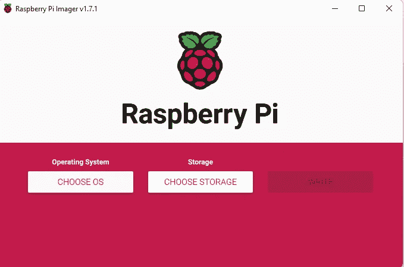
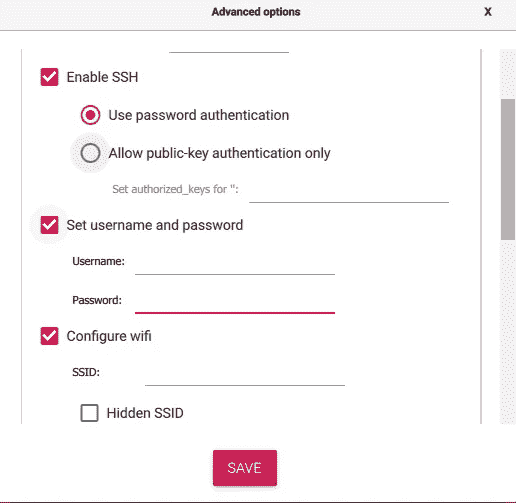
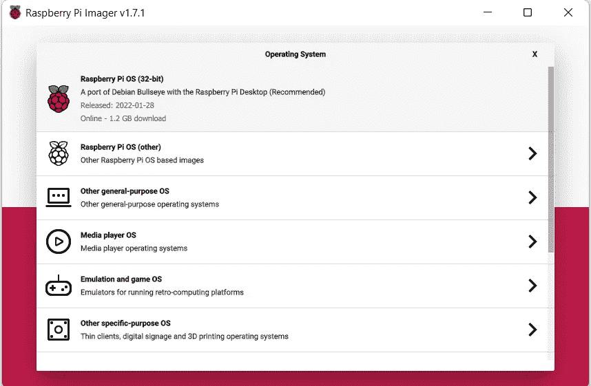
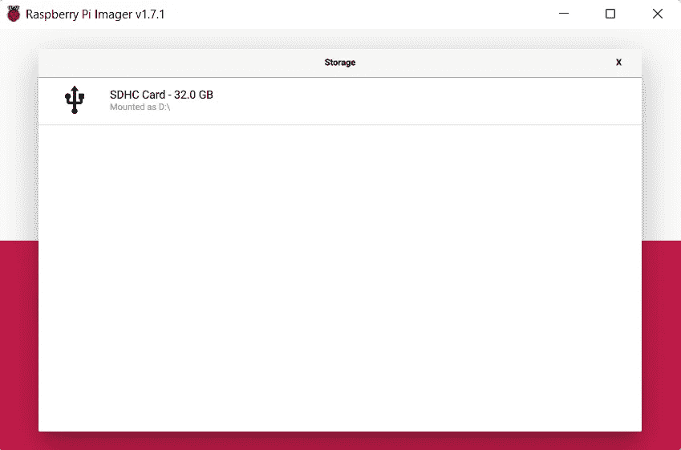
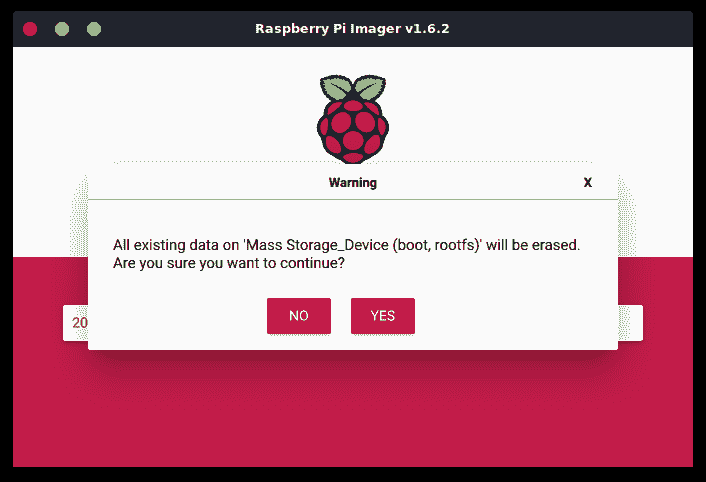
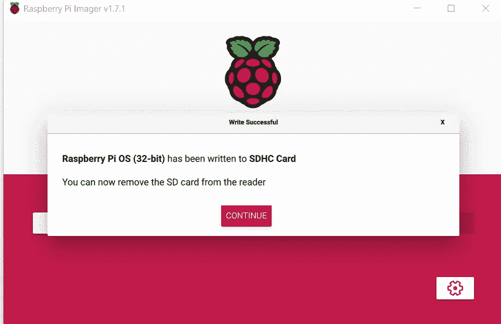
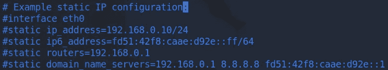

# 在树莓 Pi Zero 2 W 上设置 Pi 孔

> 原文：<https://blog.devgenius.io/setting-up-pi-hole-on-raspberry-pi-zero-2-w-893c1ee7bfcd?source=collection_archive---------3----------------------->


**什么是 Pi-hole**

你有没有被弹出的广告吓到，这些广告是你谈论过但从未搜索过的东西？Pi-hole 是防止这种情况再次发生的好办法。

Pi-hole 是一个 Linux 网络级广告和互联网追踪器拦截应用程序，它充当 DNS sinkhole 和专用网络上的可选 DHCP 服务器。它可以安装在任何 Linux 机器上，比如 Raspberry Pi 或托管 Linux 的虚拟机。它有能力屏蔽网站广告以及智能电视和移动操作系统上的广告。

我将走过我是如何设置我的树莓皮零 2 W 的皮洞。

## **设置树莓派**

首先，我使用 Raspberry Pi Imager 将 Raspberry Pi 操作系统安装到 MicroSD 卡上。下载链接可以在[这里](https://www.raspberrypi.com/software/)找到。对于 MicroSD 卡，建议使用 16GB，但我将使用 32GB，这将超过足够的内存。我在亚马逊[上找到了 16.99 美元的 2 包 MicroSD 卡，对我来说效果很好。下载成像仪并打开程序。](https://www.amazon.com/Silicon-Power-Speed-MicroSD-Adapter/dp/B07RSXSYJC/ref=sr_1_3?crid=2FD93HLTNXF8W&keywords=silicon+power+3d+nand+32gb&qid=1646279246&sprefix=silicon+power+3d+nand+32%2Caps%2C76&sr=8-3)



按 Ctrl + Shift + x 将调出高级设置进行配置。



我将**启用 SSH** ，这样我就可以在没有监视器的情况下访问我的机器。在这里您还可以**设置您的用户名和密码**以及**配置 wifi** 。您还可以选择只允许公钥身份验证。如果您想走这条路，[创建一个密钥对](https://www.ssh.com/academy/ssh/keygen)，并将公钥的内容粘贴到 authorized_keys 字段中。接下来，选择要写入 MicroSD 卡的操作系统。为此，我使用了 **Raspberry Pi 操作系统(32 位)。**



选择您想要写入的存储设备，在这种情况下是 MicroSD 卡。



点击**写入**开始向 SD 卡写入图像，但是在开始之前会看到如下提示。



点击**是，**，开始向卡中写入。这需要几分钟才能完成。完成后点击**继续。**



## **准备墩孔安装**

将 SD 卡放入 Raspberry Pi，并插入微型 USB 电缆以接通电源。绿灯应该在闪烁，这意味着它找到了一个好的操作系统映像并且正在启动。一旦绿灯保持稳定，你应该可以 SSH 了。我通过登录我的路由器并查看连接的设备，直到我找到 Raspberry Pi，从而获得了我的 IP 地址。

一旦您有了 IP 地址，您就可以使用您在 Raspberry Pi 成像仪的高级选项中输入的用户名和密码进行 SSH 登录。如果您只设置了公钥认证，请在中使用您的私钥进行 SSH。

```
ssh username@IP_Address
```

`ssh -i "private_key" username@IP_Address`

更新系统。

```
sudo apt update
sudo apt upgrade
```

分配一个静态 IP 地址。

```
sudo vim /etc/dhcpcd.conf
```



编辑以下内容:

*   连接
*   静态 ip 地址
*   静态路由器
*   静态域名服务器

如果 DHCP 服务器更改 Raspberry Pi 的 IP 地址，这将避免问题。确定静态 IP 地址没有分配给网络上的任何其他设备。

重启 Raspberry Pi 以确保更改生效。

`sudo reboot`

SSH 回到树莓派安装孔。

**安装墩孔**

github 库有一步自动安装。用于此目的的命令是:

```
curl -sSL [https://install.pi-hole.net](https://install.pi-hole.net) | bash
```

但是，有些人可能不希望运行它，因为它会阻止您阅读将要在您的系统上运行的代码。还有其他安装方法允许您在安装前检查代码。

方法 1:克隆存储库并运行

```
git clone --depth 1 [https://github.com/pi-hole/pi-hole.git](https://github.com/pi-hole/pi-hole.git) Pi-hole
cd "Pi-hole/automated install/"
sudo bash basic-install.sh
```

方法 2:手动下载安装程序并运行

```
wget -O basic-install.sh [https://install.pi-hole.net](https://install.pi-hole.net)
sudo bash basic-install.sh
```

方法 3:使用 Docker 部署 Pi-Hole

这里是 [Pi-hole docker repo](https://github.com/pi-hole/docker-pi-hole) 使用官方 docker 图片。

## **利用 Pi-hole**

现在 Pi-hole 已经安装好了，你必须[配置你的路由器，让 DHCP 客户端使用 Pi-hole 作为他们的 DNS 服务器](https://discourse.pi-hole.net/t/how-do-i-configure-my-devices-to-use-pi-hole-as-their-dns-server/245)。这样做将确保连接到您网络的任何设备都可以阻止内容，而无需执行任何其他操作。有些人可能不希望这样，因为当你看 GUI 界面时，你可以看到对网站的请求。

如果您的路由器不支持设置 DNS 服务器，另一个选择是使用[Pio-hole 的内置 DHCP 服务器](https://discourse.pi-hole.net/t/how-do-i-use-pi-holes-built-in-dhcp-server-and-why-would-i-want-to/3026)。但是，如果您想这样做，您的路由器上的 DHCP(如果可用)需要首先被禁用。

最后，如果你只想在某些设备上使用它，你可以配置每个设备使用 Pi-hole 作为它的 DNS 服务器。

Pi-hole 很棒，但并不完美。它将捕捉大多数但不是所有的广告。Pi-hole 带有一个仪表板，在这里你可以深入了解 Raspberry Pi 的状态、被阻止的查询和黑名单域。您可以通过进入网络浏览器并转到[您的 Raspberry Pi 的 IP 地址]/admin 来导航到仪表板。

现在去享受你的劳动成果吧！