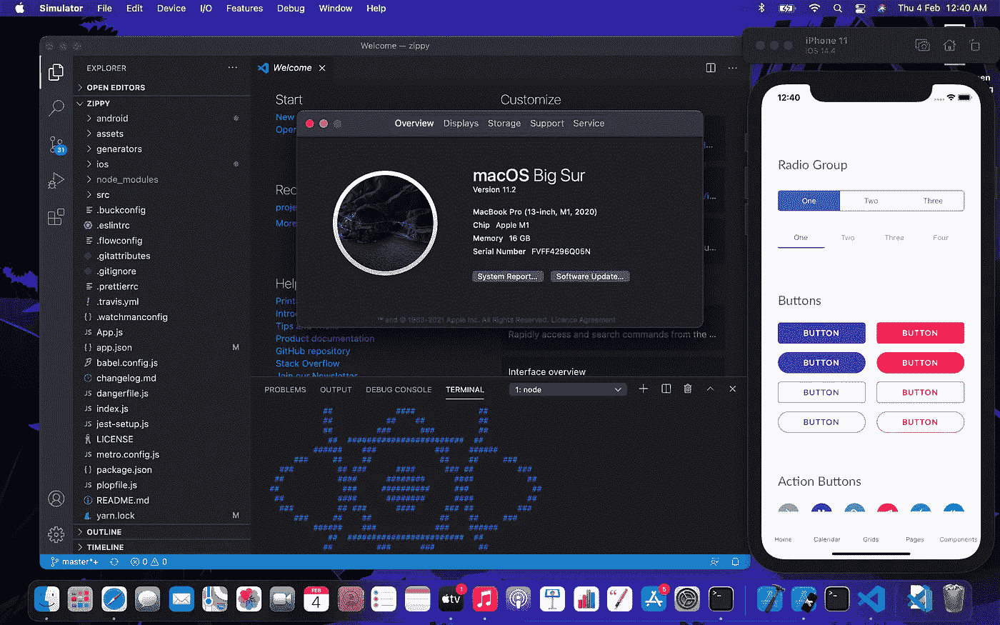
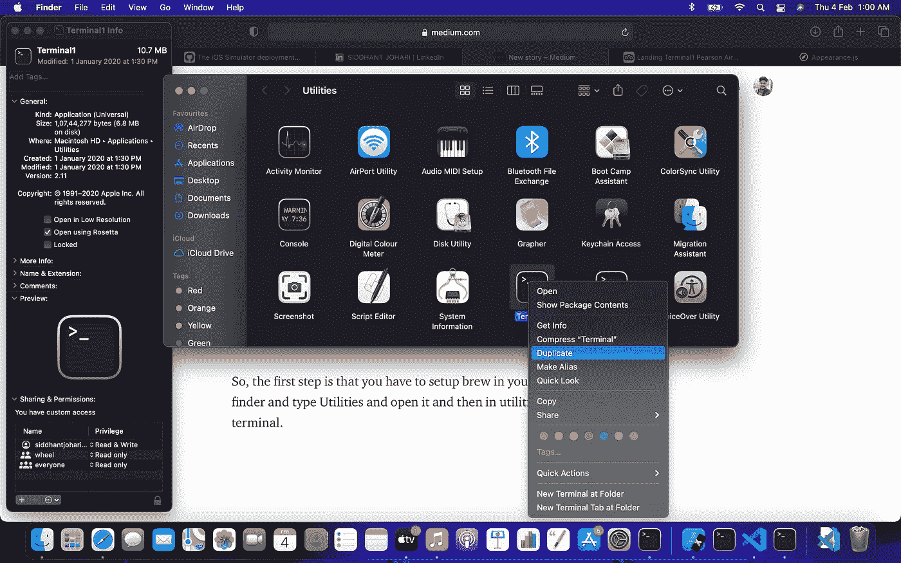

# 在 Mac M1 设立反应原生组织。

> 原文：<https://blog.devgenius.io/setting-up-react-native-in-mac-m1-aaf18c37fc34?source=collection_archive---------0----------------------->

在这个故事中，我将给出一个关于如何在 M1 建立反应型本地环境的快速指南，因为没有太多的支持和社区帮助，这有点挑战性

读完这个博客后，你将会在 M1 建立一个土生土长的反应组织。



所以，第一步是要设置 brew，你必须在你的苹果电脑中设置 rosetta，这里有以下命令。

## *设置罗塞塔终端*

```
softwareupdate --install-rosetta
```

一旦你完成了罗塞塔的安装，运行下面的命令来安装自制程序。

建立罗塞塔后，我们将创建罗塞塔终端

为此，只需前往 finder 并键入“实用程序”并将其打开，然后在“实用程序”中创建一个重复的终端。



创建一个重复的终端后，右键单击新生成的终端，进入信息部分，选择使用 rosetta 打开。

现在，我们将在新的终端中安装一个 brew。

为此，请遵循以下命令。

## ***架起沏***

/bin/bash-c " $(curl-fsSL https://raw . githubuser content . com/home rew/install/master/install . sh)

**哇！！我们已经完成了 50 %的工作。**

## ***设置 Xcode***

去应用商店下载最新版本的 Xcode 需要时间。

下载 Xcode 后，我们必须在苹果电脑上设置可可豆荚。

## *设置可可豆荚*

遵循以下命令。

```
brew install cocoapods
sudo gem install ffi
```

现在我们已经建立了大部分的东西。

设置节点:

去节点网站下载节点的最新版本，并在点击以下命令后安装。

```
npm install -g react-native-cli
```

## *创建新的反应原生 app*

创建新应用程序

```
react-native init zippy
```

创建后，转到 ios 文件夹并点击“pod install”。

现在回到项目目录，点击以下命令。

```
react-native run-iosreact-native start
```

## 结论

哇。！我们已经完成了在麦克 M1 建立反应型本土项目。