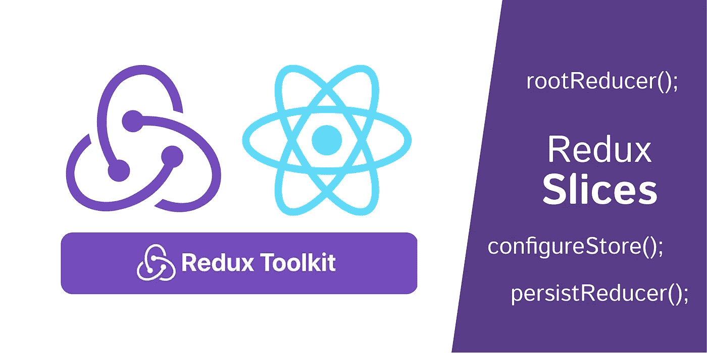

# 为 React 设置 Redux 工具包(RTK)、Redux 和 Redux-Persist。

> 原文：<https://blog.devgenius.io/setting-up-redux-tool-kit-rtk-redux-and-redux-persist-for-react-f56d35808240?source=collection_archive---------1----------------------->

使用 Redux 总是有很多工作要做，特别是因为你有很多样板代码要写。不再是因为 [Redux Toolkit](https://redux-toolkit.js.org/) (RTK)。您可以在官方文档中阅读所有相关内容，但重点是 Redux 工具包提供了 ***“抽象设置过程和处理最常见用例的工具，以及一些有用的实用程序，让用户简化他们的应用程序代码”。***

这曾经是我在 RTK 之前 Redux 的文件夹结构。

这是我正在使用的新结构。

正如您在这里看到的，APIs 文件夹的行为与前面的一样，但是我们不再有两个用于操作和缩减器的文件夹。当然我们仍然可以使用它们，但是有一种更方便的方法叫做 Redux“切片”。

所以我们能做的是，不去定义各种动作创建者和缩减者，而是创建使用 Redux 切片的特定“特性”。

在上面的代码中，我有一个“**用户”**特性，它有一个名为“ **authSlice.js** 的 Redux 片

## authSlice.js

如你所见，我们可以使用 RTK 的`createSlice`方法在同一个**片**中为一个特征定义动作和减速器。

## 索引. js

在**特征文件夹**的根目录下的 index.js 文件中，让我们合并减速器并将其导出为根减速器。

## 配置商店. js

这就是我们在为`redux-persist`设置持久化缩减器时使用 RTK 中的`configureStore`的地方。第 26 行是我不得不四处搜索并做的事情，以得到一些讨厌的警告:)。然后像往常一样返回`store`和`persistor`，这样我们就可以在项目中使用它。

## 使用存储和持久化器。

## 在操作中添加异步逻辑

使用 RTK，这也很简单。为此，我们可以使用`createAsyncThunk`方法。作为一个例子，让我转换“authSlice.js”文件中的`saveProfile`动作，使其包含异步逻辑。

## 结论

伙计们，差不多就是这样。现在，我写这篇短文的原因是，当我从传统的 Redux 方法切换到这个方法时，我得到了一些令人讨厌的错误和警告。因为我已经搜索了这些错误/警告并修复了它们，这可以作为一个小样本，希望能节省你一些时间…干杯。😄

由， ***鹤山***