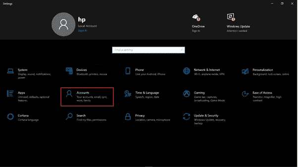
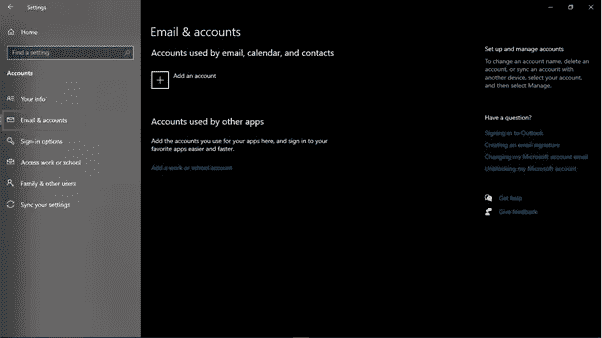
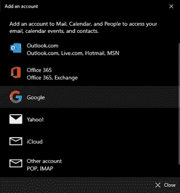
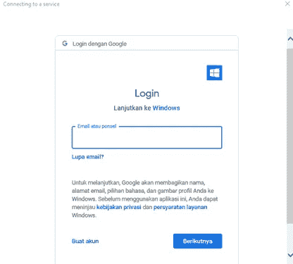
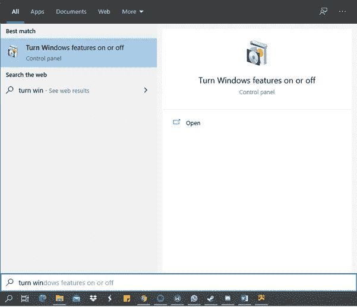
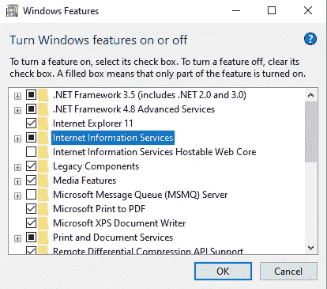
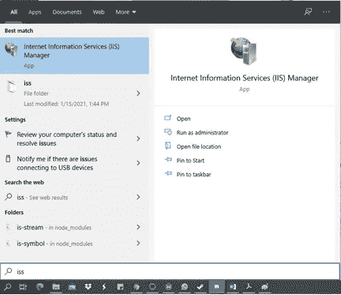
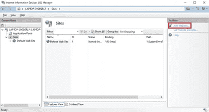
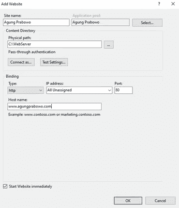

# 在 Windows 10 上使用 IIS(互联网信息服务)设置网络邮件和创建网络服务器

> 原文：<https://blog.devgenius.io/setting-up-webmail-and-creating-a-web-server-using-iis-internet-information-service-on-windows-fb5fbbe505fa?source=collection_archive---------9----------------------->

在 Windows 10 中，有一个来自微软 Windows 的官方应用程序，可以用来管理我们的电子邮件。下面介绍如何在 Windows 10 中设置邮件应用。

*   打开**设置**，然后点击**账户**

*   然后打开**邮箱&账号**然后点击**添加一个** **账号**

*   之后会出现选项，根据我们想要的进行选择。有 Outlook、Office 365、谷歌、雅虎、iCloud 等几个选项。

*   接下来，输入您的电子邮件和密码

*   然后继续，直到登录过程完成。

# 使用 IIS (Internet 信息服务)创建 Web 服务器

对于那些想在 Windows 上创建一个 web 服务器的人来说——可能是因为你正在学习制作自己的 web 或出于其他目的，你可以很容易地做到。在 Windows 上创建 web 服务器的第一种方法是使用 Microsoft IIS (Internet 信息服务)。IIS 已经在 Windows 中，但默认情况下是关闭的。以下是方法。

*   在搜索栏中键入**打开或关闭 Windows 功能**，然后单击打开。

*   检查**互联网信息服务**并点击确定，然后等待该过程完成。

*   之后在搜索栏输入 **IIS** ，打开**互联网信息服务**管理器

*   点击左边> **站点**的**连接**面板中的下拉菜单，现在你会在那里找到你的窗口上的网站列表。如果你刚刚激活了它，那么这里应该只有**默认网站**。您可以通过点击右侧面板中的**添加网站**来添加新网站。

*   实际上，如果您有网站的静态 IP，您可以在提供的栏中输入 IP。但是因为这里我们将创建一个本地 web 服务器，所以您不需要这样做。只需将 IP 列的内容保留为默认值。在主机名部分，填写您想要创建的网站的主机名，例如，[www.yourwebsite.com](http://www.yourwebsite.com)或简单的 yourwebsite.com。

