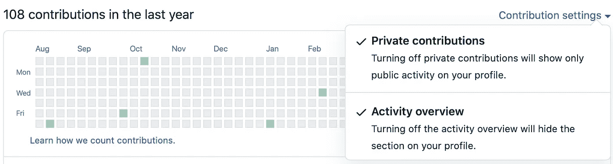

# 设置您的 Git 提交电子邮件地址

> 原文：<https://blog.devgenius.io/setting-your-github-commit-email-address-49856eaf4af4?source=collection_archive---------8----------------------->

照片由 [Richy Great](https://unsplash.com/@richygreat?utm_source=unsplash&utm_medium=referral&utm_content=creditCopyText) 在 [Unsplash](https://unsplash.com/s/photos/github?utm_source=unsplash&utm_medium=referral&utm_content=creditCopyText) 上拍摄

# 绪论

Git 有一个特性，显示用户的贡献([,基于符合特定需求集](https://docs.github.com/en/github/setting-up-and-managing-your-github-profile/why-are-my-contributions-not-showing-up-on-my-profile)的提交)。我认为这很棒，因为它让公众(以及潜在的雇主或客户)看到了你的编程活动。默认情况下只显示公共捐款，但也有一个选项来说明私人捐款。在处理一个客户项目时，我最近遇到了一个问题，我推给 GitHub 的作品没有出现在我的个人资料中。

# 简单的解决办法

此修复不仅适用于 GitHub，也可用于其他 git 服务。如前所述，只有符合特定要求的稿件才会显示在您的个人资料中。贡献包括问题、拉请求和提交。通常，要将私人贡献添加到您的个人资料中，您唯一需要做的就是启用该设置。提交有一个他们必须遵守的规则子集——包括 1。)用于提交的电子邮件地址与您的 GitHub 帐户和 2。)您是存储库的合作者，或者是拥有该存储库的组织的成员。

在与一个客户合作了大约两周并使用了私人回购后，我注意到我的提交没有显示在我的个人资料中。我已经确认我是回购的合作者，并假设我的电子邮件帐户与从命令行推送的提交相关联。事实证明我错了，但解决方法很简单。

在我通过 web 应用程序向我的 GitHub 帐户添加了一个新的电子邮件后，我无法在我的本地机器上更改它。这是一个简单的过程，当我将电子邮件地址改为与我的 GitHub 帐户相关联的地址时，我的个人资料上就开始显示私人提交的邮件。

在“终端”中，您可以通过运行以下命令来检查与您的 GitHub 帐户关联的当前电子邮件地址:

> $ git 配置-全局用户.电子邮件

要设置电子邮件帐户，请运行:

> $ git config-global user . email "*email@example.com*

这就是了——一个简单的错误和一个简单的解决方案。