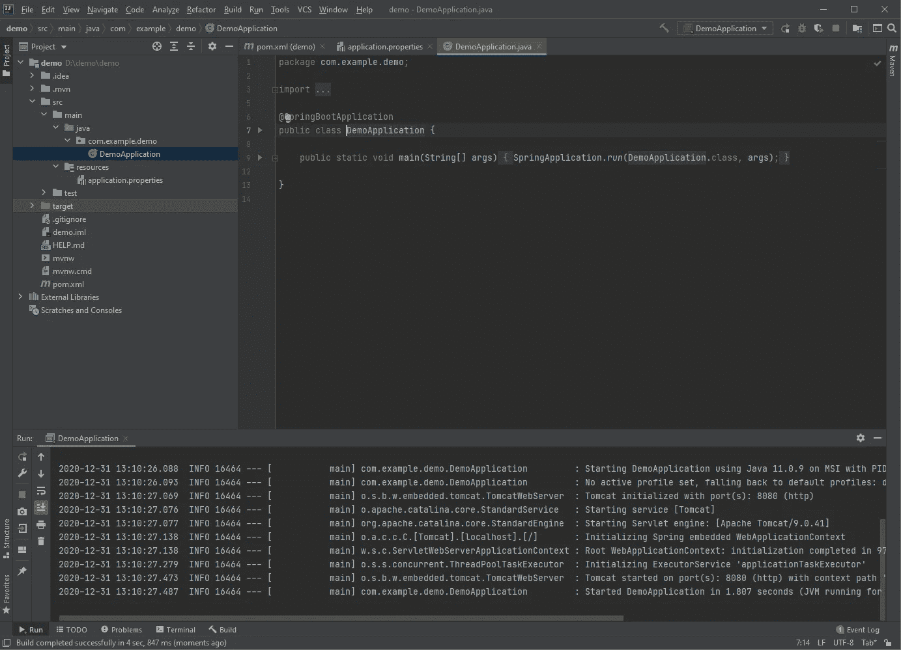

# 通过 JDBC 第 2 部分设置您自己的 spring boot 服务器

> 原文：<https://blog.devgenius.io/setting-your-own-spring-boot-server-via-jdbc-part-2-96763d67a310?source=collection_archive---------6----------------------->

在继续学习本教程之前，请确保您已经复习/阅读了第 1 部分，然后再继续:[通过 JDBC 设置您自己的 spring boot 服务器第 1 部分|作者 Michael Tong | 2020 年 12 月| Medium](https://kaleongtong282.medium.com/how-to-get-a-spring-boot-server-running-via-jdbc-part-1-659d33a5e373)

在第 2 部分中，我们将讨论如何设置端点来执行 crud 操作，以及应用程序其余部分的结构。

为了了解应用程序将如何实现，让我们看一下下图:

我们有控制器，它通过 api 端点监听客户端请求。根据请求所寻找的内容，我们调用相应的服务来处理业务逻辑。

通常这意味着调用另一个第三方服务或净化来自控制器的数据。

例如，如果我们正在构建一个处理/管理 aws ec2 服务的后端服务器，我们将需要调用 aws 服务来创建/修改/删除现有的 ec2 实例，并更新我们的数据库以反映实例的真实状态。

如果这有点难以理解，让我们以购物车应用程序为例。我们可以有一个控制器，它接收端点来购买商品。从那里，我们接收请求并调用 shoppingCart 服务，该服务检查从请求中收到的数据是否有效。如果有效，服务将与 dao 层交互，后者通过为新事务插入新条目来更新数据库。

之后，您可以从 dao 层返回事务记录或带有 200 代码的定制请求。这将被传递回服务层，然后传递到控制器层，控制器将把响应返回给客户端。

在 [Unsplash](https://unsplash.com?utm_source=medium&utm_medium=referral) 上 [whereslugo](https://unsplash.com/@whereslugo?utm_source=medium&utm_medium=referral) 拍摄的照片

谈了这么多之后，现在让我们把注意力集中在这个项目中剩余部分的实现上。

让我们转到 src/main/java/com.example.demo 下的目录，创建四个新包:

*   大刀
*   控制器
*   模型
*   服务

我们将一次关注一层。所以现在让我们把注意力放在控制器上。

步骤 1:创建模型包并添加一个 DemoController.java

在本教程的剩余部分，我们将使用一个实体，我们称它为集群。

该群集将包含一个名称和一个 id:

这将被用作我们用来存储数据库数据的实体。稍后，我将提供一个脚本来创建一个具有名称和 id 的集群。

@JsonInclude(JsonInclude。Include.NON_NULL)是一个注释，用于排除任何为空的实体，这意味着当我们将数据库数据映射回控制器时，我们将只给出非空值。但是，请注意，如果实体对象不为空，这并不排除实体对象本身具有空值。

很好，现在我们已经创建了第一个实体。然而，当我们从数据库中检索数据时，它不知道如何自动映射到我们的实体对象。为此，我们需要创建名为 ClusterMapper.java 的行映射器类:

在这里，我们获取通过 jdbc 库获得的结果集，获取行名和 id 属性，并从中创建一个集群。

就是这样！在这里，我们传入的从数据库获取特定属性的字符串必须完全匹配，这意味着数据库属性需要精确拼写为“name”和“id”。

稍后当我们要实现 dao 层时，将会用到 clusterMapper。

路易·菲利浦·波伊特拉斯在 [Unsplash](https://unsplash.com?utm_source=medium&utm_medium=referral) 上拍摄的照片

步骤 2:在控制器层设置 api 端点

在这里，我们决定应用程序将打开哪些端点，以及客户端调用可以访问哪些端点来执行 crud 操作。

为了简单起见，我们将使用端点来创建、删除、更新和获取集群:

为了建立一个有效的控制器，我们需要使用 annotation @RestController 让 spring boot 应用程序知道这是一个将要监听端点的控制器。

之后，我们需要指定@RequestMapping，它指定这个控制器中的所有端点将如何开始。例如，如果我们调用一个 api 来获取所有集群，我们将调用 localhost:8080/v1/clusters 来获取数据(因为服务器将在本地 8080 上运行)。

在控制器内部，我们还有一个集群服务，我们正在自动连接到它。等等，自动布线是什么意思？

自动连接是 spring 注入依赖项能力的一部分。在这种情况下，我们将创建一个服务和 serviceimpl.java，其中服务将是一个接口。通常，我们需要在使用服务之前实例化它。在 spring boot 中，我们所要做的就是自动连接服务，这样 spring boot 就知道在哪里寻找服务实现。

在这里，我们创建了集群，检索集群，删除集群和更新集群。

对于 createClusters，我们需要一个带有集群 id 和名称的对象列表或数组。然后，我们调用服务来创建这些集群，并返回一个响应实体，其中包含创建的数据和 http status 200，表明创建成功。

对于 retrieveClusters，这是一个相对简单的调用，因为我们只需从服务中返回集群列表。

使用 deleteClusters，我们希望收到一个 id 列表，该列表将用于删除数据库中的集群列表。

使用 updateCluster，我们获取一个 id 与数据库中现有 id 相匹配的新集群，并使用 clusterService 与数据库进行交互以更新该条目。如果更新成功，那么我们返回一个 responseEntity，其中包含更新后的集群和一个 httpstatus 代码 200。

由 [Unsplash](https://unsplash.com?utm_source=medium&utm_medium=referral) 上的 [QuickOrder](https://unsplash.com/@quickorder?utm_source=medium&utm_medium=referral) 拍摄

步骤 3:建立服务层来与我们的 dao 层交互

既然我们已经讨论完了控制器的工作原理，让我们来看看我们的服务层。首先，我们需要在 src/main/Java/com . example . demo/service package 下创建一个 clusterService.java:

之后，我们需要创建一个 clusterServiceImpl.java 来实现所有这些现有的功能:

还记得在 ClusterController.java 文件中我们有一个自动连接的集群服务吗？当我们自动连接服务时，它实际上专门寻找这个文件，因为它知道这是实现集群服务本身唯一文件。

在这个文件中，我们必须指定@Service，向应用程序表明这是我们为这个应用程序使用的服务之一。我们还必须自动连接到 dao 类本身，它将用于直接与数据库交互。

步骤 4:建立 dao 层并理解它如何与数据库交互

照片由[马库斯·斯皮斯克](https://unsplash.com/@markusspiske?utm_source=medium&utm_medium=referral)在 [Unsplash](https://unsplash.com?utm_source=medium&utm_medium=referral) 拍摄

Dao，也称为数据访问对象，是我们在远离业务逻辑的较低层次上提供某种与数据库交互的机制的地方。

让我们来看看界面是什么样子的:

现在让我们看看这个类的 dao 实现:

在这里，我们声明 ClusterDaoImpl 拥有@Repository。这告诉 spring 应用程序这个文件将用于与数据库交互。对于 createClusters，我们遍历每个 newCluster，并运行 postgres 查询向数据库中插入一个新条目。

同样，对于其他查询调用，我们也可以删除或编辑集群，就像我们自己在 pgAdmin 中运行查询一样，在 pg admin 中我们可以修改数据库。

现在一切都已建立，您可以转到 src/main/Java/com . example . demo/demoApplication . Java 下的 demo application，转到第 9 行，单击 play 图标运行:

您的服务器应该正在运行！

为了测试你的端点，你可以从这里下载 Postman:[下载 Postman |免费试用 Postman](https://www.postman.com/downloads/)。

之后，打开 postman 应用程序，点击收藏选项卡:

现在用下面的 url 添加一个新的 api 调用:[https://localhost/8080/v1/clusters](https://localhost/8080/v1/clusters.)。在 url 的左边，您可以将 POST 设置为您的 api 类型，因为您将创建一个集群。之后，您可以单击“另存为”，系统会提示您进入此页面:

将其命名为“创建集群”，并选择集群作为要保存的集合。

单击“Body”选项卡并选择“raw”单选按钮。在“GraphQL”选项旁边，选择“JSON”作为要发送的数据类型。在下面的文本框中，您可以像这样发送一个示例 JSON:

之后，您应该会得到一个成功的 200 httpStatus Ok 响应，这个 json 就是您从服务器收到的响应！

你也可以更新集群，删除集群和获取集群！在运行这些 api 调用之前，请确保首先运行以下脚本在 pgAdmin 中创建集群表:

从顶部导航栏中选择“工具”，然后单击“查询工具”并运行查询:

就是这样！您刚刚在 spring 中安装并设置了第一个 jdbc 应用程序。