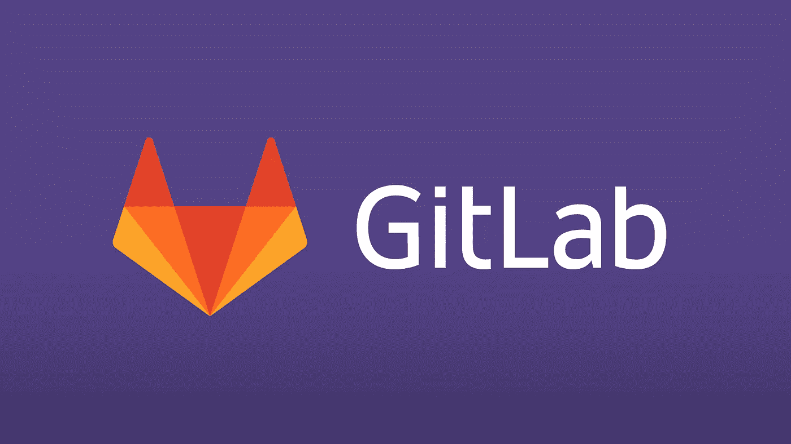
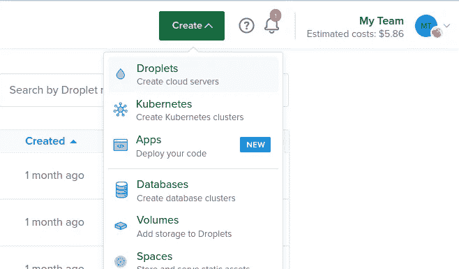
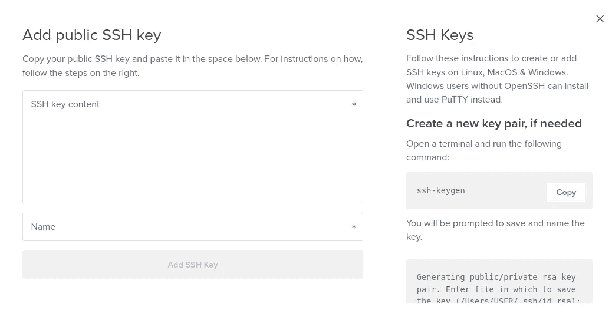
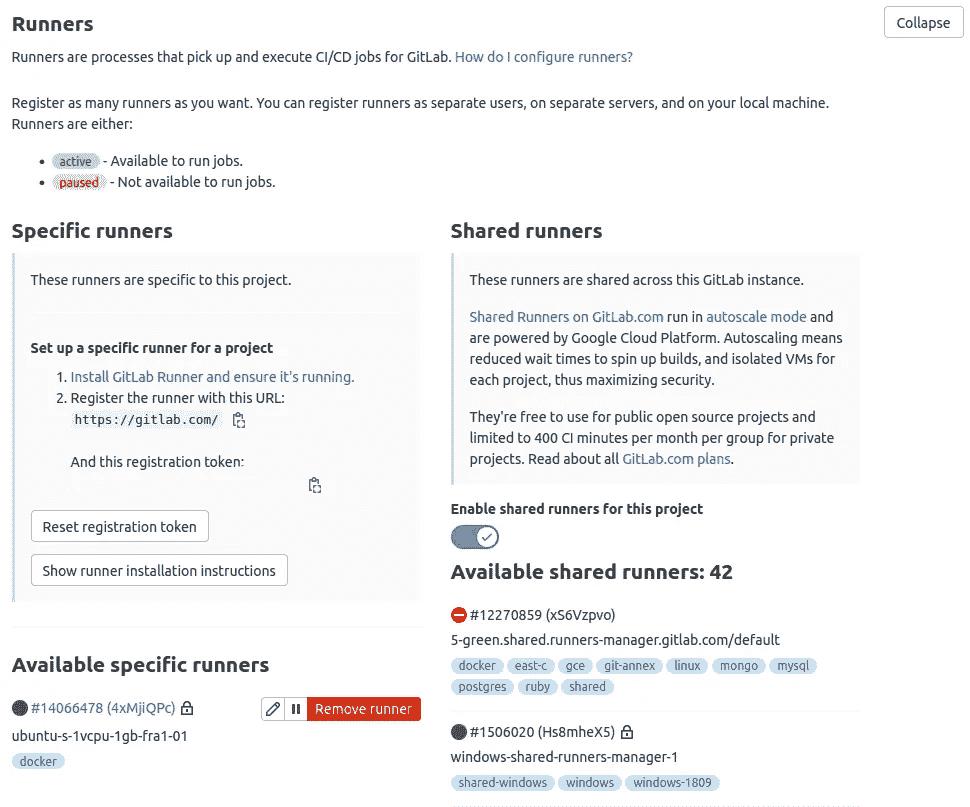
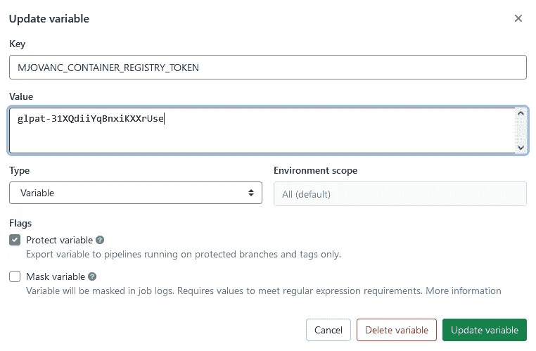
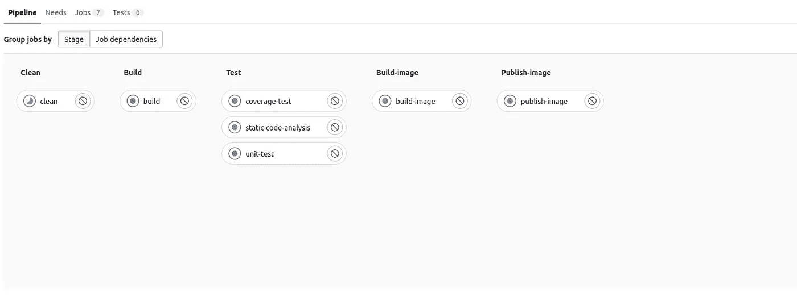
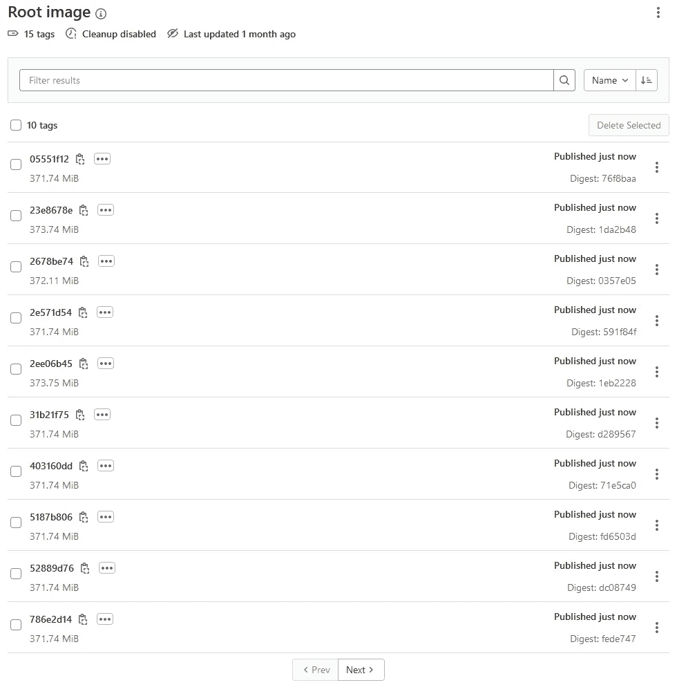

# 与 Spring Boot 建立 GitLab CI/CD 管道

> 原文：<https://blog.devgenius.io/setup-a-gitlab-ci-cd-pipeline-using-spring-boot-5c3757f3fec0?source=collection_archive---------0----------------------->



之前我们和*詹金斯*一起查看了 **CI/CD** 来构建 *Spring Boot* 应用。在本教程中，我们将介绍如何利用 GitLab CI/CD *。*

我已经在我的个人 GitHub 账户上添加了这个项目的源代码，在这个库[https://github.com/mjovanc/medium-gitlab-cicd-springboot](https://github.com/mjovanc/medium-gitlab-cicd-springboot)中，但是它显然应该被放在 GitLab 库中。

# 设置管道配置

因此，当我们将项目放入 GitLab 库时，我们需要做的第一件事就是。我们需要创建一个**。gitlab-ci.yml** 初始化管道:

```
# Adding workflow rules to avoid other branches to use the pipeline 
# since we only want to use the master branch
workflow:
  rules:
    - if: $CI_COMMIT_TAG
      when: never
    - if: $CI_COMMIT_BRANCH == 'master'

variables:
  IMAGE_OPENJDK_GRADLE: gradle:7.3.3-jdk17-alpine

stages:
  - clean
  - build
  - test
  - build-image
  - publish-image
  - deploy

clean:
  image: $IMAGE_OPENJDK_GRADLE
  stage: clean
  script:
    - echo "Cleaning leftovers from previous builds"
    - sh $CI_PROJECT_DIR/gradlew clean

build:
  image: $IMAGE_OPENJDK_GRADLE
  stage: build
  script:
    - echo "Compiling the code..."
    - sh $CI_PROJECT_DIR/gradlew assemble
  artifacts:
    paths:
      - build/libs/blog-*.war

static-code-analysis:
  image: $IMAGE_OPENJDK_GRADLE
  stage: test
  script:
    - echo "Running Static Code Analysis..."
    - echo "Checking style..."
    - sh $CI_PROJECT_DIR/gradlew checkstyleMain
    - echo "Checking duplicated code..."
    - sh $CI_PROJECT_DIR/gradlew cpdCheck
    - echo "Checking bugs..."
    - sh $CI_PROJECT_DIR/gradlew spotbugsMain
    - echo "Checking code standard..."
    - sh $CI_PROJECT_DIR/gradlew pmdMain

unit-test:
  image: $IMAGE_OPENJDK_GRADLE
  stage: test
  script:
    - echo "Running unit tests..."
    - sh $CI_PROJECT_DIR/gradlew test -Dspring.profiles.active=test

coverage-test:
  image: $IMAGE_OPENJDK_GRADLE
  stage: test
  needs:
    - job: unit-test
  script:
    - echo "Running coverage tests..."

build-image:
  stage: build-image
  script:
    - echo "Building Docker Image..."
    - docker build -t $CI_REGISTRY/mjovanc/blog-api:$CI_COMMIT_SHORT_SHA .
    - docker build -t $CI_REGISTRY/mjovanc/blog-api:latest .

publish-image:
  stage: publish-image
  script:
    - echo "Publishing Docker Image..."
    - docker login -u mjovanc -p $MJOVANC_CONTAINER_REGISTRY_TOKEN $CI_REGISTRY
    - docker push $CI_REGISTRY/mjovanc/blog-api:$CI_COMMIT_SHORT_SHA
    - docker push $CI_REGISTRY/mjovanc/blog-api:latest

# Alternative down stream pipeline to be triggered
#deploy:
#  stage: deploy
#  trigger: mjovanc/blog-iac
```

首先，我们定义工作流规则，以便我们*仅在新代码到达主分支*时进行构建。因此，即使功能分支处于失败状态，我们仍然可以推进它们并对它们进行处理。那么我们就不需要每次都构建，构建后再推送到容器注册表。

```
workflow:
  rules:
    - if: $CI_COMMIT_TAG
      when: never
    - if: $CI_COMMIT_BRANCH == 'master'
```

也许您可以删除它并设置检查器，如果不在主分支上，我们将在构建和测试后跳过其他阶段。但是现在我们将使用定义的阶段。

然后，我们使用图像定义一个变量，该变量将用于构建我们的应用程序，并且将是**Gradle**with**open JDK 17**:

```
variables:
  IMAGE_OPENJDK_GRADLE: gradle:7.3.3-jdk17-alpine
```

然后，我们定义该流程中的所有阶段。这个阶段是*清理*、*构建*、*测试*、*构建映像* (docker)、*发布映像* (docker)和*部署*。我们注释掉*部署*在底部，因为它不会工作，因为我们现在没有其他管道。我们将只讨论它，这样我们就知道如何触发另一个管道来完成部署容器的工作。

```
stages:
  - clean
  - build
  - test
  - build-image
  - publish-image
  - deploy
```

您可以添加另一个使用 *Kubernetes* 的管道，或者使用 *Ansible* 在服务器上手动部署。

对于每项工作，我们都定义了它应该与哪个阶段相关联:

```
clean:
  image: $IMAGE_OPENJDK_GRADLE
  stage: clean
  script:
    - echo "Cleaning leftovers from previous builds"
    - sh $CI_PROJECT_DIR/gradlew clean
```

你可能想知道，不是每次都有新的图片吗？是的。但在本例中，我们将设置一个 GitLab 拉取策略`if-not-present`,以确保我们不会每次都拉取一个新图像，并且我们会重复使用现有图像，从而节省大量时间。我们将在下一节介绍如何将策略添加到 GitLab Runner 中。

我们还有一个脚本定义应该在 *GitLab Runner* 上执行什么。GitLab 有*共享*或*组*或*特定*跑步者供我们使用。我们可以设置自己的跑步者，如果我们需要更大的 CPU，内存等或软件比什么是由 GitLab 提供的。在这种情况下，我们将通过设置自己的来使用*特定的*跑步者。我们将在完成**后进行此操作。gitlab-ci.yml** 。

您可以在 GitLab 管道配置中看到，我们有一个叫做**的东西需要**来告诉管道，在另一项工作完成之前，这个阶段不能运行。在本例中，在*单元测试*通过之前，我们将不运行*覆盖率测试*。如果我们将许多工作放在与阶段测试相同的阶段，它将并行运行*。所以它会尝试同时做所有的工作。*

```
*coverage-test:
  image: $IMAGE_OPENJDK_GRADLE
  stage: test
  needs:
    - job: unit-test
  script:
    - echo "Running coverage tests..."*
```

*为了构建码头工人的形象，我们需要如下配置:*

```
*build-image:
  stage: build-image
  script:
    - echo "Building Docker Image..."
    - docker build -t $CI_REGISTRY/mjovanc/blog-api:$CI_COMMIT_SHORT_SHA .
    - docker build -t $CI_REGISTRY/mjovanc/blog-api:latest .*
```

*我们使用 docker 命令在**当前目录**中构建，并查找我们的 *Dockerfile* ，我们通过内置环境变量 **$CI_REGISTRY** 并添加*公司/组织/用户*和应用程序的*名称*对其进行标记。我们还添加了提交 *SHA256 哈希*(短版本，不是完整值)，所以我们可以有一个唯一的构建 ID。然后，我们还建立了第二个图像，但使用最新的作为 ID，所以如果我们只想获取最新的*版本，我们总是可以提取该图像。在需要*回滚*的情况下，我们仍然有旧的构建，所以我们可以回到更早的提交。**

*然后我们只需将新构建的图像推送到 *GitLab 容器注册中心*:*

```
*publish-image:
  stage: publish-image
  script:
    - echo "Publishing Docker Image..."
    - docker login -u mjovanc -p $MJOVANC_CONTAINER_REGISTRY_TOKEN $CI_REGISTRY
    - docker push $CI_REGISTRY/mjovanc/blog-api:$CI_COMMIT_SHORT_SHA
    - docker push $CI_REGISTRY/mjovanc/blog-api:latest*
```

*最后，我们添加了*部署*阶段，该阶段将触发另一条管道运行(可选):*

```
*deploy:
  stage: deploy
  trigger: mjovanc/blog-iac*
```

# *安装 GitLab Runner*

*为了让这个管道正常工作，我们需要在 GitLab 中添加一些配置，并添加我们自己的 *GitLab Runner* 。所以我们将首先研究如何设置*特定的*跑步者。在本教程中，我们将介绍如何使用*数字海洋*设置 *GitLab Runner* 。所以我们首先去[https://www.digitalocean.com/](https://www.digitalocean.com/)登录或创建一个账户。然后我们需要设置一个基本的液滴*

**

*选择“液滴”以创建新的液滴*

*我们必须将 **SSH** 键添加到新的液滴中，因此我们通过运行以下命令在机器上生成一个新的键:*

```
*ssh-keygen -t rsa -b 4096 -o -a 100*
```

*然后我们选择一个名字，为了这个教程，最好是 gitlab。我们打开存在于 **~/中的内容。通过在终端中运行 ssh/gitlab.pub** :*

```
*cat ~/.ssh/gitlab.pub*
```

*我们复制内容，然后在数字海洋水滴设置中添加一个新的 SSH 密钥，并将内容粘贴到那里。*

**

*现在，我们需要将 ssh-key 添加到 ssh 代理中，以便它在尝试通过 ssh 连接到 Droplet 时能够找到这个密钥。我们通过在终端中运行以下命令来实现这一点:*

```
*eval $(ssh-agent)
ssh-add ~/.ssh/gitlab*
```

*所以现在当这些完成后，我们对 Droplet 的设置感到满意，我们就可以创建它了。现在，我们需要通过运行以下命令登录到这个 Droplet (VM 实例):*

```
*ssh root@<ip-of-droplet>*
```

*我们进入了，现在我们将运行 GitLab Runner 安装。查看这里的文档【https://docs.gitlab.com/runner/install】[**/**](https://docs.gitlab.com/runner/install/)**了解具体的 Linux 发行版。它可能会有所不同，因为有些上有不同的包管理器。我们将在这里浏览 Debian/Ubuntu。现在我们已经进入，我们将运行这个脚本:***

***[https://gist . github . com/mjovanc/82 eeabfdf 2124 AE 7 f 0a 4566 a2 a2 ea 432](https://gist.github.com/mjovanc/82eeabfdf2124ae7f0a4566a2a2ea432)***

***在 *Droplet* 中启动 *VIM* 或您更喜欢的编辑器，创建一个名为 **docker.sh** 的新文件，并将内容粘贴到其中。然后通过运行以下命令使该文件可执行:***

```
***chmod +x docker.sh***
```

***然后通过以下方式运行它:***

```
***./docker.sh***
```

***我们现在将运行这个 *cURL* 命令来下载 GitLab Runner 软件包:***

```
***curl -LJO "https://gitlab-runner-downloads.s3.amazonaws.com/latest/deb/gitlab-runner_amd64.deb"***
```

***我们通过运行以下命令来安装该软件包:***

```
***dpkg -i gitlab-runner_amd64.deb***
```

***所以现在当 GitLab Runner 被安装后，我们需要注册它，这样 GitLab 就会选择这个 Runner 并将其添加到我们的项目中。我们运行下面的命令，但是添加了令牌，并添加了一些关于 GitLab Runner 用途的描述。要获得令牌，进入 GitLab，进入项目和**设置> CI/CD > Runners** ，你会在那里找到你的令牌。***

```
***sudo gitlab-runner register -n \
  --url https://gitlab.com/ \
  --registration-token <REGISTRATION_TOKEN> \
  --executor docker \
  --description "<GITLAB_RUNNER_NAME>" \
  --docker-image "docker:stable" \
  --docker-volumes /var/run/docker.sock:/var/run/docker.sock***
```

***现在应该添加了，我们可以通过转到**设置> CI/CD >跑步者:**进行确认***

******

***我们还需要配置一个步骤，我们需要设置一个拉取策略，这样我们就可以减少在每个作业上拉取 docker 映像所花费的时间，因为我们将使用同一个映像。我们将设置`if-not-present`。来自 GitLab 文档:***

> ***如果您希望使用从远程注册表中提取的图像，但是希望在使用大量且很少更新的图像时减少分析图像层差异所花费的时间，那么`if-not-present`提取策略是一个不错的选择。在这种情况下，您需要偶尔从本地 Docker 引擎存储中手动删除映像，以强制更新映像。***
> 
> ***如果您需要使用仅在本地构建并可用的图像，但另一方面，也需要允许从远程注册表中提取图像，那么这也是一个不错的选择。***

***所以我们需要进入我们的 Droplet 并设置配置。我们需要找到文件`config.toml`并编辑它。通常位于 **/etc/gitlab-runner/** 。因此，我们通过添加新行来添加拉策略:***

```
***pull_policy = ["if-not-present"]***
```

***我们还可以设置**多个**拉动策略:***

```
***pull_policy = ["always", "if-not-present"]***
```

***如果我们想使用 **always** 的话，最好使用一个后备选项，因为如果我们从中提取的注册表不可用的话，它会给我们一个失败的任务。但是在本教程中，我们将只使用 **if-not-present** 。***

***重新启动 GitLab Runner，现在运行作业应该更快了:***

```
***gitlab-runner restart***
```

***所有可用的 GitLab Runner 命令列表可以在这里看到:[https://docs.gitlab.com/runner/commands/](https://docs.gitlab.com/runner/commands/)***

# ***GitLab 中的附加配置***

***我们需要生成一个*个人访问令牌*。为此，我们进入个人资料图片所在的右上角，选择**首选项**。然后导航到**访问令牌**并将名称写成**MJOVANC _ CONTAINER _ REGISTRY _ TOKEN**并选择 **api** 、 **read_registry** 、 **write_registry** 。***

******

***我之前已经添加了，所以这里显示的是更新而不是创建。***

***现在，我们的管道可以通过我们的**中的变量获得这个令牌。gitlab-ci.yml** 文件，并能够推送新建的图片。***

***现在，当我们运行管道时，我们可以看到仪表板，方法是转到左侧面板，然后按 CI/CD > Pipelines。在这里，我们可以看到所有执行的管道及其状态。我们现在按下按钮**运行管道**，我们将看到它开始构建。我们按下蓝色按钮**运行**，我们可以看到它的仪表板视图:***

******

***详细的管道视图***

***我们也可以在这里点击单个作业，我们将在 *GitLab Runner* 上看到构建过程的输出。***

***现在我们已经运行了我们的管道并构建了我们的项目，我们可以在侧边栏的**包&注册表>容器注册表**上找到我们创建的图像(最新的在最后一页，每次我们做新的推送时它都会更新):***

******

***容器注册表中所有已发布的图像***

***GitLab CI/CD 是一个非常丰富的功能，很好的工具，很棒的文档和很棒的社区。我强烈推荐！***

***基本就是这样。这比我们之前介绍的 Jenkins 服务器设置起来要快一些。你也可以建立自己的 GitLab，但我会让你去发现自己。我不权衡哪个是最好的。这主要取决于你的需求。***

***我希望这个教程对你有用。请在 Medium 或 Twitter 上关注我，了解更多即将推出的教程。干杯！***