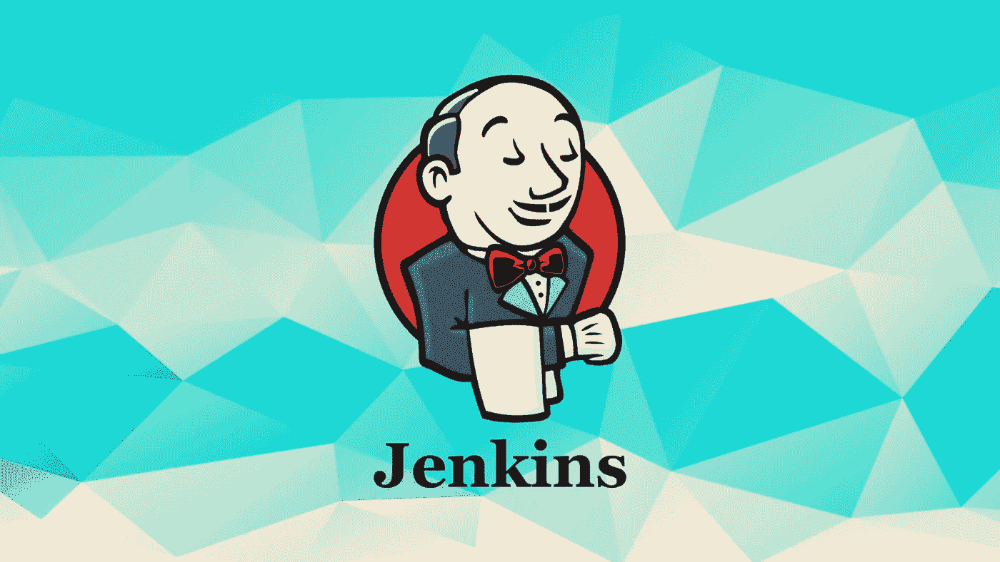
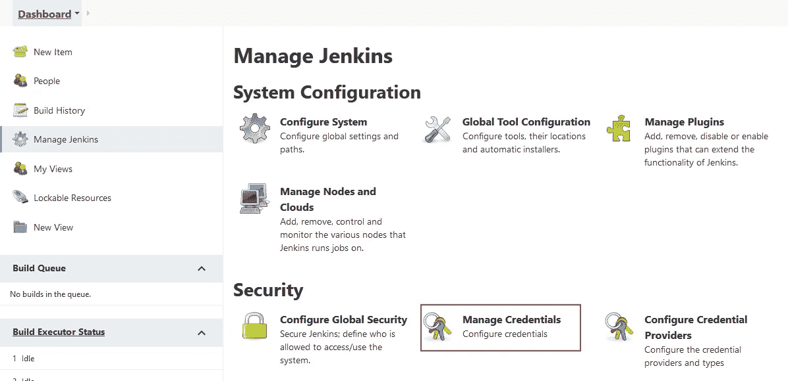
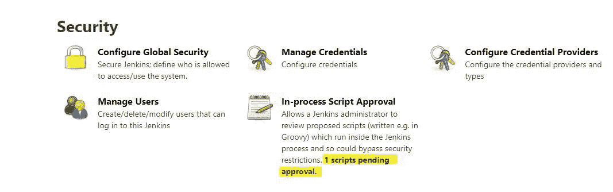

# 设置 Jenkins 服务器以构建 Spring Boot 应用程序

> 原文：<https://blog.devgenius.io/setup-a-jenkins-server-to-build-a-spring-boot-application-81b8d4c78083?source=collection_archive---------5----------------------->



在本教程中，我们将介绍使用 Docker 和 Docker Compose 设置 Jenkins 服务器的步骤，以便能够从 GitHub 资源库构建 Spring Boot 应用程序。

# 詹金斯配置代码

我们将从查看作为代码的詹金斯配置(JCasC)部分开始，因此我们将克隆存储库[https://github.com/mjovanc/medium-jenkins-casc](https://github.com/mjovanc/medium-jenkins-casc)，并且我们将分别检查每个文件，它们的作用以及我们为什么需要它们。本教程中有很多东西需要解开，所以偶尔喝一杯提神的饮料吧。

那么为什么我们需要一个叫做詹金斯配置的东西作为代码呢？想象一下，您需要手动安装一个 Jenkins 服务器，并在 Jenkins 的 web UI 中输入配置。如果服务器出了问题，我们需要用 Jenkins 复制一个新的服务器，该怎么办？然后，我们需要在 web UI 中再次手动添加它们，并手动安装插件。如果你有一个更大的项目，这将花费很长时间，并且可能导致你正在构建的产品的交付出现很多问题。

事实上，我试图找到关于 JCasC 的信息，但是在寻找好的教程时遇到了**问题，这些教程很全面，涵盖了做这件事所需的每一个步骤。所以我的目标是现在用一种**的基本方式**向你们展示你们需要什么。我会尽我所能。如果有一些错误，请添加评论，我会尽快回答并纠正错误。**

因此，在存储库中，我们将首先打开文件 **config/jenkins.yml** :

```
jenkins:
  systemMessage: "Welcome to Jenkins for the Spring Project!"
  numExecutors: 4
  mode: NORMAL
  scmCheckoutRetryCount: 3
  labelString: "mjovanc"  # we need to specify something here that we will define in our pipeline jobs, choose whatever name you want

  primaryView:
    all:
      name: All

tool:
  jdk:
    installations:
    - name: "OpenJDK 16"
      properties:
      - installSource:
          installers:
          - zip:
              subdir: "/var/jenkins_home/tools/hudson.model.JDK/OpenJDK_16/jdk-16.0.1"
              url: "https://download.java.net/java/GA/jdk16.0.1/7147401fd7354114ac51ef3e1328291f/9/GPL/openjdk-16.0.1_linux-x64_bin.tar.gz"

jobs:
  - script: |
      job('seedjob-mjovanc') {
        description('Set up all jobs')

        scm {
          git {
            branches('*/master')
            remote {
              credentials('mjovanc-jenkins-key')
              url('git@github.com:mjovanc/medium-mjovanc-job-dsl.git')
            }
          }
        }
        steps {
          dsl {
            external('*.groovy')
            removeAction('DELETE')
            ignoreExisting(ignore = false)
            removeViewAction('DELETE')
          }
        }
        triggers {
          cron('@midnight')
        }
      }
```

这里有两个主要部分值得指出。我们有**詹金斯**、**工具**和**工作**。

詹金斯是服务器的一般配置，如我们需要多少执行者等等。

**工具**是关于我们需要安装什么样的额外软件来构建我们的软件。我添加了 OpenJDK16，因为 Jenkins 使用的 OpenJDK11 无法工作。

**作业**部分定义了启动 Jenkins 时最初应该存在的作业类型。所以我们在这里添加了一个 Groovy 脚本来设置一个作业，该作业将在午夜从一个外部存储库中获取更多的 Groovy DSL 作业，您可以从这里克隆这个库:[https://github.com/mjovanc/medium-mjovanc-job-dsl](https://github.com/mjovanc/medium-mjovanc-job-dsl)。因此，如果您要对外部存储库中的 DSL 作业进行任何更改，它将在午夜发生变化。

现在让我们看看我们的**文档:**

```
FROM jenkins/jenkins:lts-jdk11
USER root

COPY plugins.txt /usr/share/jenkins/ref/plugins.txt
RUN /usr/local/bin/install-plugins.sh << /usr/share/jenkins/ref/plugins.txt

RUN apt-get update -y
RUN apt-get install -y apt-transport-https ca-certificates curl gnupg2 software-properties-common docker.io
RUN docker --version

RUN usermod -aG docker jenkins

USER jenkins
```

这里我们定义了自己的 **Dockerfile** ，因为我们需要在 Docker 容器中安装 Docker，这样才能在 Jenkins 上构建 Docker 映像。

我们的 **docker-compose.yml** 文件:

```
version: '3.7'

services:
  jenkins:
    build: .
    privileged: true
    user: root
    restart: on-failure:10
    ports:
      - 8080:8080
    container_name: mjovanc-jenkins
    volumes:
      - ./:/jcasc
      - ~/apps/jenkins:/var/jenkins_home
      - /var/run/docker.sock:/var/run/docker.sock
    environment:
      - CASC_JENKINS_CONFIG=/jcasc/configs/jenkins.yml
      - JENKINS_OPTS='--prefix=/'
    logging:
      driver: 'json-file'
      options:
        max-file: '3'
        max-size: '10m'
```

这个文件定义了我们将从我们自己的 **Dockerfile** 构建，并将服务名设置为 **jenkins** 。我们还从我们的主机操作系统中映射了一些所需的卷，例如所有的 JCasC 配置和 Docker UNIX 套接字，以便能够在 Docker 容器中使用它们。

我们还设置了两个环境变量。**CASC _ 詹金斯 _ 配置**，它指向我们定义的**詹金斯. yml** 文件，因此詹金斯将知道它应该在启动时加载该文件。我们还设置了一个前缀，Jenkins 应该在 URL 上使用 **JENKINS_OPTS** 。所以网址会直接在 **/** 上。

在 Jenkins 的 Web UI 中首次设置 Jenkins 服务器后，我们需要运行一些代码。我们转到脚本控制台并输入:

```
**def** pluginList = **new** ArrayList(Jenkins.instance.pluginManager.plugins)
pluginList.sort **{** it.getShortName() **}**.each**{** plugin **->** println ("$**{**plugin.getDisplayName()**}** ($**{**plugin.getShortName()**}**): $**{**plugin.getVersion()**}**")
**}**
```

这将为我们提供一个已安装插件的长列表，因此我们可以在一个 **plugins.txt** 文件中定义它，这样下次我们需要设置一个新的 Jenkins 服务器时，我们只需在运行 **docker-compose up** 时从该文件加载即可。

接下来你需要做的就是把这个文件的名字**your-domain.com**改成你自己的名字。为了设置 **NGINX** 配置，需要有这个文件，因为我们的 NGINX 将充当 Jenkins 服务器的**反向代理**。文件看起来是这样的:

```
upstream jenkins {
  keepalive 32; # keepalive connections
  server 127.0.0.1:8080; # jenkins ip and port
}

# Required for Jenkins websocket agents
map $http_upgrade $connection_upgrade {
  default upgrade;
  '' close;
}

server {
    listen 80;
    listen [::]:80;
    return 301 https://$host$request_uri;
}

server {
    server_name your-domain.com; # managed by Certbot

   # this is the jenkins web root directory
    # (mentioned in the /etc/default/jenkins file)
    root            /root/apps/jenkins/war/;

    access_log      /var/log/nginx/jenkins.access.log;
    error_log       /var/log/nginx/jenkins.error.log;

    # pass through headers from Jenkins that Nginx considers invalid
    ignore_invalid_headers off;

    location ~ "^/static/[0-9a-fA-F]{8}\/(.*)$" {
        # rewrite all static files into requests to the root
        # E.g /static/12345678/css/something.css will become /css/something.css
        rewrite "^/static/[0-9a-fA-F]{8}\/(.*)" /$1 last;
    }

    location /userContent {
        # have nginx handle all the static requests to userContent folder
        # note : This is the $JENKINS_HOME dir
        root /root/apps/jenkins/;
        if (!-f $request_filename){
            # this file does not exist, might be a directory or a /**view** url
            rewrite (.*) /$1 last;
            break;
        }
        sendfile on;
    }

   location / {
        sendfile off;
        proxy_pass         http://jenkins;
        proxy_redirect     default;
        proxy_http_version 1.1;

        # Required for Jenkins websocket agents
        proxy_set_header   Connection        $connection_upgrade;
        proxy_set_header   Upgrade           $http_upgrade;

        proxy_set_header   Host              $host;
        proxy_set_header   X-Real-IP         $remote_addr;
        proxy_set_header   X-Forwarded-For   $proxy_add_x_forwarded_for;
        proxy_set_header   X-Forwarded-Proto $scheme;
        proxy_max_temp_file_size 0;

        #this is the maximum upload size
        client_max_body_size       10m;
        client_body_buffer_size    128k;

        proxy_connect_timeout      90;
        proxy_send_timeout         90;
        proxy_read_timeout         90;
        proxy_buffering            off;
        proxy_request_buffering    off; # Required for HTTP CLI commands
        proxy_set_header Connection ""; # Clear for keepalive
    }

    listen [::]:443 ssl ipv6only=on; # managed by Certbot
    listen 443 ssl; # managed by Certbot
    ssl_certificate /etc/letsencrypt/live/your-domain.com/fullchain.pem; # managed by Certbot
    ssl_certificate_key /etc/letsencrypt/live/your-domain.com/privkey.pem; # managed by Certbot
    include /etc/letsencrypt/options-ssl-nginx.conf; # managed by Certbot
    ssl_dhparam /etc/letsencrypt/ssl-dhparams.pem; # managed by Certbot
}
```

您需要在该文件中更改到您自己的域，我将演示的下一个文件将在安装 NGINX 服务器后使用该文件复制到它的位置。这是脚本 **setup_start.sh** :

```
#!/bin/bash
# 
# Use this file to setup the environment for Jenkins
# and run the server

# Variables
JENKINS_DOMAIN=<your domain> # this domain should be the name of your nginx configuration file as well
NGINX_SSL_EMAIL=<your email>

# Installing necessary dependencies
sudo apt-get update -y
sudo apt-get install -y \
    ca-certificates \
    curl \
    gnupg \
    lsb-release \
    nginx \
    certbot

apt-get install -y python3-certbot-nginx

# Setup NGINX
sudo mkdir -p /var/log/nginx/jenkins
sudo cp $JENKINS_DOMAIN /etc/nginx/sites-available/$JENKINS_DOMAIN
sudo ln -s /etc/nginx/sites-available/$JENKINS_DOMAIN /etc/nginx/sites-enabled/

# SSL
sudo certbot --nginx -d $JENKINS_DOMAIN --non-interactive --agree-tos -m $NGINX_SSL_EMAIL

# Reload
nginx -t && nginx -s reload

# Add Docker’s official GPG key:
curl -fsSL https://download.docker.com/linux/ubuntu/gpg | sudo gpg --dearmor -o /usr/share/keyrings/docker-archive-keyring.gpg

# Setup the stable repository
echo \
  "deb [arch=$(dpkg --print-architecture) signed-by=/usr/share/keyrings/docker-archive-keyring.gpg] https://download.docker.com/linux/ubuntu \
  $(lsb_release -cs) stable" | sudo tee /etc/apt/sources.list.d/docker.list > /dev/null

# Install Docker Engine
sudo apt-get update -y
sudo apt-get install -y docker-ce docker-ce-cli containerd.io docker-compose

# Start Docker and orchestrate
docker-compose up -d
```

这个脚本将安装 NGINX、Certbot、Docker 和 Docker Compose 所有必需的依赖项，然后运行 Jenkins。你需要在顶部编辑这个文件，把 **JENKINS_DOMAIN** 和 **NGINX_SSL_EMAIL** 的值改成你自己的域和邮箱地址。

我想当然地认为您已经设置了一个 Linux 实例(VM ),并用 DNS A 记录指向了您自己的域。

如果你想看到一些输出，你可以在 **docker-compose up** 之后移除 **-d** 标志。这在开始时是很好的，因为我们可以按照编排的过程来发现我们是否犯了任何错误。但是，当您完成后，您可以再次添加它。

现在，我们准备启动应用程序，首先使用以下命令设置文件 setup_start.sh 的可执行权限，然后启动应用程序:

```
chmod +x ./setup_start.sh
```

正如我们在运行 shell 脚本时经常做的那样，我们只需使用以下命令运行它:

```
./setup_start.sh
```

太好了！现在它已经开始运行了！

现在我们只需要对 Jenkins 做最后的修改，让它与配置部分一起工作。我们首先需要生成一个将要使用的 SSH 密钥。使用下面的命令生成一个:

```
ssh-keygen -t rsa
```

按照 CLI 给出的说明，选择一个合适的名字，也许是 jenkins-github？然后我们只需要将这个密钥添加到我们计算机上的 ssh 代理中:

```
eval "$(ssh-agent -s)"
ssh-add <path to your ssh key>
```

现在我们将转到我们的 GitHub 帐户，添加我们的 **public** (。pub)宋承宪键在这里【https://github.com/settings/keys。

最后，对于 JCasC 部分，我们需要在 Jenkins Web UI 中执行一个手动步骤来添加作业加载到 Jenkins 所需的 SSH 凭证。如果存储库是公共的，您可以跳过这一步，删除 DSL 作业中的 credential()方法。**重要的**要注意的是，我们需要给配置文件中所说的内容添加相应的凭证名称，看看这个作业在 **jenkins.yml** 里面是什么样子的。



看看这篇关于如何在 Jenkins 上添加凭证的教程:[https://www.jenkins.io/doc/book/using/using-credentials/](https://www.jenkins.io/doc/book/using/using-credentials/)

也许现在喝点饮料是个好主意。

# 詹金斯 DSL 作业

有很多文件要看。振作起来，还会有更多。我们现在来看看 DSL 作业是什么样子的。

我们将从查看 Spring API DSL 作业开始:

```
//---------------------------------------------------------------------------------
// spring_api_job.groovy
//---------------------------------------------------------------------------------
// A pipeline job for the Spring Boot API application
//---------------------------------------------------------------------------------

pipelineJob('Spring-API') **{** description('Build Spring Boot API')

    triggers **{** githubPush()
    **}** definition **{** cpsScm **{** scm **{** git **{** remote **{** url('git@github.com:mjovanc/medium-spring-api.git')
                        credentials('mjovanc-jenkins-key')
                    **}** branches('master')
                    scriptPath('jenkins/main.jenkinsfile')
                    extensions **{** cleanBeforeCheckout()
                    **}
                }
            }
        }
    }
}**
```

这里我们定义类型 **pipelineJob** 及其名称和描述。我们还设置了一个触发器方法，名为 **githubPush()** ，每当我们得到一个新的提交时，它就会向 Jenkins 发送更新。所以我们需要设置一个 **webhook** ，但是我们会在浏览完文件之后再做。然后我们有一个定义部分，我们描述了什么存储库和什么凭据将用于验证我们自己。我们还指定我们将检出哪个分支，以及我们将在这个管道中使用哪个 **Jenkinsfile** 。

作为一项额外的 DSL 工作，我们将添加一个构建监视器视图:

```
//---------------------------------------------------------------------------------
// spring_build_monitor.groovy
//---------------------------------------------------------------------------------
// Defines build monitor views for Spring API
//---------------------------------------------------------------------------------

buildMonitorView('Spring-API') **{** description('Spring API master')

    recurse()

    jobs **{** name('master')
    **}** configure **{** project **->** (project / config / displayCommitters ).value = **true** (project / config / buildFailureAnalyzerDisplayedField).value = Name
    **}
}**
```

我们可以在这个 DSL 资源库中为不同的项目添加更多带有不同 Groovy 脚本的管道，Jenkins 会把它们捡起来添加进去。

需要注意的一点是，当 Jenkins 进行这些夜间检查时，如果我们更改了脚本或添加了新的脚本，我们需要手动进入 Jenkins 并**批准**它们。



等待脚本批准时的外观示例

现在我们将在 **GitHub** 中设置 **webhook** ,我们转到存储库设置，转到 webhooks 并点击添加。现在，我们将添加有效载荷的网址，这确保詹金斯得到推送，并登记它发生了一些事情。添加以下内容:

```
https://your-jenkins-domain.com/github-webhook/
```

选择选项，**让我选择单个事件**，选择**按下**并保存。

# 与詹金斯和多克一起设计 Spring Boot

现在我们要设置 Spring Boot 与詹金斯和 Docker。

我们将使用我之前为另一个教程构建的博客应用:[https://medium . com/@ mjovanc/spring-boot-with-PostgreSQL-and-hibernate-part-2-5406 f3c 93665](https://medium.com/@mjovanc/spring-boot-with-postgresql-and-hibernate-part-2-5406f3c93665)。但是我添加了一个新的存储库来将它们分开:[https://github.com/mjovanc/medium-spring-jenkins-docker](https://github.com/mjovanc/medium-spring-jenkins-docker)。

我们首先需要在存储库的根目录下创建一个名为 **jenkins** 的目录，然后在其中创建一个新文件 **main.jenkinsfile** 并放置以下代码:

```
def SPRING_VERSION = "X.X.X"

pipeline {
    agent {
        node {
            label 'spring'
        }
    }

    tools {
        jdk 'OpenJDK 16'
    }

    stages {
        stage('Clean') {
            steps {
                echo 'Cleaning leftovers from previous builds'
                sh "chmod +x -R ${env.WORKSPACE}"
                sh './gradlew clean'
            }
        }

        stage('Compile') {
            steps {
                echo 'COMPILING JAVA'
                sh './gradlew assemble'
            }
        }

        stage('Static Code Analysis') {
            steps {
                echo 'Running Static Code Analysis'

                echo 'Checking style'
                sh './gradlew checkstyleMain'

                echo 'Checking duplicated code'
                sh './gradlew cpdCheck'

                echo 'Checking bugs'
                sh './gradlew spotbugsMain'

                echo 'Checking code standard'
                sh './gradlew pmdMain'
            }
        }

        stage('Unit Test') {
            steps {
                echo 'Running all unit tests'
                sh './gradlew test -Dspring.profiles.active=test'
            }
        }

        /* stage('Coverage Test') {
            steps {
                echo 'Coverage Test'
            }
        } */

        stage('Build Docker Image') {
            steps {
                script {
                    echo 'Building Docker Image'

                    // Getting project version
                    SPRING_VERSION = sh(
                            script: './gradlew -q printVersion',
                            returnStdout: true).trim()

                    echo "CURRENT VERSION: ${SPRING_VERSION}"
                    sh "docker build -t spring-api:${SPRING_VERSION} ."
                }
            }
        }

        stage('Publish Docker Image') {
            steps {
                script {
                    echo 'Publish Docker Image to Docker Hub'

                    withCredentials([usernamePassword(credentialsId: 'DOCKER_HUB', usernameVariable: 'DOCKER_HUB_USER', passwordVariable: 'DOCKER_HUB_TOKEN')]) {
                        sh """
                            docker login -u $DOCKER_HUB_USER -p $DOCKER_HUB_TOKEN
                            docker image tag spring-api:${SPRING_VERSION} spring/spring-api:${SPRING_VERSION}
                            docker image tag spring-api:${SPRING_VERSION} spring/spring-api:latest
                            docker push spring/spring-api:${SPRING_VERSION}
                            docker push spring/spring-api:latest
                        """
                    }
                }
            }
        }
    }
}
```

该文件定义了应用程序在 Jenkins 中应该经历的所有管道阶段。我们还使用之前在 JCasC 的 **jenkins.yml** 文件中定义的相应标签来定义代理，以及我们将在此管道中使用的工具 **OpenJDK 16** 。

如果有某个阶段目前不工作，也许是静态代码分析阶段，把它注释掉，你可以在以后修复它。

在 **Docker** 阶段，我们将发布它要求凭据，您需要像以前一样将以下内容添加到您的 Jenkins 凭据页面，但使用这些变量: **DOCKER_HUB** 、 **DOCKER_HUB_USER** 和 **DOCKER_HUB_TOKEN** 。

我们还需要更改 build.gradle 文件，以使管道工作:

```
buildscript **{** repositories **{** mavenCentral()
   **}** dependencies **{** classpath("org.springframework.boot:spring-boot-gradle-plugin:2.5.2.RELEASE")
   **}
}** plugins **{** id 'org.springframework.boot' version '2.5.2'
   id 'io.spring.dependency-management' version '1.0.11.RELEASE'
   id 'java'
   id 'war'
   id "com.dorongold.task-tree" version "2.1.0"
   id 'checkstyle'
   id 'pmd'
   id 'de.aaschmid.cpd' version '3.3'
   id "com.github.spotbugs" version "5.0.4"
**}** group = 'com.mjovanc'
version = '0.0.1'
sourceCompatibility = '16'

repositories **{** mavenCentral()
**}** dependencies **{** implementation 'org.springframework.boot:spring-boot-starter-data-jpa'
   implementation 'org.springframework.boot:spring-boot-starter-web'
   implementation 'org.springframework.session:spring-session-core'
   implementation group: 'org.springframework.data', name: 'spring-data-commons', version: '2.5.2'
   implementation group: 'org.springdoc', name: 'springdoc-openapi-ui', version: '1.5.9'
   implementation group: 'com.h2database', name: 'h2', version: '1.4.200'

   runtimeOnly 'org.postgresql:postgresql'
   providedRuntime 'org.springframework.boot:spring-boot-starter-tomcat'
   testImplementation 'org.springframework.boot:spring-boot-starter-test'
**}** test **{** useJUnitPlatform()
**}**war **{** enabled = **true** archiveClassifier = ''
**}**//---------------------------------------------------------------------------------
// STATIC CODE ANALYSIS CONFIGURATION
//---------------------------------------------------------------------------------

checkstyle **{** toolVersion = '8.12'
   ignoreFailures = **false** configFile = file("$**{**projectDir**}**/gradle/static-code-analysis/checkstyle/checkstyle.xml")
**}** pmd **{** toolVersion = '6.7.0'
   ignoreFailures = **false** ruleSetFiles = files("$**{**projectDir**}**/gradle/static-code-analysis/pmd/ruleset.xml")
   ruleSets = []
   rulesMinimumPriority = 3
**}** cpd **{** language = 'java'
   toolVersion = '6.1.0'
   minimumTokenCount = 200 // approximately 5-10 lines
**}** cpdCheck **{** reports **{** text.enabled = **true** xml.enabled = **false
   }** ignoreAnnotations = **true** source = sourceSets.main.allJava // only java, groovy and scala classes in 'main' sourceSets
**}** spotbugsMain **{** reports **{** html **{** required = **true** outputLocation = file("$projectDir/build/reports/spotbugs/main/spotbugs.html")
         stylesheet = 'fancy-hist.xsl'
      **}
   }** excludeFilter = file("$**{**projectDir**}**/gradle/static-code-analysis/spotbugs/spotbugs-exclude.xml")
**}** //---------------------------------------------------------------------------------
// TASKS
//---------------------------------------------------------------------------------

tasks.withType(Checkstyle) **{** reports **{** xml.enabled **false** html.enabled **true
   }
}** tasks.withType(Pmd) **{** reports **{** xml.enabled **false** html.enabled **true
   }
}** task printVersion **{** doLast **{** println project.version
   **}
}**
```

这个文件有很多我不会在本教程中涉及的东西，但是有一些东西是需要说的。我们已经定义了一个名为 **printVersion** 的任务，我们在 **Jenkinsfile** 中使用它来获取当前版本。我们还有一个**战**挡:

```
war **{** enabled = **true** archiveClassifier = ''
**}**
```

这确保了我们不会得到两个**。war** 文件，并且只有一个，所以我们的 **Dockerfile** 可以只选择第一个，因为如果我们改变版本，那么硬编码这个版本是不好的:

```
# Using Tomcat 9.0 since the latest doesn't work with Spring Boot
FROM tomcat:9.0-jdk16-openjdk
ARG WAR_FILE=build/libs/spring-*.war
RUN rm -rf /usr/local/tomcat/webapps/*
COPY ${WAR_FILE} /usr/local/tomcat/webapps/ROOT.war
EXPOSE 8080
CMD ["catalina.sh", "run"]
```

差不多就是这样。我可能忘记提到一些事情，所以如果你不明白或者遇到任何问题，请提问。每当我看到需要澄清的地方，我都会更新。