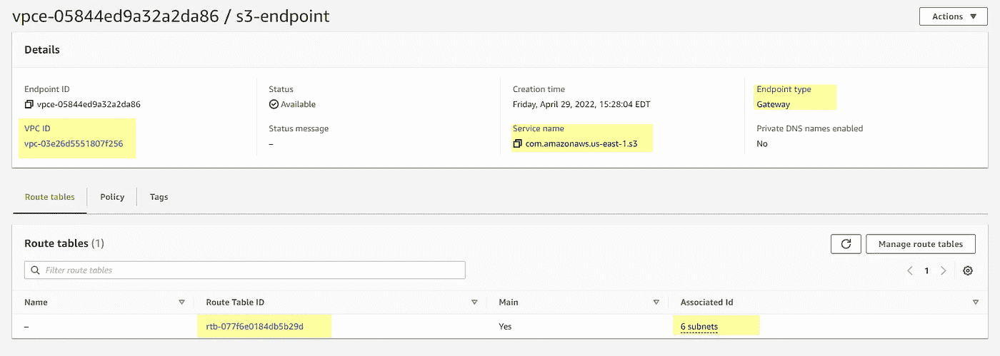

# 使用外部连接设置 AWS 红移集群

> 原文：<https://blog.devgenius.io/setup-aws-redshift-cluster-with-external-connectivity-6d3a04d60399?source=collection_archive---------2----------------------->

**使用 AWS VPC，AWS 红移，DBeaver**


AWS 红移设置

Amazon Redshift 是 AWS 云中的一个完全托管的数据仓库服务。亚马逊红移数据仓库由各种被称为*节点的计算资源组成。*节点被组织成一个组，称为*集群*。每个集群运行一个 Amazon 红移引擎，并包含一个或多个数据库。在[之前的](/build-your-own-data-lake-on-aws-s3-d984320a5388)文章中，我们用 AWS 胶水用保存在 S3 桶中的数据创建了一个数据湖。我们定义了一个从 S3 推断模式的爬虫，并创建了一个 AWS 胶合目录。它生成了我们在 AWS Athena 中查询的这些表。今天，我们将在此基础上继续努力。我们将创建一个红移集群，将这些数据存储到数据库中以供进一步分析。AWS 红移是基于 Postgres 的，所以如果你熟悉 Postgres，那么一些功能是相似的。为了通过 AWS Glue 或从您的本地 SQL 客户端(例如 DBeaver)连接到 Redshift，我们需要在 AWS 中配置额外的资源。

如果你喜欢视觉效果，那么我在 YouTube[上有一个附带的视频，里面有完整设置的演示。](https://www.youtube.com/watch?v=s8HckCTC6aA&t)

今天我们将:

*   VPC 及其组成部分概述
*   为外部连接配置端点
*   向安全组添加规则
*   创建红移集群并从本地机器连接

我们需要的第一个组件是 IAM 角色。在之前的[会话中，我们创建了以下*AWSGlueServiceRole-adventureworks*IAM 角色。最初，这个角色拥有 s3 和 Glue 服务权限。我还添加了红移访问。](/build-your-own-data-lake-on-aws-s3-d984320a5388)


IAM 角色权限

**AWS VPC**


AWS VPC 概述

下一个难题是 VPC 或虚拟私有云设置。默认情况下，当我们创建帐户时，AWS 会为我们提供一个默认的 VPC 实例。您可以继续创建另一个 VPC，但我们现在将使用默认实例。亚马逊虚拟私有云(或 VPC)是一种服务，允许您在自己定义的逻辑隔离的虚拟网络中启动 AWS 资源。

每个 VPC 在 AWS 云中创建一个独立的虚拟网络环境，专用于您的 AWS 帐户。其他 AWS 资源和服务在 VPC 网络内部运行，以提供云服务。

Amazon 使用以下资源为每个帐户创建一个默认 VPC。

*   子网
*   路由表
*   安全组
*   网络访问控制列表

**子网**

默认的 *VPC* 有六个子网。子网是网络内部的一个 T2 网络。子网是 VPC 中的一系列 IP 地址。您可以将 AWS 资源启动到指定的子网中。对必须连接到互联网的资源使用公共子网，对不会连接到互联网的资源使用专用子网。

**路由表**

路由表包含确定网络流量在 VPC 和子网内如何定向的规则(路由)。VPC 会创建一个名为主路由表的默认路由表。主路由表会自动与所有 VPC 子网相关联。

**终点**

我们需要创建一个资源来连接到*红移*，一个*端点*。 *AWS Glue* 外部客户端需要一个端点连接到这个 VPC，以便连接到其中的资源。我们的*红移*实例将位于私有*子网*中。这将删除从*红移*实例到互联网或 AWS 服务的所有连接。我们将需要 *AWS Glue* 来连接到这个服务以执行 ETL。这就是 *VPC* 端点的由来。它确保你的 *VPC* 和特定 AWS 服务之间的流量通过 *VPC* 端点开放，不会离开亚马逊网络。



S3 网关端点

**安全组**

安全组充当虚拟防火墙，控制允许到达和离开与其关联的资源的流量。例如，在我们将一个安全组与一个*红移*实例相关联之后，它控制该实例的入站和出站流量。

默认情况下，我们将有一个安全组。该组有一个入站自引用规则。我们将增加两条新规则。首先是*红移*，我们将它设置为*我的 IP，*在 source *，*下，这将帮助我们从本地机器用 DBeaver 或 Jupyter 笔记本连接到*红移*。我们需要为 *AWS Glue* 制定另一条规则:这将来自这个 *VPC* 中的任何 *IPV4* 地址。我们增加了两条附加规则。第一个本地连接到红移，第二个打开红移到任何 IPv4，但是自引用规则将源限制到这个 *VPC* 中的同一个安全组，所以它不是对所有网络开放。

**红移星团**

在*红移*服务下，我们将单击“create cluster”来创建一个新的集群。通常，如果这是你第一次投入 *AWS 红移*服务，探索免费试用是个好主意。但是，它不允许我们自定义设置。所以，我们会选择生产。我们将尝试并保留与免费试用相匹配的设置，因此不会产生任何额外费用。让我们选择 dc2 大型节点类型，并将节点数量设置为 1。我们将保留该用户的默认值，并为其设置一个密码。


红移星团构型

我们将一个角色与该集群相关联。让我们选择默认角色。该角色拥有以下权限*AmazonRedshiftServiceLinkedRolePolicy*。


集群 IAM 角色

接下来，我们将覆盖一些默认设置。如果您计划从本地 PC 连接到 redshift，这一点非常重要。在“网络和安全”下，我们将检查是否选择了合适的 VPC。该群集将处于默认 VPC 和默认安全组下。

我们需要将该群集公开。这允许 VPC 之外的设备通过端点连接到数据库。让我们单击“create”按钮来创建该集群。创建所有资源需要一段时间。一旦该群集可用，我们将建立到该群集的连接。


AWS 集群配置

**连接本地 SQL 客户端**

一旦集群状态变为可用。我们可以单击它来探索它的属性。在“属性”下，我们将找到与*红移*相关的大部分信息。我们有数据库**开发**、**端口**，并且**用户**和密码将是我们在创建时提供的。我们需要确保启用公开访问选项。让我们滚动到顶部，复制该群集的端点。这是连接字符串中的主机名。

在 DBeaver 客户端中，让我们单击 create a new connection。我们将搜索*红移*并选择它。让我们将端点粘贴到主机/实例中。它还有一些额外的部分，比如数据库名称和端口，所以我们将把它们和冒号一起删除。我们将保持其余的配置细节不变，并提供我们的密码。让我们测试一下连接，结果是成功的。我们可以单击“完成”来保存它。我们已经使用 *DBeaver* 成功连接到*红移*数据库。我们可以扩展和预览数据库。目前我们没有任何桌子。让我们继续创建一个表。我们将打开一个新的查询窗口，并粘贴一个创建表脚本。让我们执行查询并刷新表节点。我们在数据库中有一个新表。我们可以回去在 AWS 中确认这一点。

```
CREATE TABLE IF NOT EXISTS public.src_dimproductcategory
(
  productcategorykey BIGINT  
 ,productcategoryalternatekey BIGINT  
 ,englishproductcategoryname VARCHAR(500)  
 ,spanishproductcategoryname VARCHAR(500)  
 ,frenchproductcategoryname VARCHAR(500)  
)
```

我们将在这里结束，在下一节课中，我们将从 *AWS Glue* 连接到*红移*，并使用 *AWS Glue* 执行 ETL。所以，下次和我一起。

**结论:**

*   我们已经介绍并配置了用于外部连接的 AWS VPC 组件。
*   我们已经创建并探索了 AWS 红移星团
*   我们从本地 SQL 客户端建立到红移数据库的连接