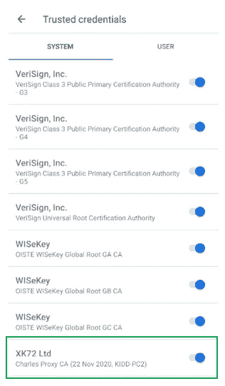

# 容易设置查尔斯代理拦截 Android 模拟器的 HTTPS 流量

> 原文：<https://blog.devgenius.io/setup-charles-proxy-to-intercept-https-traffic-of-android-emulator-591baba5d7ec?source=collection_archive---------0----------------------->

对于 Web 或应用程序开发，通常需要调试和查看应用程序的 HTTPS 流量。为了拦截流量，您必须使用中间人技术在您的应用程序和 API 端点之间进行解密和加密。

让我们用 Android 模拟器详细演练一下…

# A.设置 Android 模拟器(在 Android Studio 中)

您必须使用模拟器系统映像，而不使用播放存储


选择没有播放商店图标的图像


使用 Android Q


(可选)显示高级设置→设置为“冷启动”

> 存储模拟器的新文件夹将在`%USERPROFILE%\.android\avd`创建

# B.导出根证书

保存查尔斯根证书


将这个“pem”文件重命名为 android 特定格式的证书文件。

> 你可以在 **Git Bash** 中使用 openssl

```
openssl x509 -inform PEM -subject_hash_old -in charles.pem | head -1
```

> 名称格式为" <hash-value>" + ".0"
> (只需将" . 0 "作为一个字符串与哈希值字符串连接起来)</hash-value>


# C.启动模拟器

> Windows
> 中的仿真器路径`%LOCALAPPDATA%\Android\Sdk\emulator`

```
cd %LOCALAPPDATA%\Android\Sdk\emulator emulator -avd Pixel_3a_XL_API_29 -writable-system -no-snapshot-load
```


# D.根证书和推送根证书

> Windows 中的亚行路径
> `%LOCALAPPDATA%\Android\Sdk\platform-tools`

用`adb`执行命令

*   适用于 Android Q 及以上版本(API 等级≥ 29)

```
adb root 
adb shell avbctl disable-verification 
adb reboot 
```


```
adb root 
adb remount  
adb push 4a40cad5.0 /system/etc/security/cacerts/ 
adb -e shell chmod 644 /system/etc/security/cacerts/4a40cad5.0 
adb reboot
```


*   对于较旧的 Android (API 级别< 29)

```
adb root 
adb remount 
adb push 4a40cad5.0 /system/etc/security/cacerts/ 
adb -e shell chmod 644 /system/etc/security/cacerts/4a40cad5.0 
adb reboot
```

# E. Verify Trusted Cert & Setting APN

1.  Settings → Security → Encryption & Credentials → Trusted credentials



2\. Disable Wi-Fi

3\. Network & Internet → Mobile network → Advanced → Access Point Names

> *集合名称，APN 具有任意值，代理&端口应该跟随查尔斯代理*


4.选择 APN


5.确认


如果代理配置不匹配，或者 Charles 没有启动


如果一切正常

一旦你完成了上述所有步骤，你应该能够看到所有的加密流量从你的 Android 模拟器发送！