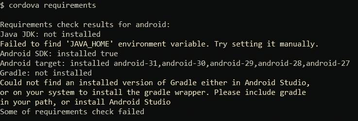
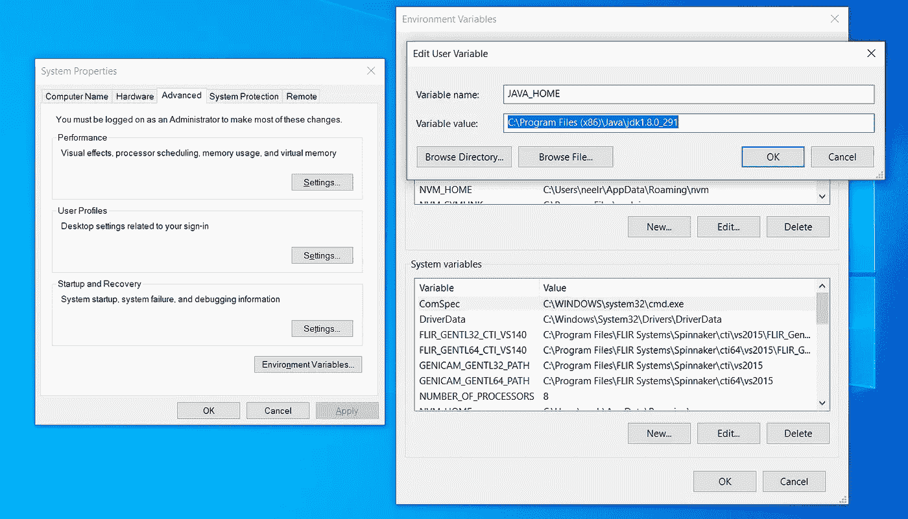
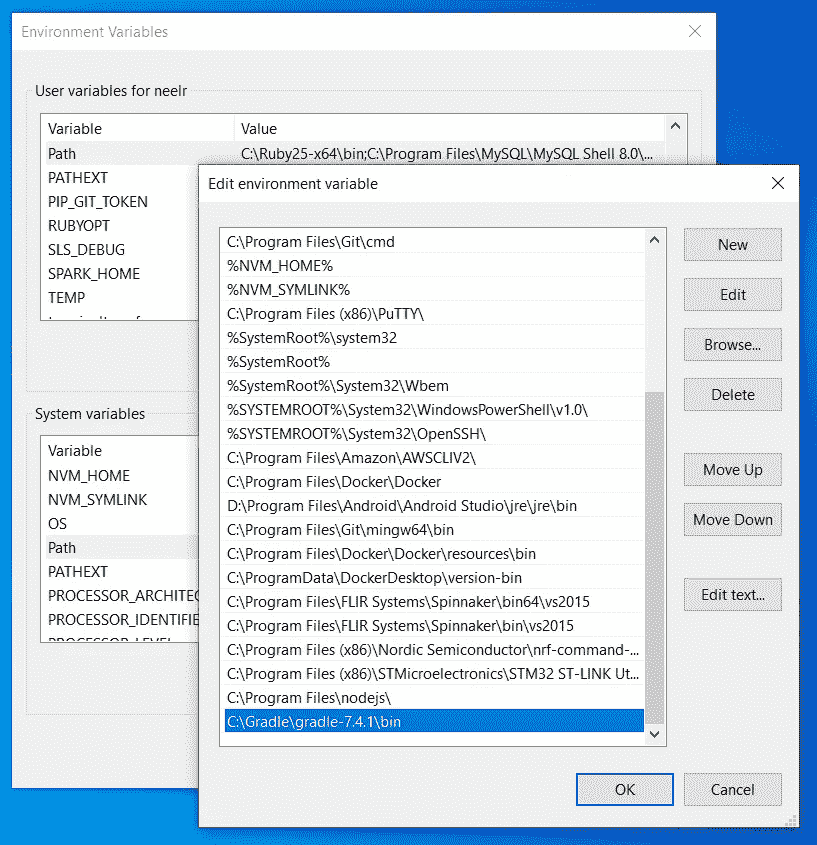
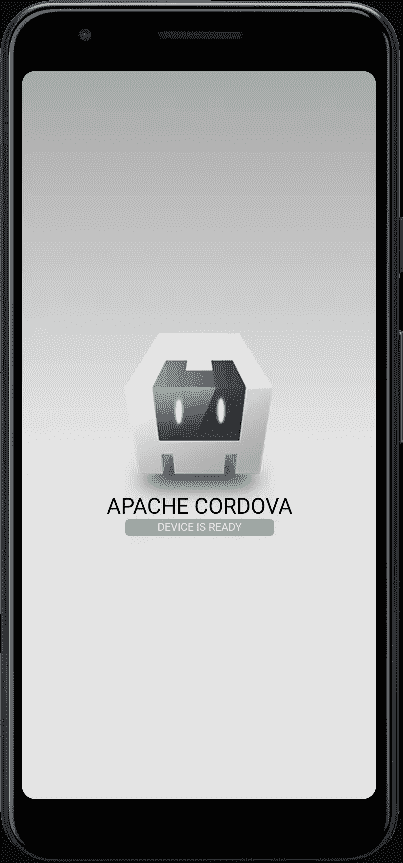

# 为 Android 设置科尔多瓦

> 原文：<https://blog.devgenius.io/setup-cordova-for-android-70da2970e48c?source=collection_archive---------5----------------------->

**先决条件:** 1。安卓工作室
2。npm 包管理器:

在开始以下过程之前，请确保这些程序已安装在系统上。如果没有安装，使用以下链接下载 [NPM](https://nodejs.org/en/download/) 和[安卓工作室](https://developer.android.com/studio)的安装包。

1.  使用 npm 在全球范围内安装 Cordova

```
npm install -g cordova
```

2.创建一个示例 Cordova 应用程序

```
cordova create myapp com.medium.myapp MyApp
```

现在，我们必须在 Cordova 应用程序中添加 Android 作为平台

3.更改目录

```
cd myapp
```

4.添加 Android 作为平台

```
cordova platform add android
```

这将更新 *config.xml* 和 *package.json* 文件。

5.检查依赖性满意度

```
cordova requirements
```

我的命令提示符的输出如下所示。



这基本上说明我没有安装 JDK，并且是为 Cordova 设置的。我安装了 Android Studio，但它无法检测 Gradle，这是一个用于编译、链接和打包 Android 应用程序的自动化工具。

6.安装 Java 开发工具包

使用以下链接下载并安装 Java 开发工具包:[https://www . Oracle . com/Java/technologies/downloads/# JDK 17-windows](https://www.oracle.com/java/technologies/downloads/#jdk17-windows)

7.安装梯度工具

使用以下链接下载安装二进制文件并解压:[https://gradle.org/releases/](https://gradle.org/releases/)

9.设置环境变量

这里我们将添加两个环境变量。使用关键字 **JAVA_HOME** 创建一个新的用户变量，并将其值设置为 JAVA 的安装路径。我这里是*“C:\ Program Files(x86)\ Java \ JDK 1 . 8 . 0 _ 291”*。注意，这是上一个目录，那里有*java.exe*。



将另一个 path 变量设置为 Gradle 文件的解压位置。在我这里是*" C:\ Gradle \ Gradle-7 . 4 . 1 \ bin "*



然后我们必须为 **ANDROID_HOME** 设置环境路径，在我的例子中是"*C:\ Users \ muser \ AppData \ Local \ ANDROID \ Sdk "。*

现在，要构建 android 应用程序，构建的堆大小可能会超过为 JVM 分配的内存空间。因此，我们需要增加最大分配内存大小。为此，我们将添加另一个环境变量 **_JAVA_OPTIONS** ，并将其值设置为 *-Xmx512m* 。

现在，如果我们再次运行 cordova 需求，我们应该看到我们满足了所有的需求。

10.运行应用程序

使用 Android Studio 中的 AVD 管理器启动一个 Android 模拟器，并运行以下命令。

```
cordova run android
```



*感谢阅读。*