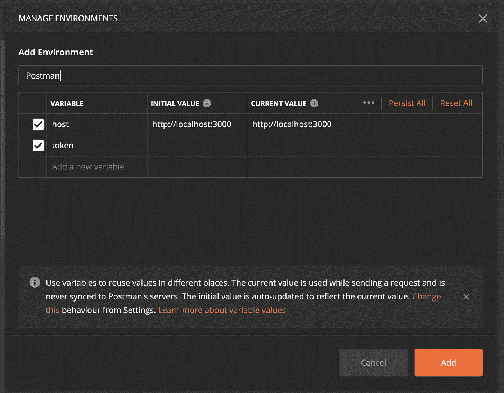

# 在 Postman 中将 Firebase 令牌设置为环境变量

> 原文：<https://blog.devgenius.io/setup-firebase-token-as-an-environment-variable-in-postman-7a850eb6177a?source=collection_archive---------2----------------------->

## 邮递员的环境变量

克里斯托夫·高尔在 [Unsplash](https://unsplash.com?utm_source=medium&utm_medium=referral) 上拍摄的照片

在我的大多数项目中，我使用 Postman 来检查我的 API 是否工作正常。大多数都使用 Firebase 来验证用户，所以我需要检索 Firebase 提供的会话令牌，并将其附加到每个响应的头中。

如果您手动这样做，对于几个端点来说是可以的，但是如果您有很多端点将这个令牌附加到头部，您将需要很多时间。

这个问题的解决方案是 Firebase 令牌的环境变量。让我们来配置它:

首先，我们需要创建一个环境，因此在 Postman 中，单击下图中白色圆圈内的按钮:

然后，单击添加按钮。在这里，您需要命名环境并创建您想要使用的变量。对于此示例，我们将创建两个变量，host 和 token:

现在，我们需要使用 Postman 登录 Firebase，因此创建一个新的 POST 请求，如下所示:

[https://identity toolkit . Google APIs . com/v1/accounts:signInWithPassword？key=](https://identitytoolkit.googleapis.com/v1/accounts:signInWithPassword?key=)

其中，密钥是您的 Firebase 项目密钥，正文如下:

该请求将返回一个具有以下结构的 JSON:

我们需要将 idToken 设置为令牌的环境变量。怎么做呢？转到 Postman 中的 Tests 选项卡，复制以下内容:

响应体是来自 Firebase 的响应。现在，我们需要解析它，然后，我们可以设置我们命名为“令牌”的环境变量。

现在，在您想要使用该令牌的任何请求中，转到“授权”选项卡，并添加令牌，如下所示:{ {令牌}}

就是这样。如果您使用 Firebase 来验证用户，并使用 postman 来检查响应，这将节省您大量的时间。

与我们合作:

 [## 阿维拉泰克

### 技术创新的发展

www.avilatek.com](https://www.avilatek.com/en/) 

领英:[https://www.linkedin.com/in/marcelo-laprea/](https://www.linkedin.com/in/marcelo-laprea/)