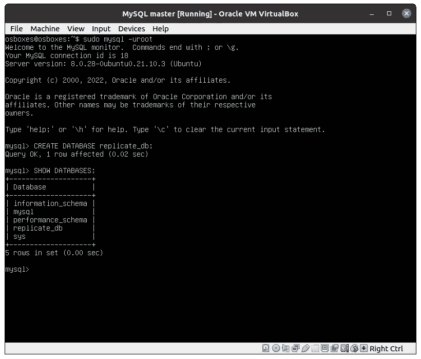

# 用 MySQL 设置主从复制

> 原文：<https://blog.devgenius.io/setup-master-slave-replication-with-mysql-e528dcd3b24a?source=collection_archive---------0----------------------->


当我们期望更高的吞吐量时，通常会增加数据库的读操作和写操作。因此，我们需要一种方法，通过添加多个服务器(从服务器)来复制数据库中的数据，允许应用服务器而不是主服务器从这些服务器中读取数据。主设备将只处理写操作。

这种设置主从复制的方式非常有用，因为它将制作您数据的多个副本，在其中一个从服务器出现故障时提供冗余。它可以提高可用性和可扩展性，因为我们可以在获得更高吞吐量和整体性能时添加更多从服务器。这种在多个数据库上进行同步的做法称为复制。

本教程期望您已经掌握了一些关于关系数据库管理系统和使用 GNU/Linux 操作系统的基本知识。

所以我们现在首先要做的就是安装第一台主 MySQL 服务器。我会在 Ubuntu 21.10 上安装这个。我们还将在本地机器上使用 VirtualBox，我们可以下载一个准备好的 Ubuntu 21.10 镜像，我们可以将它导入 VirtualBox，而不必自己安装操作系统。

我们当然也可以使用云提供商来设置服务器，这些服务器也已经准备好了可以使用的映像。但是不管怎样，只要对本教程有用。

# 安装 VirtualBox 并下载 Ubuntu 映像

所以我们从这里开始下载 VirtualBox:[https://www.virtualbox.org/wiki/Linux_Downloads](https://www.virtualbox.org/wiki/Linux_Downloads)选择 Ubuntu 19.10 / 20.04 / 20.10 / 21.04。然后在 Ubuntu 软件中打开软件，按安装。

现在我们在这里下载 Ubuntu 镜像:【https://www.osboxes.org/ubuntu/ 选择 Ubuntu 21.10 Impish Indri。这个文件将用 7zip 下载，所以我们需要解压它。我们可以通过按下**信息**按钮找到稍后需要的登录信息。


打开 VirtualBox 并按下按钮**新建**


现在将出现一个弹出窗口，您可以在其中输入虚拟机名称、存放数据的目录、操作系统类型和版本。


除机器文件夹外，填写以上信息，然后按下一步:


现在它将询问应该分配多大的内存。使用默认设置。如果你发现


在这里，我们将按“使用现有的虚拟硬盘文件”,并按下目录图标。


添加硬盘(VDI)

这个弹出窗口将出现，我们按添加。


找到你的**。vdi** 文件，您在其中导出了 7zip 文件，然后按 Open。现在继续保存虚拟机。

开始之前，我们需要通过进入**设置**将网络设置为桥接适配器，以便我们可以为虚拟机获取唯一的 IP:


现在我们有了一个可以启动的虚拟机，所以按下开始按钮，Ubuntu 就会加载。


如果您遇到光标闪烁的问题或启动困难。您可能希望增加虚拟机的 RAM 或图形内存。还要检查你的 CPU 是否支持硬件虚拟化。这可以通过 GNU/Linux 中的命令来完成:

```
egrep -c ‘(vmx|svm)’ /proc/cpuinfo
```

如果你得到任何大于 0 的值，你的硬件支持它。

现在使用凭证登录


使用密码 osboxes.org 登录系统

现在，我们可以通过打开终端并输入以下命令来禁用 GUI:

```
sudo systemctl set-default multi-user
```

现在重新启动系统，我们将只看到 CLI:


Ubuntu CLI

# 设置 MySQL 主虚拟机

现在，我们使用凭据登录，开始安装所有必需的软件包和依赖项。

```
sudo apt-get update
sudo apt-get install mysql-server mysql-client -y
```

现在，我们需要使用以下命令来获取虚拟机的 IP 地址

```
ip addr show
```


192.168.32.10

在第二个以太网上复制 inet 的值，在这种情况下，它应该是 **192.168.32.10** 。

# 设置 MySQL 从属虚拟机

因此，按照之前的说明，使用我们下载的相同映像创建一个新的虚拟机。但是附加上**可能会有问题。vdi** 文件，因为它将具有相同的 UUID。因此，我们需要首先通过进入命令行并输入:

```
VBoxManage internalcommands sethduuid <filename>.vdi
```

然后继续安装虚拟机，然后我们再次安装软件包。

```
sudo apt-get update
sudo apt-get install mysql-server mysql-client -y
```

让我们像以前一样获取这个虚拟机的 IP 地址，并保存它。

# MySQL 主配置

使用 VIM 或 Nano 打开配置:

```
sudo vim /etc/mysql/mysql.conf.d/mysqld.cnf
```

找到包含 bind-address 的行，并用我们之前得到的 MySQL master 的 IP 地址替换该值。接下来，我们将在文件中找到这些行并删除注释:

```
server-id = 1
log_bin = /var/log/mysql/mysql-bin.log
```

为了避免我长期以来遇到问题，我也删除了这一行:

```
mysqlx-bind-address = 127.0.0.1
```

现在让我们重启 MySQL 服务

```
sudo service mysql restart
```

确认 MySQL 是否正在运行:

```
systemctl status mysql
```

如果我们在配置中出错或 IP 不正确，我们会看到它在这里处于失败状态。

我们将在稍后阶段对此服务器进行一些额外的配置。我们首先要设置 MySQL 从属虚拟机。

我们现在将创建一个应该用于从服务器的用户，以便它们可以登录到 MySQL 主服务器。在下面输入以下命令。

```
sudo mysql -uroot
mysql> CREATE USER ‘slave’@’SLAVE_IP_ADDRESS‘ IDENTIFIED BY ‘SLAVE_PASSWORD‘;
mysql> GRANT REPLICATION SLAVE ON *.* TO ‘slave’@’SLAVE_IP_ADDRESS‘;
mysql> FLUSH PRIVILEGES;
mysql> FLUSH TABLES WITH READ LOCK;
```

我们可以使用以下命令来验证状态

```
mysql> SHOW MASTER STATUS;
```

现在，我们需要将现有的数据转移到从属服务器。所以退出 MySQL CLI。我们进行 MySQL 转储，并将其保存到一个. SQL 文件中。

```
sudo mysqldump -–all-databases > data.sql
```

# MySQL 从属配置

我们打开从 MySQL 配置，在这里将绑定地址设置为 IP，并像以前一样注释掉这些行，但是记住将**服务器 id** 设置为 2 而不是 1。然后我们重启 MySQL 服务。

```
mysql> CHANGE MASTER TO
     MASTER_HOST='<master-ip>' ,
     MASTER_USER='slave' ,
     MASTER_PASSWORD='Test1234!!#' ,
     MASTER_LOG_FILE='mysql-bin.000001' ,
     MASTER_LOG_POS=1232;
```

用您的主 IP 地址替换 MASTER_HOST，用运行 SHOW MASTER STATUS 时获得的文件名替换 MASTER _ LOG _ FILE 并在 MASTER_LOG_POS 上获取位置并设置它。

# 设置用于传输的公共/私有 SSH 密钥

让我们将 data.sql 文件从主服务器传输到从服务器。但是我们需要生成一个公钥/私钥，这样我们就可以用 SCP 传输它。因此，通过运行以下命令从主服务器创建一个密钥:

```
ssh-keygen
```

跳过不同的名称或密码。然后打开公钥:

```
cat ~/.ssh/id_rsa.pub
```

复制内容，然后转到 MySQL 从服务器。这里我们需要安装 openssh-server。

```
sudo apt-get install openssh-server
```

然后打开 SSH 配置:

```
sudo nano /etc/ssh/sshd_config
```

修改 **PermitRootLogin** 并设置为 **Yes** 。保存文件。然后创建以下文件:

```
touch ~/.ssh/authorized_keys
```

然后打开它，粘贴我们之前生成的公钥。现在运行以下命令来重新启动 SSH 服务。

```
sudo systemctl restart ssh
```

现在我们应该能够与从属服务器通信了。我们可以通过以下方式进行测试:

```
ssh -v <ip-of-slave> /bin/true
```

如果我们得到的退出状态为 0，应该没问题。现在我们将实际传输我们生成的转储文件:

```
scp data.sql osboxes@<ip-of-slave>:/home/osboxes
```

现在我们应该可以看到文件了，我们看到了！


我们可以看到 data.sql 存在于主目录中

# 将 MySQL 转储文件导入 MySQL 从属服务器

现在让我们导入 MySQL 转储文件:

```
sudo mysql -uroot < data.sql
```

现在我们的 slave 中应该有相同的数据。我们可以通过进入 MySQL CLI 确认这一点。


所以我们有相同的数据。很好！

让我们向 master 添加一个新的数据库，以检查我们的复制是否有效。



我们在 MySQL master 中添加了一个新的数据库 replicate_db

好的，我们现在有五个数据库。让我们检查是否所有东西都复制到了我们的 MySQL 从属服务器上。


我们现在看到我们的 replicate_db 已经被添加到了从属数据库中

如果你在安装过程中遇到问题，你可以在这里查看复制清单:[https://dev . MySQL . com/doc/MySQL-Replication-extract/8.0/en/Replication-problems . html](https://dev.mysql.com/doc/mysql-replication-excerpt/8.0/en/replication-problems.html)

本教程到此为止。我们应该为产品添加许多设置，但我不会在这里讨论，因为这将是非常广泛的，也许在未来的教程中。如果你想了解更多，请给我发评论。