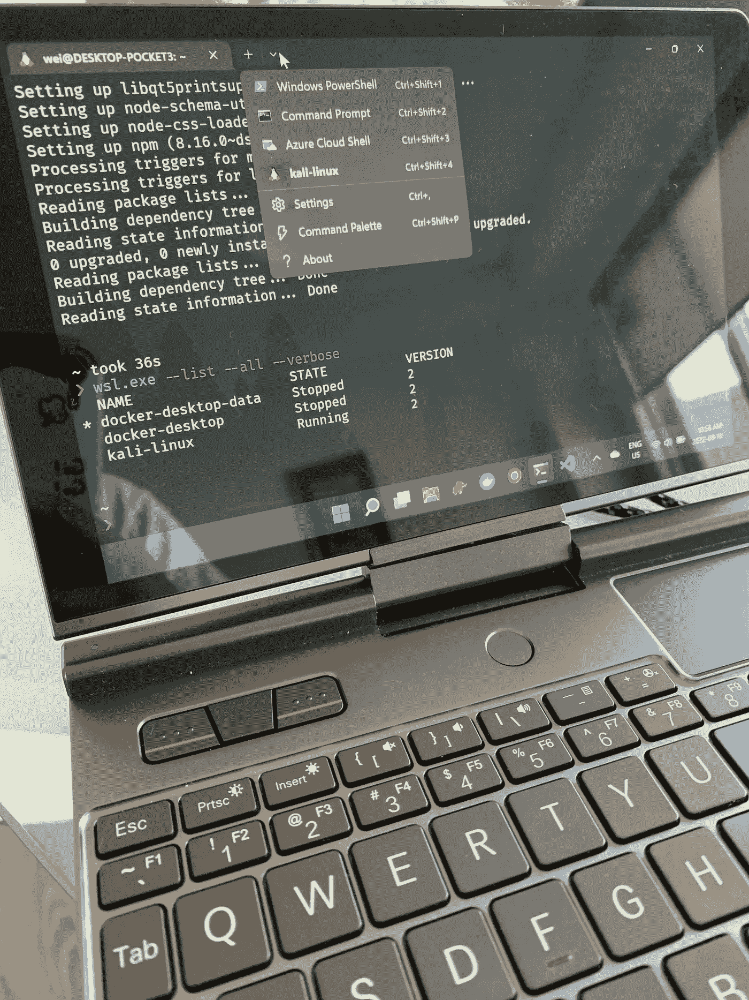

# 设置我的新便携式开发笔记本电脑

> 原文：<https://blog.devgenius.io/setup-my-new-portable-development-laptop-1cea724e325c?source=collection_archive---------9----------------------->

周末建设和学习

大约一年前，我写了一篇文章分享我的开发设置，比如我的笔记本电脑，E.N.V..等。

 [## 简单高效

### 我的个人发展环境设置

blog.devgenius.io](/simple-and-efficient-8ab081659fe3) 

我喜欢我的 OneNet Book，它给了我许多可移植的选项，帮助我在不同的环境和情况下继续编码和写作。

然而，其中一个问题或者说我唯一的抱怨是它的键盘布局，这需要很多时间来适应。

我最近决定尝试一款新的便携式笔记本电脑，它有一个新的开发环境。Windows 11 和 WSL2 Kali 运行时。

## 新设备选择

在目前的市场上，很难找到一些 10 英寸的笔记本电脑。[全球动力局](https://www.gpd.hk/)科技公司是专注于迷你手持设备的公司之一。

经过一番研究和谷歌搜索，我最终决定购买 G.P.D. Pocket 3 是我新的随身编码手持设备，尤其是在我等待儿子周末音乐课的时候。

等待

作者的信用

G.P.D. Pocket 3 的关键特性之一是模块化。

对于我个人的编码使用来说，N6000 入门级已经足够好了。

作者的信用

## 新的设备设置

最初，我想安装 Kali Linux 但是，G.P.D. Pocket 3 在安装 Linux 时有两大问题。

1.  **声音:**n 6000 型号采用 ESSX8326 声音硬件，驱动通常由`sof-firmware`提供。此时扬声器和耳机音频都不起作用。一份关于 sof 项目 GitHub 的公开 bug 报告，请求专门针对 Pocket 3 的帮助。es8xxx 系列声音设备与 Linux 的问题由来已久，并且普遍缺乏解决这些问题的兴趣。
2.  **暂停:**根据 [**动力局的公告**](https://www.indiegogo.com/projects/pocket-3-a-modular-and-full-featured-handheld-pc/x/28134519#/updates/24) ，暂停等级 S3 目前无法正常运行。可以通过添加`mem_sleep_default=s2idle`内核参数来强制 S2。

这两个重要问题对于日常使用来说相当混乱，这导致了我的下一个选择:Windows 11+Linux(w . s . l .)Kali Linux 的 Windows 子系统。

当前的 W.S.L .是第 2 版。开始和设置跑步很容易。

 [## 安装不锈钢。

### 本指南将向您展示如何安装 Linux 发行版(如 Ubuntu、OpenSUSE、Kali、Debian、Arch Linux 和…

docs.microsoft.com](https://docs.microsoft.com/en-us/windows/wsl/install) 

对我来说，最方便的特性是我可以设置所有的开发工具包，而不会与我当前基于 Linux 的笔记本电脑有所不同，如下所示:

1.  微软 VS 代码:用于开发的 IDE。
2.  Docker，Docker Compose:更快地构建工作和开发环境。
3.  TablePlus: SQL 和数据库 G.U.I .(与 SQLectron 的 Linux 设置不同)
4.  戈朗
5.  拉斯特朗
6.  Nodejs
7.  计算机编程语言

除了常用的编程工具，我还设置了一些终端定制；今天，我要说的是，到目前为止，Windows 终端的用户体验非常好。

1.  您可以安装多个 Linux 系统，并在选项卡之间轻松切换。

作者的信用

2.你可以定制你想要的终端。我喜欢 Z.S.H 的组合..哦，我的时髦和书呆子字体。谷歌一下，你会找到你喜欢的。

3.本机和自然地与 VSCode 集成，可以方便和平滑您的开发体验。

在过去的几周里，这种体验非常棒。我会继续分享更多。

这就是本周的全部内容。

感谢您的阅读。