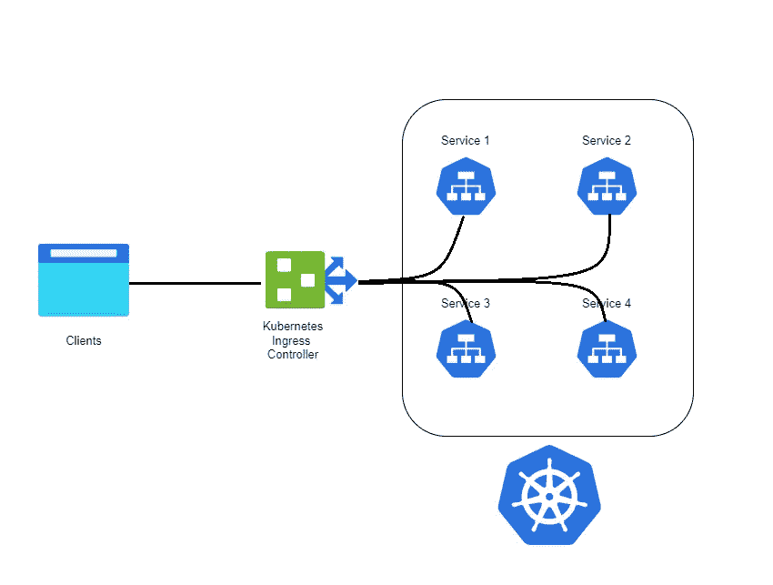

# 在云中设置 nginx 入口

> 原文：<https://blog.devgenius.io/setup-nginx-ingress-in-cloud-a829f617fab6?source=collection_archive---------3----------------------->

本文描述了如何使用 kubectl 在 Kubernetes 集群中安装 NGINX 入口控制器。

## 什么是 Ingress？

Ingress 是 Kubernetes 的本地资源，如 pods、deployments 等。使用入口，您可以维护 DNS 路由配置。入口控制器通过从存储在 etcd 中的入口对象读取路由规则来执行实际路由。

## 在进入之前？

在 Kubernetes 入口稳定之前，定制 Nginx 或 HAproxy kubernetes 部署将作为负载平衡器服务公开，用于将外部流量路由到内部集群服务。

## Kubernetes Ingress:它是如何工作的？



实际进入依赖于两个概念

- Kubernetes Ingress 资源:Kubernetes Ingress 资源负责在集群中存储 DNS 路由规则。

- Kubernetes 入口控制器:Kubernetes 入口控制器(Nginx/HAProxy 等。)通过访问通过入口资源应用的 DNS 规则来负责路由。


## 设置

首先，我们将通过使用 YAML 清单部署 Nginx 控制器来理解所有相关的 Kubernetes 对象。一旦我们有了理解，我们将使用 kubectl 部署它。

## 安装 NGINX 入口控制器

由于入口控制器是 Kubernetes 的核心组件，因此作为安装的一部分，它需要在集群级别执行特定的配置。NGINX 项目通过提供一个单一的部署 yaml 文件简化了这一过程，该文件捕获了集群配置所需的所有步骤:

```
kubectl apply -f https://raw.githubusercontent.com/kubernetes/ingress-nginx/main/deploy/static/provider/cloud/deploy.yaml
```

输出:


## 暴露 NGINX 入口控制器

默认情况下，上述命令会将 NGINX 入口控制器暴露给外界，以允许它开始接收连接。

## 验证 NGINX 入口控制器

```
kubectl get pods --all-namespaces -l app.kubernetes.io/name=ingress-nginx
kubectl get services ingress-nginx-controller --namespace=ingress-nginx
```


## 使用 NGINX 入口控制器公开服务

现在我们将编写入口清单:

```
apiVersion: networking.k8s.io/v1
kind: Ingress
metadata:
  name: hello-world
  annotations:
    kubernetes.io/ingress.class: "nginx"
    nginx.ingress.kubernetes.io/rewrite-target: /
spec:
  rules:
    - http:
        paths:
          - pathType: Exact
            path: /bookstore
            backend:
              service:
                name: app1-svc
                port:
                  number: 80
          - pathType: Exact
            path: /library
            backend:
              service:
                name: app2-svc
                port:
                  number: 80
```

测试事物:

部署我们的应用程序清单后:


我们可以使用负载平衡器 IP 进行测试:


还有书店:


最后，我们演示了如何在 Azure Kubernetes 服务中成功部署入口控制器，并在集群中提供两个 ClusterIP 服务。