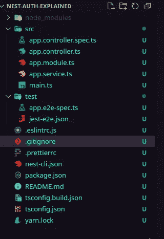
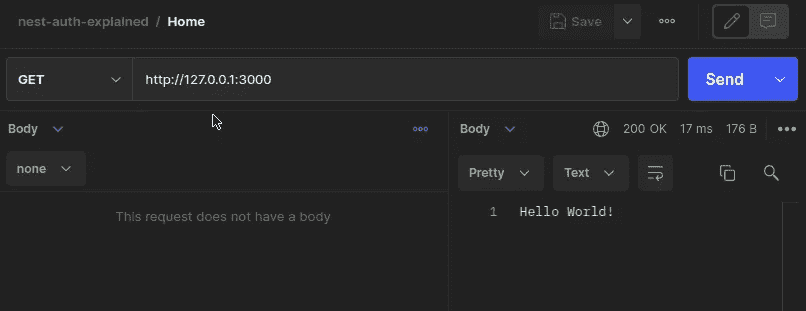
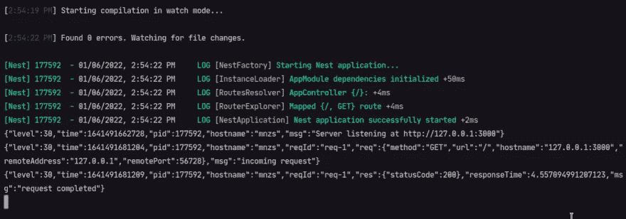

# 设置项目和 Fastify 平台—带 Passport #01 的 NestJs

> 原文：<https://blog.devgenius.io/setup-project-and-fastify-platform-nestjs-with-passport-01-61a8a5bc2b5?source=collection_archive---------4----------------------->


在这一系列的文章中，我将使用社会认证和 JWT 创建一个护照认证系统。让我们用 NestJs + Passport + Fastify 的组合来创建一个完整的认证系统。

所以在第一部分中，我们从一个空白项目开始，将使用 Fastify 平台并理解 NestJs 是如何工作的。

# 什么是 NestJs？

NestJs 是一个用于构建高效且可伸缩的 Node.js 服务器端应用程序的框架。它使用健壮的 HTTP 服务器框架，如 Express 或 Fastify。NestJs 在公共 Node.js 框架之上提供了一个抽象层次，并向开发人员公开了它们的 API。这为使用第三方模块提供了很大的自由度。

用于编写可伸缩、可测试和松散耦合的应用程序。它支持 PostgreSQL、MongoDB、MySQL 等数据库。

# 启动项目

我们将使用`@nestjs/cli`创建一个启动项目，并在我们的项目中不使用这些文件时清除它们。如果你想了解细节，请查阅官方文档。

首先，我们在您的计算机中全局安装`@nestjs/cli`,并初始化一个空白项目。我推荐使用 yarn 来安装包，但是你也可以选择你喜欢的包管理器。

```
yarn global add @nestjs/cli
nest new nest-auth
```

您可以访问该文件夹并在 VSCode 中运行(如果您愿意，也可以在另一个编辑器中运行)。

```
cd nest-auth
code .
```

在下图中，您可以看到文件结构，此时我们有一个应用程序模块、控制器和服务。



# NestJs 中的块类型

**模块:**用于组织代码，并将特性分解成逻辑上可重用的单元。分组的 TypeScript 文件用“@ Module”decorator 来修饰，它提供了 NestJs 用来组织应用程序结构的元数据。

**提供者:**也称为服务，设计用于抽象任何形式的复杂性和逻辑。可以创建提供者并将其注入控制器或其他提供者。

**控制器:**负责处理传入的请求，并向应用程序的客户端返回适当的响应(例如调用 API)。

# 配置 Fastify 平台

在这个项目中，我选择使用 Fastify，因为它比 Express 有更好的性能和功能。

> *Fastify 为 Nest 提供了一个很好的替代框架，因为它以类似 Express 的方式解决设计问题。然而，fastify 比 Express 快得多，达到了几乎两倍的基准测试结果。一个公平的问题是为什么 Nest 使用 Express 作为默认的 HTTP 提供者？原因是 Express 被广泛使用，众所周知，并且有一个庞大的兼容中间件集，可用于嵌套用户开箱即用。*

让我们来配置一下，在`main.ts`中，如果我们使用 Fastify，我们会配置平台。

首先，我们需要安装所需的软件包:

```
yarn add @nestjs/platform-fastify
```

在`src/main.ts`中，你导入`FastifyAdapter`和`NestFastifyApplication`来初始化`NestFactory.create`中的。

```
// src/main.tsimport { NestFactory } from '@nestjs/core';
import {
  FastifyAdapter,
  NestFastifyApplication,
} from '@nestjs/platform-fastify';
import { AppModule } from './app.module';async function bootstrap() {
  const app = await NestFactory.create<NestFastifyApplication>(
    AppModule,
    new FastifyAdapter()
  );
  await app.listen(3000);
}
bootstrap();
```

我们不需要更多的设置，现在 Fastify 已经配置好了，可以使用了👏

# 运行第一条路线

当使用`@nestjs/cli`创建一个项目时，它会创建一个示例路由，因此将使用该路由来测试我们的配置。在接下来的教程中，我将解释在 NestJs 中路由是如何工作的。现在我们想知道 Fastify 是否有效。

打开`app.controller`文件，我们看到使用`http://localhost:3000/`时在`/`路径中使用 GET 方法默认路由，服务器运行`getHello`函数并从`AppService`返回响应

```
// src/app.controller.tsimport { Controller, Get } from '@nestjs/common';
import { AppService } from './app.service';@Controller()
export class AppController {
  constructor(private readonly appService: AppService) {} @Get()
  getHello(): string {
    return this.appService.getHello();
  }
```

`AppService`有一个名为`getHello`的方法，它返回一个字符串`Hello World`

```
// src/app.service.tsimport { Injectable } from '@nestjs/common';@Injectable()
export class AppService {
  getHello(): string {
    return 'Hello World!';
  }
}
```

因此，让我们使用 Postman 为这条路线发送一个请求，看看返回什么



好消息是它起作用了👏

# 记录器

如果你想得到一个你发送一个请求的日志，你可以在`Fastify Adapter`中设置这个选项

```
// src/main.tsasync function bootstrap() {
  const app = await NestFactory.create<NestFastifyApplication>(
    AppModule,
    new FastifyAdapter({ logger: true }),
  );await app.listen(3000);
}
bootstrap();
```

如果您使用此选项，下面是一个示例



# 直到下次

这就是我们将在本文中讨论的所有内容，我们了解了 NestJs，并为我们的项目发展做了初步设置。在本系列的下一篇文章中，我们将使用 Prisma、Docker 和 Postgresql 配置数据库。

感谢您的阅读！

遵循存储库来查阅代码

[https://github.com/mnzsss/nest-auth-explained](https://github.com/mnzsss/nest-auth-explained)

# 参考

*   [NestJs 文档](https://docs.nestjs.com/)
*   [为什么选择 NestJS 作为你的后端框架？](https://selleo.com/blog/why-choose-nest-js-as-your-backend-framework)