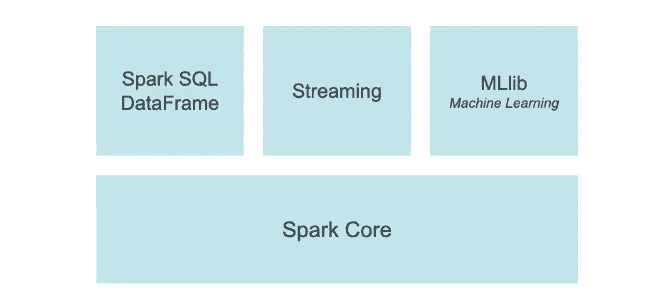
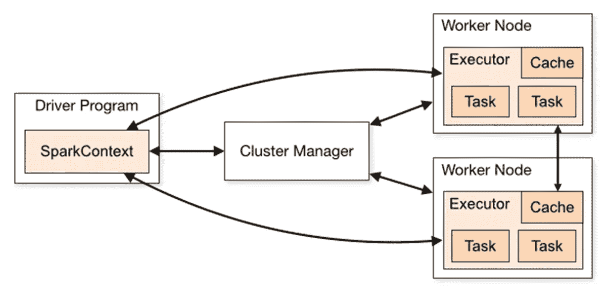

# 在本地设置 PySpark &用 py spark 构建您的第一个 ETL 管道

> 原文：<https://blog.devgenius.io/setup-pyspark-locally-build-your-first-etl-pipeline-with-pyspark-91c3060c6133?source=collection_archive---------0----------------------->

**使用 Python，Jupyter 笔记本**


PySpark (Python API)

[PySpark](https://spark.apache.org/docs/latest/api/python/) 是针对 [Apache Spark](https://spark.apache.org/) 的 Python API。Apache Spark 是一个用于大规模数据处理的分析引擎。它是一个分布式数据处理引擎，这意味着它运行在一个集群上。一个群集由三个或更多节点(或计算机)组成。Spark 是用 Scala 写的，但是它提供了 Java、Python、R 等其他主流语言的 API——py spark 就是 Python API。

它还支持其他工具和语言，包括用于 SQL 的 [Spark SQL](https://spark.apache.org/docs/latest/sql-programming-guide.html) ，用于 pandas 工作负载的 [pandas API，以及用于增量计算和流处理的](https://spark.apache.org/docs/latest/api/python/getting_started/quickstart_ps.html)[结构化流](https://spark.apache.org/docs/latest/structured-streaming-programming-guide.html)。



PySpark 建筑由[https://spark.apache.org/](https://spark.apache.org/)

完整代码可在 [GitHub](https://github.com/hnawaz007/pythondataanalysis/tree/main/PySpark) 上获得。随附的视频教程可在 [YouTube 上找到。](https://www.youtube.com/watch?v=5S8fEqTfT2I)

本 PySpark 教程将帮助您:

*   设置 PySpark 开发环境
*   将数据从平面文件读入数据帧
*   在 Spark 上使用 Pandas API 执行数据帧操作
*   使用 Spark-SQL 查询数据集
*   将数据帧保存到 PostgreSQL 数据库中。

**Pyspark 架构**

Apache Spark 有一个主/从架构，其中主被称为“驱动程序”，从被称为“工人”。

这是一个基于集群的系统，由一个驱动程序和多个工作程序组成。在集群的主节点中，我们有创建**火花上下文**的驱动程序。SparkContext 协调集群上的进程。它调度作业的执行并连接到集群管理器。集群管理器在 spark 应用程序中分配资源。一旦连接上，Spark 就会在集群中的 worker 节点上获得*执行器*，这些执行器是为我们的应用程序运行计算和存储数据的进程。



https://spark.apache.org/的星火建筑

接下来，它将我们的应用程序代码(SparkContext 的 JAR 或 Python 文件)发送给执行器。最后，SparkContext 将*任务*发送给执行器运行。

我们将以独立模式运行 PySpark。Standalone cluster 是 Spark 附带的一个简单的集群管理器，可以轻松设置集群。

**先决条件**

我们需要在我们的机器上安装 Java JDK。我在 windows 上，我已经安装了 windows 版本。如果您想要查询或持久化数据库中的数据，那么我们将需要适当数据库的 Jar 文件。因为我有 PostgreSQL 和 SQL Server，所以我将从 maven 存储库站点下载 jar。请记住，Jar 文件必须与您的 Java 版本兼容。最后，我们需要在机器上安装 PySpark。

```
pip install PySpark
```

**首款 PySpark App**

现在我们准备开发我们的第一个 PySpark 应用程序。我们将使用 Jupyter 笔记本作为我们的 IDE。我们在顶部导入所需的库。

```
from pyspark import SparkContext, SparkConf
from pyspark.sql import SparkSession, SQLContext
import os
```

要运行 PySpark 应用程序，您需要安装 Java。我们需要为 Spark 提供 Java 位置。为此，我们将使用 os dot environ 设置一个 Java home 变量，并提供 Java 安装目录。

```
os.environ["JAVA_HOME"] = "C:\Program Files\Java\jdk-18.0.2.1"
```

接下来，我们将为 spark 应用程序设置配置。Spark 应用程序只需要很少的配置细节就可以运行。我们可以在从 PySpark 导入的 SparkConf 对象的帮助下提供配置。我们将应用程序名称设置为“Example”。主节点 URL 为 local，并设置 Jar 文件的位置。我们准备创造一个火花环境。我们利用 SparkContext 对象并调用 getOrCreate 函数。我们向该函数提供配置。我们调用 SparkSession 并为其提供 Spark 上下文。我们将会话保存到一个名为 spark 的变量中。

```
conf = SparkConf() \
    .setAppName("Example") \
    .setMaster("local") \
    .set("spark.driver.extraClassPath","C:/pyspark/*")#
sc = SparkContext.getOrCreate(conf=conf)
spark = SparkSession(sc)
```

我们可以查看 spark 变量来查看 spark 应用程序的细节。它显示了我们在上面提供的配置细节。此外，我们还有到 Spark UI 的链接。我们点击链接，探索 Spark UI。我们可以在这里看到我们在应用程序中执行的所有操作。创建几个数据帧后，我们将再次访问 SQL/Dataframe 选项卡。

我们的 spark 应用程序启动了。让我们用 spark 读取一个 csv 文件。这将把文件读入数据帧。我们使用 show 函数显示数据帧。

```
df=spark.read.options(delimiter=",", header=True).csv(r"C:\Users\haq\OneDrive\Notebooks\data\AdvWorksData.csv")
df.show()
```

**数据帧操作**

现在我们可以在这个数据帧上执行各种操作。你可以在 spark 网站上查看完整列表。我们可以打印 dataframe 的模式来查看列及其数据类型。

我们可以用过滤函数过滤这个数据帧。这里我们只过滤法国的数据集。我们可以过滤出分析所需的数据。

```
france = df.filter(df.saleterritory == "France").show(truncate=False)
```

如果我们想关注几列，我们可以通过向数据帧提供一个列列表来缩减数据帧。这个数据帧包括我们指定的列的子集。

```
df1 = df[['productcategory','saleterritory','OrderDate','Sales']]
df1.show()
```

我们还可以执行聚合函数，例如 group by。这些是使用 Spark dataframe API 进行数据操作的几个例子。

```
saleterritory = df.groupBy('saleterritory').count()
print(saleterritory.show())
```

**Spark-SQL**

我们还可以使用 Spark SQL 对这个数据集运行 SQL 查询。我们将数据帧保存为一个临时视图，称为 sales。使用 Spark SQL，我们可以用 SQL 查询它。输出显示为 Caps 子类别过滤的记录。我们可以使用分布式引擎对这个数据集执行标准的 SQL 操作。

```
df.createOrReplaceTempView("sales")
output =  spark.sql("SELECT * from sales where productsubcategory='Caps'")
output.show()
```

**写入数据库**

如果我们愿意，我们可以将这个数据集持久化到数据库中。我们已经向 Spark 上下文提供了 PostgreSQL 的 Jar 文件。我们将声明数据库细节和凭证。我们将添加一个名为 *pyspark_sales_table* 的新表。

我们在 dataframe 上调用 write 函数。我们提供了一些配置，比如模式(如果表存在，我们会覆盖它)格式是 jdbc(我们提供 jdbc URL、目标表名、用户、密码和驱动程序。最后，我们在它上面调用 save 函数。一旦我们执行这个单元，这将把数据帧保存到 PostgreSQL 数据库。

```
dest_tbl = 'public."pyspark_sales_table"'
database = "AdventureWorks"
password = "password"
user = "user"
#
df.write.mode("overwrite") \
    .format("jdbc") \
    .option("url", f"jdbc:postgresql://localhost:5432/{database}") \
    .option("dbtable", dest_tbl) \
    .option("user", user) \
    .option("password", password) \
    .option("driver",  "org.postgresql.Driver") \
    .save()
```

我们已经演示了如何在独立模式下设置 PySpark。我们编写了第一个从 CSV 文件读取数据的 PySpark 应用程序。我们在 Spark 上使用 Pandas API 执行数据帧操作。此外，我们使用 Spark-SQL 查询导入的数据集。最后，我们将数据帧持久化到 PostgreSQL 数据库中。

**结论**

*   我们描述 PySpark 是什么以及如何在本地配置它。
*   我们展示了使用 PySpark 导入和操作数据是多么容易。
*   我们使用 PySpark、Pandas API 和 PostgreSQL 实现了一个基本的 ETL 管道。
*   完整的代码可以在[这里](https://github.com/hnawaz007/pythondataanalysis/tree/main/PySpark)找到