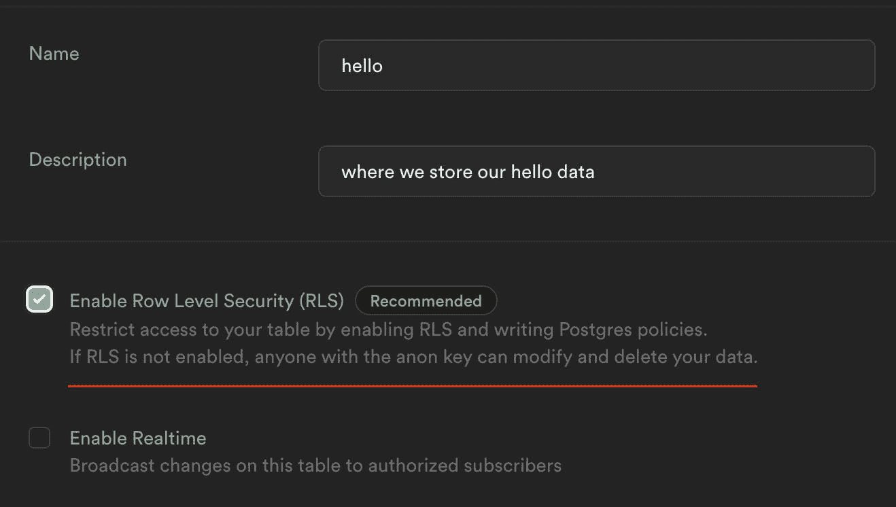
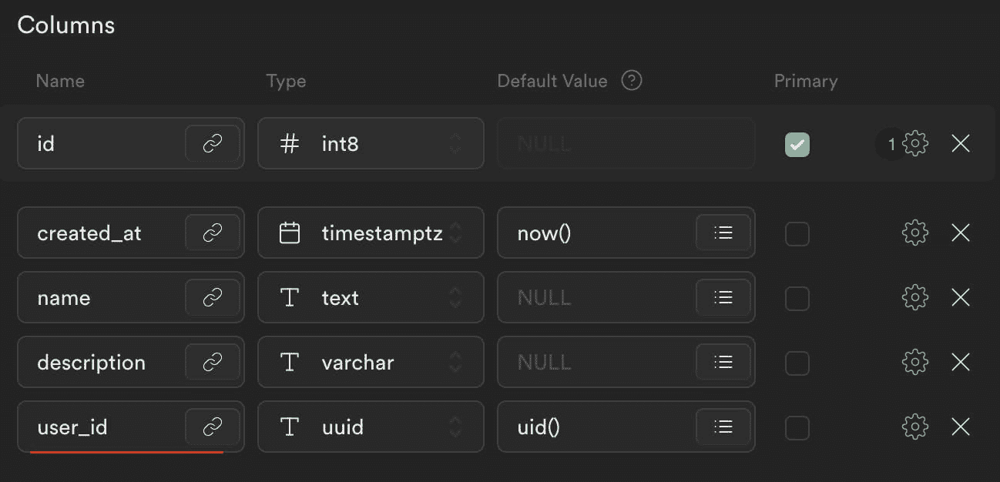
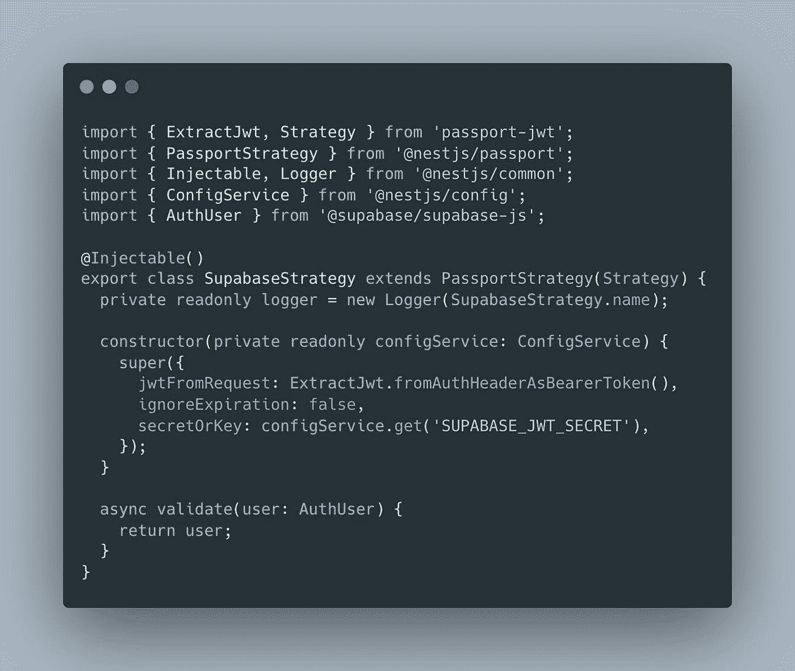
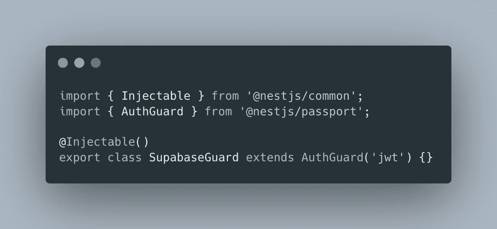
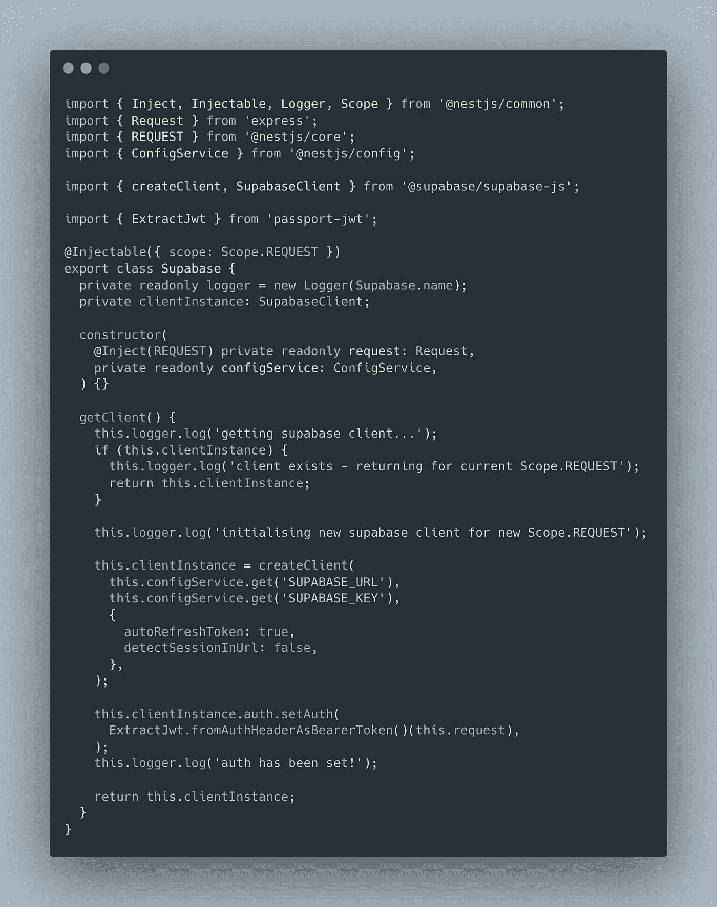
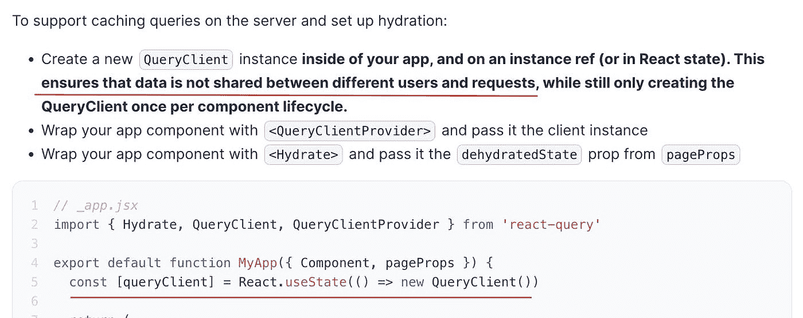
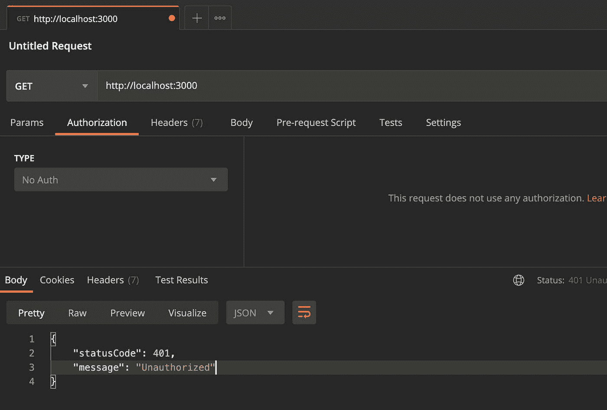
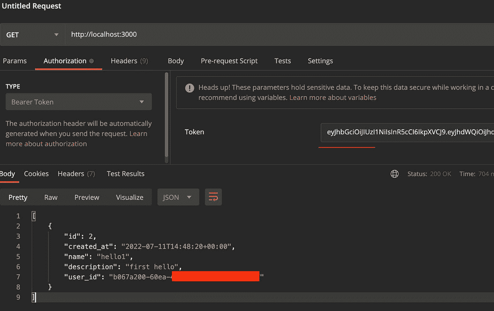
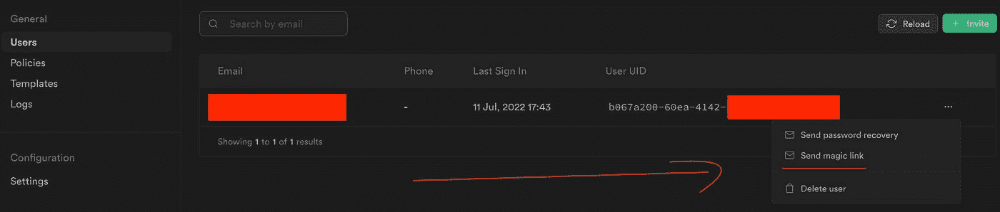

# 使用 Nest.js 设置 Supabase

> 原文：<https://blog.devgenius.io/setup-supabase-with-nest-js-85041b03ec3a?source=collection_archive---------7----------------------->

# 如何在 Nest.js 应用中使用 Supabase 的 Auth 和 Client


使用 Nest.js 设置 Supabase

# ⚠️免责声明

这篇文章是为 Supabase **v1** 创建的，由于某些 **auth** 方法的贬值，似乎无法与 **v2** 一起工作。我将为 **v2** 创建一篇新文章，并放在这里。如果你已经找到了解决方案，请在评论中告诉我！谢谢！

## 🤓我对你的期望

*   你知道 Supabase 是什么吗
*   你知道 Nest.js 框架
*   如果需要的话，你可以谷歌一下本教程之外的内容

# 🤔我在 Nest.js 中使用 Supabase 的用例

我需要一个每 1 秒钟运行一次并执行一些操作的轮询机制。作为 Auth 和 DB，我选择了使用 Supabase，因为我看到了一些教程，想尝试一下。

起初，我想通过 Cron Jobs 使用 Next.js 和函数来完成这些操作，但恰好 Github(作为最容易访问的 Cron 提供者)的 Cron Job 的最小时间范围只有每 5 分钟一次。

所以我转而考虑用 Nest.js 开发一个服务器(完整)应用程序

# 🧑‍💻如何使用 Supabase 和 Nest.js

有一个例子可以说明如何使用 Supabase 作为 Nest.js 应用程序的身份验证库，但是:

*   对我来说，这似乎并不简单(实际实现)，我也不想使用外部包
*   它不像我希望的那样工作——它没有从 lib 中暴露 Supabase 客户端

*如果你从未使用过 Passport 并且需要一个例子，这仍然是一个很好的条目——它帮助我理解在我的代码中应该做什么，所以谢谢*hiro1107* :)

📑例子:[supabase.com/docs/guides/examples](https://supabase.com/docs/guides/examples)

🧑‍💻github:[github.com/hiro1107/nestjs-supabase-auth](https://github.com/hiro1107/nestjs-supabase-auth)

所以我决定为 Auth 和 Client 实现我的方法。

## 我们可以在 Node.js 后端使用 Supabase 吗？

一般来说，像 Firebase 一样，Supabase 是一个客户端工具，它通过为“匿名”用户提供行级安全策略来从客户端工作，但它不会强迫我们只在客户端使用 Supabase。

通过一些规则，我们可以在 Node.js 服务器中自由地利用 Supabase 的能力。

# 🍴Supabase 基本设置

在编写代码之前，我想提到几个关键点。

## RLS 政策

创建表时启用它



我建议默认创建两个:

为了使您的应用程序与以前的策略一起工作，不要忘记在您使用的每个表上创建`user_id`列:它应该是自动生成的`auth.uid()`字段，所以这样一来，Supabase 将总是将正确的用户追加到一行中。



如果需要，您可以使用服务密钥绕过 RLS，但要小心。

# 🐱Nest.js 应用程序

## 安装

为了实现这一点，除了 Supabase 之外，我们还需要添加一些库:

```
npm i passport passport-jwt @nestjs/passport @supabase/supabase-js
```

passport——处理与 Auth 相关的所有事情，它有没有魔力，我们不需要关心

passport-jwt-为 jwt 认证提供了现成的策略

[@ nestjs](https://hashnode.com/@nestjs)/passport—nest . js 的 Passport 的模块

## JWT 认证如何与护照

JWT Auth 如何工作超出了本文的范围，但是在 Nest.js 中使用 Passport 和 passport-jwt 有很多解释，你可以从检查 Nest.js 的[认证](https://docs.nestjs.com/security/authentication)开始。

对于我们的案例，我们需要知道的是:Supabase 是一个基于 JWT 的授权机构，负责处理它这边的所有事情。在我们这边，我们需要正确的`SUPABASE_JWT_SECRET`，用于解码 jwt。(位于设置- > API)

## 超级文件夹

🔗[将](https://github.com/andriishupta/nestjs-supabase-setup/tree/main/src/common/supabase)链接到文件夹

这是你可以复制到你的代码库的主要代码，它将会工作。该模块是一个常规的 Nest.js 模块。其他文件值得深入研究。

## 战略

> *Passport 拥有丰富的战略生态系统，可实现各种身份验证机制。虽然在概念上很简单，但你可以选择的护照策略非常多，而且种类繁多*

如 Supabase 是 JWT，我们将使用现成的 passport-jwt 策略，为我们做所有的解码和其他事情。

在这段代码中，我们用 JWT 策略扩展了 PassportStrategy，并在`super`调用中传递配置。

*奇怪的“扩展”* `*PassportStrategy(Strategy)*` *是打字稿 Mixins*

🔗[源代码](https://github.com/andriishupta/nestjs-supabase-setup/blob/main/src/common/supabase/supabase.strategy.ts)



## 防护装置

有了这个防护，我通过在 app.module.ts 中提供`APP_GUARD`来保护整个应用程序——一种全局防护方式。你可以使用`UseGuard`来保护那些需要保护的路线。

这里，我们用`jwt`策略扩展了 AuthGuard(这是 passport-jwt 如何在幕后命名策略的)。简单。

🔗[源代码](https://github.com/andriishupta/nestjs-supabase-setup/blob/main/src/common/supabase/supabase.guard.ts)



## 服务:`Scope.REQUEST`

该服务将为每个请求提供`createClient`和`setAuth`，因此我们将在所有后续服务呼叫中拥有正确的用户。代码以“单例”方式实现，因此我们将在同一请求的不同位置获得相同的实例。

🔗[源代码](https://github.com/andriishupta/nestjs-supabase-setup/blob/main/src/common/supabase/supabase.ts)



为什么？

这里有一个有趣的部分，它发生在保存客户端状态的不同库上:

如果我们在像 Next.js 这样的服务器或 SSR 应用上使用保存每个用户状态的客户端库，我们需要小心这些，例如当我们创建一个库的实例时，它可能对调用服务器/SSR 应用的每个人都可用。

这就是为什么必须使用`@Injectable({ scope: Scope.REQUEST })`的原因，这样我们的 Supabase `createClient`将根据请求创建，我们将正确设置 auth。

再比如: [Next.js &带 react-query 的 SSR](https://react-query-v3.tanstack.com/guides/ssr#using-hydration)



*免责声明:我还没有对多个用户进行测试，但是我很确定。*我还没有找到通过直接将`access_token` - only `setAuth`附加到客户端来与文档中的一个客户端传递 Auth 的其他方法。

*可能的解决方案* : Supabase 可以调整认证流程，通过独特的设置，我们可以在每个请求中传递用户。有了 Passport，我们就有了`req.user`中的用户，并且仍然可以访问`access_token`的授权头。

# 📭邮递员测试

一切都结束后，让我们试着给我们的服务器打电话。



不出所料，我们得到了一个 401 代码——这是*护照。js* 它在我们的 **SupabaseGuard** 中检查了 JWT 吗

现在让我们得到一个有效的`access_token`并重复调用:



💪 💪 💪

*用户登录后可用的访问令牌。在我的例子中，我刚刚发送了“神奇链接”，并从 URL* 中获得了 `*acces_token*`

**

# *📋summary—TL；DR；*

*   *安装所需的依赖项*
*   *将 **supabase** 文件夹复制到你的项目中*
*   *添加 3 个 SUPABASE_*变量到。包封/包围（动词 envelop 的简写）*
*   *导入*supabase . module*:in app . module/[@ Global](https://hashnode.com/@Global)()auth . module/等。*
*   *提供全局`APP_GUARD`或使用`UseGuard`在需要的地方使用它*
*   *使用`this.supabase.getClient()`提供的其他服务中的 *supabase.ts* 进行 supabase 通话*

# *🔗链接*

*   *github:[github.com/andriishupta/nestjs-supabase-setup](https://github.com/andriishupta/nestjs-supabase-setup)*
*   *Nest.js 的[认证](https://docs.nestjs.com/security/authentication)，包括带 Passport.js 的 JWT*
*   *如何在 Nest.js 中使用[守卫](https://docs.nestjs.com/guards)*
*   *Supabase 的 Auth [带有 Nest.js 的示例应用](https://github.com/hiro1107/nestjs-supabase-auth)*
*   *[Supabase 的文件](https://supabase.com/docs/reference)*

*感谢阅读！*

**原载于*[*https://blog . andriishupta . dev*](https://andriishupta.dev/setup-supabase-with-nestjs)*。**