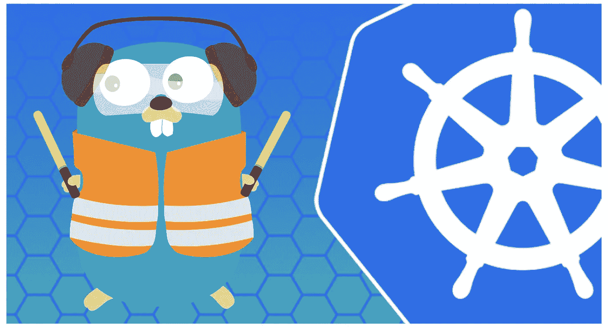
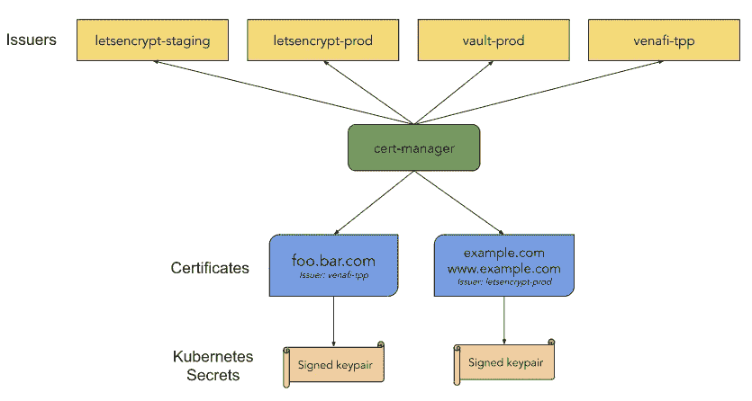

# 在 Kubernetes 上为 HA 设置 Traefik v2

> 原文：<https://blog.devgenius.io/setup-traefik-v2-for-ha-on-kubernetes-20311204fa6f?source=collection_archive---------0----------------------->

使用 cert-manager 管理加密 TLS 证书并运行 Traefik v2 的多个副本。



在我的上一篇文章“Kubernetes 上 Traefik v2 的快速入门”中，我花了 5 分钟快速完成了 Traefik、Let's Encrypt 和 Cloudflare 的端到端设置，以处理 Kubernetes 上的 HTTPS 请求。虽然使用 Traefik CRDs 的设置便于通过 IngressRoute 定义自动创建和更新证书，但它是使用 Traefik 的单个实例运行的，这意味着它的可用性不高。换句话说，Traefik 成为所有进入集群的流量的单点故障。

在 Traefik v1 中，有使用 k v 存储(例如 Consul、etcd 等)的集群/ HA 模式的[测试版支持。然而，Traefik v2 删除了对在 k v 存储中存储 ACME/Let 加密证书的支持，理由是 raft consensus 算法存在缺陷(](https://docs.traefik.io/v1.7/user-guide/cluster/) [#4851](https://github.com/containous/traefik/issues/4851) 、 [#3487](https://github.com/containous/traefik/issues/3487) 、 [#5047](https://github.com/containous/traefik/issues/5047) 、 [#3833](https://github.com/containous/traefik/issues/3833) )。自动证书管理功能被转移到 TraefikEE，让开源用户要么运行非 HA 版本，要么实施定制的证书管理解决方案。

Traefik 文档建议使用[证书管理器](https://github.com/jetstack/cert-manager)作为证书控制器，并指出对入口路由 CRD 的有限支持:

> 当使用 Traefik Kubernetes CRD 提供商时，不幸的是 Cert-Manager 还不能直接与 CRDs 接口，但我们的团队正在努力解决这个问题。一种解决方法是启用 Kubernetes Ingress 提供程序，允许 Cert-Manager 创建 Ingress 对象来完成挑战。请注意，这仍然需要手动干预，以通过证书管理器创建证书，但一旦创建，证书管理器将保持证书更新。

这篇文章介绍了如何绕过这个限制，在 Kubernetes 上以 HA 模式运行 Traefik v2。我将使用 Cloudflare 作为我的 DNS 提供商和 ACME challenge solver，但也可以随意使用任何其他受支持的提供商。

*所有的代码也可以在 Github 上找到:*

[](https://github.com/Yitaek/traefik-v2-ha-demo) [## Yitaek/traefik-v2-ha-demo

### Traefik v2 删除了对在 k v 存储中存储 ACME/Let 加密证书的支持，引用了 raft 的错误…

github.com](https://github.com/Yitaek/traefik-v2-ha-demo) 

# 先决条件

*   Kubernetes 集群(例如 GKE)
*   头盔 v3
*   DNS 提供商(例如 Cloudflare)

# 安装 Traefik

我们将把 Traefik 部署到`traefik`名称空间:

```
$ kubectl create namespace traefik
```

现在让我们用 3 个副本部署 Traefik。您可以在`traefik/traefik-values.yaml`中看到这些值:

Traefik HA 设置的舵值

```
$ helm repo add traefik https://containous.github.io/traefik-helm-chart$ helm install -n traefik traefik traefik/traefik -f traefik/traefik-values.yaml
```

等待部署开始，并记下负载平衡器 IP。

# 安装证书管理器

Cert-manager 是一款开源工具，用于自动颁发和更新 TLS 证书:



证书管理器图表—图像信用:[证书管理器文档](https://cert-manager.io/docs/)

我们将把它安装在名称空间`cert-manager`中:

```
$ kubectl create namespace cert-manager
```

添加[喷气堆舵杆 repo](https://github.com/jetstack/cert-manager) 并安装 CRDs:

```
$ helm install \
  cert-manager jetstack/cert-manager \
  --namespace cert-manager \
  --version v0.16.0 \
  --set installCRDs=true
```

等待所有证书管理器盒启动:

```
$ kubectl get pods -n cert-manager -w
```

# 部署应用程序

为了便于演示，我们将在`default`名称空间中部署`whoami`应用程序(参见`whoami`目录下的部署、服务和入口文件)。您可以用您的应用程序或众所周知的舵图(例如 Grafana、Kibana 等)来替换它。

whoami 默认部署、服务、入口路由

用你的 FQDN 替换`whoami.example.com`并展开:

```
$ kubectl apply -f whoami
```

# 创建证书

为了颁发新的证书，我们需要首先定义一个颁发者。在本例中，我将使用 Cloudflare 作为 ACME Issuer 类型，使用 Let's Encrypt 的临时服务器。您还可以在文档中找到其他[支持的配置](https://cert-manager.io/docs/configuration/)(自签名、CA、Vault、Venafi 和外部发行者类型)。

证书管理器颁发者示例

配置`certs/issuer.yaml`中的`email`和`solvers`部分。要将 Cloudflare 用作 [DNS01](https://cert-manager.io/docs/configuration/acme/dns01/) 质询求解器，首先使用以下设置创建一个新的 API 令牌:

**权限**:

*   `Zone - DNS - Edit`
*   `Zone - Zone - Read`

**区域资源**:

*   `Include - All Zones`

将令牌作为 Kubernetes 的秘密挂载:

```
$ kubectl create secret generic cloudflare-token --from-literal=dns-token=<my-api-token>
```

最后，配置证书(根据需要在`certs/whoami-cert.yaml`中修改`commonName`、`secretName`和`dnsNames`)并部署:

whoami 应用程序示例证书

```
$ kubectl apply -f certs
```

# 设置 DNS

检查证书是否已生成:

```
$ kubectl describe certificate whoami-cert
```

您还可以查看 Traefik 的调试日志来观察证书的激活情况。

最后，将 DNS 记录指向负载平衡器的 IP 地址，以查看由 HA Traefik + cert-manager 支持的启用了 TLS 的站点。可选地，为了完整性，您可以部署 HTTPS 重定向中间件。

现在，我们在 Kubernetes 上部署了高可用性 Traefik。使用 cert-manager 的缺点是用户现在必须记住在部署 IngressRoute 之前创建证书，但是实现 HA 在生产中更重要，以避免停机。