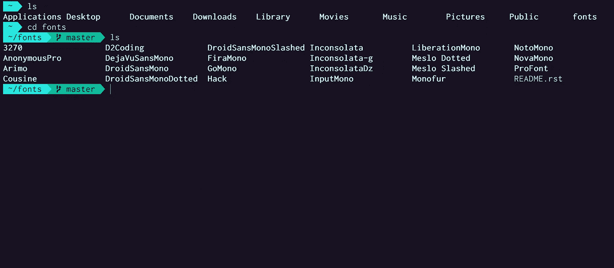

# 用 iterm 和 zsh 像专业人士一样设置您的终端

> 原文：<https://blog.devgenius.io/setup-your-terminal-like-a-pro-with-iterm-and-zsh-2ebb2af6c86c?source=collection_archive---------1----------------------->



湿婆潘迪的终点站

编程需要你经常使用终端来执行许多动作。默认的终端只是普通的，对有限的信息和平淡的设计没有任何帮助。Zsh 也称为 **Z shell** 是一个构建在 macOS(bash)默认 Shell 之上的 Shell。

Zsh 有大量的特性，当与 iterm 结合时，它成为了编程和生产力的野兽。让我们来看看如何设置我们的终端，让它为我们提供所需的信息，并帮助我们提高工作效率。

# 1.公司自产自用

如果你已经使用终端有一段时间了，并且喜欢编程，你很可能已经安装了[自制软件](https://brew.sh/)。否则，您可以继续使用下面的命令安装 homebrew。

```
/usr/bin/ruby -e "$(curl -fsSL https://raw.githubusercontent.com/Homebrew/install/master/install)"
```

# 2.iTerm2

与 macOS 中的默认终端相比，Iterm 包含了更好的特性，大多数程序员更喜欢使用它。iterm 的最新版本是 iTerm2。使用以下命令安装 iTerm2:

```
brew cask install iterm2
```

# 3.Zsh

默认情况下，MacOS 附带 zsh，您不需要做任何事情。但是，如果您的系统没有 zsh 配置，我们将需要安装它以进行后续步骤。

运行这个命令来安装 zsh。

```
brew install zsh
```

# 4.哦，我的 Zsh

哦，我的 zsh 是一个管理你的 Zsh 配置的框架。它允许您轻松地配置 zsh。使用以下命令安装 Oh My Zsh:

```
sh -c "$(curl -fsSL https://raw.githubusercontent.com/robbyrussell/oh-my-zsh/master/tools/install.sh)"
```

现在，重启你的终端，你就可以开始了。

# 5.主题

哦，我的 Zsh 默认有很多主题(默认是: **robbyrussell)。**您可以在预置主题之间切换。但是要建立一个强大而漂亮的终端，你需要使用一个自定义的主题。zsh 最流行的自定义主题之一是 [powerlevel9k](https://github.com/bhilburn/powerlevel9k/wiki/Install-Instructions#option-2-install-for-oh-my-zsh) 。让我们克隆存储库:

```
$ git clone https://github.com/bhilburn/powerlevel9k.git ~/.oh-my-zsh/custom/themes/powerlevel9k
```

一旦主题被克隆，继续更新您的 zsh 配置，将主题更改为 powerlevel9k。

使用以下命令打开 zsh 配置:

```
open ~/.zshrc
```

文件打开后，通过编辑以下代码行，用 powerlevel9k 替换现有主题:

```
ZSH_THEME="powerlevel9k/powerlevel9k"
```

通过运行以下命令保存文件并更新您的更改:

```
source ~/.zshrc
```

要更改颜色和外观，您可以导航至“首选项”>“配置文件”>“颜色”,尝试使用各种颜色，也可以使用预建的配色方案。继续下载[配色方案](https://github.com/mbadolato/iTerm2-Color-Schemes)的 zip 文件。提取 zip 文件。

下一步，从首选项中选择配置文件中的颜色，并通过单击颜色预设导入配色方案。

# 6.字体

下一步是安装字体。从[电力线字体](https://github.com/powerline/fonts)下载首选字体并安装。将首选项菜单中的字体更改为您刚刚下载的字体。如果您的字体支持连字，请选中“使用连字”选项以在您的终端中启用连字。连字是非常酷的字体特性， [Fira code](https://github.com/tonsky/FiraCode) 是一个支持连字的开源字体。

# 7.自定义提示

当你完成这个设置的时候。您将在终端的两侧看到提示。有些人喜欢所提供的信息及其外观。我尤其不喜欢这些。所以，如果你想自定义提示的外观。

打开您的 zsh 配置:

```
open ~/.zshrc
```

在主题选项之后。添加以下行:

```
POWERLEVEL9K_LEFT_PROMPT_ELEMENTS=(ssh dir dir_writable vcs)
```

我只是自定义我喜欢的左边提示。您可以在这里查看您可以更改的[功能。完成此操作后，保存文件并通过运行以下命令更新更改:](https://github.com/Powerlevel9k/powerlevel9k#customizing-prompt-segments)

```
source ~/.zshrc
```

现在你应该有一个漂亮的终端，你会喜欢的。
恭喜你！！