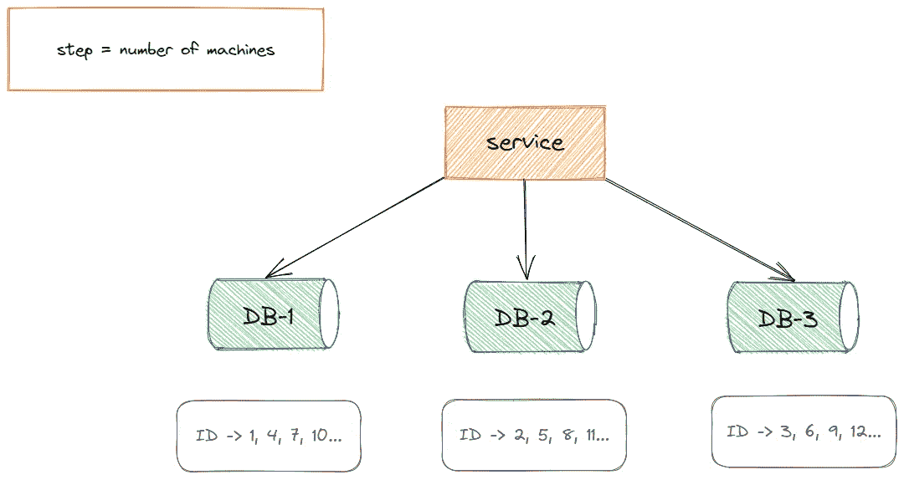
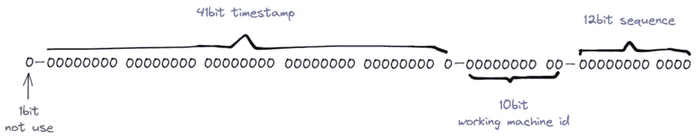

# 生成分布式系统标识的几种方法

> 原文：<https://blog.devgenius.io/several-methods-of-generating-distributed-system-ids-6035425042fc?source=collection_archive---------6----------------------->

分布式系统 ID


史蒂文·昂格曼在 Unsplash[上的照片](https://unsplash.com/s/photos/desk?utm_source=unsplash&utm_medium=referral&utm_content=creditCopyText)

一般单机或单数据库项目规模可能比较小，应用场景相对有限。平台的流量和业务量较小，商家 ID 生成方式相对原始但足够。它没有带来这样的系统。问题和瓶颈，所以我们在这种情况下没有太关注。

但对于大规模复杂业务、分布式、高并发的应用场景，显然这种 ID 生成方式不会像小项目那样单纯依靠简单的数据自动递增序列来完成。

而且在分布式环境下，这种方式已经不能满足业务的需求，不仅不能完成业务能力，而且业务 ID 生成的速度或重复都可能造成系统的严重故障。

正好最近公司业务增长很快，我就研究了分布式唯一 id 的生成方法，分享给大家。

**分布式入侵检测系统的产生。**

在分析之前，我们先明确一下业务 id 的生成特征。基于这些特点，我们可以对下面的生成方法有更深入的了解和认识。

*   **全局唯一**:这是基本要求，不能重复。
*   **数字类型，递增趋势**:后面的 ID 必须大于前面的 ID。这是从 MySQL 存储引擎考虑的，需要保证写数据的性能。
*   **长度短**:可以提高查询效率，这也是基于 MySQL 数据库规范，尤其是当 ID 作为主键时。
*   **信息安全**:如果持续生成 IDs，势必会泄露商业信息，甚至有可能被猜到，所以需要不规范。
*   **高可用低延迟** : ID 生成快，能承受高并发，延迟足够低，不会成为业务瓶颈。

**生成分布式 IDs 的几种方法。**

虽然因为项目规模小可能用不上，但是提出方案的思路还是很值得借鉴的，尤其是`Leaf`方案，我觉得特别酷。

***# 1。总部位于 UUID。***

这是一个简单的解决方案。毕竟，UUID 在世界上的独特之处已深入人心。然而，任何熟悉 MySQL 数据库特性的人都不应该将它用作业务 ID。

它不可读，而且太长，这不是一个好主意，除非你的系统足够小，不在乎这个，这是另一个故事。

下面我们简单总结一下使用 UUID 作为业务 ID 的优缺点，以及这种方法适用的业务场景。

**优势:**

*   代码实现简单易用。
*   本地版本没有性能问题。
*   由于具有全局唯一的特性，数据库迁移不会有任何问题。

**缺点**:

*   每次生成的 id 都是无序的，并不是所有的数字，也不能保证趋势会增加。
*   UUIDs 生成字符串，字符串存储性能差，查询效率慢。
*   UUID 的长度太长，不适合存储，会消耗数据库性能。
*   ID 没有一定的业务意义，可读性差。

**适用场景:**

*   它可以用于生成诸如令牌令牌之类的场景，这些令牌足够不可识别、无序和可读，并且具有足够的长度。
*   它可以用在不需要纯数字、自增量和可读性的场景中。

***# 2。基于数据库主键的自动增量。***

使用数据库主键进行自动增量的方法更常用。

以 MySQL 为例，在创建新表时，指定由 auto_increment 自动生成主键，或者指定一个增长步长。

这对于小规模的单机部署业务系统来说已经足够了，使用简单，具有一定的业务性质，但在分布式高并发系统中并不适用。

分布式系统涉及子数据库和子表。在跨机甚至跨机房部署的环境下，数据库的自增方式无法满足业务需求。同时，在高并发访问和大量访问的情况下，数据库的容量是有限的。

**优势:**

*   实现简单，只依赖数据库，成本低。
*   ID 被数字化并单调递增，以满足数据库存储和查询性能。
*   具有一定的商业可读性。

**缺点**:

*   对 DB 的依赖性强，存在单点问题，如果数据库宕机，业务不可用。
*   DB 代 ID 性能有限，单点数据库压力大，无法处理高并发场景。

**适用场景:**

*   几乎没有数据访问的小规模业务场景。
*   没有高并发场景，插入记录可控。

***# 3。基于数据库的多实例主键自动递增。***

上面我们已经大致解释了数据库的主键是如何`auto-incremented`的，并讨论了单机部署的情况。

如果想提高 ID 生成的效率，可以横向伸缩机器，平衡单点数据库的压力。

这个方案是如何实施的？

即在 auto_increment 的基础上，设置步长增长步长，使 DB 之前生成的 ID 趋势增长，不重复。



图片来源:作者

从上图可以看出，横向扩展的数据库集群有利于解决数据库单点压力的问题。同时，对于 ID 生成功能，根据机器数量设置自动增量步长。

但是，这里有一个缺点，就是不能再扩展了。如果再扩大容量，就无法生成 ID，步长也就用完了。

那么如果想解决新机带来的问题，不妨将第三台机器的 ID 生成位置设置到远离当前 ID 的位置，在其中设置新的步长，同时修改旧的。机器上 ID 生成的步长，但在 ID 增长到新机器设置的值之前，ID 必须递增，否则将重复。

**优势:**

*   在平衡负载的同时解决了 ID 生成的单点问题。

**缺点**:

*   一定要确定步长，这样会给后续的扩展带来困难，而且单个数据库本身压力还是比较大的，无法满足高并发。

**适用场景:**

*   数据量不大，数据库也不需要扩容。

这种方案除了难以适应大规模分布式、高并发的场景外，普通业务规模还是有能力的，所以这种方案值得积累。

**# 4。基于雪花算法。**

雪花算法是 twitter 内部分布式项目使用的 ID 生成算法。它现在是开源的，很受欢迎。下面是雪花算法的 ID 组成图。



图片来源: [W.T .诺亚](https://medium.com/better-programming/implementing-snowflake-algorithm-in-golang-c1098fdc73d0)

这种方案巧妙地将 64 位分成多个段，并分别表示时间戳差异、机器标识和随机序列，首先生成一个 64 位二进制正整数，然后将其转换为十进制进行存储。

其中，`1-bit`标识，未使用，标记为`0`。

`41-bit`时间戳用于存储时间戳之间的差异。

`10-digit`机器代码可以识别 1024 个机器节点。如果机器部署在 IDC 中，10 位数字也可以拆分。比如 5 位数字代表机房 ID，5 位数字代表机器 ID，所以有`32*32`组合。，通常就足够了。

最后一个`12-bit`随机序列用来记录以毫秒为单位的计数，一个节点可以生成 4096 个 ID 序列号。

所以综上所述，经过综合计算，雪花算法方案的理论 QPS 在 410 万/s 左右，性能足够强，而且这种方法可以保证集群中每个节点生成的 id 都不一样，并且在区间内递增。

**优势:**

*   它每秒可以生成数百万个不同的 id，性能良好。
*   时间戳值在高位，中间是固定机器码，自增序列在位置，整个 ID 是趋势递增的。
*   可以根据业务场景中数据库节点的排列灵活挑战位划分，灵活性高。

**缺点**:

*   它强烈依赖于机器时钟。如果时钟回拨，将会生成重复的 id。因此，如果基于此的算法将时钟回拨，将会引发异常以阻止 ID 生成，这可能会导致服务不可用。

**适用场景:**

*   雪花算法的明显缺点是时钟依赖性。如果确保机器没有时钟返回，使用这种方法生成分布式 id 是可行的。当然，可以使用小规模系统。

***# 5。基于 Redis。***

Redis 的`INCR`命令可以将存储在 key 中的数字值加 1。由于这个操作的`atomic`性质，我们可以巧妙地利用它来创建一个分布式 ID 生成方案，并且还可以与时间戳和机器 ID 等其他值配合使用。等等。用于组合词。

**优势:**

*   增量有序，可读性强。
*   可以满足一定的性能。

**劣势**:

*   对 Redis 的依赖性很强，可能存在单点问题。
*   占用网络，需要考虑网络延时等问题对性能的影响。

**适用场景:**

*   对性能要求不高，小规模业务较轻，对 Redis 的运营有一定的要求。注意网络问题和单点压力问题。如果是分布式的情况，就有更多的问题需要考虑。因此，这种方法很少在一组情况下使用。

事实上，需要研究 Redis 解决方案的可靠性。毕竟，这取决于网络。延迟故障或停机可能会导致服务不可用。在系统设计过程中需要考虑这种风险。

***# 6。基于 LEAF 方案。***

从上面的几种分布式身份认证方案可以看出，它可以解决一定的问题，但是存在明显的缺陷。为此，美团在数据库方案的基础上进行了优化，提出了一种称为叶段的数据库方案。

原方案中，每次获取一个 ID 需要读取数据库一次，在高并发、大数据量的情况下，容易对数据库造成压力。我们能一次获得一批身份证吗，这样就不用经常去了？数据库。

叶片段的解决方案是每次获取一个 ID 片段。当该段用完后，去数据库获取一个新的编号段，这可以大大减轻数据库的压力。怎么做？

非常简单，我们创建一个表如下:

其中`biz_tag`用于区分服务，`max_id`表示当前分配给`biz_tag`的身份证号码段的最大值，`step`表示每次分配的号码段的长度，后面的 desc 和`update_time`分别表示该号码段的业务描述和最后一次更新时间。

过去，您需要在每次获得 ID 时访问数据库。现在您只需要将`Step`设置得足够合理，比如`1000`。现在您可以在`1000`号用完之后访问数据库了。看起来真的很酷。

我们现在可以这样设计获取分布式 id 的整个过程:

1.  注册用户时，用户服务需要用户标识，它会请求标识服务的接口(这是一个独立的应用程序)。
2.  生成 id 的服务将查询数据库以找到`user_tag`的 ID，当前的`max_id`是`0`，以及`step=1000`。
3.  生成 ID 的服务将`max_id`和`step`返回给用户服务，并将`max_id`更新为`max_id = max_id + step`，后者更新为`1000`。
4.  用户服务获得`max_id=0, step=1000`。
5.  这个用户服务可以使用区间`[max_id + 1, max_id + step]`的 ID，也就是`[1, 1000]`。
6.  用户服务将这个时间间隔保存到 JVM 中。
7.  当用户服务需要使用 ID 时，可以在`[1, 1000]`区间内依次获取 ID，使用`AtomicLong`中的`getAndIncrement`方法。
8.  如果区间的值用完了，去请求生产 ID 的服务的接口，得到`max_id`为`1000`，即可以使用区间`[max_id + 1, max_id+step]`的 ID，也就是`[1001, 2000]`。

显然，这种方法很好地解决了数据库自动增量的问题，并且可以自定义 max_id 的起点和步长，非常灵活，易于扩展。

同时，这种方法也很好的解决了数据库压力的问题，ID 号段存储在 JVM 中，性能有很大的保证，可用性尚可。段，系统还能支持一段时间。

**优势:**

*   灵活的扩展和强大的性能可以支持大多数业务场景。
*   ID 号呈增加趋势，满足数据库存储和查询性能要求。
*   高可用性，即使 ID 生成服务器不可用，也可以在短时间内使服务可用，为故障排除赢得时间。
*   max_id 的大小可以定制，方便业务迁移和机器横向扩展。

**缺点**:

*   身份证号不够随机，完全的顺序递增可能会造成安全问题。
*   数据库停机可能会导致整个系统不可用，而且仍然存在这种风险，因为号码段只能持续一段时间。
*   可能存在分布式环境中每个节点同时竞争 ID 号段的情况，这可能导致并发问题和 ID 重复生成。

以上缺点也需要引起足够的重视。官方技术团队也想出了一个妙招——`double buffer`。

***双缓冲。***

如上所述，由于可能有多个节点同时请求 ID 范围，因此最好避免这种情况。

Leaf-segment 对此进行了优化，优化了获取一个号码段的方式，以获取两个号码段。一个号段用完之后，不需要马上更新号段。还有一个缓存号段用于备份，可以有效解决问题。这场冲突。

并且使用双缓冲的方法，当前号段消耗 10%时，检查下一个号段是否准备好，如果没有，更新下一个号段。

当当前号段用完时，切换到下一个缓存的号段使用，当下一个号段消耗到 10%时，检查下一个号段是否准备好，以此类推。

下面简要总结了该过程:

1.  当前采集 ID 在 buffer1 中，每个采集 ID 在 buffer1 中采集。
2.  当 buffer1 中的 Id 已被使用到 100 时，这是范围的 10%。
3.  当达到 10%时，首先确定是否获得了 buffer2。如果没有，立即发起一个请求来获取 ID 线程。该线程将获得的 ID 设置为 buffer2。
4.  如果 buffer1 用完了，它会自动切换到 buffer2。
5.  当 buffer2 用了 10%的时候，也会启动线程再次获取，来回设置到 buffer1
    。

双缓冲器方案得到了很好的考虑。当下一个缓冲区更新时，有一个单独的线程来观察。两个缓冲区的切换也解决了临时去数据库更新号段可能带来的并发问题。

这种方法可以增加 JVM 中业务 ID 的可用性，建议分段长度为业务高峰期 QPS 的 100 倍(经验值，可以根据自己的业务设置)，这样即使 DB 宕机，也能生成业务 ID。还可以长时间维护，可以有效兼容偶尔出现的网络抖动等问题。

**优势:**

*   基本的数据库问题得到了解决，并且可以工作。
*   双缓冲区的号段基于 JVM 存储，减少了数据库查询，降低了网络依赖性，效率更高。

**缺点**:

*   号段号段的长度是固定的，业务量大的时候可能会因为原来分配的号段会一下子用完而频繁更新号段。
*   如果号段长度设置太长，如果缓存中的号段还没有用完，其他节点重新获取的号段可能会有比以前更大的跨度。

针对以上不足，官方技术团队重新提出了动态调整号段长度的方案。

***动态调整步长。***

一般情况下，如果你的业务不会有明显的波峰和波谷，你不需要太担心调整步长。

因为稳定的业务量基本上长期固定在一个步长之间，但是如果像这样有一个明显的活动期，那么这个步长就必须足够灵活，以适应不同时间段业务量的暴涨或者暴跌。

假设服务 QPS 为 Q，号段长度为 L，号段更新周期为 T，则 Q * T = L

L 的长度一开始是固定的，导致随着 Q 的增长，T 会越来越小。

但是这个方案的本质要求是希望 T 是固定的。那么如果 L 能和 Q 正相关，T 就能逼近一个固定值。

因此，本方案中每次更新号段，都会根据号段的周期 T 和上一次更新的号段长度步长来确定下一次的号段长度 nextStep。下面是一个简单的算法，旨在说明动态更新的含义:

```
T < 15min，nextStep = step * 215min < T < 30min，nextStep = stepT > 30min，nextStep = step / 2
```

到目前为止，号段消费稳定并趋于一定时间区间的需求已经得到满足。

当然，面对突然增加的几十倍、上百倍的流量，这种解决方案仍然无法满足数据库能够容忍一段时间不可用，系统仍然能够稳定运行的要求。

因为从本质上来说，这个方案虽然在 DB 层做了一些容错方案，但是身份证号段的发放方式最终还是需要很大程度上依赖 DB。

最后，还是要在数据库的高可用性上下功夫。

感谢您阅读这篇文章。

敬请关注更多内容。