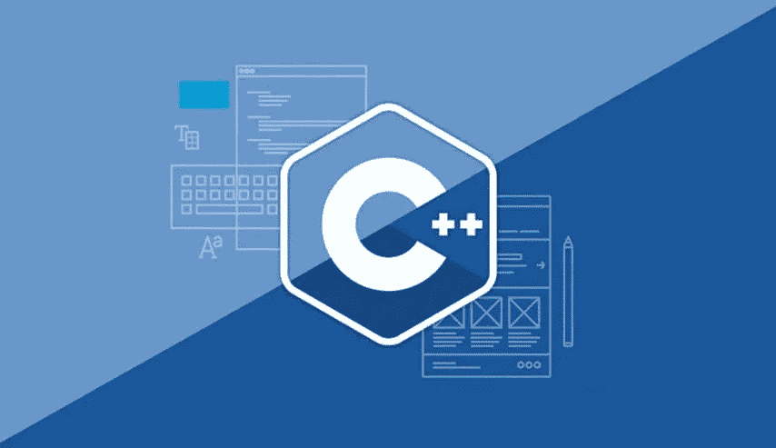
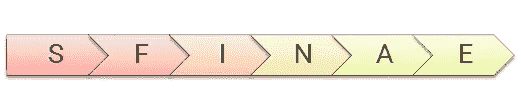

# SFINAE 是什么以及如何在现代 C++中使用它

> 原文：<https://blog.devgenius.io/sfinae-what-is-and-how-to-use-it-with-modern-c-bb3edfb0d2f8?source=collection_archive---------6----------------------->



乍一看，你可能会对这个概念感到困惑，所以这里需要澄清一些事情。

# 检测习语:

在 C++中，检测习语允许编译时类型自省。使用检测习语，我们可以检查类型是否有适合特定接口的方法、类型别名或成员。这允许库作者创建更具表现力的元编程工具。用户可以将他喜欢的任何类型插入到元函数中，只要它符合所需的接口。
检测习语的所有当前迭代都依赖于 SFINAE，那么 S *FINAE* 是什么？

# 替换失败不是错误

从 [cppreference](https://en.cppreference.com/w/cpp/language/sfinae)

> 该规则适用于函数模板的重载解析:当[用](https://en.cppreference.com/w/cpp/language/function_template#Template_argument_substitution)替换模板参数的显式指定类型或[推导出的类型](https://en.cppreference.com/w/cpp/language/template_argument_deduction)失败时，专门化将从[重载集合](https://en.cppreference.com/w/cpp/language/overload_resolution)中被丢弃，而不会导致编译错误。
> 
> 该特性用于模板元编程。

让我们考虑这个例子:

```
template<typename T>
struct hasActive
{
  T active;
  using activeType = T;
};

struct noActive
{
};
template<typename T>
typename T::activeType printActive(const T& t)
{
  return t.active;
}

int main()
{
    printActive(hasActive<int>{});
    printActive(noActive{});
}
```

代码将无法编译。第一次调用*print active(hasActive<int>{ })*是正确的构造，但是第二次调用产生了以下错误(GCC):

```
no matching function for call to 'printActive(noActive)'
   20 |     printActive(noActive{});
      |     ~~~~~~~~~~~^~~~~~~~~~~~
prog.cc:12:24: note: candidate: 'template<class T> typename T::activeType printActive(const T&)'
   12 | typename T::activeType printActive(const T& t)
      |                        ^~~~~~~~~~~
prog.cc:12:24: note:   template argument deduction/substitution failed:
prog.cc: In substitution of 'template<class T> typename T::activeType printActive(const T&) [with T = noActive]':
prog.cc:20:16:   required from here
```

为了解决这个问题，您可能需要为`noActive` 类型`void printActive(const noActive& ){}`添加一个合适的函数。这样，编译器可以找到一个合适的匹配，并注入代码。
所以我们需要了解重载决策。

# 过载分辨率

来自 [cppreference](https://en.cppreference.com/w/cpp/language/overload_resolution)

> 为了编译一个函数调用，编译器必须首先执行[名称查找](https://en.cppreference.com/w/cpp/language/lookup)，对于函数，这可能涉及[参数相关的查找](https://en.cppreference.com/w/cpp/language/adl)，对于函数模板，后面可能是[模板参数推导](https://en.cppreference.com/w/cpp/language/template_argument_deduction)。如果这些步骤产生了一个以上的*候选函数*，则执行*过载解决*来选择实际将被调用的函数。
> 
> 通常，参数与实参最匹配的候选函数就是被调用的函数。
> 
> 对于其他可能出现重载函数名的上下文，参见[重载函数的地址](https://en.cppreference.com/w/cpp/language/overloaded_address)。
> 
> 如果重载决策不能选择一个函数(例如，它是一个[模板实体](https://en.cppreference.com/w/cpp/language/templates#Templated_entity)，带有一个失败的[约束](https://en.cppreference.com/w/cpp/language/constraints)，它不能被命名或以其他方式使用。

现在，让我们看看如何让 SFINAE 具有模板专门化

```
#include <type_traits>
template <typename T, typename Enable = void> //allow SFINAE with template specialization

struct has_active : std::false_type
{
};
struct has_active<T, std::enable_if_t<std::is_same<int, decltype(std::declval<T>().active)>::value>> : std::true_type
{
};
```

这种方法用于将值 false 和 true 表示为类型。

这在类型特征中很有用，在类型特征中，根据模板参数满足的某些条件，您可以让类模板继承不同(部分)专门化的`std::false_type`或`std::true_type`。

这样做允许测试给定类型是否满足类型特征的条件，并通过访问静态值成员获得指示结果的编译时常数值，该静态值成员是通过使用转换运算符转换类型特征的实例从`std::false_type`或`std::true_type`或替代继承的。在上面的例子中，我们做了以下事情:

*   我们继承了两个结构，第一个将在我们的类型没有`active`成员时使用，第二个将检查我们的类型是否有`active`成员并且它的类型是 int。
*   `std::is_same<T, U>`将检查`T`和`U`是否命名相同的类型(考虑 const/volatile 资格)，提供等于 true 的成员常量`value`。否则，`value`就是假的。
*   `std::enable_if<condition,T>`是一种在 C++20 的[概念](https://en.cppreference.com/w/cpp/language/constraints)之前利用 SFINAE 的便捷方式(我们将在后面看到概念的用法)，特别是基于类型特征有条件地从[候选集](https://en.cppreference.com/w/cpp/language/overload_resolution)中删除函数，允许基于那些不同类型特征的独立函数重载或专门化。
    **std::enable_if** 可以以多种形式使用，包括:
    -作为附加函数实参(不适用于运算符重载)
    -作为返回类型(不适用于构造函数和析构函数)
    -作为类模板或函数模板形参

为`enable_if`添加专门化的程序的行为是未定义的。
`std::enable_if_t`是 c++14 的一个特性，它是 *typename enable_if < B，T>:*type 的别名；

下一步是实现一个演示函数，它应该适用于这两种类型的结构。

```
#include <iostream>

template <typename T>
std::enable_if_t<!has_active<T>::value> printActive(const T &)
{
    std::cout << "no active\n";
}

template <typename T>
std::enable_if_t<has_active<T>::value> printActive(const T &t) { std::cout << "active: " << t.active << "\n"; }
```

让我们解释一下上面的例子:
第一个重载应该处理没有活动成员的类型，所以编译器会对`hasActive`求值，从而实例化`T`。如果`T`没有活动成员，`has_active<T>::value`将被评估为假，并且因为我们否定了语句== >，所以该函数将是那些没有活动成员的类型的适当匹配。
同样的事情发生在第二次过载。
现在在主函数中我们可以编写以下代码:

```
struct SActive
{
    int active;
};
struct SNoActive
{
};

int main()
{
    printActive(SActive{42}); // 42
    printActive(SActive{0}); // 0
    printActive(SNoActive{}); // no active
    printActive(int{}); // no active
}
```

这将编译并运行。很好不是吗！但不是那种超级好看的表情。有其他选择吗？是的，我们可以使用标签调度、编译时 if 和 C++20 概念！

# 标签分发

标签调度使编译器能够根据类型特征选择函数。这个决定发生在编译时，基于特征。是对`enable_if`的有益补充。
也可以配合拖尾返回式和`decltype`使用。
当同一个函数有多个重载，并且它们都有何时可以被调用的条件时，这是最有用的。使用 enable_if，您不仅要测试重载条件，还要测试所有其他重载条件的否定，以免您得到重载模糊性。标签分派将有助于减少混乱，因此让我们修改我们的示例:

```
template<typename T>
void printActive(const T& t, std::true_type)
{
    std::cout << "active: " << t.active << "\n"; 
}

template<typename T>
void printActive(const T&,std::false_type)
{
    std::cout << "no active\n";
}
```

# 编译时 if

从 C++17 开始，我们在语言中有了一个新的特性，允许我们在编译时检查条件，而不需要编写复杂的模板代码。这是一个`constexper if`。这使它能够有条件地编译源代码，也可以在编译时使用。让我们再次修改我们的示例:

```
template<typename T>
void printActive(const T& t)
{
 if constexpr (has_active<T>{})
 {
   std::cout << "active: " << t.active << "\n";
 }
 else
 {
   std::cout << "no active\n"; 
 }

}
```

# 概念

类模板、函数模板和非模板函数(通常是类模板的成员)可能与一个*约束*相关联，该约束指定了对模板参数的要求，模板参数可用于选择最合适的函数重载和模板专门化。

这些需求的命名集合被称为*概念*。每个概念都是一个谓词，在编译时进行计算，并成为模板接口的一部分，在模板中用作约束。

这个特性是从 c++ 20 开始引入的。概念的定义具有以下形式:

`**template <**` *模板-参数-列表* `**>**`

`**concept**` *概念-名称属性*(可选)`**=**` *约束-表达式***；。** 再次，让我们修改我们的例子:

```
template<typename T>
concept HasActive = std::is_same<int, decltype(std::declval<T>().active)>::value;

template<typename T>
concept NoActive = not HasActive<T>;

template<HasActive T>
void f(const T& t)
{
    std::cout << "active: " << t.active << "\n"; 
}

template<NoActive T>
void f(const T&)
{
    std::cout << "no active\n";   
}

struct s_active
{
    int active;
};
struct s_no_active
{
};

int main()
{
    f(s_active{42}); // active: 42
    f(s_active{0}); // active: 0
    f(s_no_active{}); // no active
}
```

> ***记住:*** *SFINAE* 发生在

*   函数类型中使用的所有类型(包括返回类型和所有参数的类型)
*   模板参数声明中使用的所有类型
*   函数类型中使用的所有表达式
*   模板参数声明中使用的所有表达式(从 C++11 开始)
*   在[显式说明符](https://en.cppreference.com/w/cpp/language/explicit)中使用的所有表达式(从 C++20 开始)

您还可以看到[哪些错误是替换错误](https://github.com/Pharap/CppExplanations/blob/master/SFINAE.md#which-errors-are-substitution-errors)。

在这篇文章中，我列出了一些关于 SFINAE 的信息。有了这种技术和类型特征，我们就可以创建专门的函数来处理类型的子集，并始终保持学习。