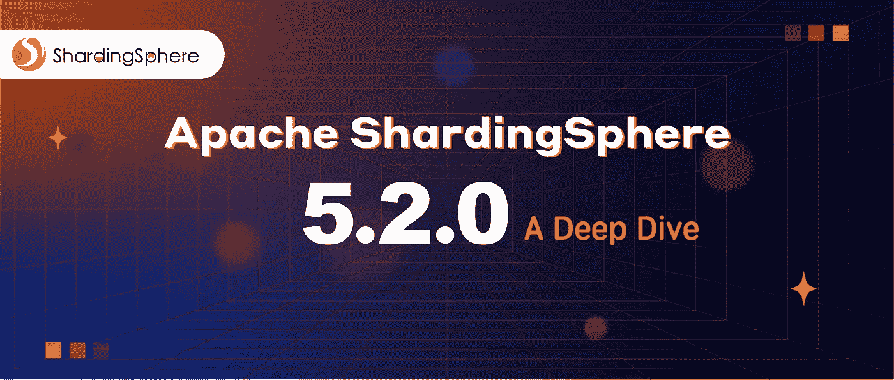
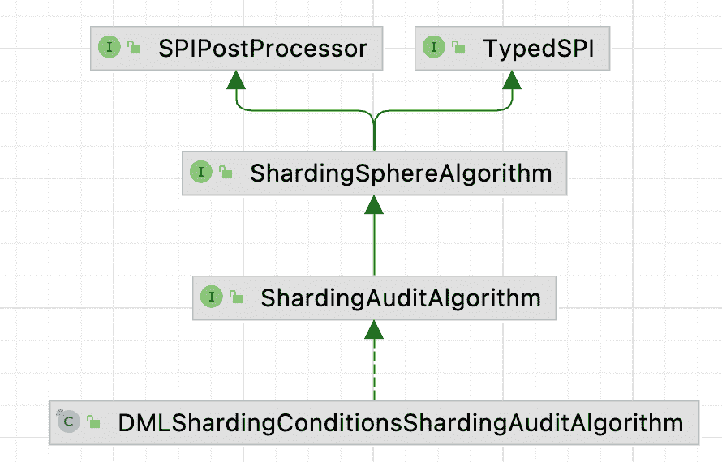
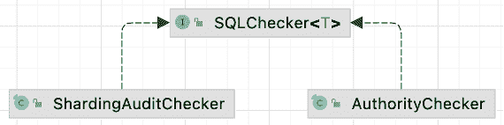

# ShardingSphere 5.2.0:对分片的审计在多分片场景中拦截不合理的请求

> 原文：<https://blog.devgenius.io/shardingsphere-5-2-0-audit-for-sharding-intercepts-unreasonable-requests-in-multi-shards-scenarios-9a113312062b?source=collection_archive---------9----------------------->



## 1.背景

感谢我们对[分片领域的](https://shardingsphere.apache.org)社区反馈的持续审查，我们使用这些反馈来开发数据分片和读/写拆分等功能，我们发现一些用户在使用数据分片功能时会创建大量的分片。

在这种情况下，可能有 1，000 个物理表对应于一个分片逻辑表，这极大地干扰了用户。

例如，`SELECT * FROM t_order`语句将导致全路由，这显然不是 [OLTP](https://shardingsphere.apache.org/blog/en/material/2022_04_26_how_to_use_shardingsphere-proxy_in_real_production_scenarios_your_quick_start_guide/) 的情况。这个 SQL 可以放在另一个代理中，以避免阻塞其他请求。

但是，如果用户不熟悉代理，或者编写了一个`where`条件并且不知道在这个条件下不支持分片，那么仍然需要一个完整的路由。

完整的路由会降低代理的性能，甚至导致合理的请求失败。想象一下，在一个物理数据库中有 1000 个碎片，如果并行执行，需要 1000 个连接——如果是串行的，请求可能会导致超时。对此，社区用户要求是否可以直接拦截不合理请求。

我们已经考虑这个问题有一段时间了。如果我们简单地阻塞全路由操作，我们只需要在代码中检查它，并在配置文件中添加一个开关。另一方面，如果用户后来需要将一个表设置为只读，或者需要更新操作携带一个`limit`，这是否意味着我们需要再次更改代码和配置？这显然违背了代理的可插拔逻辑。

针对以上问题，[最近发布的 Apache ShardingSphere 5.2.0](https://faun.pub/apache-shardingsphere-5-2-0-is-released-bringing-new-cloud-native-possibilities-8d674d964a93?source=your_stories_page-------------------------------------) 为用户提供了针对分片功能的 SQL 审计。审计可以是截取操作，也可以是统计操作。与分片和唯一密钥生成算法类似，审计算法也是面向插件的、用户定义的和可配置的。

接下来，我们将通过具体的 SQL 示例详细说明数据分片审计的实现逻辑。

## **2。分片接口审计**

Apache ShardingSphere 的审计入口在`org.apache.shardingsphere.infra.executor.check.SQLCheckEngine`类中，该类将调用`SQLChecker`接口的`check`方法。目前，ShardingSphere audit 包含权限审计(验证用户名和密码)和分片审计。

在这里，我们重点关注在 audit for sharding 的`ShardingAuditChecker`中实现的父接口。



通过查看`org.apache.shardingsphere.sharding.checker.audit.ShardingAuditChecker`的`check`代码，可以快速了解其工作原理。

```
public interface ShardingAuditAlgorithm extends ShardingSphereAlgorithm {

    */***
 ** Sharding audit algorithm SQL check.*
 ***
 ** @param sqlStatementContext SQL statement context*
 ** @param parameters SQL parameters*
 ** @param grantee grantee*
 ** @param database database*
 ** @return SQL check result*
 **/*
    SQLCheckResult check(SQLStatementContext<?> sqlStatementContext, List<Object> parameters, Grantee grantee, ShardingSphereDatabase database);
}
```

该方法获取所有相关分片表的审计策略，并调用每个分片表审计策略中配置的审计算法。如果审计算法未能通过，将向用户显示异常。

一些用户可能想知道`disableAuditNames`在这里做什么。对分片的审计也允许用户跳过这个过程。在某些情况下，用户可能需要执行审计应该阻止的 SQL，并且他们知道该 SQL 的影响。

出于这个原因，我们提供了`Hint: disableAuditNames`来跳过审计拦截，这将在后面用实际的例子来描述。代理管理员可以配置`allowHintDisable`来控制是否允许用户跳过这个过程。默认值为`true`，表示允许基于提示的跳过。

## **3。分片算法审计**

分片算法接口`org.apache.shardingsphere.sharding.spi.ShardingAuditAlgorithm`的审计继承自 SPI 类`ShardingSphereAlgorithm`。它继承了`type`和`props`属性，并定义了自己的`check`方法。如果您想定制自己的审计算法，只需实现接口并将其添加到`INF.services`中。



```
public interface ShardingAuditAlgorithm extends ShardingSphereAlgorithm {

    */***
 ** Sharding audit algorithm SQL check.*
 ***
 ** @param sqlStatementContext SQL statement context*
 ** @param parameters SQL parameters*
 ** @param grantee grantee*
 ** @param database database*
 ** @return SQL check result*
 **/*
    SQLCheckResult check(SQLStatementContext<?> sqlStatementContext, List<Object> parameters, Grantee grantee, ShardingSphereDatabase database);
}
```

Apache ShardingSphere 实现了对分片算法`org.apache.shardingsphere.sharding.algorithm.audit.DMLShardingConditionsShardingAuditAlgorithm`的通用审计，也就是上面提到的截取完整路由的 SQL 语句。

该算法通过确定分片条件是否为`null`来做出决定。当然，它不会拦截广播表和非分片表。

```
public final class DMLShardingConditionsShardingAuditAlgorithm implements ShardingAuditAlgorithm {

    @Getter
    private Properties props;

    @Override
    public void init(final Properties props) {
        this.props = props;
    }

    @SuppressWarnings({"rawtypes", "unchecked"})
    @Override
    public SQLCheckResult check(final SQLStatementContext<?> sqlStatementContext, final List<Object> parameters, final Grantee grantee, final ShardingSphereDatabase database) {
        if (sqlStatementContext.getSqlStatement() instanceof DMLStatement) {
            ShardingRule rule = database.getRuleMetaData().getSingleRule(ShardingRule.class);
            if (rule.isAllBroadcastTables(sqlStatementContext.getTablesContext().getTableNames())
                    || sqlStatementContext.getTablesContext().getTableNames().stream().noneMatch(rule::isShardingTable)) {
                return new SQLCheckResult(true, "");
            }
            ShardingConditionEngine shardingConditionEngine = ShardingConditionEngineFactory.createShardingConditionEngine(sqlStatementContext, database, rule);
            if (shardingConditionEngine.createShardingConditions(sqlStatementContext, parameters).isEmpty()) {
                return new SQLCheckResult(false, "Not allow DML operation without sharding conditions");
            }
        }
        return new SQLCheckResult(true, "");
    }

    @Override
    public String getType() {
        return "DML_SHARDING_CONDITIONS";
    }
}
```

这里我们要介绍另一种针对分片算法的审计:`LimitRequiredShardingAuditAlgorithm`。该算法可以在`update`和`delete`操作中不携带`limit`的情况下拦截 SQL。

由于这个算法不太通用，所以它目前没有集成到 Apache ShardingSphere 中。正如您所看到的，实现定制算法非常容易，这就是为什么我们需要为分片框架设计审计。由于其面向插件的架构，ShardingSphere 拥有巨大的可伸缩性。

```
public final class LimitRequiredShardingAuditAlgorithm implements ShardingAuditAlgorithm {

    @Getter
    private Properties props;

    @Override
    public void init(final Properties props) {
        this.props = props;
    }

    @SuppressWarnings({"rawtypes", "unchecked"})
    @Override
    public SQLCheckResult check(final SQLStatementContext<?> sqlStatementContext, final List<Object> parameters, final Grantee grantee, final ShardingSphereDatabase database) {
        if (sqlStatementContext instanceof UpdateStatementContext && !((MySQLUpdateStatement) sqlStatementContext.getSqlStatement()).getLimit().isPresent()) {
            return new SQLCheckResult(false, "Not allow update without limit");
        }
        if (sqlStatementContext instanceof DeleteStatementContext && !((MySQLDeleteStatement) sqlStatementContext.getSqlStatement()).getLimit().isPresent()) {
            return new SQLCheckResult(false, "Not allow delete without limit");
        }
        return new SQLCheckResult(true, "");
    }

    @Override
    public String getType() {
        return "LIMIT_REQUIRED";
    }
}
```

## **4。使用审计进行分片**

分片审计要求您为逻辑表配置审计策略。为了帮助您快速入门，它的配置与分片算法和分片键值生成器的配置相同。

有算法定义和策略定义，也支持默认审计策略。如果审计策略是在逻辑表中配置的，那么它只对逻辑表有效。

如果在逻辑表中配置了`defaultAuditStrategy`,那么它对分片规则下的所有逻辑表都有效。`Auditors`类似于`ShardingAlgorithms`、`auditStrategy`至`databaseStrategy`、`defaultAuditStrategy`至`defaultDatabaseStrategy`或`defaultTableStrategy`。

请参考以下配置。仅显示用于分片的审计配置。需要自己配置分片算法和数据源。

```
rules:
  - !SHARDING
    tables:
      t_order:
        actualDataNodes: ds_${0..1}.t_order_${0..1}
        auditStrategy:
          auditorNames:
            - sharding_key_required_auditor
          allowHintDisable: true defaultAuditStrategy:
      auditorNames:
        - sharding_key_required_auditor
      allowHintDisable: true auditors:
      sharding_key_required_auditor:
        type: DML_SHARDING_CONDITIONS
```

**第一步:**执行一个查询操作。在配置用于拦截完整数据库路由的审核策略时，会显示一个错误。

```
mysql> select * from t_order;
ERROR 13000 (44000): SQL check failed, error message: Not allow DML operation without sharding conditions
```

**第二步:**添加`HINT.``HINT`的名称是`/* ShardingSphere hint: disableAuditNames */`，`disableAuditNames`后面是前面命令中配置的`auditorsNames`。

如果有多个名称，请用空格分隔，如`/* ShardingSphere hint: disableAuditNames=auditName1 auditName2*/`。使用`HINT`后，我们可以看到 SQL 操作成功执行。

```
mysql> */* ShardingSphere hint: disableAuditNames=sharding_key_required_auditor */* select * from t_order;
+*----------+---------+------------+--------+*
| order_id | user_id | address_id | status |
+*----------+---------+------------+--------+*
|       30 |      20 |         10 | 20     |
|       32 |      22 |         10 | 20     |
+*----------+---------+------------+--------+*
2 rows in set (0.01 sec)
```

**注意:** `HINT`需要您修改代理的`server.yaml`配置。另外，如果你使用 MySQL 终端直接连接代理，你需要添加`-c`属性——否则，`HINT` 评论将从 MySQL 终端过滤掉，不会被后端的代理解析。

```
rules:
  - !SQL_PARSER
    sqlCommentParseEnabled: true
    sqlStatementCache:
      initialCapacity: 2000
      maximumSize: 65535
    parseTreeCache:
      initialCapacity: 128
      maximumSize: 1024
props:
  proxy-hint-enabled: truemysql -uroot -proot -h127.0.0.1 -P3307  -c
```

## **5。带分片审计的 DistSQL】**

目前，正如你从[发行说明](https://github.com/apache/shardingsphere/releases/tag/5.2.0)中看到的，Apache ShardingSphere 5.2.0 支持以下 [DistSQL](https://shardingsphere.apache.org/document/5.1.0/en/concepts/distsql/) 的分片审计功能。

```
CREATE SHARDING AUDITOR
ALTER SHARDING AUDITOR
SHOW SHARDING AUDIT ALGORITHMS
```

未来版本将支持以下 DistSQL:

```
DROP SHARDING AUDITOR
SHOW UNUSED SHARDING AUDIT ALGORITHMS
CREATE SHARDING TABLE RULE *# including AUDIT_STRATEGY*
```

这篇文章通过具体的例子介绍了分片审计是如何工作的。相信你已经对这个函数有了基本的了解，无论何时需要或者使用自定义算法都可以使用。

也欢迎大家向社区提交通用算法。如果你有任何想法想要贡献，或者你在你的 ShardingSphere 中遇到任何问题，请随时在 [Github](https://github.com/apache/shardingsphere) 上发表。

# 作者

黄婷，[腾讯](https://www.tencent.com/en-us/)金融科技&[sharding sphere Committer](https://shardingsphere.apache.org/community/en/team/)技术工程师。

他主要负责针对分片和交易功能的代理相关审计的 R&D。