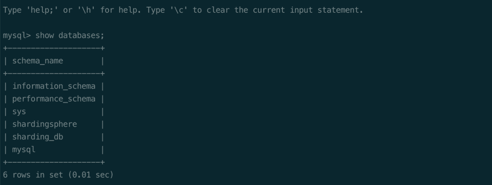
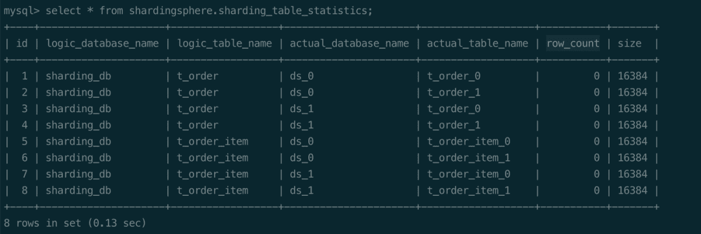
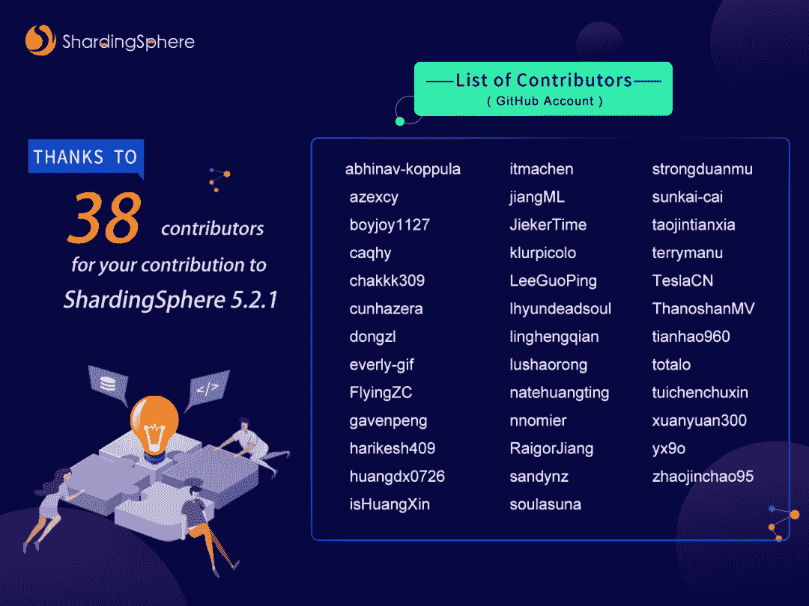

# ShardingSphere 5.2.1 发布了——以下是亮点

> 原文：<https://blog.devgenius.io/shardingsphere-5-2-1-is-released-here-are-the-highlights-bab8c628f4b6?source=collection_archive---------7----------------------->

我们新的 5.2.1 版本带来了新的功能和增强，如 ShardingSphere 系统数据库、SQL 提示强制分片路由、异步数据一致性检查以及对 Consul 和 Nacos 治理中心的支持。

# 介绍

经过 1.5 个月的开发，[Apache sharding sphere](https://shardingsphere.apache.org/)5 . 2 . 1 发布了。我们的社区合并了来自世界各地的团队和个人的 614 个 pr。[产生的 5.2.1 版本](https://github.com/apache/shardingsphere/blob/master/RELEASE-NOTES.md)在特性、性能、测试、文档、示例等方面进行了优化。

新版本带来了以下亮点:

*   ShardingSphere 系统数据库
*   SQL 提示强制分片路由
*   异步数据一致性检查

版本 5.2.1 引入了新的 ShardingSphere 系统数据库，为分布式数据库提供统计信息。统计信息可以帮助 SQL 联邦执行引擎评估执行成本，以选择成本最低的执行计划。此外，ShardingSphere 可以收集数据分片后的分布信息，为自动分片缩放管理提供参考。

**SQL 提示是 ShardingSphere 5 提供的一个重要特性。x，利用它用户可以通过 SQL 注释灵活地控制路由。新版本增强了 SQL 提示功能，并支持数据分片强制路由。**

用户只需在将分片值传输到 ShardingSphere 路由引擎之前添加格式为:`/* SHARDINGSPHERE_HINT: t_order.SHARDING_DATABASE_VALUE=1, t_order.SHARDING_TABLE_VALUE=1 */`的注释。与之前的 HintManager 方法相比，SQL HINT 更加灵活，不需要用户编写代码。

**新版本还增强了数据迁移期间的数据一致性检查能力，支持异步执行检查。用户可以通过**[**DistSQL**](https://medium.com/nerd-for-tech/intro-to-distsql-an-open-source-more-powerful-sql-bada4099211)**查看数据迁移进度，提高了数据迁移的便捷性。**

而且**治理中心现在支持 Consul 和 Nacos** ，为用户提供了更多的选择。SQL 兼容性大大提高。读/写分割也得到了优化，因为在禁用辅助数据库后，可以使用`-f`参数强制启动代理。

接下来，本帖将详细介绍 ShardingSphere 5.2.1 的更新。

# 显著亮点

## ShardingSphere 系统数据库

与 [MySQL](https://www.mysql.com/) 和 [PostgreSQL](https://www.postgresql.org/) 系统数据库一样，ShardingSphere 5.2.1 引入了新的系统数据库来管理数据库的元数据。

ShardingSphere 系统数据库主要存储动态和静态元数据。动态元数据是指经常更新的数据，如来自分布式数据库的统计信息，需要通过内置的调度任务定期收集和维护。

相比之下，静态元数据指的是无需用户修改就能保持不变的数据。一个例子就是用户设置的 ShardingSphere 分布式数据库的 status 参数，只需要存储在元数据数据库中进行查询即可。

由于该功能目前处于试验阶段，您需要通过以下配置开始收集元数据。

```
proxy-metadata-collector-enabled: true
```

通过命令行连接代理，然后执行`SHOW DATABASES`语句。我们可以看到新的`shardingsphere`系统数据库，它存储了分布式数据库的元数据。



目前`shardingsphere`系统数据库中增加了`sharding_table_statistics`表，用于收集分片表的分布信息，包括`row_count`和`size`。



ShardingSphere 系统数据库提供的统计信息可以帮助 SQL 联邦执行引擎评估执行成本。这允许选择合适的关联顺序和方法，并实现高效执行。

此外，通过收集存储节点的数据分布信息和负载信息，ShardingSphere 可以进行自动分片缩放，降低用户的运维成本。

## SQL 提示强制分片路由

在一些特殊的业务场景中，用于分片的字段存在于外部业务逻辑中，而不是 SQL、数据库和表结构中。目前需要`Hint`引入分片键值来完成分片路由。

在 5.2.1 版本之前，`Hint`有两种使用方式。一种方法是通过 JDBC 接入端口中的 HintManager 来使用它，而另一种方法是在代理接入端口中启动`proxy-hint-enabled`参数。

在第一种情况下，用户需要编写代码来调用`addDatabaseShardingValue`和`addTableShardingValue`方法来设置数据库和表分片的值。但是，如果使用 HintManager 方法，用户必须以一定的代价修改原始逻辑。

```
*// Sharding database and table with using HintManagerString sql = "SELECT * FROM t_order";*
try (HintManager hintManager = HintManager.getInstance();
     Connection conn = dataSource.getConnection();
     PreparedStatement preparedStatement = conn.prepareStatement(sql)) {
    hintManager.addDatabaseShardingValue("t_order", 1);
    hintManager.addTableShardingValue("t_order", 2);
    try (ResultSet rs = preparedStatement.executeQuery()) {
        while (rs.next()) {
            *// ...        
        }*
    }
}
```

如果是第二种情况，首先启动`proxy-hint-enabled`参数，然后通过下面的 [DistSQL](https://shardingsphere.apache.org/document/5.1.0/en/concepts/distsql/) 配置清除分片值。

然而，基于提示的方法会将代理的线程处理模型从 IO 多路复用转换为每个请求一个独立的线程，这将降低代理的吞吐量。这意味着用户必须做出权衡。

```
*-- For the current connection, add sharding values yy to table xx. xx: logical table name; yy: database sharding value*
ADD SHARDING HINT DATABASE_VALUE t_order= 100;*-- For the current connection, add sharding values yy to table xx. xx: logical table name; yy: table sharding value*
ADD SHARDING HINT TABLE_VALUE t_order = 100;*-- For the current connection, clear sharding hint settings*
CLEAR SHARDING HINT;
```

由于这两种方法都存在问题，5.2.1 版增加了 SQL 提示强制分片路由功能。这允许用户通过 SQL 注释灵活地控制路由。不需要修改原始代码的逻辑，代理访问端口中的线程处理模型不受影响。

在使用 SQL 提示强制分片路由之前，用户应该提前启用解析注释的配置，并将`sqlCommentParseEnabled`设置为`true`。注释格式只支持`/* */`，内容必须以`SHARDINGSPHERE_HINT:`开头。

可选属性包括:

*   `{table}.SHARDING_DATABASE_VALUE`:用于添加`{table}`对应的数据源分片键值。多个属性由逗号分隔。
*   `{table}.SHARDING_TABLE_VALUE`:用于添加`{table}`对应的表格分片键值。多个属性由逗号分隔。

> *当需要数据库分片而不需要表分片，并且对子数据库进行强制路由时，可以使用* `*SHARDING_DATABASE_VALUE*` *添加分片，而不需要指定{table}。*

下面是一个使用`HINT_INLINE`算法的例子。

```
rules:
- !SHARDING
  tables:
    t_order:
      actualDataNodes: ds_${0..1}.t_order_${0..1}
      databaseStrategy:
        hint:
          shardingAlgorithmName: database_hint_inline
      tableStrategy:
        hint:
          shardingAlgorithmName: t_order_hint_inline
  defaultDatabaseStrategy:
    none:
  defaultTableStrategy:
    none: shardingAlgorithms:
    database_hint_inline:
      type: HINT_INLINE
      props:
        algorithm-expression: ds_${value % 2}
    t_order_hint_inline:
      type: HINT_INLINE
      props:
        algorithm-expression: t_order_${value % 2}
```

我们可以通过 SQL 提示传递`t_order`表的分片值。从`PREVIEW`语句中我们可以看到，虽然 SQL 语句没有指定的分片键，但是 SQL Hint 引入的分片键-值对也可以实现分片路由。

```
*/* SHARDINGSPHERE_HINT: t_order.SHARDING_DATABASE_VALUE=1, t_order.SHARDING_TABLE_VALUE=1 */*
SELECT * FROM t_order;PREVIEW */* SHARDINGSPHERE_HINT: t_order.SHARDING_DATABASE_VALUE=1, t_order.SHARDING_TABLE_VALUE=1 */* SELECT * FROM t_order;
+*------------------+----------------------------------------------------------------------------------------------------------------------+*
| data_source_name | actual_sql                                                                                                           |
+*------------------+----------------------------------------------------------------------------------------------------------------------+*
| ds_1             | */* SHARDINGSPHERE_HINT: t_order.SHARDING_DATABASE_VALUE=1, t_order.SHARDING_TABLE_VALUE=1 */* SELECT * FROM t_order_1 |
+*------------------+----------------------------------------------------------------------------------------------------------------------+*
```

## 异步数据一致性检查

在 5.2.1 版本之前，用户必须等待服务器同步返回检查结果。有时检查很耗时，所以数据库服务器的`session`可能会超时。

在这种情况下，用户无法观察结果，只能查看日志，这对用户不友好。针对该问题，版本 5.2.1 支持异步数据一致性检查功能以及如下 DistSQL 集:

*   检查迁移作业 Id —异步数据一致性检查
*   显示迁移检查状态作业 Id —查询检查进度
*   开始迁移检查作业 id-开始检查作业
*   停止迁移检查作业 id-停止检查作业

通过上面的 DistSQL，用户可以更容易地管理数据迁移。例子如下:

```
*-- Execute consistency check*
mysql> CHECK MIGRATION 'j0101270cbb6714cff0d7d13db9fa23c7c0a1' BY TYPE (NAME='DATA_MATCH');
Query OK, 0 rows affected (0.24 sec)*-- Query the check progress*
mysql> SHOW MIGRATION CHECK STATUS 'j0101270cbb6714cff0d7d13db9fa23c7c0a1';
+*---------+--------+---------------------+-------------------+-------------------------+----------------+------------------+---------------+*
| tables  | result | finished_percentage | remaining_seconds | check_begin_time        | check_end_time | duration_seconds | error_message |
+*---------+--------+---------------------+-------------------+-------------------------+----------------+------------------+---------------+*
| t_order | false  | 0                   | 2450              | 2022-10-12 16:07:17.082 |                | 14               |               |
+*---------+--------+---------------------+-------------------+-------------------------+----------------+------------------+---------------+*
1 row in set (0.02 sec)*-- Stop the check job*
mysql> STOP MIGRATION CHECK 'j0101270cbb6714cff0d7d13db9fa23c7c0a1';
Query OK, 0 rows affected (0.06 sec)*-- Start the check job*
mysql> START MIGRATION CHECK 'j0101270cbb6714cff0d7d13db9fa23c7c0a1';
Query OK, 0 rows affected (5.13 sec)
```

请参考[官方文档](https://shardingsphere.apache.org/document/current/en/user-manual/shardingsphere-proxy/migration/usage/)，并关注未来帖子的更多详细信息。

# 提高

## 核心

此次更新优化了 [Oracle](https://www.oracle.com/index.html) 和 [PostgreSQL](https://www.postgresql.org/) 的 SQL 解析，大大提高了 ShardingSphere 的 SQL 兼容性。详细的 SQL 解析优化可以在下面的发行说明部分找到。

提高 SQL 解析兼容性是 ShardingSphere 社区的一项长期任务，欢迎任何感兴趣的人加入我们。

5.2.1 版还支持读/写拆分。辅助数据库被禁用后，可以使用`-f`参数强制启动 [ShardingSphere-Proxy](https://shardingsphere.apache.org/document/current/en/quick-start/shardingsphere-proxy-quick-start/) 。

在这种情况下，即使部分存储节点不可用，仍可启动代理进行操作和维护工作。此外，内核函数还针对`SHOW PROCESSLIST`语句的显示结果进行了优化，并增加了`Sleep`状态的线程显示。

通过优化单播路由的逻辑和尽可能重用缓存的数据库连接，ShardingSphere 的执行性能得到了提高。

## 弹性缩放

弹性伸缩模块只支持具有唯一键的表的数据迁移，允许表迁移到新的表名。此外，它优化了数据迁移中线程池的使用。数据一致性检查可以中断，这使得用户更容易管理数据迁移。

## 分布式治理

在分布式治理方面，治理中心现在能够支持 Consul 和 Nacos，为您提供更多的选择。同时，内置的 H2 数据库用于支持以独立模式持久化元数据信息。

在运行模式下，`overwrite`配置项被删除。元数据信息基于治理中心的数据，用户可以通过 DistSQL 动态更改规则和配置。

# 发布说明

在接下来的章节中，您将会找到 ShardingSphere 5.2.1 的发行说明。为了改善用户体验，本次更新中修改了部分功能的 API。有关详细信息，请参考下面的 API 更改部分。

## 新功能

1.  添加 ShardingSphere 默认系统数据库以支持全局元数据管理
2.  支持异步数据一致性检查
3.  增加了对领事管理中心的支持
4.  增加了对 Nacos 治理中心的支持
5.  增加了对治理中心中查看功能的支持

## 提高

1.  SQL 联邦引擎增加高级执行器并适配 openGauss 数据库
2.  支持 ShardingSphere 代理在读写拆分读取数据库被禁用后启动
3.  SQL 提示支持强制分片路由
4.  Show processlist 支持显示代理连接(睡眠、活动)
5.  优化的 sharing sphere-JDBC 数据源配置错误消息
6.  JDBC 支持 SpringBoot 3。x 版本
7.  支持加载 MySQL、PostgreSQL、openGauss 和 SQLServer 视图元数据
8.  将 Snakeyaml 更新为 1.33，打开 YAML 3MB 限制
9.  单播分片时尽可能重用缓存的连接
10.  支持在 Oracle 中解析 ALTER ROLE
11.  添加对 Oracle 更改资源成本的支持
12.  支持在 Oracle 中解析删除实体化视图
13.  支持在 Oracle 中解析拖放库
14.  支持在 Oracle 中解析 DROP JAVA
15.  支持在 Oracle 中解析可插拔数据库
16.  支持在 Oracle 中解析删除索引类型
17.  支持在 openGauss 中解析 ALTER 包
18.  支持 openGauss select offset，count 语句解析，删除 PostgreSQL 语法中无用的语法
19.  将 max_size 添加到 openGauss 语法
20.  优化 alter view/drop view 解析逻辑并修复 alter view 刷新程序错误
21.  将 SQL 分析器错误详细信息添加到 ParseCancellationException
22.  添加对 Postgres 解析 OptOnConflict 的支持
23.  增强对 PostgreSQL 中 ALTER TABLE 和 ALTER VIEW 的支持
24.  在 PostgreSQL Declare 语句中添加一个缺少的关键字
25.  为 MySQL 解析器添加 JSON 函数支持
26.  ShardingSphere-Proxy 自动适应 Docker 环境中的 cgroup 内存限制
27.  显示迁移状态 DistSQL respond 新添加的 error_message 列
28.  显示迁移状态响应新添加的已处理记录计数列
29.  支持增量转储中的 MySQL 8 缓存 _ sha2 _ 密码认证
30.  改进下降管道工艺配置
31.  支持唯一键表迁移
32.  支持将表迁移到新名称表
33.  提高流水线任务和运行程序中线程池的使用率
34.  支持可取消的数据一致性检查
35.  DistSQL:创建或更改读写拆分规则时，检查重复的写或读资源
36.  DistSQL:为`ALTER SHARDING BINDING TABLE RULES`添加有效性检查
37.  独立模式 H2 支持持久元数据
38.  修复 xa 事务中的 openGauss 游标执行
39.  添加了与事务相关的异常错误修复

## 错误修复

1.  重写时为 PostgreSQL 生成适当的占位符
2.  修复 opengauss 更新集解析异常
3.  修复使用负值执行插入语句时出现的分析异常
4.  修复 OracleDataSourceMetaData 中错误的 connectDescriptorUrlPattern
5.  修复在特殊规则中重写分片后插入 SQL 的乱码
6.  修复执行 select * from information _ schema . tables 时出现的异常
7.  修复执行更改视图重命名时的异常
8.  修复使用 rolsuper 时 PostgreSQL 检查数据源权限
9.  DistSQL:修复没有资源时`REFRESH TABLE METADATA`的 NPE
10.  修改规则时修复未修改的表元数据
11.  修复数据库发现
12.  MySQL。NORMAL_REPLICATION 算法找不到主节点"
13.  修复了使用 etcd 构建不知道的集群事件
14.  修复未创建事务管理时发生的 NPE
15.  修复当 InlineShardingAlgorithm 算法的分片值超过整数时发生的路由异常

## API 变更

1.  SQL 提示语法格式调整为 SQL 风格的格式
2.  DistSQL:删除语法`COUNT DATABASE RULES`
3.  ShardingSphere 模式删除覆盖配置
4.  代理:优化 agent.yaml 的配置

# 相关链接

🔗[**下载链接**](https://shardingsphere.apache.org/document/current/en/downloads/)

**🔗** [**发布说明**](https://github.com/apache/shardingsphere/blob/master/RELEASE-NOTES.md)

**🔗** [**项目地址**](https://shardingsphere.apache.org/)

**🔗** [**云子项目地址**](https://github.com/apache/shardingsphere-on-cloud)

# 社区贡献

这个 Apache ShardingSphere 5.2.1 版本是由 38 个贡献者提交的 614 个合并 PRs 的结果。谢谢你的努力！

