# sharding sphere-代理前端协议故障排除指南和示例

> 原文：<https://blog.devgenius.io/shardingsphere-proxy-front-end-protocol-troubleshooting-guide-and-examples-f3037d840e7c?source=collection_archive---------6----------------------->

定位为透明数据库代理的 ShardingSphere-Proxy ，是 [Apache ShardingSphere](https://shardingsphere.apache.org/) 的访问点之一。

ShardingSphere-Proxy 实现了一个数据库协议，任何使用[MySQL](https://www.mysql.com/)/[PostgreSQL](https://www.postgresql.org/)/[open gauss](https://opengauss.org/en/)协议或与之兼容的客户端都可以访问该协议。ShardingSphere-Proxy 相对于 [ShardingSphere-JDBC](https://shardingsphere.apache.org/document/current/en/overview/#shardingsphere-jdbc) 的优势在于对异构语言的支持以及 DBA 进入数据库集群的可操作入口点。

类似于 ShardingSphere 的 SQL 解析模块，建立 ShardingSphere-Proxy 对数据库协议的支持是一个长期的过程，需要开发者不断完善数据库协议部署。

这篇文章将向您介绍数据库协议开发中常用的工具，通过提供一个 ShardingSphere-Proxy MySQL 协议问题的故障排除指南作为案例研究。

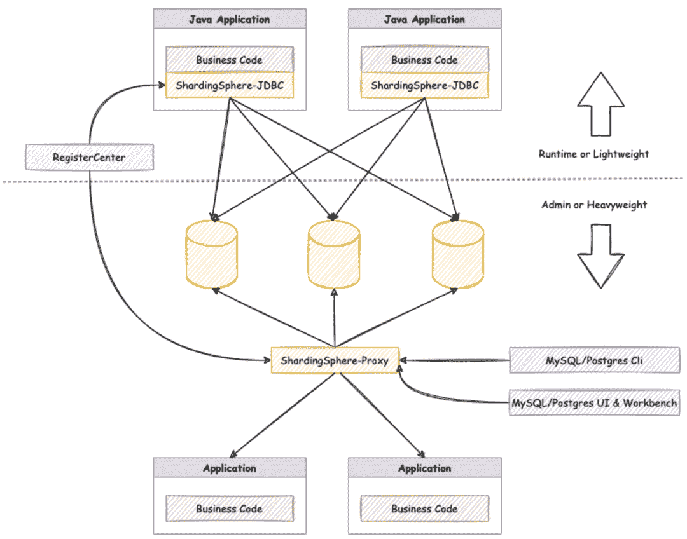

# 1.使用 Wireshark 分析网络协议

[Wireshark](https://www.wireshark.org/) 是一款流行的网络协议分析工具，内置了对数百种协议(包括与本文相关的 MySQL / PostgreSQL 协议)的解析支持，并且能够读取许多不同类型的数据包捕获格式。

Wireshark 的完整功能、安装和其他详细信息可以在 Wireshark 官方文档中找到。

## 1.1 使用 Wireshark 或 [tcpdump](https://www.bing.com/ck/a?!&&p=59c98df665abf4ae96c59d71ce8241351b538ec6a61efe940bad8c1c419b6a15JmltdHM9MTY1NzI0NzgxNiZpZ3VpZD0xZjZlODVkMS0wNmNkLTRlODMtYWRhMS0wOWIzM2RjYTJiNjEmaW5zaWQ9NTE3OQ&ptn=3&fclid=d57892b9-fe66-11ec-9844-e4d3b8466c04&u=a1aHR0cHM6Ly93d3cudGNwZHVtcC5vcmcv&ntb=1) 等工具捕获数据包

## Wireshark

Wireshark 本身具有捕获数据包的能力，所以如果连接到 ShardingSphere-Proxy 的环境可以运行 Wireshark，你就可以用它直接捕获数据包。

启动 Wireshark 后，首先选择正确的网卡。

例如，如果您在本地运行 ShardingSphere-Proxy，客户端将连接到 127.0.0.1 上的端口 3307 上的 ShardingSphere-Proxy，流量将通过被选为数据包捕获目标的环回 NIC。

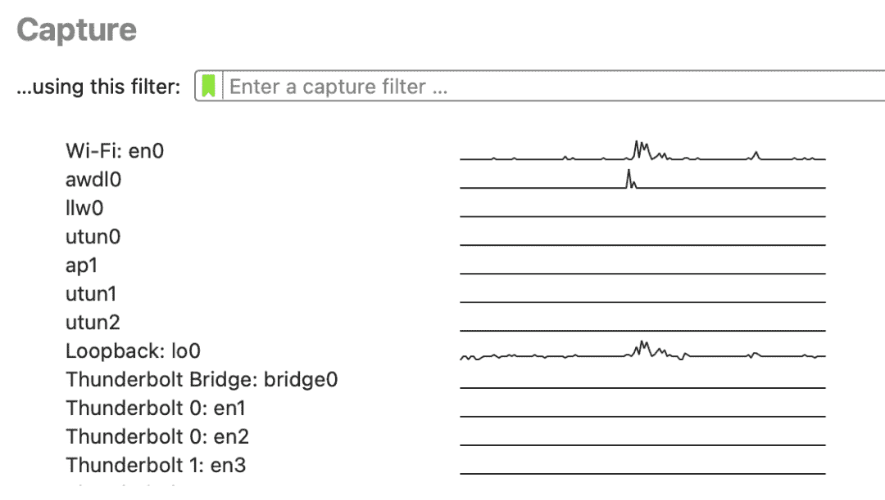

选择网卡后，Wireshark 开始捕获数据包。由于网卡上可能有来自其他进程的大量流量，因此有必要过滤掉来自指定端口的流量。

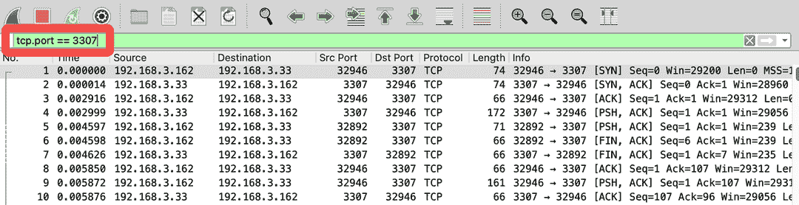

## 1.1.2 [tcpdump](https://www.tcpdump.org/)

如果 ShardingSphere-Proxy 部署在在线环境中，或者当您无法使用 Wireshark 捕获数据包时，请考虑使用 tcpdump 或其他工具。

NIC eth0 作为目标，过滤 TCP 端口 3307，将结果写入/path/to/dump.cap .命令示例:

```
tcpdump -i eth0 -w /path/to/dump.cap tcp port 3307
```

要知道如何使用 tcpdump，可以去 man tcpdump。tcpdump 的数据包捕获结果文件可以通过 Wireshark 打开。

## 注意事项

当客户端连接到 MySQL 时，SSL 加密可能会自动启用，导致数据包捕获结果无法直接解析协议内容。您可以通过使用 MySQL 客户端命令行和以下命令指定参数来禁用 SSL:

```
mysql --ssl-mode=disable
```

可以使用带有以下参数的 JDBC 添加参数:

```
jdbc:mysql://127.0.0.1:3306/db?useSSL=false
```

# 1.2 使用 Wireshark 读取数据包捕获结果

Wireshark 支持读取多种数据包捕获文件格式，包括 tcpdump 的捕获格式。

默认情况下，Wireshark 将端口 3306 解码为 MySQL 协议，将端口 5432 解码为 PostgreSQL 协议。对于 ShardingSphere-Proxy 可能使用不同端口的情况，您可以在`Decode As…`中为指定端口配置协议

比如 ShardingSphere-Proxy MySQL 使用 3307 端口，可以按照以下步骤解析为 SQL 协议:

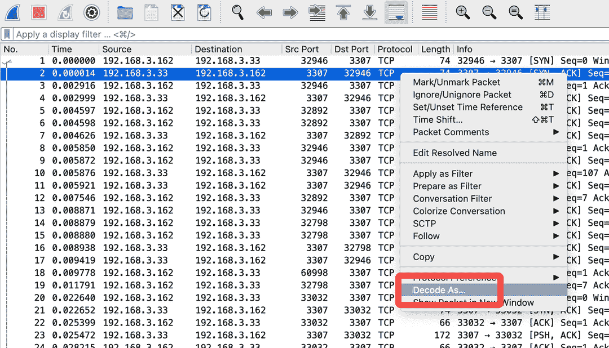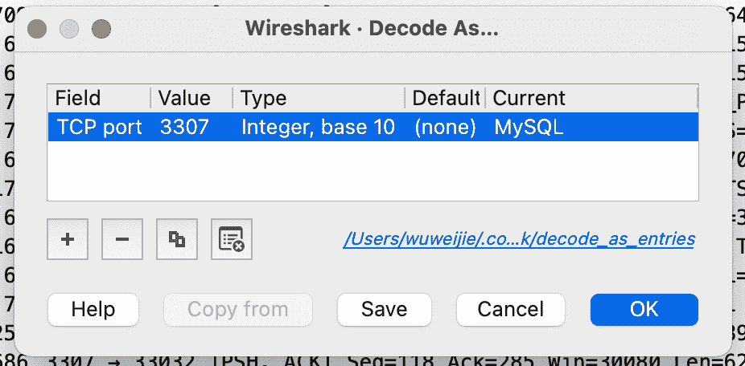

一旦 Wireshark 能够解析出 MySQL 协议，我们就可以添加过滤器来仅显示 MySQL 协议数据:

```
tcp.port == 3307 and mysql
```

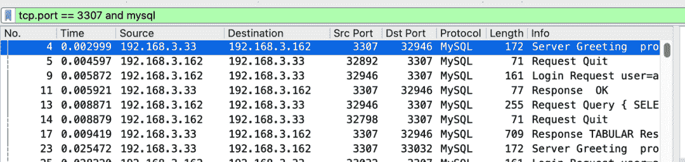

为指定端口选择正确的协议后，您可以在 Wireshark 窗口中看到内容。

例如，客户端与服务器建立 TCP 连接后，MySQL 服务器向客户端发起一个`Greeting`,如下所示:

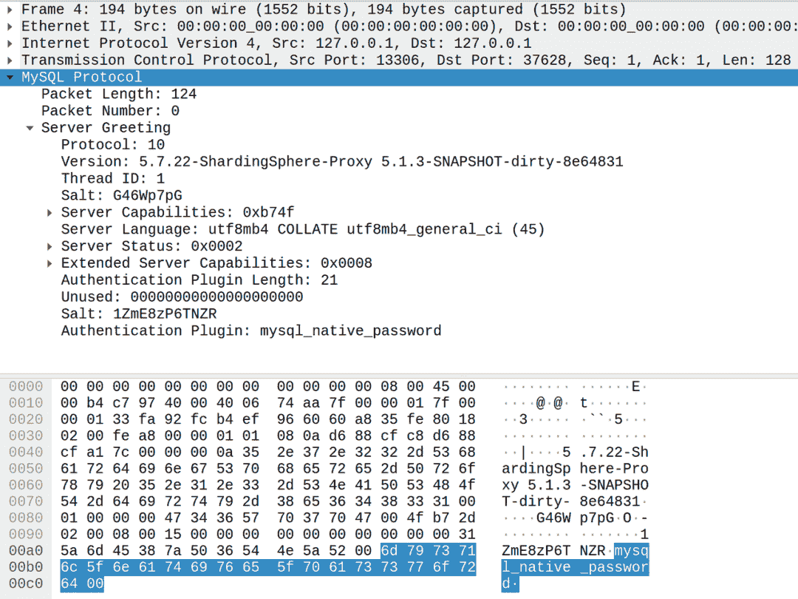

示例:客户端执行 SQL select 版本()，协议如下所示:

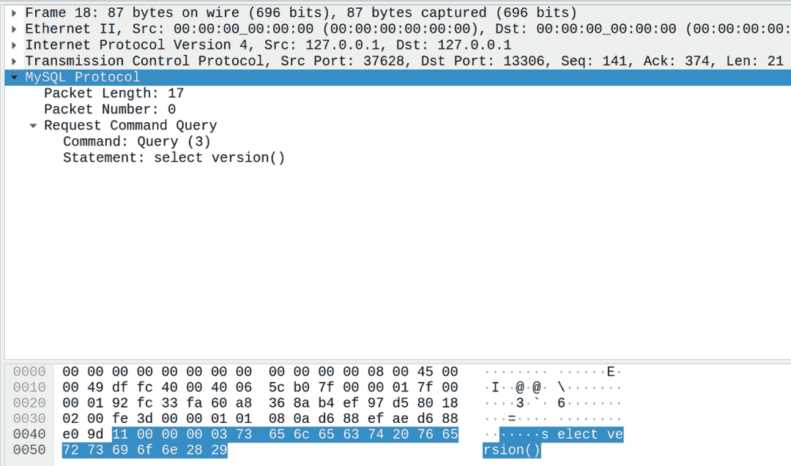

# 2.协议故障排除案例研究:ShardingSphere-Proxy MySQL 支持超大数据包

# 2.1 问题描述

使用 MySQL Connector/J 8.0.28 作为客户端连接 ShardingSphere-Proxy 5.1.1，执行时提示批量插入错误。

更换驱动 MySQL 连接器/J 5.1.38 后问题解决。

```
[INFO ] 2022-05-21 17:32:22.375 [main] o.a.s.p.i.BootstrapInitializer - Database name is `MySQL`, version is `8.0.28`
[INFO ] 2022-05-21 17:32:22.670 [main] o.a.s.p.frontend.ShardingSphereProxy - ShardingSphere-Proxy start success
[ERROR] 2022-05-21 17:37:57.925 [Connection-143-ThreadExecutor] o.a.s.p.f.c.CommandExecutorTask - Exception occur: 
java.lang.IllegalArgumentException: Sequence ID of MySQL command packet must be `0`.
 at com.google.common.base.Preconditions.checkArgument(Preconditions.java:142)
 at org.apache.shardingsphere.db.protocol.mysql.packet.command.MySQLCommandPacketTypeLoader.getCommandPacketType(MySQLCommandPacketTypeLoader.java:38)
 at org.apache.shardingsphere.proxy.frontend.mysql.command.MySQLCommandExecuteEngine.getCommandPacketType(MySQLCommandExecuteEngine.java:50)
 at org.apache.shardingsphere.proxy.frontend.mysql.command.MySQLCommandExecuteEngine.getCommandPacketType(MySQLCommandExecuteEngine.java:46)
 at org.apache.shardingsphere.proxy.frontend.command.CommandExecutorTask.executeCommand(CommandExecutorTask.java:95)
 at org.apache.shardingsphere.proxy.frontend.command.CommandExecutorTask.run(CommandExecutorTask.java:72)
 at java.base/java.util.concurrent.ThreadPoolExecutor.runWorker(ThreadPoolExecutor.java:1128)
 at java.base/java.util.concurrent.ThreadPoolExecutor$Worker.run(ThreadPoolExecutor.java:628)
 at java.base/java.lang.Thread.run(Thread.java:834)
[ERROR] 2022-05-21 17:44:24.926 [Connection-317-ThreadExecutor] o.a.s.p.f.c.CommandExecutorTask - Exception occur: 
java.lang.IllegalArgumentException: Sequence ID of MySQL command packet must be `0`.
 at com.google.common.base.Preconditions.checkArgument(Preconditions.java:142)
 at org.apache.shardingsphere.db.protocol.mysql.packet.command.MySQLCommandPacketTypeLoader.getCommandPacketType(MySQLCommandPacketTypeLoader.java:38)
 at org.apache.shardingsphere.proxy.frontend.mysql.command.MySQLCommandExecuteEngine.getCommandPacketType(MySQLCommandExecuteEngine.java:50)
 at org.apache.shardingsphere.proxy.frontend.mysql.command.MySQLCommandExecuteEngine.getCommandPacketType(MySQLCommandExecuteEngine.java:46)
 at org.apache.shardingsphere.proxy.frontend.command.CommandExecutorTask.executeCommand(CommandExecutorTask.java:95)
 at org.apache.shardingsphere.proxy.frontend.command.CommandExecutorTask.run(CommandExecutorTask.java:72)
 at java.base/java.util.concurrent.ThreadPoolExecutor.runWorker(ThreadPoolExecutor.java:1128)
 at java.base/java.util.concurrent.ThreadPoolExecutor$Worker.run(ThreadPoolExecutor.java:628)
 at java.base/java.lang.Thread.run(Thread.java:834)
```

# 2.2 故障排除

错误发生在代理的前端，不包括后端 JDBC 驱动程序，并且与协议实现相关。

## 2.2.1 分析

直接在源代码中确定，如果序列 ID 不等于 0，则报错。

```
public final class MySQLCommandPacketTypeLoader {

    */***
 ** Get command packet type.*
 ***
 ** @param payload packet payload for MySQL*
 ** @return command packet type for MySQL*
 **/*
    public static MySQLCommandPacketType getCommandPacketType(final MySQLPacketPayload payload) {
        Preconditions.checkArgument(0 == payload.readInt1(), "Sequence ID of MySQL command packet must be `0`.");
        return MySQLCommandPacketType.valueOf(payload.readInt1());
    }
}
```

**代码链接:**[https://github . com/Apache/sharding sphere/blob/d 928165 ea 4 f 6 ECF 2983 B2 a3 a 8670 ff 66 FFE 63647/sharding sphere-d b-protocol/sharding sphere-d b-protocol-MySQL/src/main/Java/org/Apache/sharding sphere/db/protocol/MySQL/packet/command . Java # L38](https://github.com/apache/shardingsphere/blob/d928165ea4f6ecf2983b2a3a8670ff66ffe63647/shardingsphere-db-protocol/shardingsphere-db-protocol-mysql/src/main/java/org/apache/shardingsphere/db/protocol/mysql/packet/command/MySQLCommandPacketTypeLoader.java#L38)

根据 MySQL 协议文档，考虑序列 ID 何时不等于 0 [2]。

*   服务器向客户端响应多条消息。
*   客户端发送多个连续的消息。
*   ……

在这种情况下，MySQL 数据包的消息头由 3 字节长度+ 1 字节序列 ID [3]组成，因此有效载荷部分的最大长度为 16 MB — 1。

考虑到该错误是在大容量插入期间生成的，问题可能是客户端发送的数据超过了单个 MySQL 数据包的长度限制，并被分割成多个连续的 MySQL 数据包，代理无法处理这些数据包。

## 2.2.2 试图重现问题

使用 `longtext` 类型字段。最初的想法是构造一个长度超过 16 MB 的 SQL，但是不经意间我们发现，当 SQL 长度超过 8 MB 时也会报告错误。该代码复制如下:

```
try (Connection connection = DriverManager.getConnection("jdbc:mysql://127.0.0.1:13306/bmsql", "root", "root")) {
    try (Statement statement = connection.createStatement()) {
        statement.execute("drop table if exists foo");
        statement.execute("create table foo (id bigint primary key, str0 longtext)");
        long id = ThreadLocalRandom.current().nextLong();
        String str0 = RandomStringUtils.randomAlphanumeric(1 << 23);
        String sql = "insert into foo (id, str0) values (" + id + ", '" + str0 + "')";
        System.out.println(sql.length());
        statement.execute(sql);
    }
}
```

错误报告如下:

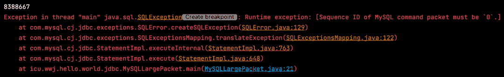

Wireshark 数据包捕获结果显示，数据包长度 0x80003C == 8388668，只有一个 MySQL 数据包，序列 ID 只有 0:

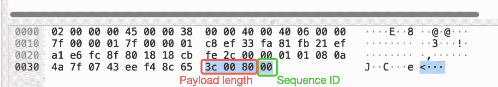

调试代码发现代理使用的 `readMediumLE()`方法是一个有符号的数字，数据包长度被读取为负数。

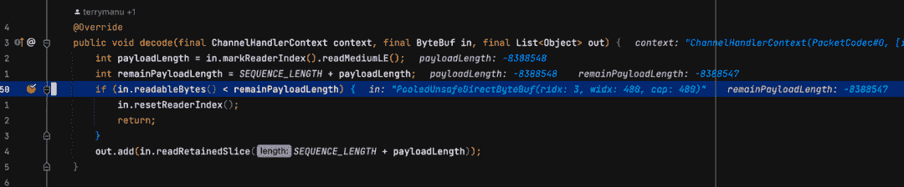

这个问题相对容易修复，只需更换相应的`readUnsignedMediumLE()`方法即可。

尽管错误消息与问题描述一致，但它并没有完全解决潜在的问题。

长度超出问题解决后，继续对问题进行故障排除。使用以下代码向 ShardingSphere-Proxy 发送大约 64 MB 的数据:

```
try (Connection connection = DriverManager.getConnection("jdbc:mysql://127.0.0.1:13306/bmsql", "root", "root")) {
    try (Statement statement = connection.createStatement()) {
        statement.execute("drop table if exists foo");
        statement.execute("create table foo (id bigint primary key, str0 longtext)");
        long id = ThreadLocalRandom.current().nextLong();
        String str0 = RandomStringUtils.randomAlphanumeric(1 << 26);
        String sql = "insert into foo (id, str0) values (" + id + ", '" + str0 + "')";
        statement.execute(sql);
    }
}
```

出现错误:

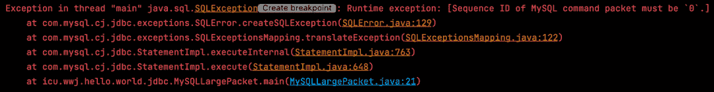

分析数据包捕获结果:

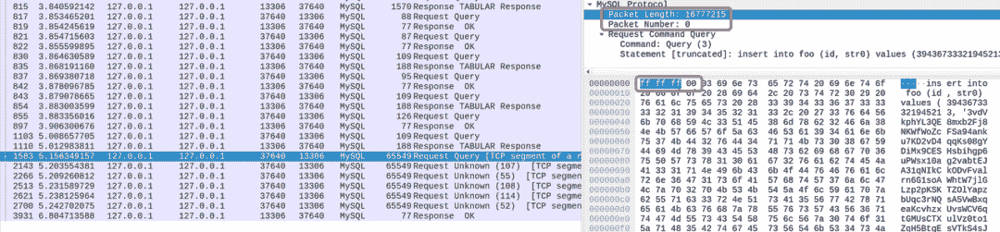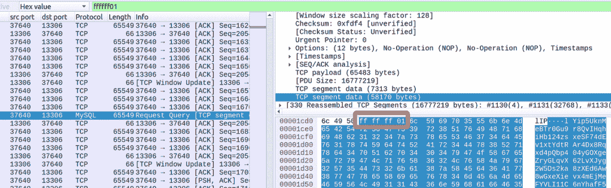

结果表明，客户端发送了多个 16MB 的数据包，Wireshark 无法正确解析 MySQL 长数据包，但我们可以使用搜索功能找到 MySQL 数据包的报头。

与 ShardingSphere-Proxy MySQL 解码逻辑相关联:

```
int payloadLength = in.markReaderIndex().readUnsignedMediumLE();
int remainPayloadLength = SEQUENCE_LENGTH + payloadLength;
if (in.readableBytes() < remainPayloadLength) {
    in.resetReaderIndex();
    return;
}
out.add(in.readRetainedSlice(SEQUENCE_LENGTH + payloadLength));
```

问题很明显:因为 ShardingSphere-Proxy 没有聚合包，所以多个包被代理作为多个命令分别解析，并且因为后续包的`Sequence ID`大于 0，所以代理的序列 ID 的内部断言逻辑报告了一个错误。

# 2.3 故障排除和维修

故障排除后，报告的错误为:

*   (直接原因)ShardingSphere-Proxy MySQL 协议解包逻辑没有正确处理长度符号[4]。
*   (根本原因)ShardingSphere-Proxy MySQL 不聚合大于 16 MB 的数据包[5]。

首先重要的是理解 MySQL 协议如何处理很长的数据包[6]。

*   当总数据长度超过 16 MB — 1 时，协议会将数据拆分为多个长度为 16 MB — 1 的数据包，直到最终数据长度小于 16 MB — 1，如下图所示:

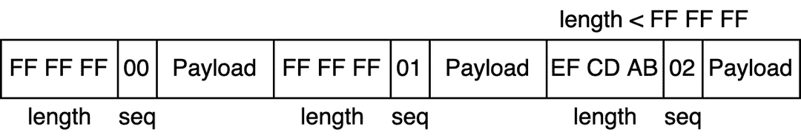

*   当数据长度正好等于 16 MB — 1 或其倍数时，发送一个或多个长度为 16 MB — 1 的数据包，后跟一个长度为 0 的数据包，如下图所示:

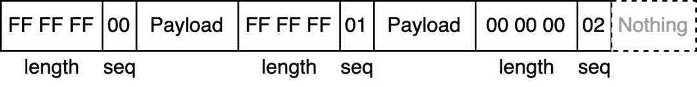

**解决方案:**为了让 ShardingSphere-Proxy MySQL 的协议实现不关心处理多长的数据包，最好在数据解码逻辑中聚合数据包。

在 ShardingSphere-Proxy 前端 [Netty](https://netty.io/) 解码逻辑中，当遇到一个长度为`0xFFFFFF`的数据包时，多个 MySQL 包的净荷部分通过 CompositeByteBuf 进行聚合。

有关特定代码，请参见参考文档中的拉请求。

以下问题目前已修复:

*   正确处理数据包长度数字符号[7]。
*   MySQL 协议解码逻辑支持超过 16 MB 的数据包[8]。

以后要解决的潜在问题，包括但不限于:

*   MySQL 协议编码逻辑不支持响应大于 16 MB 的数据包。

# 3.总结 Shardingsphere 前端协议的故障排除方法

对于基于协议的故障排除，您首先需要熟悉相应的协议和数据库协议，包括但不限于:

通过数据包捕获工具观察客户端直接连接到数据库的协议。

根据数据库协议文件，读取官方客户端数据库的协议编码逻辑源代码(如 JDBC 驱动)。

一旦您基本掌握了数据包捕获工具和协议，您就可以开始排除 sharing sphere-Proxy 前端协议问题了。

ShardingSphere-Proxy 与客户端建立连接的代码条目位于 org . Apache . sharding sphere . Proxy . frontend . netty . serverhandlerinitializer[9]中，可以用作识别问题的起点。

本文中介绍的解决方案已经在 Apache ShardingSphere 5.1.2 中发布[10]。

# 相关链接:

[1][https://www.wireshark.org/](https://www.wireshark.org/)

[https://dev.mysql.com/doc/internals/en/sequence-id.html](https://dev.mysql.com/doc/internals/en/sequence-id.html)

[3][https://dev.mysql.com/doc/internals/en/mysql-packet.html](https://dev.mysql.com/doc/internals/en/mysql-packet.html)

[4]https://github.com/apache/shardingsphere/issues/17891

[5]https://github.com/apache/shardingsphere/issues/17907

[6][https://dev . MySQL . com/doc/internals/en/sending-more-16 mbyte . html](https://dev.mysql.com/doc/internals/en/sending-more-than-16mbyte.html)

[https://github.com/apache/shardingsphere/pull/17898](https://github.com/apache/shardingsphere/pull/17898)

[https://github.com/apache/shardingsphere/pull/17914](https://github.com/apache/shardingsphere/pull/17914)

[9][https://github . com/Apache/sharding sphere/blob/2c 9936497214 b 8 a 654 CB 56d 43583 f 62 CD 7 a6b 76b/sharding sphere-proxy-frontend/sharding sphere-proxy-frontend-core/src/main/Java/org/Apache/sharding sphere/proxy/frontend/netty/serverhandlerinitializer . Java](https://github.com/apache/shardingsphere/blob/2c9936497214b8a654cb56d43583f62cd7a6b76b/shardingsphere-proxy/shardingsphere-proxy-frontend/shardingsphere-proxy-frontend-core/src/main/java/org/apache/shardingsphere/proxy/frontend/netty/ServerHandlerInitializer.java)

[10][https://sharding sphere . Apache . org/document/current/cn/downloads/](https://shardingsphere.apache.org/document/current/cn/downloads/)

[GitHub 问题](https://github.com/apache/shardingsphere/issues)

[投稿指南](https://shardingsphere.apache.org/community/en/contribute/)

推特

[切割球松弛度](https://join.slack.com/t/apacheshardingsphere/shared_invite/zt-sbdde7ie-SjDqo9~I4rYcR18bq0SYTg)

[华人社区](https://community.sphere-ex.com/)

# 作者

吴伟杰，Apache ShardingSphere PMC，R&D,[spherex](https://www.sphere-ex.com/en/)基础设施工程师。韦杰专注于 Apache ShardingSphere 访问端和 sharing sphere 子项目 [ElasticJob](https://shardingsphere.apache.org/elasticjob/) 。