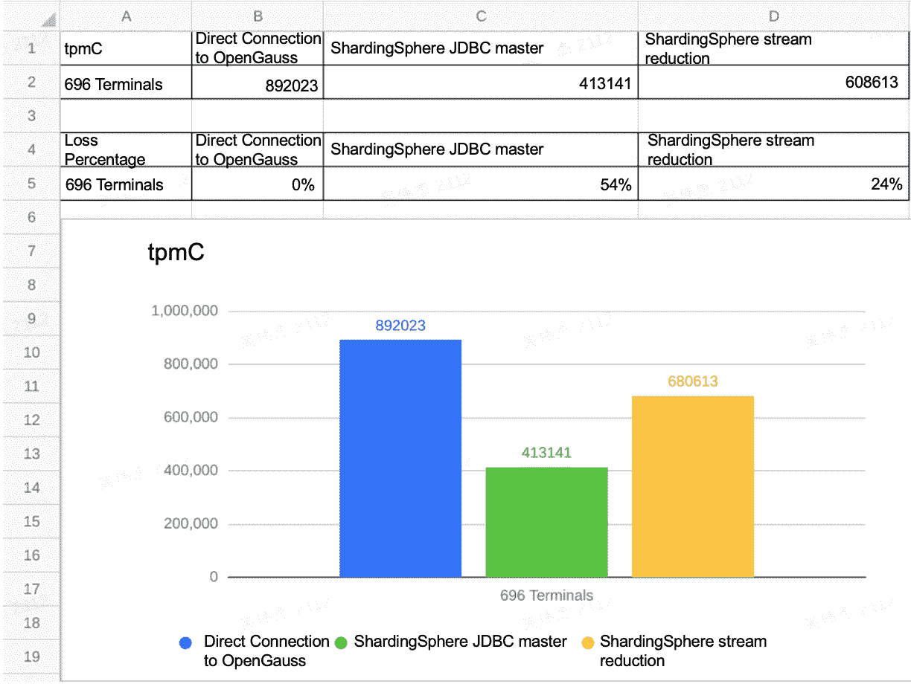
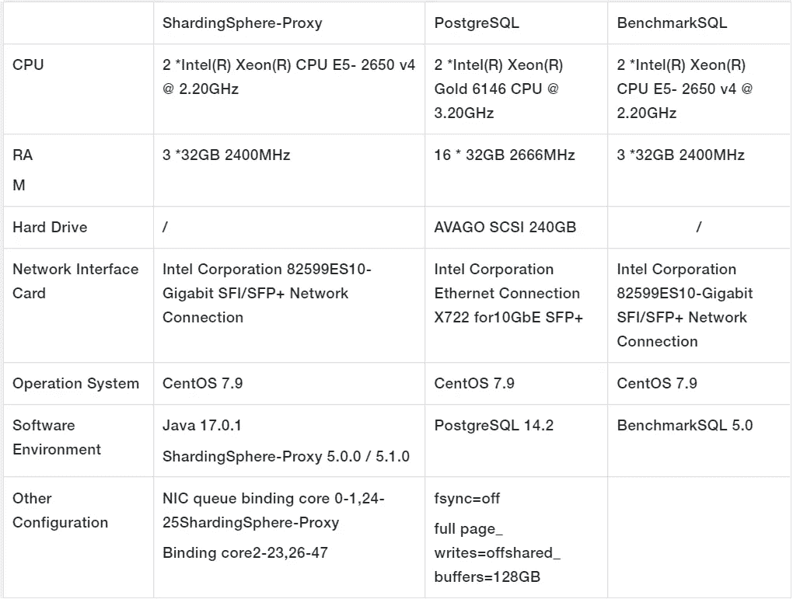
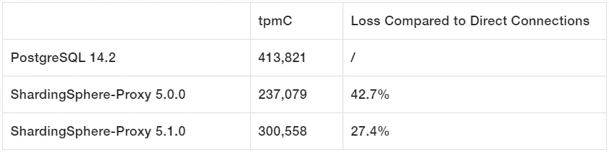
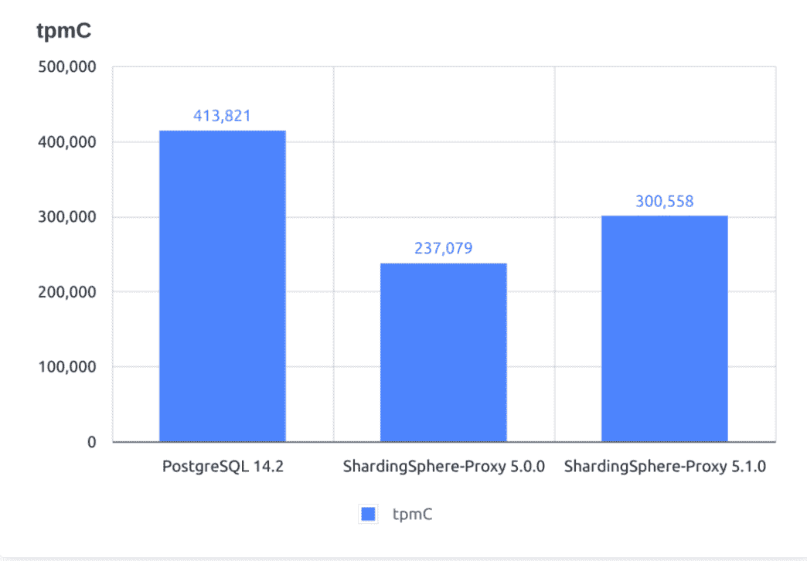

# Apache sharding sphere-PostgreSQL 的代理性能在版本 5.1.0 中提高了 26.8%

> 原文：<https://blog.devgenius.io/shardingsphere-proxy-performance-with-postgresql-is-improved-26-8-with-version-5-1-0-432f6bf9e077?source=collection_archive---------5----------------------->

各行各业对 Apache ShardingSphere 的采用越来越多，这使得我们的社区能够收到对我们最新版本的宝贵反馈。

我们的团队对 ShardingSphere 内核、接口等进行了大量的性能优化。自从 5.0.0 版本发布以来。本文介绍了一些代码级的性能优化，并展示了 ShardingSphere-Proxy TPC-C 基准测试的优化结果。

# 最佳化

## 纠正可选的使用

`java.util.Optional`，由 Java 8 引入，它使代码更干净。例如，它可以避免方法返回`null`值。`Optional`常用于两种情况:

```
public T orElse(T other) {return value != null ? value : other;} public T orElseGet(Supplier<? extends T> other) {return value != null ? value : other.get();}
```

在 ShardingSphere 项目`org.apache.shardingsphere.infra.binder.segment.select.orderby.engine.OrderByContextEngine`中，一个`Optional`代码被用作:

```
Optional<OrderByContext> result = // Omit codes...return result.orElse(getDefaultOrderByContextWithoutOrderBy(groupByContext));
```

在上面的`orElse`语句中，即使结果不为空，也会调用`orElse`方法。如果`orElse`方法涉及修改操作，可能会发生事故。在方法调用的情况下，应该相应地调整语句:

```
Optional<OrderByContext> result = // Omit codes...return result.orElseGet(() -> getDefaultOrderByContextWithoutOrderBy(groupByContext));
```

λ用于提供一个`Supplier`到`orElseGet`。这样，只有当结果为空时，才会调用`orElseGet`方法。

> **相关公关:**【https://github.com/apache/shardingsphere/pull/11459/files】T21

## 避免频繁并发调用 Java 8 ConcurrentHashMap 的 computeIfAbsent

`java.util.concurrent.ConcurrentHashMap`常用于并发情况。与用`synchronized`修改所有操作的`java.util.Hashtable`相比，`ConcurrentHashMap`可以在保证线程安全的同时提供更好的性能。

然而，在 Java 8 实现中，即使键存在，`ConcurrentHashMap` 的方法`computeIfAbsent`仍然检索`synchronized`代码片段中的值。同一个键频繁调用`computeIfAbsent`会极大地损害并发性能。

> **参考:**https://bugs.openjdk.java.net/browse/JDK-8161372

这个问题在 Java 9 中已经解决了。然而，为了避免这个问题并确保 Java 8 中的并发性能，我们调整了 ShardingSphere 代码中的语法。

以一个经常被调用的 ShardingSphere 类`org.apache.shardingsphere.infra.executor.sql.prepare.driver.DriverExecutionPrepareEngine`为例:

```
// Omit some codes...private static final Map<String, SQLExecutionUnitBuilder> TYPE_TO_BUILDER_MAP = new ConcurrentHashMap<>(8, 1);// Omit some codes...public DriverExecutionPrepareEngine(final String type, final int maxConnectionsSizePerQuery, final ExecutorDriverManager<C, ?, ?> executorDriverManager,final StorageResourceOption option, final Collection<ShardingSphereRule> rules) {super(maxConnectionsSizePerQuery, rules);this.executorDriverManager = executorDriverManager;this.option = option;sqlExecutionUnitBuilder = TYPE_TO_BUILDER_MAP.computeIfAbsent(type,key -> TypedSPIRegistry.getRegisteredService(SQLExecutionUnitBuilder.class, key, new Properties()));}
```

在上面的代码中，只有两个`type`会被传入`computeIfAbsent`，大多数 SQL 执行都必须采用这个代码。这样一来，就会出现同一个键频繁并发调用`computeIfAbsent`的情况，阻碍并发性能。采用以下方法来避免这个问题:

```
SQLExecutionUnitBuilder result;if (null == (result = TYPE_TO_BUILDER_MAP.get(type))) {result = TYPE_TO_BUILDER_MAP.computeIfAbsent(type, key -> TypedSPIRegistry.getRegisteredService(SQLExecutionUnitBuilder.class, key, new Properties()));}return result;
```

> **相关公关:**【https://github.com/apache/shardingsphere/pull/13275/files】T21

## 避免频繁调用 java.util.Properties

`java.util.Properties`是一个常用的 ShardingSphere 配置类。`Properties`继承了`java.util.Hashtable`，因此需要避免在并发情况下频繁调用`Properties`。

我们发现`org.apache.shardingsphere.sharding.algorithm.sharding.inline.InlineShardingAlgorithm`中有一个逻辑频繁调用`getProperty`，一个 ShardingSphere 数据分片类，导致并发性能受限。为了解决这个问题，我们把调用`Properties`的逻辑放在了`InlineShardingAlgorithm`的`init`下面，避免了分片算法中并发性能的计算。

> **相关公关:**[https://github.com/apache/shardingsphere/pull/13282/files](https://github.com/apache/shardingsphere/pull/13282/files)

## 避免使用集合。synchronizedMap

在检查 ShardingSphere 的监视器阻塞时，我们在`org.apache.shardingsphere.infra.metadata.schema.model.TableMetaData`中发现了一个被频繁调用的 Map，它被`Collections.synchronizedMap`修改。

这会影响并发性能。修改操作只存在于修改地图的初始阶段，其余都是读取操作，因此，`Collections.synchronizedMap`修改方法可以直接删除。

> **相关公关:**[https://github.com/apache/shardingsphere/pull/13264/files](https://github.com/apache/shardingsphere/pull/13264/files)

## 用字符串串联替换不必要的 String.format

那里的 ShardingSphere 项目`org.apache.shardingsphere.sql.parser.sql.common.constant.QuoteCharacter` 有如下逻辑:

```
public String wrap(final String value) {return String.format("%s%s%s", startDelimiter, value, endDelimiter);}
```

上面的逻辑显然是一个字符串连接，但是使用`String.format`意味着它比直接的字符串连接花费更多。调整如下:

```
public String wrap(final String value) {return startDelimiter + value + endDelimiter;}
```

我们用 JMH 做一个简单的测试。以下是测试结果:

```
# JMH version: 1.33# VM version: JDK 17.0.1, Java HotSpot(TM) 64-Bit Server VM, 17.0.1+12-LTS-39# Blackhole mode: full + dont-inline hint (default, use -Djmh.blackhole.autoDetect=true to auto-detect)# Warmup: 3 iterations, 5 s each# Measurement: 3 iterations, 5 s each# Timeout: 10 min per iteration# Threads: 16 threads, will synchronize iterations# Benchmark mode: Throughput, ops/timeBenchmark                           Mode  Cnt          Score         Error  UnitsStringConcatBenchmark.benchFormat  thrpt    9   28490416.644 ± 1377409.528  ops/sStringConcatBenchmark.benchPlus    thrpt    9  163475708.153 ± 1748461.858  ops/s
```

很明显，`String.format`比`+`字符串连接的成本更高，而且自 Java 9 以来，直接字符串连接的性能已经得到了优化。这显示了选择正确的字符串连接方法的重要性。

> **相关公关:**[https://github.com/apache/shardingsphere/pull/11291/files](https://github.com/apache/shardingsphere/pull/11291/files)

## 用 For-each 替换频繁流

`java.util.stream.Stream`频繁出现在 ShardingSphere 5 中。x 的代码。

在之前的 benchmark SQL(TPC-C test for Java implementation)压力测试— ShardingSphere-JDBC + openGauss 性能测试中，我们发现当所有的频繁流都被替换为`for-each`时，ShardingSphere-JDBC 的性能有了显著的提升。



> **注** :ShardingSphere-JDBC 和 openGauss 在两台独立的 128 核 aarch64 机器上，使用毕昇 JDK 8。

上面的测试结果可能与 aarch64 和 JDK 有关，但流本身确实会带来一些开销，并且在不同的场景下，性能会有很大的差异。我们推荐`for-each`用于那些被频繁调用且不确定其性能是否可以通过 steam 进行优化的逻辑。

> **相关公关:**[https://github.com/apache/shardingsphere/pull/13845/files](https://github.com/apache/shardingsphere/pull/13845/files)

## 避免不必要的逻辑(重复)调用

在许多情况下，避免不必要的逻辑重复调用:

> *哈希码计算*

ShardingSphere 类`org.apache.shardingsphere.sharding.route.engine.condition.Column`实现了`equals`和`hashCode`方法:

```
@RequiredArgsConstructor@Getter@ToStringpublic final class Column {private final String name;private final String tableName;@Overridepublic boolean equals(final Object obj) {...}@Overridepublic int hashCode() {return Objects.hashCode(name.toUpperCase(), tableName.toUpperCase());}}
```

显然，上面的类是不可更改的，但它在`hashCode`实现中每次都计算`hashCode`。如果实例频繁放入或退出`Map`或`Set`，会造成很多不必要的计算开销。

调整后:

```
@Getter@ToStringpublic final class Column {private final String name;private final String tableName;private final int hashCode;public Column(final String name, final String tableName) {this.name = name;this.tableName = tableName;hashCode = Objects.hash(name.toUpperCase(), tableName.toUpperCase());}@Overridepublic boolean equals(final Object obj) {...}@Overridepublic int hashCode() {return hashCode;}}
```

> **相关公关:**[https://github.com/apache/shardingsphere/pull/11760/files](https://github.com/apache/shardingsphere/pull/11760/files)

## 用 Lambda 替换反射调用

在 ShardingSphere 的源代码中，以下场景要求您记录方法和参数调用，并在需要时重放对目标的方法调用。

1.  向 ShardingSphere-Proxy 发送`begin`和其他语法。
2.  使用`ShardingSpherePreparedStatement`为特定位置设置占位符参数。

以下面的代码为例。在重构之前，它使用反射来记录方法调用和重放。反射调用方法需要一些开销，并且代码缺乏可读性。

```
@Overridepublic void begin() {recordMethodInvocation(Connection.class, "setAutoCommit", new Class[]{boolean.class}, new Object[]{false});}
```

在重构之后，反射调用方法的开销被避免了:

```
@Overridepublic void begin() {connection.getConnectionPostProcessors().add(target -> {try {target.setAutoCommit(false);} catch (final SQLException ex) {throw new RuntimeException(ex);}});}
```

> **相关公关:**
> 
> [https://github.com/apache/shardingsphere/pull/10466/files](https://github.com/apache/shardingsphere/pull/10466/files)
> 
> [https://github.com/apache/shardingsphere/pull/11415/files](https://github.com/apache/shardingsphere/pull/11415/files)

## Netty Epoll 对 aarch64 的支持

从`4.1.50.Final`， [Netty 的 Epoll](https://netty.io/wiki/native-transports.html) 已经可以在 aarch64 架构的 Linux 环境下使用。在一个 [aarch64](https://en.wikipedia.org/wiki/AArch64) Linux 环境下，与 [Netty NIO](https://netty.io) API 相比，使用 Netty Epoll API 可以大大提高性能。

> **参考:**https://stackoverflow.com/a/23465481/7913731

## 5.1.0 和 5.0.0 版本之间的 ShardingSphere-Proxy TPC-C 性能测试比较

我们使用 TPC-C 进行了 ShardingSphere-Proxy 基准测试，以验证性能优化结果。由于早期版本的 ShardingSphere-Proxy 对 [PostgreSQL](https://www.postgresql.org) 的支持有限，无法执行 TPC-C 测试，因此在版本 5.0.0 和 5.0.1 之间进行比较。

为了突出 ShardingSphere-Proxy 本身的性能损失，这个测试将针对 PostgreSQL 14.2 使用带有分片数据(1 个分片)的 ShardingSphere-Proxy。

测试遵循官方文件[*benchmarks SQL 性能测试*](https://shardingsphere.apache.org/document/current/cn/reference/test/performance-test/benchmarksql-test/) 进行，配置从 4 分片减少到 1 分片。

## *测试环境*



## *测试参数*

**基准 SQL 参数**

*   仓库=192(数据量)
*   终端数=192(并发数)
*   terminalWarehouseFixed=false
*   操作时间 30 分钟

**PostgreSQL JDBC 参数**

*   defaultRowFetchSize=50
*   reWriteBatchedInserts=true

**ShardingSphere-Proxy JVM 部分参数**

*   -Xmx16g
*   -Xms16g
*   -Xmn12g
*   -XX:AutoBoxCacheMax=4096
*   -XX:+UseNUMA
*   -XX:+DisableExplicitGC
*   -XX:LargePageSizeInBytes=128m
*   -XX:+SegmentedCodeCache
*   -XX:+侵略性

## ***检测结果***



从本文的上下文和环境中得出的结果是:

*   以 sharding sphere-Proxy 5 . 0 . 0+PostgreSQL 为基准，Apache sharding sphere 5 . 1 . 0 版性能提升 26.8%。
*   基于与 PostgreSQL 的直接连接，与版本 5.0.0 相比，ShardingSphere-Proxy 5.1.0 减少了 15%的损失，从 42.7%减少到 27.4%。

上面的测试结果没有涵盖所有的优化点，因为详细的代码优化已经在整个 ShardingSphere 模块中完成。

## 如何看待业绩问题

人们不时会问，“ShardingSphere 的表现如何？损失多少？”

我相信，只要满足需求，性能就是好的。性能是一个复杂的问题，受许多因素的影响。没有适用于所有情况的灵丹妙药。根据不同的环境和场景，ShardingSphere 的性能损失可以小于 1%，也可以高达 50%。

此外，ShardingSphere 作为一种基础设施，其性能是 R&D 进程中的关键考虑因素之一。sharing sphere 社区中的团队和个人将加倍努力将 sharing sphere 的性能推向极限。

## Apache ShardingSphere 开源项目链接:

ShardingSphere Github

[ShardingSphere Twitter](https://twitter.com/ShardingSphere)

[ShardingSphere 松弛通道](https://join.slack.com/t/apacheshardingsphere/shared_invite/zt-sbdde7ie-SjDqo9~I4rYcR18bq0SYTg)

[投稿指南](https://shardingsphere.apache.org/community/cn/contribute/)

## 作者

**吴伟杰**

> SphereEx 基础设施 R&D 工程师和 Apache ShardingSphere 委员会委员

吴现在专注于 Apache ShardingSphere 及其子项目 ElasticJob 的研发。

