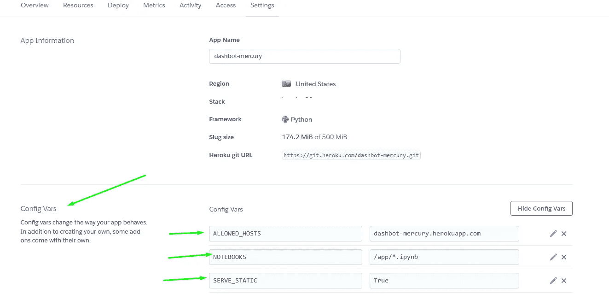

# 用几行代码将您的笔记本共享为一个网站！

> 原文：<https://blog.devgenius.io/share-your-notebook-as-a-website-in-a-couple-of-lines-cb1e9ca2d447?source=collection_archive---------7----------------------->


由[凯尔·苏杜](https://unsplash.com/@ksudu94?utm_source=unsplash&utm_medium=referral&utm_content=creditCopyText)在 [Unsplash](https://unsplash.com/collections/3494951/webiste?utm_source=unsplash&utm_medium=referral&utm_content=creditCopyText) 上拍摄的照片

# **简介**

有几个星期，当我和萨姆·查林顿一起听 TWIML 人工智能播客时，他和他的客人谈论人工智能的发展以及它如何主宰当今的商业——他的客人提到了一些与 Jupyter 笔记本电脑有关的事情；

> “如果我能在网页上分享我的笔记本，那就太棒了，因为如果我在帖子中出现小问题，我必须从头开始重做所有工作。”

他的话感动了我。如果我想和某人分享我的工作，他有调整——我必须调查我的内核，并再次开始调整我的笔记本。

对大多数读者来说听起来很痛苦，对吧！？不再是了！

Steve Nouri 先生(*in2 ity 实验室的首席数据科学家和联合创始人，AI4Diversity 的创始人*)分享了一周前的一篇帖子，阐述了一个新的框架，该框架将解决方案带给大多数数据科学家& AI 从业者，

[](https://www.linkedin.com/posts/stevenouri_innovation-artificialintelligence-datascience-activity-6888470896642785280-1D_7) [## LinkedIn 上的史蒂夫·努里:#创新#人工智能#数据科学| 60 评论| +1.1k 赞

### 轻松将您的 Python 笔记本转换为交互式 web 应用程序与他人共享笔记本。允许他们执行…

www.linkedin.com](https://www.linkedin.com/posts/stevenouri_innovation-artificialintelligence-datascience-activity-6888470896642785280-1D_7) 

哪个是 [**水星**](https://github.com/mljar/mercury) ！


图片由[皮奥特](https://github.com/pplonski)从[水星](https://github.com/mljar/mercury)拍摄

# 水星是什么？

Mercury 是一个 Web 框架，它允许你与交互工具(可选)共享你的笔记本，这些交互工具被添加到你的笔记本中，与你的变量连接，并且是免费托管的！


捕捉自[水星](http://mercury.mljar.com/)演示网站

# 如何从水星开始？

它比你想象的简单，第一；您将下载该软件包:

*   方法 01:

您可以使用`pip`命令从 PyPi 库直接安装 Mercury:

```
pip install mljar-mercury
```

*   方法 02:

从 GitHub 安装:

```
pip install -q -U git+https://github.com/mljar/mercury.git@master
```

# 让我们试一试！

1.  让我们定义一些基础知识和概念。

*   首先，您需要在您的笔记本中定义一个标题—创建标题；您需要选择单元格类型为`Row`:


由[作者](http://medium.com/@AI-Ahmed)捕获

*   其次，如果你打算使用交互工具(可选)，你需要在笔记本中定义全局变量。

此表包含一些与其`YAML`脚本相对应的交互工具，每个脚本都有一个图像&交互工具:

由[作者](https://medium.com/@AI-Ahmed)构建的表格

***注意*** *:这些不是你在 Mercury 中可以使用的唯一变量，但是我们可以使用所有基于 YAML 的工具。点击此链接查看更多可以添加到 Mercury 的工具—* [*用 YAML*](https://github.com/mljar/mercury#define-widget-with-yaml) 定义小部件

**2。构建我们的第一个本地应用程序**

*   我们将使用这个演示来构建我们的本地应用程序。

首先，我们将使用

```
git clone [https://github.com/pplonski/mercury_demo_1.git](https://github.com/pplonski/mercury_demo_1.git)
```

其次，我们将使用`requirements.text`安装先决条件

***注意事项* :** 如果您遇到了笔记本中没有显示绘图的问题，请按照 [*中的指导，在 Jupyter Lab/Jupyter Notebook*](https://github.com/plotly/plotly.py#jupyterlab-support)*中安装“plotly”扩展。*

***A .解释表头***

*   头部包含`title`、`descripion`、`show-code: False`(意思是——在笔记本中，不需要展示代码，而是在框架后台运行。)，和`params`(它包含 2 个“选择”类型参数，允许您同时选择多个选项。)


国籍参数-由[作者](http://medium.com/@AI-Ahmed)捕获


球杆参数—由[作者](http://medium.com/@AI-Ahmed)捕获

***B .上传笔记本到水星***

*   首先，您需要通过以下方式运行服务器:

```
mercury runserver --runworker
```


由[作者](http://medium.com/@AI-Ahmed)捕获

你会发现服务器是空的，它告诉你添加你的笔记本

*   其次，打开一个新的终端，通过以下方式将您的笔记本添加到 Mercury:

```
mercury add <path to notebook>
```


由[作者](http://medium.com/@AI-Ahmed)捕获

*   第三，现在刷新你的水星页的页面！


由[作者](http://medium.com/@AI-Ahmed)捕获

***C .从水星上删除笔记本***

*   您可以通过创建`createsuperuser`本地登录帐户轻松做到这一点

```
mercury createsuperuser
```


被[作者](http://medium.com/@AI-Ahmed)捕获

*   然后转到您的浏览器，在您的本地主机 URL 的末尾插入`admin`

```
[http://127.0.0.1:8000/admin](http://127.0.0.1:8000/admin)
```


由[作者](http://medium.com/@AI-Ahmed)捕获

*   登录，然后选择笔记本


由[作者](http://medium.com/@AI-Ahmed)捕获

*   选择应用程序


由[作者](http://medium.com/@AI-Ahmed)捕获

*   然后，删除


由[作者](http://medium.com/@AI-Ahmed)捕获

**3。将你的应用移植到产品中**

*   对于大多数刚刚开始数据科学或人工智能之旅的人来说，在生产中运行应用程序具有挑战性，所以 Mercury 考虑了这一点。现在，您可以将您的笔记本应用程序移植到生产环境中。

Mercury 可用于任何云提供商的生产。

目前有两种指南:

*   [AWS](https://github.com/mljar/mercury/wiki/Deploy-to-AWS-EC2)
*   [**Heroku**](https://github.com/mljar/mercury/wiki/Deploy-to-Heroku)

## **先说*Heroku***

> Heroku 是一个云平台即服务，支持多种编程语言。作为首批云平台之一，Heroku 从 2007 年 6 月开始开发，当时它只支持 Ruby 编程语言，但现在支持 Java、Node.js、Scala、Clojure、Python、PHP 和 Go。[维基百科](https://en.wikipedia.org/wiki/Heroku)

首先，你需要在 *Heroku 上[注册](https://signup.heroku.com/)才能拥有你的* `*secret key*`

其次，转到 Heroku CLI 安装 Heroku 命令行界面，这样我们就可以从终端创建我们的应用程序。

第三，准备好你的申请去 Heroku。我将部署到 Heroku 的应用程序是 [dashbot](https://github.com/AI-Ahmed/dashbot) 。


由[作者](http://medium.com/@AI-Ahmed)捕获

您可以使用以下方法克隆项目

```
git clone [https://github.com/AI-Ahmed/dashbot.git](https://github.com/AI-Ahmed/dashbot.git)
```

## **部署 Mercury Dashbot 的步骤**

1.  让我们转到项目目录，使用

```
heroku login
```

2.在 Heroku 内部创建我们的应用程序，使用

```
heroku create mercury-dashbot
```

在这一行之后，您会注意到您的应用程序已经创建了一个在特定 IPs 中可用的


由[作者](http://medium.com/@AI-Ahmed)捕获

3.现在，让我们通过以下方式获取我们的 URL

```
heroku open <link-of-app> -a <app-name>
```


由[作者](http://medium.com/@AI-Ahmed)捕获

4.现在，让我们添加我们的应用程序。

*注意:*您需要确保您已经在`.txt`文件中列出了应用程序的要求


被[作者](http://medium.com/@AI-Ahmed)捕获

5.在你的主目录中添加`.env`文件来保存你的主机和笔记本的信息

```
ALLOWED_HOSTS=mercury-dashbot.herokuapp.com
SERVE_STATIC=True
NOTEBOOKS=/app/*.ipynb
```

请将`ALLOWED_HOSTS`设置为你的应用地址。我的情况是`mercury-dashbot.herokuapp.com`。我将`NOTEBOOKS`变量设置为指向项目目录中的所有`*ipynb`文件。使用`/app/`目录是因为它是笔记本部署到 Heroku 后的路径。

6.我们需要在 Heroku dyno 中设置我们的环境变量。我们可以通过运行以下命令来实现这一点:

```
heroku config:set SERVE_STATIC=True -a <app-name>
```

7.这需要对所有变量重复进行。另一种方法是使用下面的命令从`.env`文件中设置所有的环境变量:

```
heroku config:set $(cat .env | sed '/^$/d; /#[[:print:]]*$/d') -a <app-name>
```

*注意:您也可以使用仪表板设置*添加变量



由[作者捕获](http://medium.com/@AI-Ahmed)

8.在部署之前，我们需要创建`Procfile`来告诉 Heroku 如何运行 Mercury。它将有一行:

```
web: mercury runserver --runworker 0.0.0.0:$PORT
```


由[作者捕获](http://medium.com/@AI-Ahmed)

9.现在就来部署整个 app 吧！

*   创建新的 Git 存储库

在新的或现有的目录中初始化 git 存储库

```
cd my-project/
git init
heroku git:remote -a <app-name>
```

*   部署应用程序

将您的代码提交到存储库，并使用 Git 将其部署到 Heroku。

```
git add .
git commit -am "deploy my application"
git push heroku master
```

## 应用


由[作者捕获](http://medium.com/@AI-Ahmed)

为了测试这个项目，您会在这里找到这一行:[https://dashbot-mercury.herokuapp.com/](https://dashbot-mercury.herokuapp.com/)

## 对于管理面板

要访问 Mercury 中的管理面板，您需要在`.env`文件中定义另外三个变量:

```
DJANGO_SUPERUSER_USERNAME=your_user_name
DJANGO_SUPERUSER_PASSWORD=your_secret_password
DJANGO_SUPERUSER_EMAIL=your_email
```

请用`heroku config:set`命令将上述内容添加到`.env`和 Heroku。

*注意:在将* `*.env*` *文件推送到 master 时，请确保不要将其添加到 app 目录中。*

## 姜戈秘钥

*   为了更好的安全性，请在`.env`文件中设置您的 SECRET_KEY 并将更改应用到 Heroku。

```
SERVE_STATIC=False
DJANGO_SUPERUSER_USERNAME=username
DJANGO_SUPERUSER_PASSWORD=password
DJANGO_SUPERUSER_EMAIL=emailaddress@host.com
SECRET_KEY="x3%q8fs(-q3i(m&=e1g%9xtvcn*q!c%i@v0*ha4@ow2crdktpw"
```

您可以使用以下命令生成`SECRET_KEY`:

```
python -c ‘from django.core.management.utils import get_random_secret_key; \
 print(get_random_secret_key())’
```

最后，数据科学和人工智能现在是该行业最有潜力的工作之一。拥有一个框架，可以方便地分享你激动人心的笔记本，不仅如此，通过交互，工具是一种摆脱解雇的东西，每个数据科学家和人工智能从业者都在寻找类似的东西来分享他们的新策略和想法。

现在就迈出这一步，试试 Mercury，用几行代码建立你的网站！

# 参考

*   [https://github.com/mljar/mercury](https://github.com/mljar/mercury)
*   [水星(piotr-data-science-portfolio.herokuapp.com)](http://piotr-data-science-portfolio.herokuapp.com/)
*   [https://github.com/mljar/mercury/wiki/Deploy-to-Heroku](https://github.com/mljar/mercury/wiki/Deploy-to-Heroku)
*   [https://devcenter.heroku.com/articles/heroku-cli-commands](https://devcenter.heroku.com/articles/heroku-cli-commands)