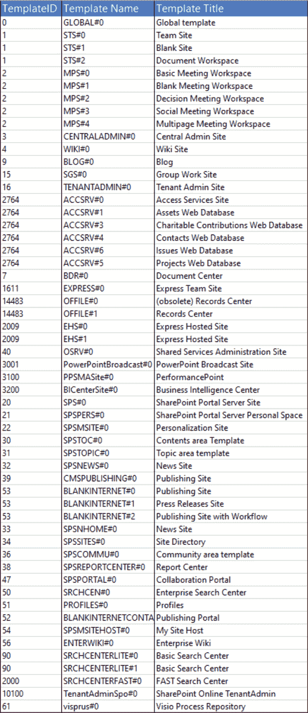

# SharePoint 网站模板

> 原文：<https://blog.devgenius.io/sharepoint-site-templates-c7f9f3e70b0b?source=collection_archive---------3----------------------->


如果您想使用**客户端对象模型**创建一个新的 SharePoint 站点，您可以使用类 **WebCreationInformation** 来指定站点的属性，然后通过将站点添加到 web 来创建它。

但是，需要传递一个唯一的**模板类型**作为参数。此参数是一个字符串，必须与可用模板的名称之一匹配。

要获得所有可用模板的列表，您可以在 PowerShell 中运行命令 **Get-SpoWebTemplate** 。下表概述了所有可用的模板。



作为微软**包中包含的库。SharePointOnline.CSOM** 没有为可用模板提供任何枚举器。我创建了下面的代码片段。

```
using System.Runtime.Serialization; namespace SharePoint.Models
{
    public enum WebTemplate
    {
        [EnumMember(Value = "GLOBAL#0")]
        GlobalTemplate,
        [EnumMember(Value = "STS#0")]
        TeamSite,
        [EnumMember(Value = "STS#1")]
        BlankSite,
        [EnumMember(Value = "STS#2")]
        DocumentWorkspace,
        [EnumMember(Value = "MPS#0")]
        BasicMeetingWorkspace,
        [EnumMember(Value = "MPS#1")]
        BlankMeetingWorkspace,
        [EnumMember(Value = "MPS#2")]
        DecisionMeetingWorkspace,
        [EnumMember(Value = "MPS#3")]
        SocialMeetingWorkspace,
        [EnumMember(Value = "MPS#4")]
        MultipageMeetingWorkspace,
        [EnumMember(Value = "CENTRALADMIN#0")]
        CentralAdminSite,
        [EnumMember(Value = "WIKI#0")]
        WikiSite,
        [EnumMember(Value = "BLOG#0")]
        Blog,
        [EnumMember(Value = "SGS#0")]
        GroupWorkSite,
        [EnumMember(Value = "TENANTADMIN#0")]
        TenantAdminSite,
        [EnumMember(Value = "ACCSRV#0")]
        AccessServicesSite,
        [EnumMember(Value = "ACCSRV#1")]
        AssetsWebDatabase,
        [EnumMember(Value = "ACCSRV#3")]
        CharitableContributionsWebDatabase,
        [EnumMember(Value = "ACCSRV#4")]
        ContactsWebDatabase,
        [EnumMember(Value = "ACCSRV#6")]
        IssuesWebDatabase,
        [EnumMember(Value = "ACCSRV#5")]
        ProjectsWebDatabase,
        [EnumMember(Value = "BDR#0")]
        DocumentCenter,
        [EnumMember(Value = "EXPRESS#0")]
        ExpressTeamSite,
        [EnumMember(Value = "OFFILE#1")]
        RecordsCenter,
        [EnumMember(Value = "EHS#0")]
        ExpressHostedSite,
        [EnumMember(Value = "OSRV#0")]
        SharedServicesAdministrationSite,
        [EnumMember(Value = "PowerPointBroadcast#0")]
        PowerPointBroadcastSite,
        [EnumMember(Value = "PPSMASite#0")]
        BusinessIntelligenceCenter,
        [EnumMember(Value = "SPS#0")]
        SharePointPortalServerSite,
        [EnumMember(Value = "SPSPERS#0")]
        SharePointPortalServerPersonalSpace,
        [EnumMember(Value = "SPSMSITE#0")]
        PersonalizationSite,
        [EnumMember(Value = "SPSTOC#0")]
        ContentsAreaTemplate,
        [EnumMember(Value = "SPSTOPIC#0")]
        TopicAreatemplate,
        [EnumMember(Value = "SPSNEWS#0")]
        NewsSite,
        [EnumMember(Value = "CMSPUBLISHING#0")]
        PublishingSite,
        [EnumMember(Value = "BLANKINTERNET#0")]
        PublishingSiteBlank,
        [EnumMember(Value = "BLANKINTERNET#1")]
        PressReleasesSite,
        [EnumMember(Value = "BLANKINTERNET#2")]
        PublishingSiteWithWorkflow,
        [EnumMember(Value = "SPSNHOME#0")]
        NewsHomeSite,
        [EnumMember(Value = "SPSSITES#0")]
        SiteDirectory,
        [EnumMember(Value = "SPSCOMMU#0")]
        CommunityAreaTemplate,
        [EnumMember(Value = "SPSREPORTCENTER#0")]
        ReportCenter,
        [EnumMember(Value = "SPSPORTAL#0")]
        CollaborationPortal,
        [EnumMember(Value = "SRCHCEN#0")]
        EnterpriseSearchCenter,
        [EnumMember(Value = "PROFILES#0")]
        Profiles,
        [EnumMember(Value = "BLANKINTERNETCONTAINER#0")]
        PublishingPortal,
        [EnumMember(Value = "SPSMSITEHOST#0")]
        MySiteHost,
        [EnumMember(Value = "ENTERWIKI#0")]
        EnterpriseWiki,
        [EnumMember(Value = "SRCHCENTERLITE#0")]
        BasicSearchCenter,
        [EnumMember(Value = "SRCHCENTERFAST#0")]
        FastSearchCenter,
        [EnumMember(Value = "TenantAdminSpo#0")]
        SharePointOnlineTenantAdmin,
        [EnumMember(Value = "visprus#0")]
        VisioProcessRepository,
    }
}
```

为了访问 **EnumMember** 属性，我们必须使用下面的 Enum 扩展方法。

```
using System;
using System.Linq;
using System.Runtime.Serialization;
using System.Reflection;
using System.ComponentModel; namespace SharePoint.Extensions
{
    public static class EnumExtensions
    {
        public static string GetMemberAttributeValue(this Enum source)
        {
            Type enumType = source.GetType();
            if (!enumType.IsEnum)
            {
                throw new ArgumentException("source must be an enumerated type");
            }
 var memInfo = enumType.GetMember(source.ToString());
            var attr = memInfo.FirstOrDefault()?.GetCustomAttributes(false).OfType<EnumMemberAttribute>().FirstOrDefault();
            if (attr != null)
            {
                return attr.Value;
            }
            return null;
        }
    }
}
```

现在，使用以下代码在 SharePoint 上创建一个新网站就足够了:

```
WebCreationInformation webCreationInfo = new WebCreationInformation
{
  Title = "Title",
  Url = "url",
  WebTemplate = WebTemplate.ExpressTeamSite.GetMemberAttributeValue(),
  Description = "Description",
  UseSamePermissionsAsParentSite = true
};ctx.Site.RootWeb.Webs.Add(webCreationInfo);
ctx.ExecuteQuery();
```