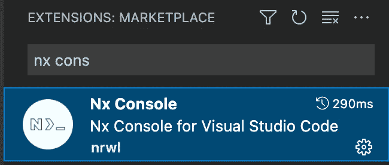
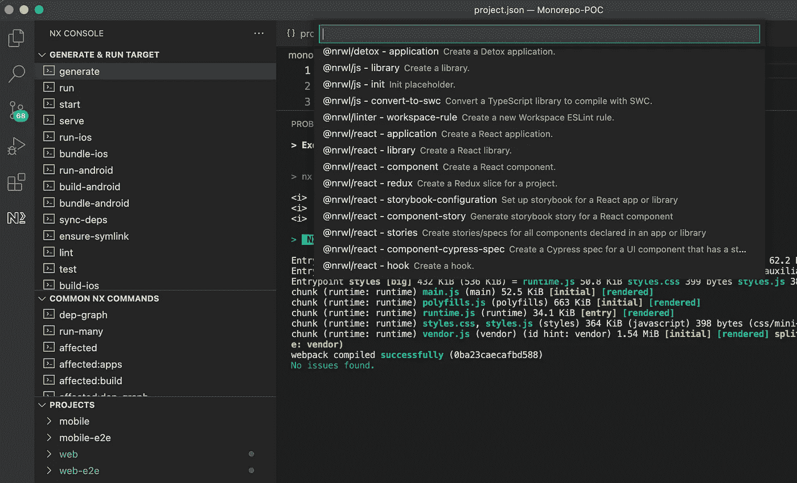
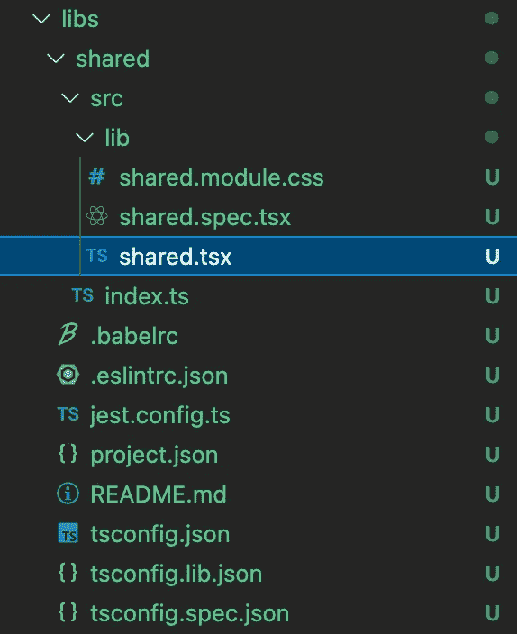

# 使用 Nx 在 ReactJS 和 React Native 之间共享代码。

> 原文：<https://blog.devgenius.io/sharing-code-between-reactjs-and-react-native-using-nx-9b22751f5a39?source=collection_archive---------1----------------------->

Monorepo 是维护大型项目和在多个项目之间共享公共代码/逻辑的一种方便而有用的技术。

在本文中，我们将使用 Nx 工具创建 monorepo。

在 ReactJS 和 React Native 内共享代码的第一步是创建一个工作区。

创建 nx 工作空间的命令是

```
npx create-nx-workspace name-of-the-workspace
```


在下一步中，我们将获得一个选项来选择我们希望在工作区中使用的应用程序类型。我首先创建一个 React 本地项目，然后将创建一个 ReactJS 项目。

选择应用程序时，它会询问应用程序的名称。我将 React-native 应用程序命名为“移动”，将 ReactJS 应用程序命名为“web”。


工作区现在创建完毕。在下图中，我们可以看到名为 monorepo-nx 的工作区，其中包含一个应用程序文件夹。我们将把 React-native 和 ReactJS 项目放在 apps 文件夹下，并将公共代码放在 libs 文件夹中。


现在，是时候创建我们的 **ReactJS** 应用程序了。命令是

```
npx nx g @nrwl/react:app name-of-reactjs-app
```


现在，它将在我们工作区的 apps 文件夹下创建一个名为 web 的 **ReactJS** 应用程序。我们也可以使用 NX 控制台来实现这一点。


为了简化使用 Nx workspace 的工作，我们可以做的下一件事是安装 Nx Console extension for Visual Studio 代码。



使用 NX 控制台，我们可以轻松地运行、构建、服务和部署我们的代码，而无需记住确切的命令。

我们可以使用 NX 控制台轻松运行我们的 web 或移动应用程序，只需右键单击项目名称，然后从提供的选项中选择 Nx run。


我们可以选择是构建还是服务于我们的项目。在这里，我选择了 serve 来执行命令 **nx run web:serve** 。请注意，我们也可以从我们的终端运行命令 **nx run web:serve** 。


我们的 web 应用程序现在运行在 [http://localhost:4200/。以同样的方式，我们可以运行我们的 react 本地应用程序。](http://localhost:4200/.)

现在我们将创建一个库来保存我们的公共代码。

为了创建一个库，我再次使用 NX 控制台。点击 generate，它会给我们提供一个我们可以生成的东西的列表。从这里开始，我要选择@nrwl/react — library。



一旦我们选择了库选项，我们将得到一个表单来填写关于我们想要创建的库的信息，如库的名称，使用的样式，linter 等。我已经将我的库命名为 shared，并提供了导入路径 [@nx/shared](http://twitter.com/nx/shared) 。此名称( [@nx/shared](http://twitter.com/nx/shared) )将用于导入 web 和移动应用中的共享代码。

在 libs 文件夹下，我们现在可以看到我们新创建的库“共享”。我们现在将对 **shared.tsx** 进行修改，并将该代码用于 ReactJS 和 React Native app。



我选择使用 monorepo 的一个主要原因是为了在 ReactJS 和 React Native app 之间共享 API 调用代码。

我在例子中使用的是 https://jsonplaceholder.typicode.com/posts/1[的](https://jsonplaceholder.typicode.com/posts/1) api。


现在，让我们创建一个 getPosts() api 调用函数来调用 https://jsonplaceholder.typicode.com/posts/1 的。一旦我们的函数准备就绪，我们现在将在 React Native 和 ReactJS 应用程序中导入该函数。


我们可以看到，我们正在使用 import {getPosts}从“@nx/shared”导入共享库中的 getPosts 函数。

现在，如果我们运行 web 和移动应用程序，我们将在两者中看到相同的输出。


ReactJS 应用


React 本机应用程序

就是这样。