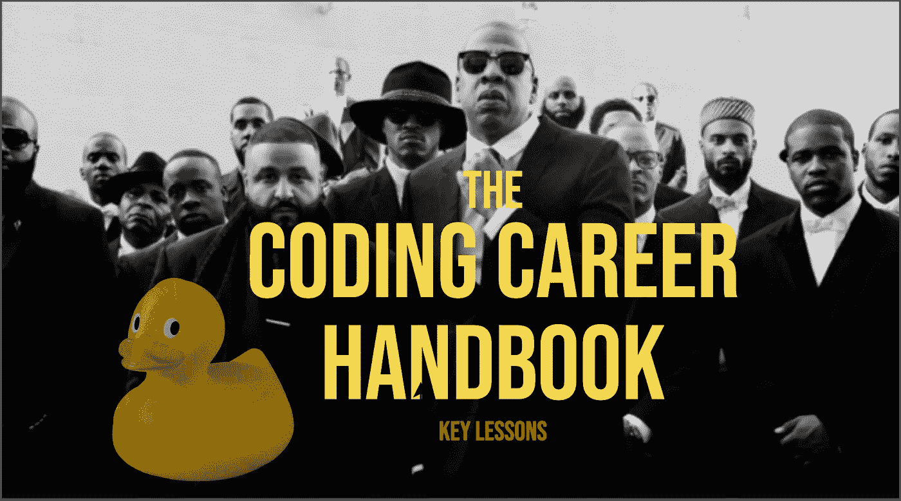
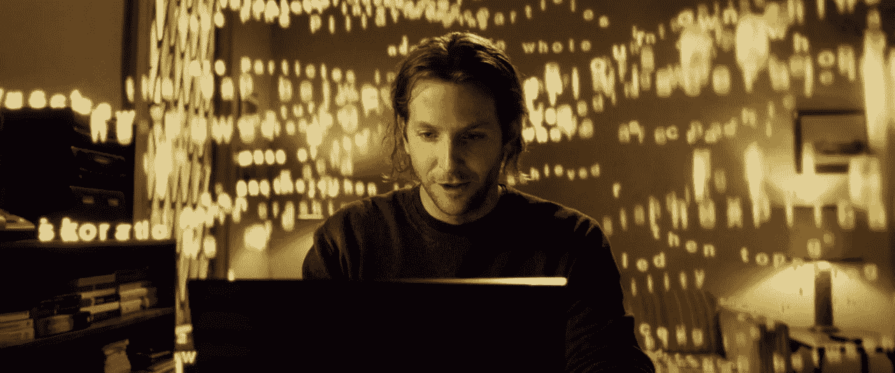
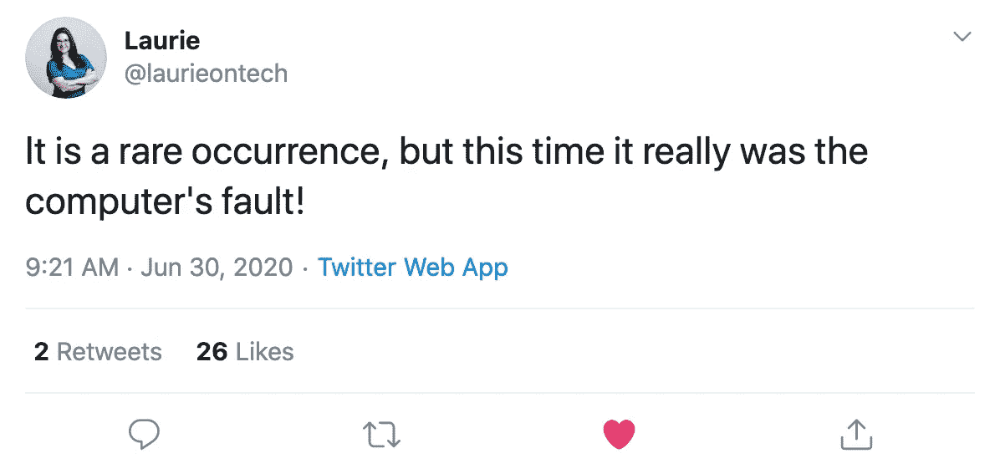
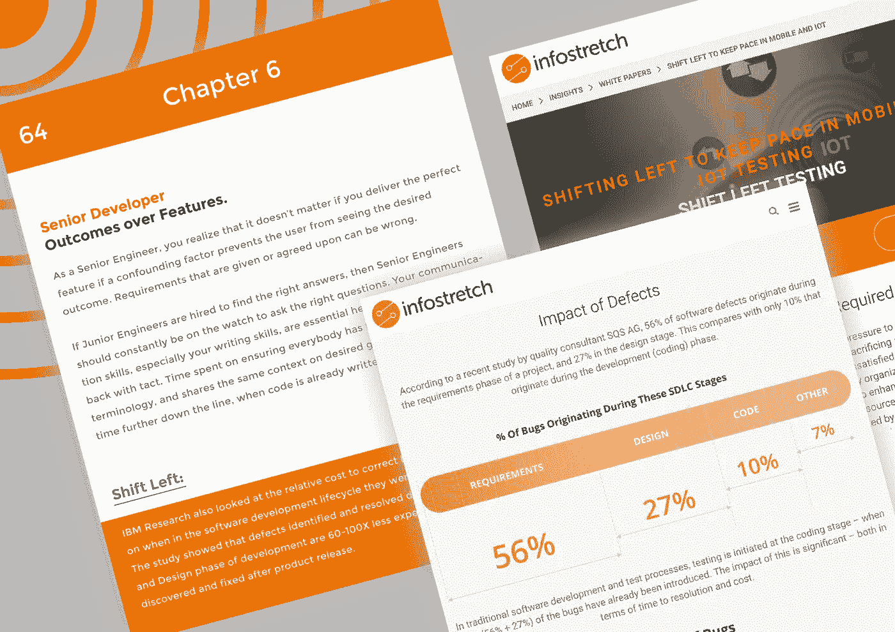
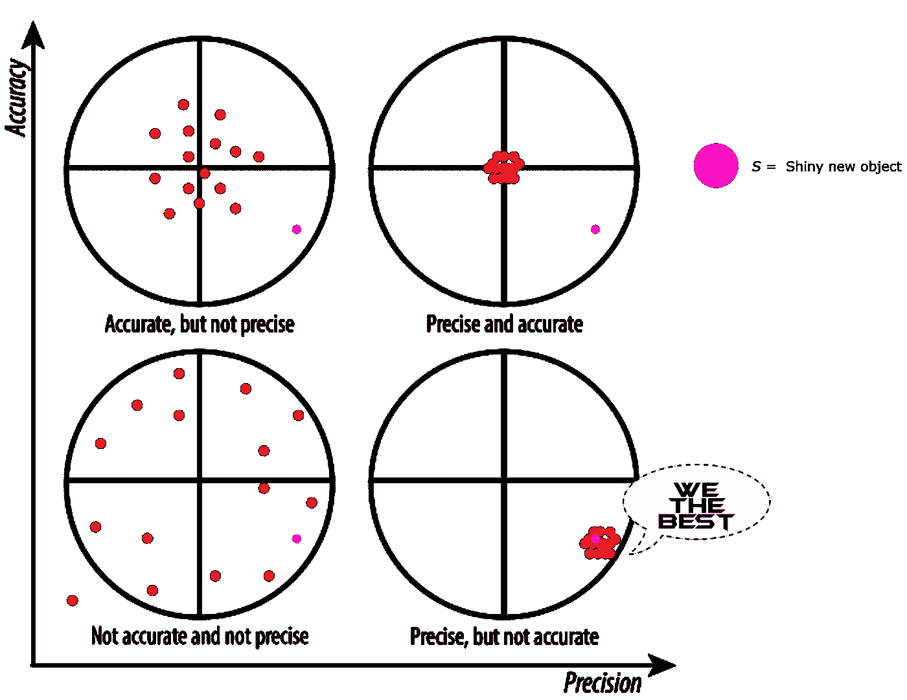

# 磨砺初级开发人员——这本手册值得你花费时间吗？

> 原文：<https://blog.devgenius.io/sharpening-the-junior-developer-is-this-handbook-worth-your-time-13d74c244ee0?source=collection_archive---------20----------------------->



[draw.io](https://app.diagrams.net/) 中的 Photoshopping 比听起来要难。

[编码职业](https://www.learninpublic.org/)这本书服务于一个目标，那就是**获得软件工作并在这方面表现出色。**你已经看过很多关于职业建议、谈判或典型的“*做好 5 件事”的博客。这不是一本职业建议书。它挤满了来源，引文，报价，并始终如一地向你介绍的东西，否则将需要多年来学习。*

> “这本书将帮助你聪明地工作。你能有多努力工作最终取决于你自己。正如肖恩很快指出的那样，这是一场马拉松，而不是短跑。所以，调整好自己的节奏。”
> 
> — [昆西·拉森](https://medium.com/u/17756313f41a?source=post_page-----13d74c244ee0--------------------------------)([自由代码营](https://medium.com/u/8b318225c16a?source=post_page-----13d74c244ee0--------------------------------)的创始人)



我是盲目的，但现在我看到了——无限的 2011 年

下面是我在阅读这本书时强调的许多事情之一。至少，我强烈建议你看一下目录！

## 在公共场合学习

我们一生中的大部分时间都在私下学习和训练。无论是在学校、sat、健身房还是大学……这种模式最终也会转移到工作场所。

不幸的是，有许多技术熟练的工程师在他们的职业生涯中把他们所有的专业知识都藏在脑子里。当你“在公共场合学习”时，你极大地提高了你的学习速度，扩大了你的人际网络，同时最终……建立了一个(很快)很棒的职业生涯。

你是怎么做到的？一种形式可能涉及写博客或者直播编程，回答 Stackoverflow 问题，没关系。重要的是你正在公开制作有意义的内容。你希望找到的内容。

这一章更深入，但关键是当你在公共场合学习时，你有优势:

*   吸引在线技术社区
*   接受合作者、前辈等的指导。
*   学得更快

“学得更快”可能听起来很迟钝，但是可以这样想；你认为到年底谁会有更好的体格？超重的人 **A** ，每周在地下室锻炼 3-5 天……**或**超重的人 **B** ，每周在当地健身房锻炼 3-5 天**和**参加每月一次的月度健身房挑战？

## 了解您的工具



我们都经历过，劳里，别担心。

了解你的工具和非常了解你的工具之间的差别是巨大的！

对 GIT、bash(或者你使用的任何东西)之类的工具的熟练程度，以及对幕后的了解，对于开发人员来说可能是一个范式的转变。下面这段代码我都不记得看过多少遍了:

```
app.get('/', (req, res) => {
  // ...
});
```

我没有质疑`req`和`res`到底是从哪里来的……结果，我基本上妨碍了自己探索和调试节点的 I/O。

每天都有闪亮的新东西出现，知道什么时候拿起工具，什么时候不拿需要技巧；Shawn 在接下来的章节中清楚地说明了这一点！

投资于你和你的雇主已经在使用的工具可以获得很多。

## 高级工程师和业务影响

随着你的职业生涯开始步入正轨，你会发现有比代码更重要的东西。纵观整本书，很明显，15 英寸屏幕之外还有各种有影响力的特征。这些品质之一就是高级工程师的*感*的***大局观。***

换句话说，*，*代码和系统如何能推动公司盈利！肖恩在这一章说得很好。



**注:**左边的那一页并不是这本书的实际设计

正如我之前提到的，这本书最大的好处之一是第一手和第二手资料，故事——甚至推特——来提供策展和背景。

## 足够好>最好

够好就是… *够好*。让我说清楚；这并不意味着**而不是**仅仅因为*足够好*就交付稍微差一点的代码。

要明白，沉迷于微不足道的基准，渴望最新最好的是极其低效的。你想让某个随机的聚会来试着告诉你谁和什么最棒**到底是什么吗？地狱没有，相反，“ ***你收回自己的代理权。*****

**成为“最佳寻求者”的最大副作用是会带来虚假的自信。因为精确的度量标准而加入*潮流*并不自动等同于更好的结果。**

****

**第四象限展示了假精度是如何误导人的，正如它是有害的一样**

> **“寻求近似正确与精确错误的对比。**

## **回顾**

**没有人会像你一样投入你的事业。这个行业总能从更有思想、更有战略眼光的工程师那里受益。编码职业的设计是为了让你在行业中度过青少年时期。**

**非常感谢 [Swyx](https://medium.com/u/547f259e265e?source=post_page-----13d74c244ee0--------------------------------) (肖恩)编写了为数不多的**—**本没有更好的词来形容的从初级到高级书籍之一！另外，对[react flux 社区](https://www.reactiflux.com/)的一贯支持和邀请 kickass 工程师表示感谢！**

**[**在这里买书！**](https://swyx.podia.com/coding-career-handbook/s3m0e)**