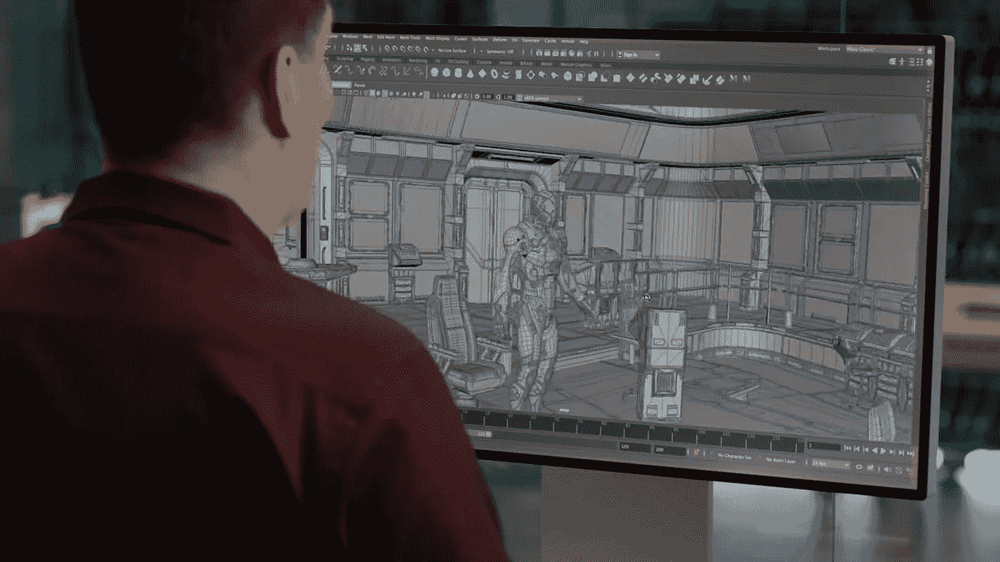
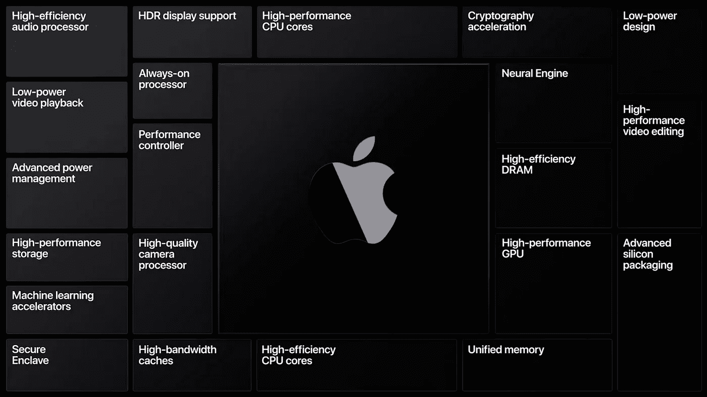

# 修卡，苹果仍然讨厌开发者

> 原文：<https://blog.devgenius.io/shocker-apple-still-hates-developers-b9a3b62d817?source=collection_archive---------9----------------------->

剪辑自 [WWDC](https://www.youtube.com/watch?v=GEZhD3J89ZE)

苹果有史以来第一次在线全球开发者大会(WWDC)于本周举行，并推出了苹果软件的下一阶段。给 IOS 阵容带来了巨大的变化，给 macOS 带来了有问题的决定。然而，最大的变化是他们决定将最新的 MacBook 系列带到苹果芯片上。这对消费者来说是个好消息，但对开发者来说却是令人讨厌的。

就其平台上的开发者而言，苹果最近并没有最热门的记录。2018 年的 WWDC 宣布 macOS 支持流行的图形 API OpenGL，支持苹果更传统的金属框架。这对于他们今年转向 ARM 架构是完全必要的——我想这是一个恰当的警告。由于苹果决定的复杂性，这个决定已经让开发者放弃了这个平台。对于希望在 macOS 平台上提供游戏的独立开发者来说，游戏在 macOS 平台上的可持续性几乎是不可能的。这是因为确保游戏正常运行的人力不值得投入时间。

ARM 芯片组的转变将是开始向更高效的未来发展的必要条件。程序员将不得不开始开发能够支持芯片组的二进制文件——这一点我们都已经知道有一段时间了。尽管如此，向 ARM 的转移将有助于开发人员在其应用程序中实现更高的性能。

剪辑自 [WWDC](https://www.youtube.com/watch?v=GEZhD3J89ZE)

> **现在，黑暗面**

苹果公司想为他们的设备创造一个有围墙的软件花园。如果他们控制了芯片，并规定哪些框架可以在他们的平台上使用，哪些不可以，他们就可以隔离他们平台上允许的东西。例如，一家小型企业花费人力创建了一个功能齐全的应用程序，并希望将其放在 app store 上。顺便说一句，为了让那个应用程序符合苹果已经发出的规范，似乎没有人知道，他们将不得不耐心等待苹果漫长而有力的提交期，他们很可能会发现一些错误，导致你再次经历循环。我们看到苹果在 2019 年底这样做，当时他们出于隐私考虑，拒绝使用电子应用。对于一家有固定启动窗口的初创公司来说，这可能是生死攸关的事情。苹果没有与开发者合作解决他们的问题，相反，如果他们看不到他们产品的价值，他们就会停止使用他们的产品，这令人惊讶，没有应用程序的人可以在应用商店获得巨大的折扣

**“开发者在第一个订阅年赚取 70%的订阅销售额，苹果收取 30%的佣金。”-** [**苹果**](https://www.apple.com/ios/app-store/principles-practices)

应该注意的是，这种佣金也发生在应用内购买中。所有这一切都是讽刺的，考虑到这是在同一个页面上，他们的应用商店是一个欢迎竞争的。令人难以置信的是，像苹果这样的垄断企业是如何被允许以目前的形式存在的。尤其是当他们建造了一个有围墙的花园，然后拒绝帮助任何人进入。

按照苹果目前分解为苹果生态系统创造有意义的体验的速度，开发者应该对花费任何时间为平台创造代码保持警惕。**我在 2019 年的 MacBook Pro 上写这篇文章时这么说，这肯定会是我拥有的最后一款苹果产品，但即使是为该平台编译代码也是必要的。缺乏适当的 GPU 支持、开发者支持和整体商业模式只是为什么苹果不应该被信任进行开发的叠加因素。如果你不是财富 500 强公司，他们不会关心你。当苹果公司生产有意义的产品时，他们的市场理念却如此平庸，这很令人失望。虽然，如果人们不被允许为产品创造有意义的体验，那么最初制造产品的目的是什么。**

 [## 在 OpenGL 中完成游戏

### 这个简单但令人恼火的滑动拼图帮我解决了很多挫折。

medium.com](https://medium.com/dev-genius/completing-a-game-in-opengl-f4421f069fce)  [## 你应该预测到 Youtube 电视的价格上涨

### 价格上涨反映了一个更深层次的问题

link.medium.com](https://link.medium.com/JFS2tBLQQ7)