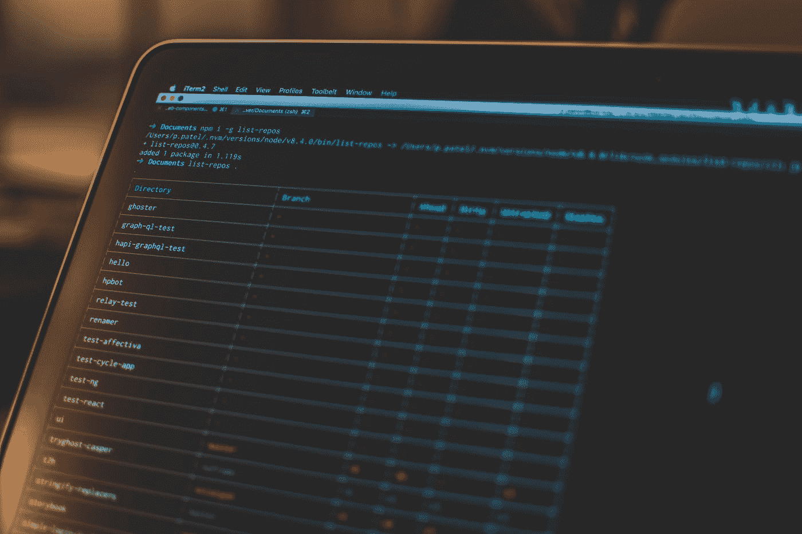

# Shopify —主题开发工作流程

> 原文：<https://blog.devgenius.io/shopify-theme-development-workflow-383ed529dd4d?source=collection_archive---------5----------------------->

我有一个 Shopify 网店([http://kleirantwerp.be/](http://kleirantwerp.be/))已经 3 年了。我真的很喜欢它的工作方式。对于没有任何网上商店知识的人来说，创建一个惊人的、易于维护的网上商店是非常容易的。同时，如果你有任何开发背景，也很容易定制你的网上商店的外观和感觉。



[潘卡杰·帕特尔](https://unsplash.com/@pankajpatel?utm_source=medium&utm_medium=referral)在 [Unsplash](https://unsplash.com?utm_source=medium&utm_medium=referral) 上的照片

今天，我想告诉你我是如何处理我的 Shopify 网络商店的开发流程的。我并不是说这是唯一和/或最好的方法。这正是我喜欢做的方式。

# 主题工具包

Shopify 构建了一个自定义的 CLI 来本地管理您的主题。它允许你下载/上传你改变的主题，甚至创建一个新的主题。通常，您会安装 CLI 并下载想要编辑的主题。修改后，你可以将主题部署到 Shopify。

更多信息可以在这里找到:[https://shopify.github.io/themekit/](https://shopify.github.io/themekit/)

# 开源代码库

我有一个私人的 Github 存储库，保存着我的网店的所有源文件。在这个 repo 中，我有一个 *deploy.yml* [工作流](https://docs.github.com/en/actions/configuring-and-managing-workflows/configuring-a-workflow)，它将通过使用 themekit CLI 自动将我的推送(和更改)代码部署到我的 live 网站。

我使用 [action-shopify repo](https://github.com/pgrimaud/action-shopify) 将我的主题部署到 shopify。这是我的 deploy.yml 文件

```
name: Shopify Theme deploy

# Controls when the action will run. Triggers the workflow on push or pull request
# events but only for the master branch
on:
  push:
    branches: [ master ]

# A workflow run is made up of one or more jobs that can run sequentially or in parallel
jobs:
  # This workflow contains a single job called "build"
  build:
    # The type of runner that the job will run on
    runs-on: ubuntu-latest
    # Steps represent a sequence of tasks that will be executed as part of the job
    steps:
      - uses: actions/checkout@v1
      - name: Shopify
        uses: pgrimaud/action-shopify@master
        env:
          SHOPIFY_PASSWORD: ${{ secrets.SHOPIFY_PASSWORD }}
          SHOPIFY_STORE_URL: ${{ secrets.SHOPIFY_STORE_URL }}
          SHOPIFY_THEME_ID: ${{ secrets.SHOPIFY_THEME_ID }}
          THEME_PATH: ${{ secrets.THEME_PATH }}
```

env 变量是 Github 内部的秘密。每当我按下主控按钮，工作流就会被触发。它启动了一个 linux 虚拟机，其中主题 CLI 被用来将我的主题部署到正确的 Shopify 商店，由 Github secrets 管理。

# 缺点

总的来说，我真的很喜欢这种工作方式。当我不得不测试小的变化或错误时，我仍然在本地使用主题 CLI。

我遇到的唯一缺点是，我没有能力在本地或任何类型的开发环境中测试我的更改。但这正是我们依赖 Shopify 的原因:)

感谢阅读。