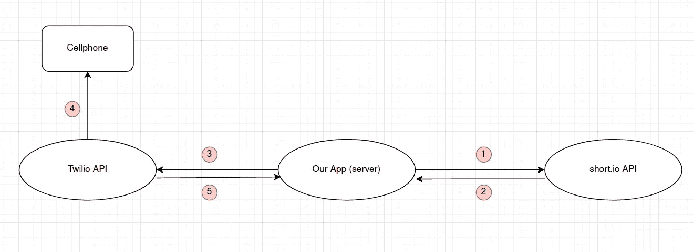
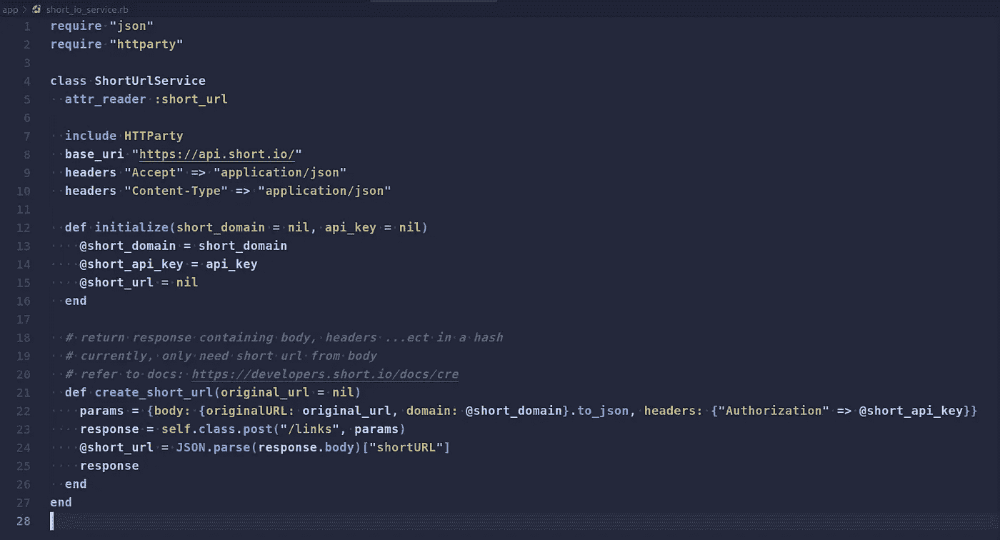
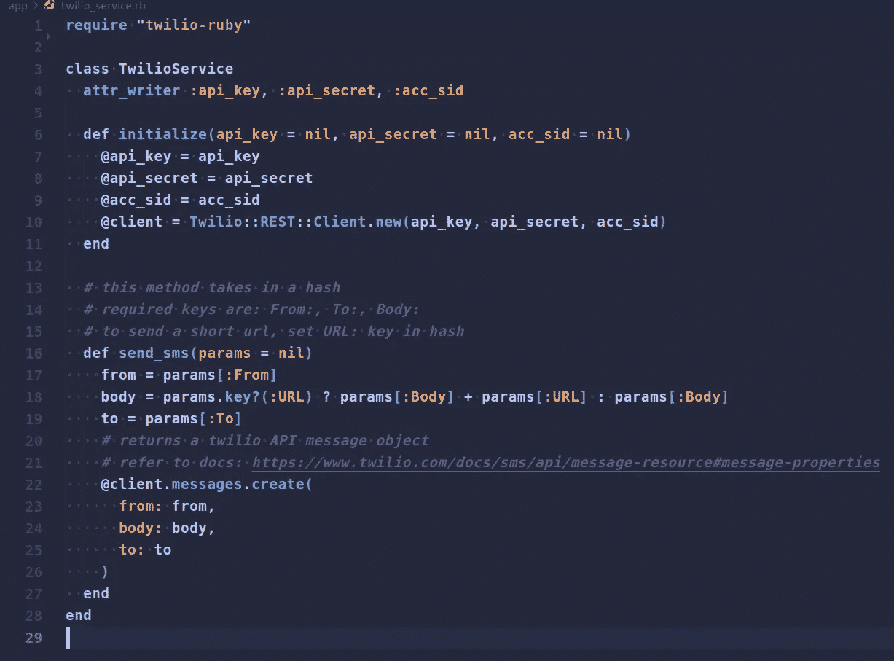
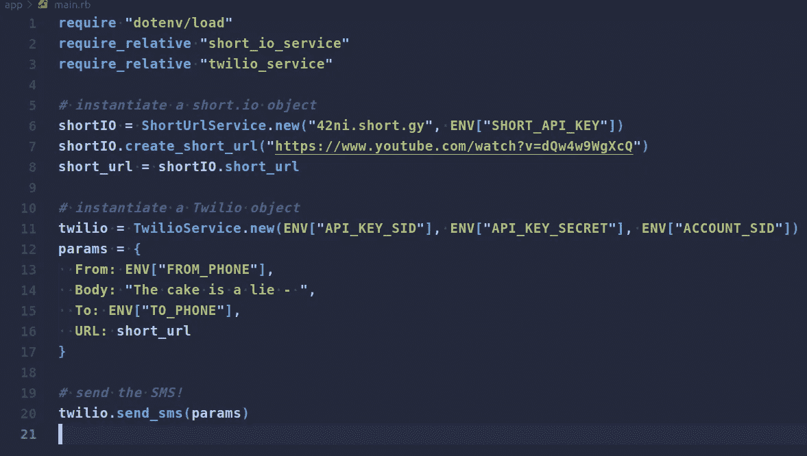
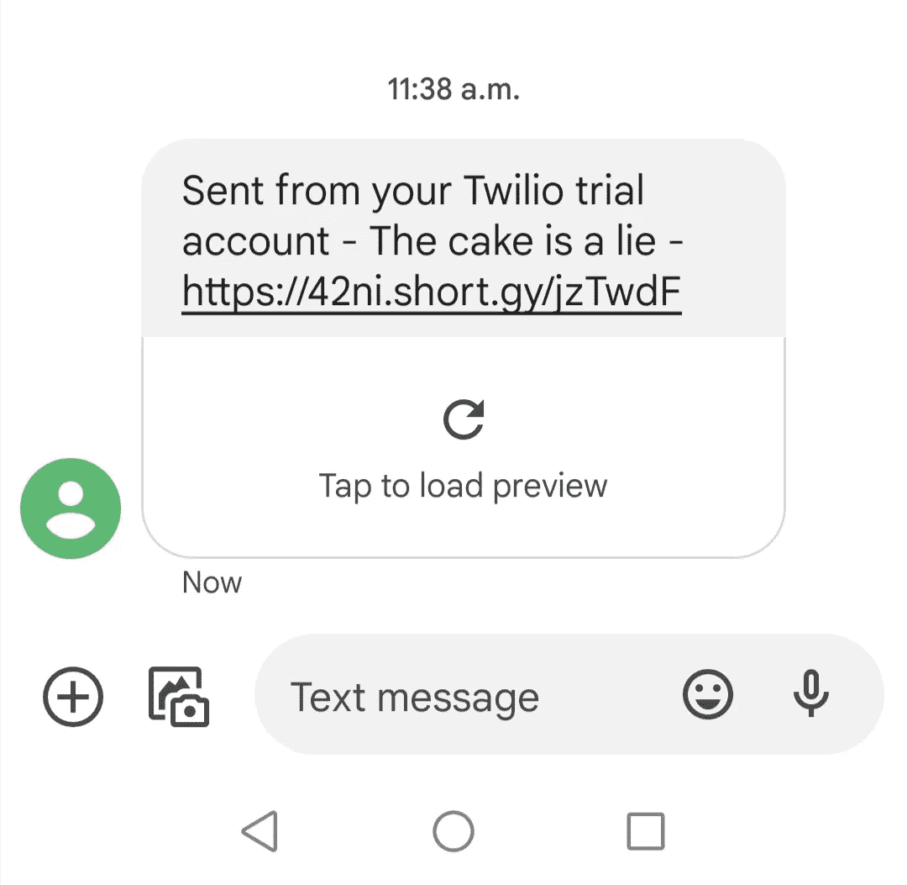

# Short.io 与 Twilio — Ruby 应用程序的集成

> 原文：<https://blog.devgenius.io/short-io-integration-with-twilio-ruby-app-6fa005f60e46?source=collection_archive---------15----------------------->

Twilio 是一种用于发送短信的流行服务。有时需要在这些消息中发送 URL 然而，这些网址会很快变长，所以人们喜欢在发送短信之前使用网址缩写服务来缩短网址。Short.io 是一个**品牌的**网址缩写服务。**无品牌的** URL(即 Bitly、TinyURL 和其他)是有风险的，因为一些移动运营商(威瑞森👀我看你)会**屏蔽包含无品牌短链接的短信**。

在本指南中，我们将通过一种方法来集成 short.io 和 Twilio，以发送带有短链接的 SMS 消息。代码示例是使用 vanilla Ruby 完成的；然而，这些方法也可以被带到一个 **Rails 应用**中。


照片由[Adem may](https://unsplash.com/@ademay?utm_source=medium&utm_medium=referral)在 [Unsplash](https://unsplash.com?utm_source=medium&utm_medium=referral) 上拍摄

# **高级概述**

解释程序架构的图表。



Twilio — short.io 与 Ruby App 的集成

1.  我们的服务器向 short.io API 发送包含原始 URL 的 **POST** 请求
2.  short.io 发送回一个包含短 URL 等信息的响应
3.  我们的服务器向 Twilio 发送一个 **POST** 请求，其中包含发送方号码、接收方号码和 SMS 消息(带有短 url)等信息
4.  Twilio API 服务器将尝试向接收方的手机发送短信
5.  Twilio 向我们的服务器发回一个响应，指示成功或失败

# **第三方宝石“必需”**

实际上，这个实现并不真正“需要”第三方 gem。以下这些宝石将使开发变得更简单。

1.  httparty:让网络请求变得更简单、更干净。像其他许多宝石一样，这个宝石为 Ruby 中内置的 **Net::HTTP** 类提供了一个包装。
2.  twilio-ruby:由 twilio 创建的帮助函数库，帮助开发者更容易地使用 Twilio 的 API
3.  我使用这个 gem 来创建一个. env 来存储/访问 API 凭证

# **构建请求**

与 API 通信本质上就是发送带有正确标题的请求并期待响应。下表显示了如何构造对 short.io 的请求


简称 io 的请求结构

从[这里](https://developers.short.io/docs/cre)获取你的 short.io API 密匙。对于几何体，表中仅列出了所需的参数。点击这里查看更多[选项](https://developers.short.io/reference/linkspost)。

使用 twilio-ruby gem 的美妙之处在于，它允许我们绕过配置和直接与网络请求及其报头交互的折磨。这让我们可以专注于更重要的事情，如设置身体。不过，如果你想手动做事，我也提供了下面的表格。


Twilio 的请求结构

这里的授权使用[基本授权](https://en.wikipedia.org/wiki/Basic_access_authentication)。请务必在此处获得您的 Twilio 证书[。注意:我们使用选项 2 (API 密钥)。这个选项比使用主密钥的第一个选项安全得多，因为您可以创建多个 API 密钥，如果它们被破坏，您可以撤销它们。](https://www.twilio.com/docs/usage/requests-to-twilio#credentials)

[这里的](https://www.twilio.com/docs/sms/api/message-resource#create-a-message-resource)是你也可以传递的可选身体参数列表。

好戏开始了。我们现在会看到很多代码，但是不要担心。我会边走边解释。我使用类是因为它给了我们在未来通过添加更多方法来扩展 short.io 和 Twilio 服务的灵活性(也许我想处理语音呼叫)。

# **Short.io 类**



short.io 类

```
require "json"
require "httparty"
```

需要宝石。httparty 用于处理网络请求，json 用于转换/解析请求体和响应。(还记得 **Content-Type** 头被设置为 json 吗？？？)

```
attr_reader :short_url
```

设置一个名为 short_url 的实例变量来存储我们的短 url，并将其设为只读。

```
include HTTParty
base_uri "https://api.short.io/"
headers "Accept" => "application/json"
headers "Content-Type" => "application/json"
```

包括 HTTParty 模块和 set 头。诸如 base_uri、headers…等方法是 HTTParty 的一部分。因此，我们需要将它包含在我们的课程中。

```
def initialize(short_domain = nil, api_key = nil)
  @short_domain = short_domain
  @short_api_key = api_key
  @short_url = nil
end
```

这是我们的构造函数，它设置我们的类实例变量。我们传入我们的 short.io 域名和 API 密钥。

```
def create_short_url(original_url = nil)
  .....  
  Code is too long to paste here 😅
  .....
end
```

这个实例方法将我们的主体和授权头包装到一个名为 params 的变量中。使用 httparty 发出带有路径“/links”和参数的 POST 请求。JSON 响应返回，我们提取 shortURL 并将其存储在名为 short_url 的实例变量中

# **Twilio 类**



Twilio 级

```
require "twilio-ruby"
```

需要宝石。twilio-ruby gem 是一个我们可以使用的有用方法库。

```
attr_writer :api_key, :api_secret, :acc_sid
```

我们创建实例变量来存储凭证；然而，为了额外的安全，它们只能被设置而不能被读取。

```
def initialize(api_key = nil, api_secret = nil, acc_sid = nil)
  @api_key = api_key
  @api_secret = api_secret
  @acc_sid = acc_sid
  @client = Twilio::REST::Client.new(api_key, api_secret, acc_sid)
end
```

我们的构造函数设置实例变量的初始值。还创建了一个 **Twilio 客户端**对象，并将其设置为客户端实例变量。Twilio 客户端对象将允许我们建立与 Twilio 的连接，并与他们的 API 服务进行交互。

```
def send_sms(params = nil)
  from = params[:From]
  body = params.key?(:URL) ? params[:Body] + params[:URL] : params[:Body]
  to = params[:To]
  *# returns a twilio API message object
  # refer to docs:* [*https://www.twilio.com/docs/sms/api/message-  resource#message-properties*](https://www.twilio.com/docs/sms/api/message-resource#message-properties)@client.messages.create(
    from: from,
    body: body,
    to: to
  )
end
```

包含必需的键/值对(:From，:Body，:To)的 params 散列与可选键一起传递。为了发送 SMS，Twilio 客户端对象中的 message 类的一个名为 **create** 的实例方法被 params 中的内容调用。

最棒的是，我们不需要手动定义请求头和设置任何 API 端点，因为 twilio-ruby 助手会在我们创建新客户端时在幕后为我们完成这些工作。

# **我们来测试一下吧！**

是时候把所有东西放在一起，看看我们的劳动成果了🍇。在一个名为 **main** 的单独文件中，我添加了以下代码。



main.rb

因为我使用 gem **dotenv** 将我的 API 凭证存储在环境变量中，所以我需要加载它们。我还需要我们的 short.io 和 Twilio 类。

接下来，用域和 API 键实例化一个新的 short.io 对象。我们调用 **create_short_url** 实例方法传入一个长 url(请点击它😉).

一个新的 Twilio 对象是用传入的 Twilio 凭证创建的。最后，调用 **send_sms** 实例方法以及 params 散列来发送我们的 sms！🥳🥳🥳



带有短 URL 的短信

# 资源

本教程也可以作为 git repo [在这里](https://github.com/xihai01/twilio-short.io-integration-ruby)获得。你可以随意使用它，克隆它，玩它。如果你喜欢或发现这篇文章有帮助，请喜欢并分享它！此外，请随意留下您可能有的任何建议或意见。我一定会回复所有的评论！

[创建链接的 short.io API 参考](https://developers.short.io/reference/linkspost)

[Twilio SMS API 参考](https://www.twilio.com/docs/sms/api/message-resource#message-properties)