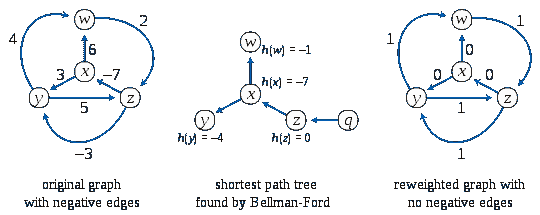

# 最短路径算法——Floyd Warshall & Johnson 的算法

> 原文：<https://blog.devgenius.io/shortest-path-algorithm-floyd-warshall-johnsons-632fd7a9f8c7?source=collection_archive---------5----------------------->

图遍历算法系列第三部分。阅读[第一部分](https://medium.com/nerd-for-tech/dfs-bfs-introduction-26a65fca2344)和[第二部分](/shortest-path-algorithms-dijkstra-bellman-ford-3b640bdb0449)

在上一篇博客中，我们学习了两种单源最短路径算法，在这篇博客中，我们将看到在所有节点对中寻找最短路径的两种算法。

# 弗洛伊德·沃肖尔算法

该算法采用动态规划的方法来解决问题。它将问题分解成更小的问题，然后组合答案来解决主要的最短路径问题。因此，利用这一点，我们可以确定到达图上任何其他节点的最快方法。

1.  构建一个大小为(N*N)的矩阵(D ),给出每个节点对之间的最短路径。
2.  将最短路径初始化为无穷大。
3.  找出使用 0 个中间顶点的最短路径。
4.  在每次迭代中，增加中间顶点的数量。`D(i, j) = min(D[i][k] + D[k][j], D[i][j])`。这里 D[i][k]表示只使用前 K 个顶点的最短路径。并且 D[k][j]表示对(k，j)之间的最短路径。

```
def FloydWarshall(N, edges):
    g = [[math.inf for _ in range(N)] for _ in range(N)]

    for u, v, w in edges:
        g[u][v] = w
        g[v][u] = w for u in range(N):
        g[u][u] = 0

    for k in range(N):
        for i in range(N):
            for j in range(N):
                if g[i][j] > g[i][k] + g[k][j]:
                    g[i][j] = g[i][k] + g[k][j]

    print(g)

FloydWarshall(4, [[0,1,3],[1,2,1],[1,3,4],[2,3,1]])
```

该算法的时间复杂度为 **O(N)。**

这种算法对于稠密图是非常好的。对于稀疏图，我们使用另一种算法，这将在下面讨论。

# 约翰逊算法

该算法最适用于稀疏图。它依靠另外两种算法来确定最短路径。它使用贝尔曼-福特来检测负周期并消除任何负边缘。然后使用 Dijkstra 算法计算最短路径。



来源维基百科

1.  对于给定的图 G，在图中添加一个新的顶点 **q** ，并从新顶点向 G 的所有顶点添加边，设修改后的图为 G。
2.  以 **q** 为源对 G 运行贝尔曼-福特算法。设贝尔曼-福特计算的距离为 h[0]，h[1]，..h[V-1]。如果我们发现一个负的重量循环，然后返回。注意，负权重循环不能由新顶点 **q** 创建，因为没有到 **q** 的边。所有边缘都来自 **q** 。
3.  重新加权原始图形的边。对于每条边(u，v)，将新权重指定为“原始权重+ h[u] — h[v]”。
4.  移除添加的顶点 **q** 并对每个顶点运行 Dijkstra 算法。

```
from collections import defaultdict
import mathdef get_min_distance(dist, visited):
    minimum, minVertex = math.inf, 0
    for vertex in range(len(dist)):
        if minimum > dist[vertex] and visited[vertex] == False:
            minimum, minVertex = dist[vertex], vertex
    return minVertexdef Dijkstra(og, ng, src):
    N = len(graph)
    spt_set = defaultdict(lambda : False)
    d = [math.inf] * N
    d[src] = 0

    for count in range(N):
        cur = get_min_distance(d, spt_set)
        spt_set[cur] = True

        for vertex in range(N):
            if ((spt_set[vertex] == False) and
                (d[vertex] > (d[cur] + ng[cur][vertex])) and
                (og[cur][vertex] != 0)):
                d[vertex] = (d[cur] + ng[cur][vertex])

    for v in range(N):
        print ('Vertex ' + str(v) + ': ' + str(d[v]))def BellmanFord(edges, graph, N):
    d = [math.inf] * (N + 1)
    d[N] = 0

    for i in range(N):
        edges.append([N, i, 0])

    for i in range(N):
        for (src, des, weight) in edges:
            if((d[src] != math.inf) and (d[src] + weight < d[des])):
                d[des] = d[src] + weight

    return d[0:N]

def JohnsonAlgorithm(graph):
    edges = []
    for i in range(len(graph)):
        for j in range(len(graph[i])):
            if graph[i][j] != 0:
                edges.append([i, j, graph[i][j]])

    # Weights used to modify the original weights
    new_weights = BellmanFord(edges, graph, len(graph))

    new_graph = [[0 for x in range(len(graph))] for y in
                    range(len(graph))]

    # Modify the weights to get rid of negative weights
    for i in range(len(graph)):
        for j in range(len(graph[i])):
            if graph[i][j] != 0:
                new_graph[i][j] = (graph[i][j] + 
                        new_weights[i] - new_weights[j])

    # Run Dijkstra for every vertex as source one by one
    for src in range(len(graph)):
        print ('\nShortest Distance with vertex ' + str(src) + ' as the source:\n')
        Dijkstra(graph, new_graph, src)

# Driver Code
graph = [[0, -5, 2, 3], 
         [0, 0, 4, 0], 
         [0, 0, 0, 1], 
         [0, 0, 0, 0]]

JohnsonAlgorithm(graph)
```

该算法的时间复杂度为 **O(N + NE log N)**

快乐阅读！！