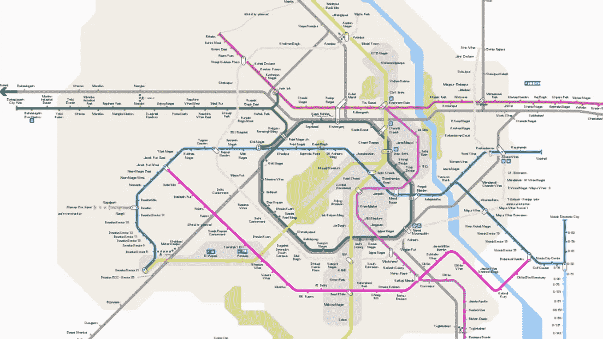
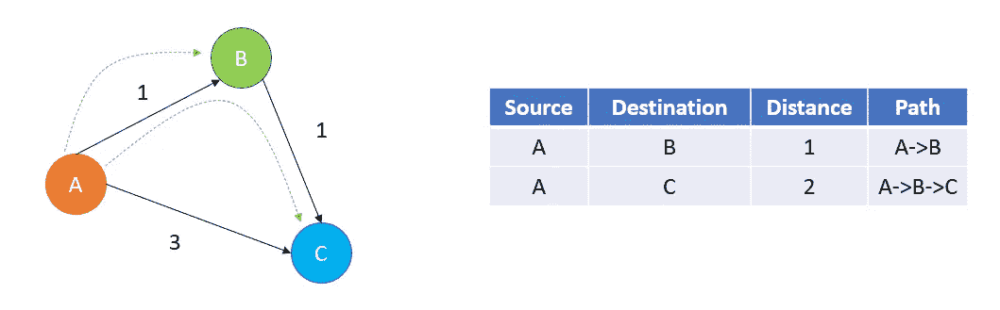
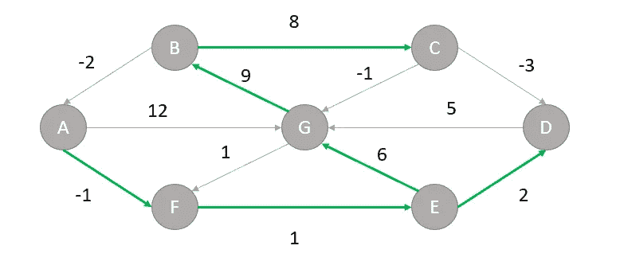
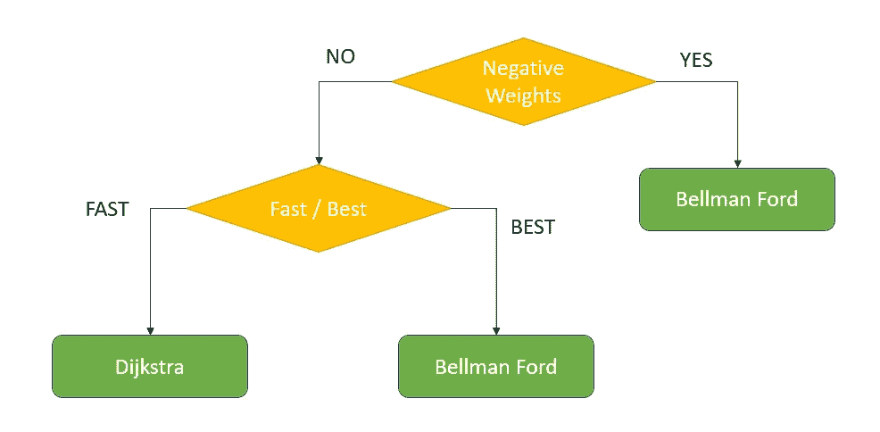

# 最短路径算法— Dijkstra & Bellman-Ford

> 原文：<https://blog.devgenius.io/shortest-path-algorithms-dijkstra-bellman-ford-3b640bdb0449?source=collection_archive---------11----------------------->



图遍历算法系列第二部分。阅读[第一部分](https://medium.com/nerd-for-tech/dfs-bfs-introduction-26a65fca2344)和[第三部分](https://asrathore08.medium.com/shortest-path-algorithm-floyd-warshall-johnsons-632fd7a9f8c7)



加权图中的最短路径

# 吉克斯特拉

Djikstra 的是一种图形遍历算法，用于查找源和目的地之间的最短路径。类似于 Prim 的 MST 算法，这也是一个贪婪算法。在 Djikstra 中，我们维护两个集合，一个集合包含最短路径树(SPT)中包含的顶点，另一个集合包含剩余的顶点。在每一次迭代中，我们从第二个(剩余的节点)集合中找到一个离源距离最小的顶点。Dijkstra 算法的核心思想是不断消除源节点和所有可能目的地之间的较长路径。

以下是 Dijkstra 算法中使用的详细步骤:

*   创建一个跟踪最短路径树中包含的顶点的 SPT 集。最初，这个集合是空的。
*   用无限距离值初始化输入图中的所有顶点。将源顶点的距离值指定为 0，以便首先拾取它。
*   而 SPT 不包括所有顶点:1。选择一个顶点 u，它不在 SPT 中，并且有一个最小距离值。2.在SPT 中包含 u。3.更新 u 的所有相邻顶点的距离值。要更新距离值，请遍历所有相邻顶点。对于每个相邻顶点 v，如果距离值 u(距源)和边的权重 u-v 之和小于距离值 v，则更新距离值 v。这个过程称为边松弛。在 DAG 中，我们使用拓扑顺序来放松边。

由于我们正在添加边的权重来寻找最短路径，Dijkstra 的算法只能处理权重为**正**的图。

## 代码实现

```
import math
from heapq import heappop, heappush

class Node:
    def __init__(self, vertex, weight=0):
        self.vertex = vertex
        self.weight = weight def __lt__(self, other):
        return self.weight < other.weight

class Graph:
    def __init__(self, edges, n):
        self.adjList = [[] for _ in range(n)]
        for (source, dest, weight) in edges:
            self.adjList[source].append((dest, weight))def get_route(prev, i, route):
    if i >= 0:
        get_route(prev, prev[i], route)
        route.append(i)

def dijkstra(graph, source, n):
    pq = []
    heappush(pq, Node(source))
    dist = [math.inf] * n
    dist[source] = 0 processed = [False] * n
    processed[source] = True
    prev = [-1] * n

    while pq:
        node = heappop(pq)
        u = node.vertex
        for (v, weight) in graph.adjList[u]:
            if not processed[v] and (dist[u] + weight) < dist[v]: 
                dist[v] = dist[u] + weight
                prev[v] = u
                heappush(pq, Node(v, dist[v]))
        processed[u] = True

    route = []
    for i in range(n):
        if i != source and dist[i] != math.inf:
            get_route(prev, i, route)
            print(f'Path ({source} —> {i}): Minimum cost = {dist[i]}, Route = {route}')
            route.clear()if __name__ == '__main__':
    n = 5
    edges = [
        (0, 1, 10), 
        (0, 4, 3), 
        (1, 2, 2), 
        (1, 4, 4), 
        (2, 3, 9), 
        (3, 2, 7),
        (4, 1, 1), 
        (4, 2, 8), 
        (4, 3, 2)
        ] graph = Graph(edges, n)
    for source in range(n):
        dijkstra(graph, source, n)
```

该算法的时间复杂度为`O(|E|+|V|log|V|)`。



负权重的最短路径

# 贝尔曼·福特算法

贝尔曼-福特算法是自底向上动态编程的一个例子。它从一个起始顶点开始，计算一条边可以到达的其他顶点的距离。然后，它继续寻找具有两条边的路径，以此类推。该算法也适用于边权重为负的图。

*   将到源的距离初始化为`0`，将所有其他节点的距离初始化为`INFINITY`。
*   对于所有边，如果到目的地的距离可以通过取边来缩短，则距离会更新为新的较低值。
*   在扫描边的每次迭代`i`中，该算法找到最长`i`边的所有最短路径。由于没有循环的最长可能路径可能是`V-1`边，所以必须扫描这些边`V-1`次，以确保为所有节点找到最短路径。
*   对所有边进行最终扫描，如果更新了任何距离，则发现了长度为`|V|`边的路径，这只有在图中存在至少一个负循环时才会发生。

## 代码实现

```
import mathdef getPath(parent, vertex):
    if vertex < 0:
        return []
    return getPath(parent, parent[vertex]) + [vertex]def bellmanFord(edges, source, n):
    distance = [math.inf] * n
    parent = [-1] * n
    distance[source] = 0

    for k in range(n - 1):
        for (u, v, w) in edges:
            if distance[u] != math.inf and distance[u] + w < distance[v]:
                distance[v] = distance[u] + w
                parent[v] = u

    for (u, v, w) in edges:
        if distance[u] != math.inf and distance[u] + w < distance[v]:
            return

    for i in range(n):
        if i != source and distance[i] < math.inf:
            print(f'The distance of vertex {i} from vertex {source}, using path {getPath(parent, i)}, is {distance[i]}.')if __name__ == '__main__':
    edges = [
        (0, 1, -1),
        (0, 2, 4),
        (1, 2, 3),
        (1, 3, 2),
        (1, 4, 2), 
        (3, 2, 5), 
        (3, 1, 1), 
        (4, 3, -3)
    ] n = 5 for source in range(n):
        bellmanFord(edges, source, n)
```

其时间复杂度为`O(VE)`。

二选一？



快乐学习！！！