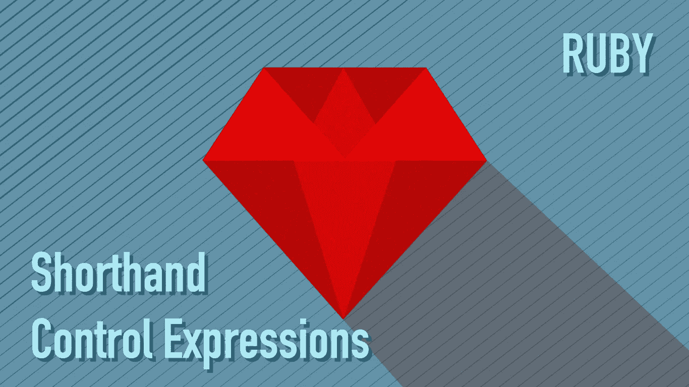

# Ruby 中的速记控制表达式

> 原文：<https://blog.devgenius.io/shorthand-control-expressions-in-ruby-dbed2be299db?source=collection_archive---------13----------------------->



# 如果，除非，三元运算符和触发器

作为一个 Ruby 初学者，当我在 Stackoverflow 中寻找答案时，经常会遇到一些对我来说很神秘的问题。在这里，我想分享一些我觉得有用或有趣的速记，从简单的一行 if/unless 语句到三元运算符和触发器。

# 1.修饰语如果和除非

有时你需要一个条件语句，用‘if-end’来写整个语句会很麻烦。在这种情况下,“如果”和“除非”这个修饰语就派上了用场。

这是一个简单的 if 语句的例子。如果'*true*'——在 ruby 中这意味着除了 nil 和 false 之外的任何值——那么做点什么。

```
if true 
  puts "the test resulted in a true-value"
end
```

这个可以缩短一行。

```
puts "the test resulted in a true-value" if true
```

`unless`表达式与`if`表达式相反。所以简单来说就是'*如果不为真'*或者'*如果为假'*。

```
unless true
  puts "the value is a false-value"
end
```

这个可以缩短一行。

```
puts "the value is a false-value" unless true
```

重要的是****`if / unless`的左边是满足测试/条件时要执行的语句，`if / unless`的右边是测试/条件表达式****

# ****2.三元 if****

****三元表达式对我来说是一个既迷人又困惑的表达式。它把简单的`if-else-end`表达得整整齐齐。但是因为可读性，建议‘三元 if’只用于简单的条件句。****

******三元表达式的基本结构是:******

```
**condition ? true : false**
```

****一个简单的例子是:****

```
**[].empty? ? “Yes” : “No”**
```

****这与以下内容相同:****

```
**if [].empty?
  "Yes"
else
  "No"
end**
```

****此示例显示了使用三元表达式的可读性问题。****

****下面是默认的 if-else 语句，用于检查散列中是否存在`"name"`键，如果找到该键，则返回一个连接值，如果没有找到，则创建`"name"`键。****

```
**hash = { }if hash.key?("name")
  hash["name"]
else 
  hash["name"] = "Anne" 
end**
```

****这在三元表达式中是:****

```
**hash.key?("key_name") ? hash["key_name"] : hash["key_name"] = value**
```

****就个人而言，在这种情况下，我更喜欢默认的`if-else-end`表达式，而不是三元表达式。当它变得有点长时，它会更清晰，可读性更好，所以我建议在使用它时要记住可读性。****

*   ****参考文献—[ruby-doc.org](https://ruby-doc.org/core-2.7.0/doc/syntax/control_expressions_rdoc.html#label-Ternary+if)****

# ****3.触发器****

****触发器是一种罕见的条件表达式。在 Ruby 2.6 中，由于缺乏对它的了解和不正确的用法，它几乎被删除了。但是几个开发者不同意，声称它在文本处理和脚本方面有帮助。所以在 Ruby 2.7 中又回来了。****

****触发器使用范围运算符两点(`..`)和三点(`...`)。它之所以被称为触发器，是因为当范围条件的开始匹配时，它“打开”——*返回* *真*，当范围条件的结束也匹配时，它“关闭”——*返回* *假*。另外，它必须用在条件句中，如`if`、`while`、`unless`、`until`等。包括修饰形式。我知道，这听起来令人困惑。让我们看一个例子。****

```
**1.upto(5) do |i|
  puts i if i==2...i==4
end
2
3
4
=>1**
```

****在这里，你看到当`i==2` *，*返回`true`时，从 2 开始执行`puts i`。当它到达 4 时，第二个条件`i==4`匹配并返回`false`，所以它在 4 之后停止`puts i`。****

****另一件要小心的事情是使用带三点(`...`)运算符的触发器，因为它排除了它的结束值。当传递 start 和 end 的相同范围值时，它不会在第二个条件中返回' false '。在下面的例子中，你可以看到它一直持续到循环结束。****

```
**# using (...) -> excludes its ending value
(1..10).each do |i| 
  puts i if i==5...i==5
end 
5
6
7
8
9
10
=> 1..10# using (...) -> includes its ending value
(1..10).each do |i| 
  puts i if i==5..i==5
end 
5
=> 1..10**
```

****我个人还没有发现人字拖的用途，但是一旦我发现了，我一定会写一篇关于它的文章。****

****我在下面包含了一些触发器用例的链接。****

 ****[## 触发器在 ruby 中的实际应用

### ruby 继承了 Perl 的哲学，即有多种方法来做同样的事情。我从…那里继承了这种哲学

火箭科学. ru](https://rocket-science.ru/hacking/2018/02/22/flip-flop-real-application)**** ****[](https://nithinbekal.com/posts/ruby-flip-flop/) [## Ruby 中的触发器运算符

### 触发器操作符是 Ruby 的奇怪特性之一，大多数人甚至都没有意识到。这是…

nithinbekal.com](https://nithinbekal.com/posts/ruby-flip-flop/) 

*   参考文献—[ruby-doc.org](https://ruby-doc.org/core-2.7.0/doc/syntax/control_expressions_rdoc.html#label-Flip-Flop)****