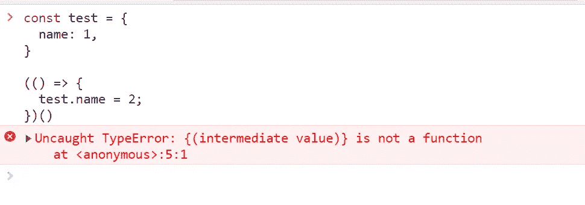
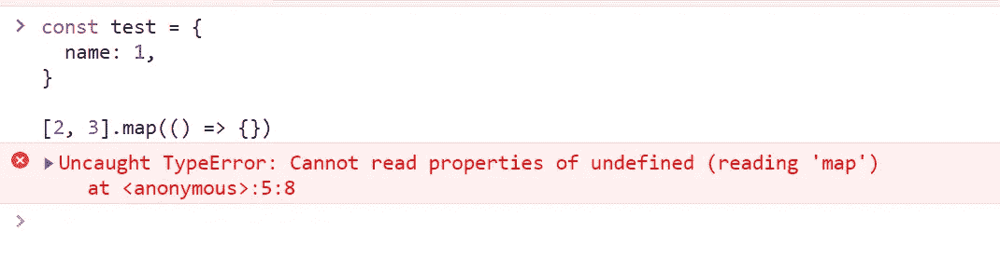
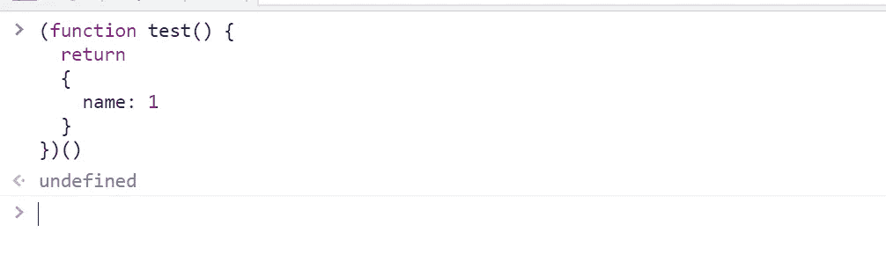
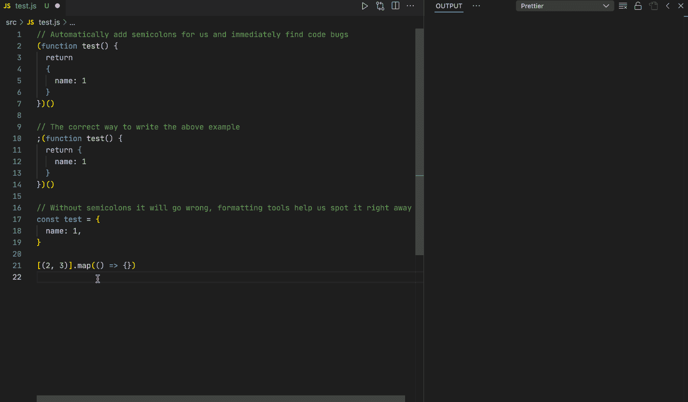

# 我应该在 JavaScript 代码中添加分号吗？

> 原文：<https://blog.devgenius.io/should-i-add-semicolons-to-javascript-code-6f254e1e170b?source=collection_archive---------4----------------------->

## 为什么不呢？


最近有刚接触 JavaScript 的朋友问我:JavaScript 里需要加分号吗？

这其实是一个一直在讨论的话题。有人认为不应该加分号，他们的意见和这个差不多:

*   流行语言中有很多可选的分号。比如 Go，Ruby，Python，Swift 都可以加分号，但是没人加。
*   不加分号可以让代码更清晰，减少视觉负担。
*   还有很多。

也有一些人认为应该加上分号。他们观点最大的一点是，没有分号可能会有问题。例如:



或者这个:



这是因为 JavaScript 解释器(如 V8)将这些代码视为同一行语句。也就是说，上面的两个例子可以这样解释:

```
// Example1
**const test = {
  name: 1,
}(() => {
  test.name = 2;
})();**// Example2
**const test = {
  name: 1,
}[(2, 3)].map(() => {});**
```

所以它当然会给出一个错误。解决方法是在`(`或`[`前加一个分号，或者在前面的语句后加一个分号。

另外，没有分号可能会出现一些意外，比如我期望返回下面的对象，但它实际上返回了`undefined`。



这样做的原因是因为 JavaScript 的自动分号插入(ASI)。上面的代码将被解析如下:

```
(function test() {
  return;
  {
    name: 1;
  }
})();
```

*参见* [*规范*](https://262.ecma-international.org/7.0/#sec-rules-of-automatic-semicolon-insertion) *了解关于该规则的更多描述。*

你是不是觉得这个规则很奇怪，为什么要这样设计？

Brendan Eich(JavaScript 的创造者)在他的博客文章[中提到了原因，这正是他所说的:](https://brendaneich.com/2012/04/the-infernal-semicolon/)

> ASI(正式来说)是一个语法纠错程序。如果你开始编码，就好像它是一个通用的有效换行符规则，你会遇到麻烦。

所以我对它的解释是:ASI 是一种容错方案，它允许编程语言有更多的自由度。这是因为编码风格是不可控的，你可以选择加分号或者不加分号(忘了分号)，有了这个机制，代码会尽可能好的工作。


照片由 [Cookie 在](https://unsplash.com/@cookiethepom?utm_source=medium&utm_medium=referral) [Unsplash](https://unsplash.com?utm_source=medium&utm_medium=referral) 上的 Pom 拍摄

那么回到主题，我们应该在 JavaScript 代码中添加分号吗？

从上面的代码中，我们也可以知道，在那些特定的场景中，比如以`(`、`[`、`/`、`+`、`-`这些记号开头的语句，我们必须添加分号来确保程序正确执行。

另外，如果没有分号，那么我们还需要了解 ASI 规则，以避免一些意外情况。

因此，如果这是一个全新的项目，我更喜欢在所有 JavaScript 代码中添加分号。如果是维护时间比较长的项目，那就按照原来的分号规则。

如果你使用像 Webpack 这样的构建工具，他们会用分号来编译你的代码，以确保你的代码是要传达的。

如果你在你的项目中使用格式化工具，比如 Prettier，那么我推荐你使用 Git 钩子，比如 [husky](https://github.com/typicode/husky) ， [simple-git-hooks](https://github.com/toplenboren/simple-git-hooks) 等等。以确保添加到远程的代码具有统一的风格。

另外，通过 VS 代码的`"editor.formatOnSave": true`配置，可以在保存代码时及时看到格式的变化，保证想要表达的意思。

例如，当您配置为在所有代码中添加分号时，您可以在编写时只在那些必要的地方添加分号，然后 VS 代码会在保存时根据配置格式化您的代码，如下所示:



本文到此为止。那么你怎么看待 JavaScript 中的分号呢？欢迎在评论区畅所欲言！

*今天就到这里。我是 Zachary，我将继续输出与 web 开发相关的故事。如果你喜欢这样的故事，想支持我，请考虑成为* [*中会员*](https://medium.com/@islizeqiang/membership) *。每月 5 美元，你可以无限制地访问媒体内容。如果你通过* [*我的链接*](https://medium.com/@islizeqiang/membership) *报名，我会得到一点佣金。*

你的支持对我来说很重要——谢谢。