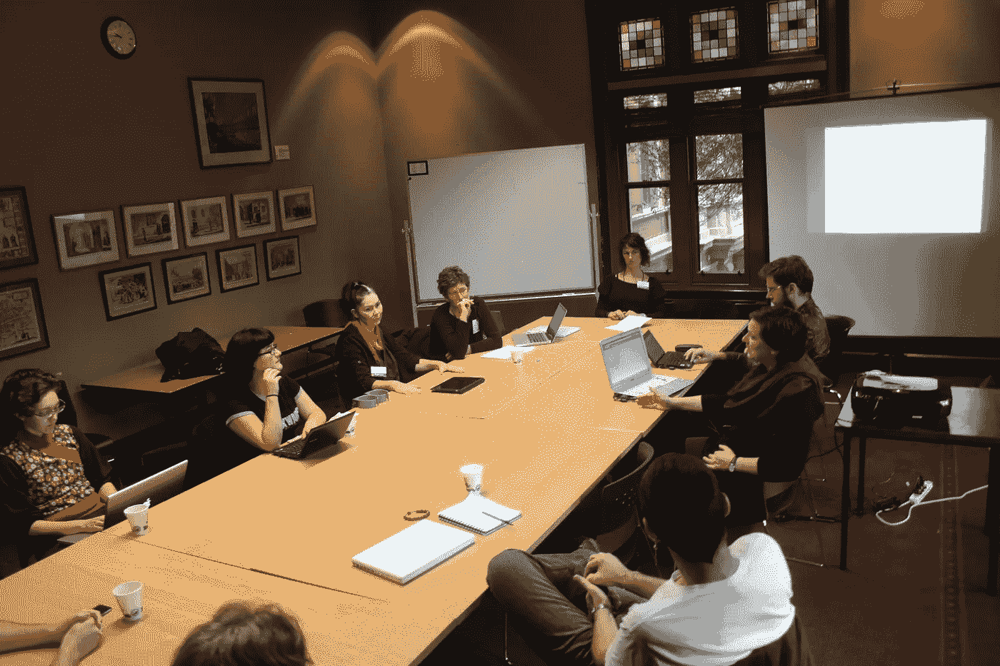

# 我应该去编码训练营吗？

> 原文：<https://blog.devgenius.io/should-i-go-to-a-coding-bootcamp-4827bc199c28?source=collection_archive---------4----------------------->

## 来自前 FAANG 工程师和软件教育家的见解

墨尔本夏令营的照片

作为一个发布了很多免费的 [Python 教程](https://www.pythonalgos.com/blog)并每天与他们的读者/学生在[互动的人](https://discord.gg/B5nqhBehZf)，我经常看到这个问题。不幸的是，这个问题很难给出肯定或否定的答案。如果你需要外在的结构和纪律，我的回答通常是“是”，但是如果你能够自律并制定自己的时间表，我的回答通常是“否”。网上有成千上万的免费教程，你可以自学，通过网络找到一份技术工作。首先，让我们来看看为什么你*应该*参加软件训练营。

# 好人

来自 Flickr 的图片

训练营擅长做三件事。第一，它们给你一个你需要的工具的概述。第二，他们给你一个课程和结构，以及外部纪律。第三，好的训练营也会提供职业帮助的资源。

## 工具

据我所知，如果我错了，请在评论中纠正我，没有真正的后端训练营。你要么得到 web 开发(前端)或全栈，全栈真正的意思是“web 开发与服务器端洒在一点点”。几乎所有的训练营都会涵盖 HTML/CSS、JavaScript 和一些 React。一些全栈的也将包括像索引数据库(SQL)这样的东西。

## 课程

据我所知，拥有一个课程/大纲/结构是编码训练营能给你的最大好处。在我看来，许多学习编程的人面临的一个难题是知道从哪里开始以及如何进步。我在我的免费 Python 博客文章教程中通过给每个教程分配级别来解决这个问题。这样，人们就有办法判断他们在哪里，从哪里开始。

拥有某种结构的另一个好处是你可以失败！失败的威胁隐约可见，这很好。当你不想工作的时候，它会给你一些动力。

## 职业帮助

我还没见过有人从新兵训练营毕业后真的找到工作，至少我在工业界工作时没有。然而，我听说有人从新兵训练营找到了工作。有趣的是，我的一个大学朋友三个多月前从全栈训练营毕业，他正在找工作。我也有一个朋友正在参加训练营，她说他们给了我很大的面试帮助。事实上，她说她甚至从街对面的一家公司得到了一份工作机会(虽然与训练营无关)，但加薪不足以让她接受。您的里程可能会有所不同。

# 坏事

[来自阿尔及利亚的图片](https://almeriaisdifferent.com/las-10-mejores-peliculas-rodadas-en-almeria/lee-van-cleef-plays-both-the-man-in-black-in-few-dollars-more-and-angel-eyes-in-gbu-2/)与众不同

好吧，如果你和一家大型科技公司的任何人交谈，你会很快意识到那里很少有编码营的毕业生。在我和 FAANG 公司的其他工程师在新兵训练营的聊天中，我们都同意一件事。主要是因为这些训练营不教你工程学。他们教你编码。他们教你就像你又回到了学校，如果你经历过美国的教育系统，你就已经知道它有多糟糕了。在大型科技公司，大多数时候，你是工程人员，而不仅仅是编码人员，为此你必须[学习工程工具](https://pythonalgos.com/2021/11/26/how-to-learn-the-tools-for-engineering/)。

如果你想成为一名软件工程师，你不能只知道如何编程。你必须知道如何成为一名工程师。要了解更多，请阅读我写的关于为什么[编程很容易，但软件工程很难](/why-programming-is-easy-but-software-engineering-is-hard-90019fd78ed5)的文章。除了不为你准备工程学位，让我们记住训练营是生意。大部分以赚钱为主。他们不在乎你未来的成功；他们不在乎你是否找到了工作，是否在 6 个月后被解雇。我遇到一个人，她声称在她的第一次训练营后发生了这种事，她从他们那里得到了 0 帮助，除了一个再次做这件事的提议。他们还是会拿走你的钱。

编码训练营专注于让你获得足够的知识来通过面试。更好的会给你指导，利用他们的人脉帮你。一般的不会，或者说通常不会。编码训练营的空间在最近几年已经爆炸了，这是因为有这么多的钱可以赚。为什么？好吧，这让我们想到了我认为训练营的丑陋一面。

# 丑陋的

图片来自 BlogSpot

许多编码训练营可能是剥削性的。让我们面对现实吧。有那么多人在寻找学习如何编程的机会，以获得一份更好的工作，赚更多的钱。糟糕的训练营利用了这一点。他们给你提供提前支付或者在几年内从你的工资中提取一定比例的能力。就像学生债一样。

除了不像学生贷款，训练营会从你的薪水中抽取一定的百分比。在你毕业后的 3 年里，训练营平均会拿走你工资的 15%。那就像最少 30k 美元！听着，如果那是你喜欢的，那就去吧。我个人认为这很可笑。我敢打赌，即使是卢达克里斯也会觉得这很可笑。尤其是当他们教你最起码的东西的时候。

现在，我想澄清一下，并不是所有的训练营都这样做。一些训练营实际上是由想帮助你的人管理的。不幸的是，金钱会说话，经营剥削训练营的人能够做更多的广告，因此得到更多的学生、更多的钱和更多的广告。所以，如果你想选择一个训练营，明智地选择，做你的研究。

# 如何自学

[图片](https://tscpl.org/parents/study-for-the-act-at-home)来自 TSCPL

我不想撒谎，自学和建立工作关系比参加训练营要难得多。那里不会有人告诉你该做什么，什么时候做。只有你自己能做到。如果你足够幸运，也许你可以得到一个导师或聘请一名教练。这些选择要便宜得多。在接下来的几年里，它们绝对不会让你花费 30，000 美元。前提是你足够幸运，能在训练营毕业后找到工作。同样值得一提的是，并不是每个参加研究生的人。我朋友训练营里的一个家伙因为“作弊”或者“使用谷歌”被踢出去了。如你所知，使用谷歌就像是半个软件工程师的工作。

好吧，那你实际上是怎么自学的呢？首先，你需要一些结构。有很多免费的课程和教程，就像我在 PythonAlgos.com 上发布的那些，但这些大多是无组织的。我正致力于提供一个免费的结构和学习计划，但是[到目前为止只做了开始](https://www.pythonalgos.com/resources)。正如我已经多次表达的那样，我相信学习编程的概念只是一个开始。一旦你学会了编程的基本原理，提高技能的最快方法就是做项目。当你做项目时，你会想问自己一些问题，比如“这段代码是做什么的？”以及“如果我改变 x、y 或 z 会发生什么？”如果你这样做，你不仅会学到技能，还会学到做软件工程的心态。

## 建立工作关系网

这大概是很多人觉得最难的部分。使用 LinkedIn。向大学或高中从事软件工作的人发送请求。与他们的帖子互动。发布您的项目。这很简单，你只要去做就行了。

如果您觉得这很有帮助，请在 Twitter 或 LinkedIn 上与您的朋友分享！要无限制地访问媒体上的信息宝库，今天就注册成为[媒体会员](https://medium.com/@ytang07/membership)！更多 Python 技巧、自然语言处理教程以及其他技术相关的帖子，记得关注我，！

*更多内容尽在*[*blog . dev genius . io*](http://blog.devgenius.io)*。*