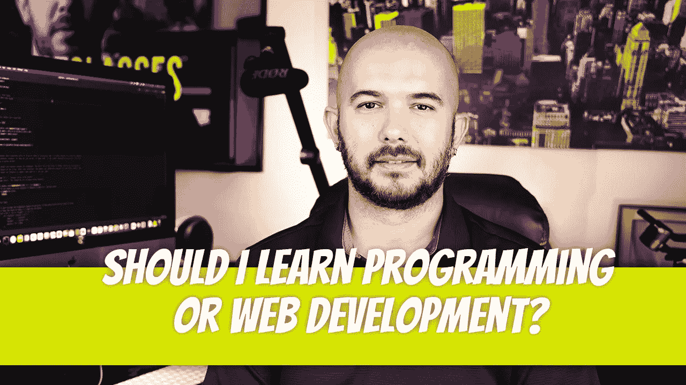

# 我应该学编程还是 Web 开发？

> 原文：<https://blog.devgenius.io/should-i-learn-programming-or-web-development-518917e3d3f0?source=collection_archive---------14----------------------->

刚开始学习旅程的人有问这个问题的倾向。Web 开发是一种编程类型。手机 App 开发是另一种类型。我发现，编程通常意味着使用运行在用户机器上的 Java 或 Python 语言进行软件开发，而 web 开发意味着使用基于 web 的语言来开发 web 应用程序。

既然我们已经清楚了这个问题，是时候给出答案了。

我非常相信在决定专攻之前先学习使用面向对象编程语言编程。选择像 Java 这样的语言迫使你学习编程概念，比如类对对象、数据结构、静态对实例方法等等。这并不容易。这是一种严格的语言，不像其他基于网络的编程语言那样宽容。

花 1 到 2 年时间学习这种类型的编程来真正夯实基础是有益的。在你的学习过程中，你会接触到像多态性这样的主题，这将很难理解。

一旦你对基础有了一个相当好的理解，超越到一个基于 web 的编程环境将会变得非常容易。不要误解这个声明。当你进入网络编程领域时，会有很多新的话题。你会问自己，既然你现在必须学习这么多新东西，为什么还要费心学习 Java。

不过，你会掌握一门编程语言。从那时起，事情只会变得更容易。当你学习 Java 的时候，你专注于一个环境，你的 PC。现在，您必须开始考虑在服务器上运行的代码与在客户端浏览器上运行的代码。他们是如何交流的？页面上的元素可以异步加载吗？

还有 HTML 和 CSS。如果你想在网上展示任何东西，你应该知道这些。

你终于学会了你将坚持使用的编程栈，然后你发现在所有东西之上都有框架。前端和后端。事实上，有时它们是框架，有时它们是库，但是它们看起来像是框架。框架到底是什么？

您将应用程序部署在哪里？AWS，GCP？共享服务器还是专用服务器？您是否使用任何工具来帮助您进行部署？CI/CD 管道？

对于刚开始学习编写代码的人来说，所有这些可能会变得极其困难。这就是为什么你要坚持一门编程语言，学习编程的基础知识。那些概念可以翻译成其他语言。如果你认为你的余生将只使用一种编程语言，那么这个领域可能不适合你。就在你觉得你已经学得足够好的时候，一些新的东西出现了，每个人都加入进来。为了保持需求，你必须学习它。

仍然不相信，并希望进入网络开发？给你更多的力量。我就是这么做的。让我至少给你提供一些资源，我希望我在开始这段旅程时就已经有了。

列表中的第一个是 2022 年成为现代前端开发者的一步一步的指南。这个旅程图从理解互联网如何工作开始，经过 HTML、CSS 和 JavaScript，在进入框架和其他内容之前，在版本控制和软件包管理中停留一下。

 [## 前端开发人员路线图:学习成为现代前端开发人员

### 我们现在有一个 YouTube 频道。订阅视频内容。该项目是开源项目，在……

roadmap.sh](https://roadmap.sh/frontend) 

一旦你选择了一个你计划在其中工作的前端环境，比如 React，你也可以遵循它的路线图。

 [## React 开发者路线图:学习成为 React 开发者

### 我们现在有一个 YouTube 频道。订阅视频内容。本指南的目的是让您了解…

roadmap.sh](https://roadmap.sh/react) 

如果你想只关注后端，有一个路线图。这一次，您将关注数据库管理和设计、API、安全性、测试、容器化等。这甚至还不包括你必须学习的编程语言和框架。

 [## 后端开发者路线图:学习成为现代后端开发者

### 我们现在有一个 YouTube 频道。订阅视频内容。该项目是开源项目，在……

roadmap.sh](https://roadmap.sh/backend) 

如果你真的想疯狂一下，看看 DevOps 路线图。

 [## DevOps 路线图:学习成为 DevOps 工程师或 SRE

### 我们现在有一个 YouTube 频道。订阅视频内容。该项目是开源项目，在……

roadmap.sh](https://roadmap.sh/devops) 

然而，如果你选择接受我的建议，从 Java 开始，谢天谢地，也有一个路线图。

 [## 学习成为现代 Java 开发人员

### 我们现在有一个 YouTube 频道。订阅视频内容。本指南的目的是让您了解…

roadmap.sh](https://roadmap.sh/java) 

不过，开始你的旅程最好的地方是 YouTube。它装载了数千小时的免费教程，将带您浏览所有您能想到的 Java 概念。另一个好资源是 Head First 我喜欢那些书。它们使学习变得极其简单和愉快。是的，还有 Head First Java。

 [## Head First Java:对大脑友好的指南

### head First Java:Amazon.com 的大脑友好指南。*免费*送货到…

amzn.to](https://amzn.to/3S49fhP) 

祝你编程生涯好运。请记住，我们一开始都没有任何编程知识，也一样困惑。坚持下去，最终一切都会变得有意义。

迪诺·卡伊奇目前是 [LSBio(生命周期生物科学公司)](https://www.lsbio.com/)、[绝对抗体](https://absoluteantibody.com/)、 [Kerafast](https://www.kerafast.com/) 、[珠穆朗玛生物](https://everestbiotech.com/)、[北欧 MUbio](https://www.nordicmubio.com/) 和 [Exalpha](https://www.exalpha.com/) 的 IT 主管。他还担任我的自动系统的首席执行官。他有十多年的软件工程经验。他拥有计算机科学学士学位，辅修生物学。他的背景包括创建企业级电子商务应用程序、执行基于研究的软件开发，以及通过写作促进知识的传播。

你可以在 [LinkedIn](https://www.linkedin.com/in/dinocajic/) 上联系他，在 [Instagram](https://instagram.com/think.dino) 上关注他，[访问他的博客](https://www.dinocajic.com/)，或者[订阅他的媒体出版物](https://dinocajic.medium.com/subscribe)。

阅读 Dino Cajic(以及 Medium 上成千上万的其他作家)的每一个故事。你的会员费直接支持迪诺·卡吉克和你阅读的其他作家。你也可以在媒体上看到所有的故事。