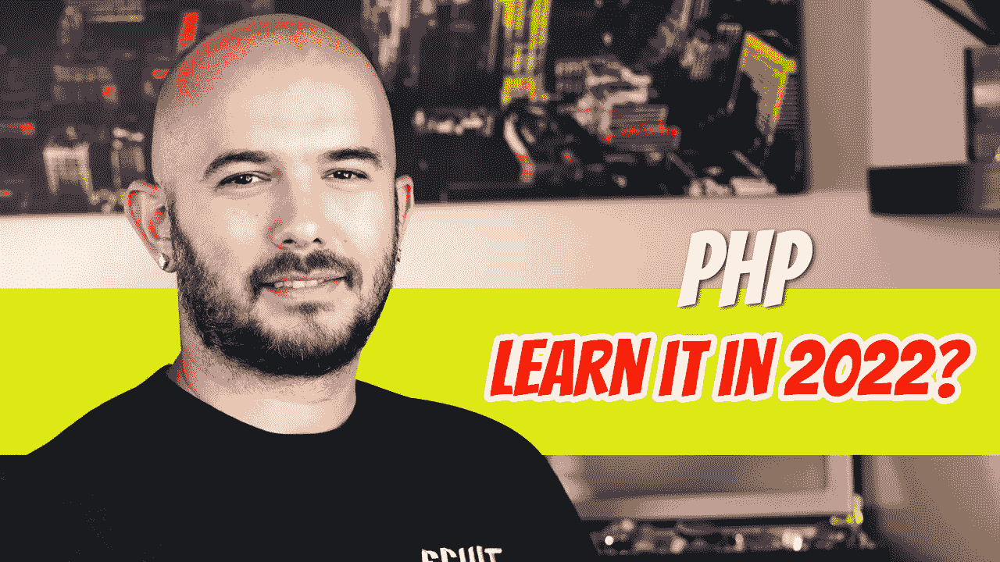
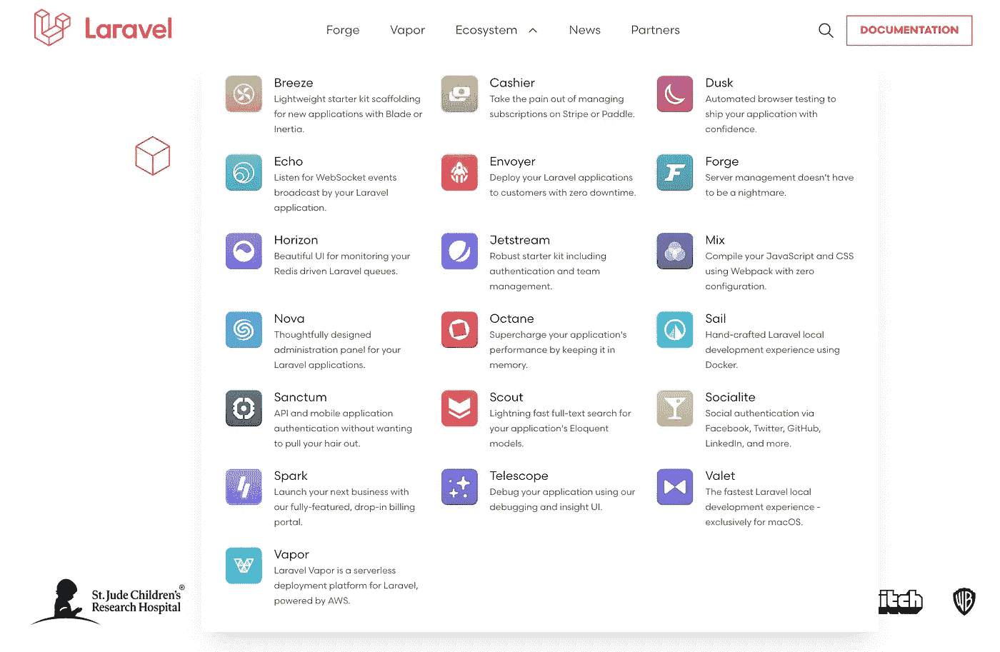

# 2022 年该不该学 PHP？

> 原文：<https://blog.devgenius.io/should-you-learn-php-in-2022-fed17f3453b8?source=collection_archive---------1----------------------->

我第一句话就给你剧透文章:答案是肯定的，有条件。我看到这个问题弹出的频率相当高，说实话，这不是一个正确的问题。正确的问题应该是“2022 年该不该学 Laravel？”

让我们暂时离开 PHP，快速浏览一下 C#。你认识几个 C#开发者？现在，你知道有多少 C#开发人员没有利用。网？。NET 已经成为 C#开发人员的同义词，大多数 C#开发人员会说，“我是一名. NET 开发人员。”PHP 开发人员也是如此。

如果你是一名开发人员，并且花时间学习了这些概念，你可以在几周内学会 PHP。如果您有 Java 方面的经验，语法几乎是相同的。到目前为止，没有什么疯狂的概念会让你花费比几周更长的时间去理解。

您应该注意的一点是，PHP 是一种用于构建 web 应用程序的服务器端语言。如果你试图构建移动或桌面应用程序，PHP 及其框架并不适合你，但可能会有所帮助(我将在后面解释)。

## 学习 PHP 的理由…其实是 Laravel

*   你在努力找工作。JavaScript 职位非常热门，竞争非常激烈。每个人都想要 JS 这个职位。我喜欢挑选相对容易找到的东西，而且竞争也不激烈。高质量的 Laravel 开发人员的薪水高达 6 位数。参加公司希望你为他们工作的面试很好，而不是让面试官向你展示他或她有多聪明。
*   你工作的公司用的是 PHP 框架。这是一个显而易见的。学会使用工作所需的工具。
*   你是一个终生的学者，喜欢学习编程语言。我觉得我们是唯一不喜欢了解其历史的职业之一。通常，我们甚至不喜欢知道现在。只有勇往直前，绝不回头。
*   您需要一个完整的生态系统，让您能够快速构建高度可伸缩的 web 应用程序。我接下来会谈到这一点；拉勒维尔的生态系统是广阔的。

## 拉勒韦尔

什么是 Laravel？它是一个 MVC 框架，只是碰巧使用 PHP 作为编程语言。它是为处理大型网络应用而设计的。如果你还没有看一眼 Laravel，我鼓励你这样做，只是为了教育你自己。

 [## laravel——Web 工匠的 PHP 框架

### Laravel 是一个 PHP web 应用程序框架，具有丰富、优雅的语法。我们已经奠定了基础——解放…

laravel.com](https://laravel.com/) 

当你访问 Laravel 网站，点击生态系统下拉菜单，你会看到很多链接，把你带到那些帮助你创建和部署 Laravel 应用的包。

例如，Vapor 是 Laravel 的一个轻松的无服务器部署工具。它接受您的应用程序，将其转换为 Lambda 函数，并将其部署到 AWS。您需要知道的只是如何注册 Vapor、注册 AWS、获取 AWS 密钥、将它们添加到 Vapor 以及部署您的应用程序。Vapor 为您处理所有其他事情。如果您想部署到其他环境，Laravel 有 Forge 来帮助您。

认证怎么样？您想要哪种类型的身份验证？移动认证？API 认证？常规认证？这一切都有一个包。JetStream 甚至为用户提供了一个完整的系统来注册、登录、找回密码、启用 2FA、编辑个人资料，所有这些都是免费的，只需一个命令。

想在 Docker 上运行吗？拉弗尔也希望你这样做。只需在您的系统上安装 Docker 并运行一个命令。Laravel 应用程序自带 docker-compose 文件。

*curl-s " https://laravel . build/your-app-name " | bash*

Octane 是最近发布的，它增强了 Laravel 应用程序的性能，甚至在针对处理请求数量的基准测试中[击败了 Express.js。](https://lukecurtis.me/benchmarking-laravel-octane-vs-express-js/)

前端怎么样？每个人都希望自己的页面具有闪电般的自然外观。你可以利用你喜欢的前端框架/库，使用 Laravel 作为 API。Laravel 用 Vue.js 很好用，不想碰 JavaScript？Livewire 怎么样？

 [## Livewire | Laravel

### 构建现代网络应用很难。像 Vue 和 React 这样的工具非常强大，但是它们增加了…

laravel-livewire.com](https://laravel-livewire.com/) 

## 持续存在的问题

我曾为专门从事 Laravel 的公司工作过，但也为开发人员提供 PHP 测试。Laravel 的开发人员经常无法通过这些测试。好像连用 Laravel 的公司都不了解开发者。

我最终说服了一家公司回去给一些没有通过的开发者发布一个 Laravel 测试。他们做到了，并且雇佣了所有人。

还有一种观念是，所有开发人员都需要用同一种编程语言编写代码。随着角色的多样化，应用程序用什么语言编写并不重要。我曾在一家公司工作，那里的前端语言是 Vue.js，后端语言是 Laravel，所有移动应用程序都是用 React Native 或 Swift UI 编写的。每个人都齐心协力，应用程序毫不费力地扩展。一个这样的移动应用为每个用户记录事件。由于每天有 25，000 个活跃用户，每个用户有数百个事件，性能无疑是主要考虑因素。该应用程序将 Swift-UI 用于移动方面，将 Vue.js 用于管理部分，将 Laravel 用于 API(使用[事件源](https://spatie.be/docs/laravel-event-sourcing/v7/introduction)包)。

## 最后的想法

如果一切正常，为什么人们对这个话题如此热情？大部分工作空间问题是由人引起的，而不是编程语言。如果你想推出一个快速的 [MVP 应用](https://dinocajic.medium.com/mvp-the-developer-death-call-453bba88b351)，并将其扩展到全面生产，Laravel 绝对是一个不错的选择。

如果您想知道我的开发人员目前是否使用 Laravel，答案是肯定的。但是，他们也使用 Python Flask，C#。NET 和 Magento。我们在 GCP 工作，每天聚集数百万条记录，并用 BigQuery 处理它们。AWS 托管了我们的大多数其他应用程序，一切都运行得很好。最终，我们会寻找适合工作并能为我们省钱的工具。

Dino Cajic 目前是 [LSBio(寿命生物科学公司)](https://www.lsbio.com/)、[绝对抗体](https://absoluteantibody.com/)、 [Kerafast](https://www.kerafast.com/) 、 [Everest BioTech](https://everestbiotech.com/) 、 [Nordic MUbio](https://www.nordicmubio.com/) 和 [Exalpha](https://www.exalpha.com/) 的 IT 负责人。他还担任我的自动系统的首席执行官。他有十多年的软件工程经验。他拥有计算机科学学士学位，辅修生物学。他的背景包括创建企业级电子商务应用程序、执行基于研究的软件开发，以及通过写作促进知识的传播。

你可以在 [LinkedIn](https://www.linkedin.com/in/dinocajic/) 上联系他，在 [Instagram](https://instagram.com/think.dino) 上关注他，或者[订阅他的媒体出版物](https://dinocajic.medium.com/subscribe)。

阅读迪诺·卡吉克(以及媒体上成千上万的其他作家)的每一个故事。你的会员费直接支持迪诺·卡吉克和你阅读的其他作家。你也可以在媒体上看到所有的故事。