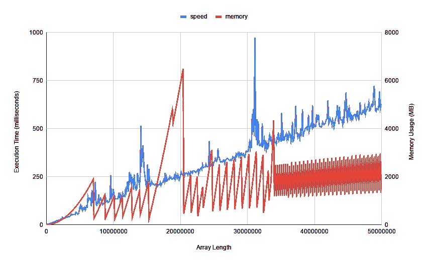
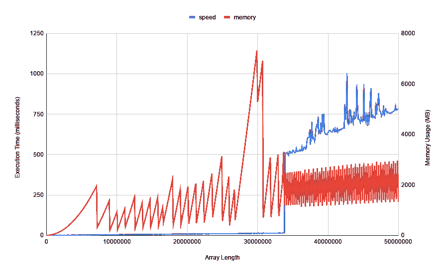
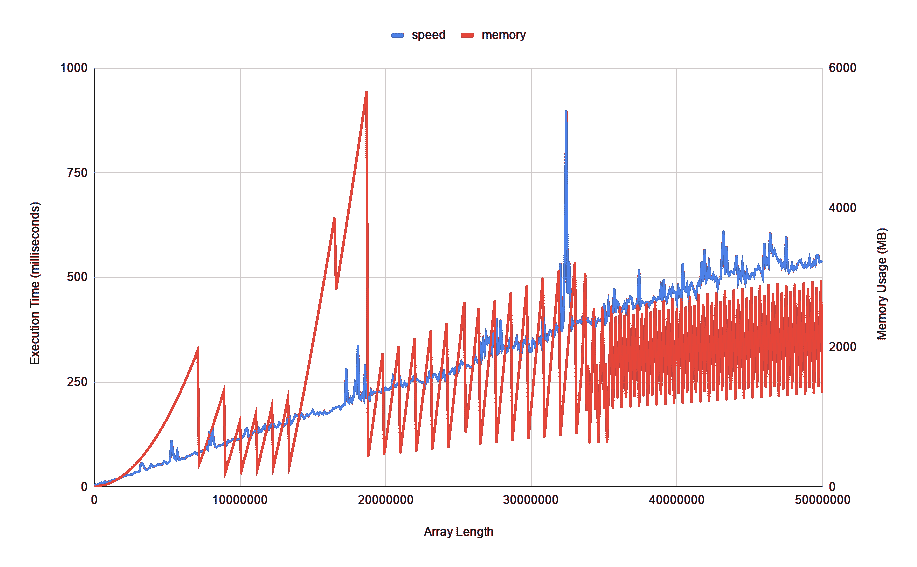
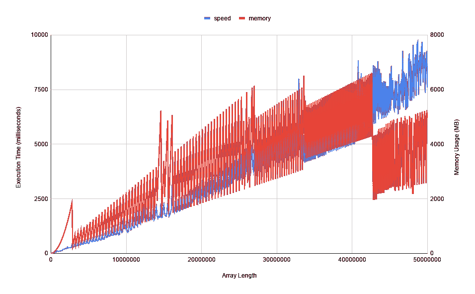
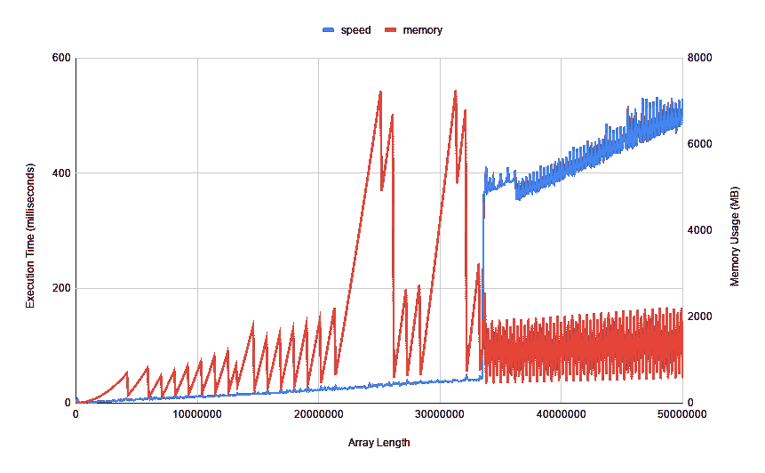
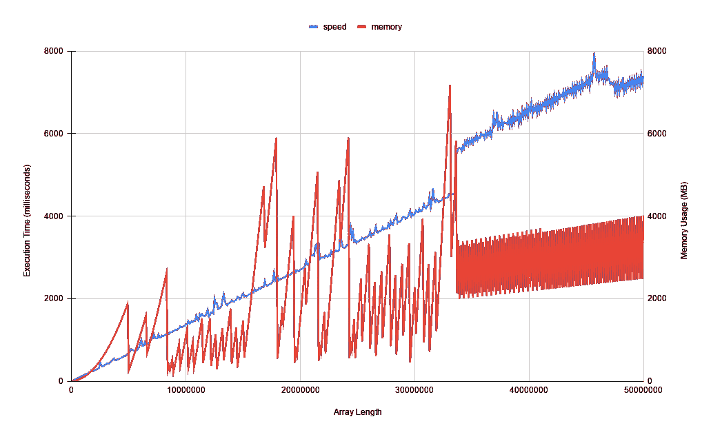
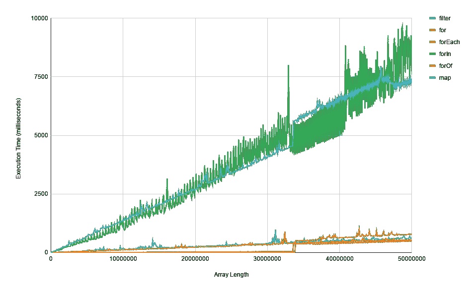
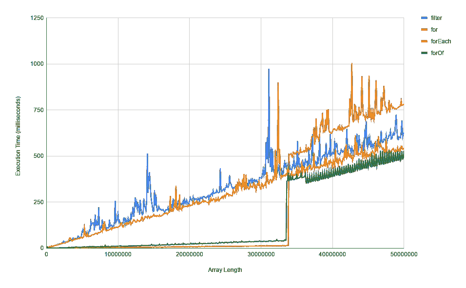
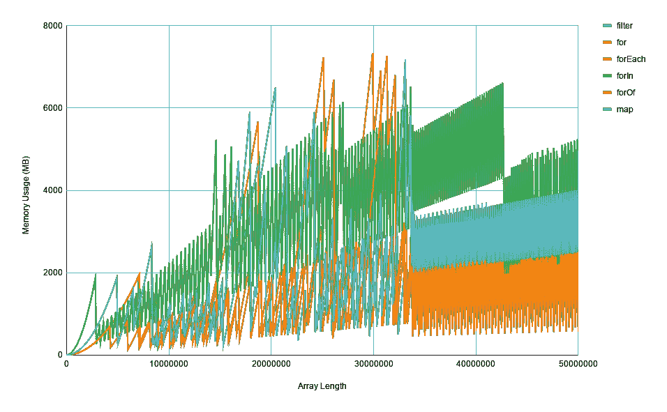

# 你应该使用。map()，。forEach()或。filter()？他们够快吗？

> 原文：<https://blog.devgenius.io/should-you-use-map-reduce-or-filter-are-they-fast-enough-fe3133be8150?source=collection_archive---------1----------------------->

Jonathan Chng 在 [Unsplash](https://unsplash.com?utm_source=medium&utm_medium=referral) 上拍摄的照片

我读了下面的文章，建议在 JavaScript 中使用内置数组函数。我一直听说那些方法比内置的`for`循环要慢很多，但是我自己从来没有实际测量过。

 [## 简化您的 JavaScript——使用。map()，。reduce()和。过滤器()

### 如果你没听说过。map()，。reduce()和。JavaScript 中的 filter()，你可能想学习使用它！

medium.com](https://medium.com/poka-techblog/simplify-your-javascript-use-map-reduce-and-filter-bd02c593cc2d) 

所以，我想现在是时候了。所以，我们去做些测试吧！

# 基线

我运行代码的机器是 MacBook Pro，配有 2.5GHz 四核英特尔酷睿 i7 处理器和 16GB 1600 MHz DDR3 内存。我的节点版本是 12.14.0。

虽然[最大数组长度是 2](https://stackoverflow.com/a/6155063/6496010) ，但我的计算机实际上无法创建具有该长度的数组而不出现`JavaScript heap out of memory`错误。基于本地测试，5000 万长度的数组是我所能达到的最高长度。

# 标准

这些功能将通过两种方式进行判断:

*   内存使用——使用`process.memoryUsage().heapUsed`测量
*   执行速度——使用`Date`对象和一级数学来测量

# 剧本

该脚本创建 500 个增量为 100K 的数组，测量每个代码执行所需的时间，并输出到一个 CSV 文件。

# 参赛者是谁？

*   `filter`
*   `for`
*   `forEach`
*   `for / in`
*   `for / of`
*   `map`

现在，让我们看看每个函数是如何执行的！谁对结果感到兴奋？

由 [Camylla Battani](https://unsplash.com/@camylla93?utm_source=medium&utm_medium=referral) 在 [Unsplash](https://unsplash.com?utm_source=medium&utm_medium=referral) 上拍摄的照片。她当然是！！

# 过滤器

速度线性增加。

记忆图显示每个峰之间的距离在超过 33M 长度后显著缩短。(这个很有意思，但是我还没想明白为什么会这样。).

# 为

速度保持在 20 毫秒以下，直到 33.9 米。然后它跃升至 510 毫秒，并在 50 米时慢慢增加到 782 毫秒。

记忆显示了类似的模式，峰值也在 33 米左右收紧。

# 为每一个

速度线性增加。

记忆遵循类似的模式(你会听到我再说几次)。

# 福林

速度线性增加，但与其他功能相比噪音更大。

记忆不遵循模式。实际上，内存使用量下降了 4300 万左右。

# ForOf

速度遵循与`for`循环相似的模式。峰值出现在 33.6 米处。在峰值出现之前，速度保持在 50 毫秒以下。

记忆遵循正常的模式。

# 地图

速度随着峰值线性上升(你猜对了！)33.4 米。

记忆和以前一样遵循以前的模式。

# 速度结果

让我们比较一下每个函数的速度。

到目前为止，`forIn`和`map`表现最差。让我们把这两个都去掉，以便更清楚地看到其他四个。

`for`是最快的，直到我们达到 33.5 米的长度，但超过这个长度后就变得最慢，此时`forOf`成为速度的明显赢家。

`for`和`forOf`都达到速度急剧增加的点，其中`forEach`和`filter`在整个测试中线性增加。

# 记忆结果

虽然该图非常嘈杂，但我们通常可以看到`for`、`forOf`和`forEach`使用的内存比其余的要少。

# 判决

基于速度和内存数据，`for`循环今天胜出。对于大多数常见的用例(例如，长度小于 3300 万的数组)来说，它是最快的，并且与其他相比，它的内存效率更高。

当然，对于日常编程使用，这些方法中的任何一个都足够快。1M 以下，除了`map`和`for/in`都可以在 10ms 左右完成。

我希望在以后的文章中深入探讨几个开放性的问题。(当然，我欢迎任何有识之士)

1.  为什么`for`和`for/of`循环达到临界点，导致速度急剧下降？和我的硬件有关吗？还是和节点有关？
2.  为什么内存图在大约与#1 相同的临界点处根据`peak width`发生变化？
3.  是什么让`map`明显比`for`循环慢？如果我创建一个空数组，使用 for 循环，并将结果压入新数组，我预计会比`map`快得多。(下次再考！)
4.  为什么`for/in`的表现比`for/of`差那么多？

感谢阅读。这是一个超级有趣的实验，将我的电脑的冷却系统推到了极限(它变得非常非常热)。请随时给我留言！

哦！我的公司正在招人！[查看我们的角色](https://www.skillz.com/careers-list/)！