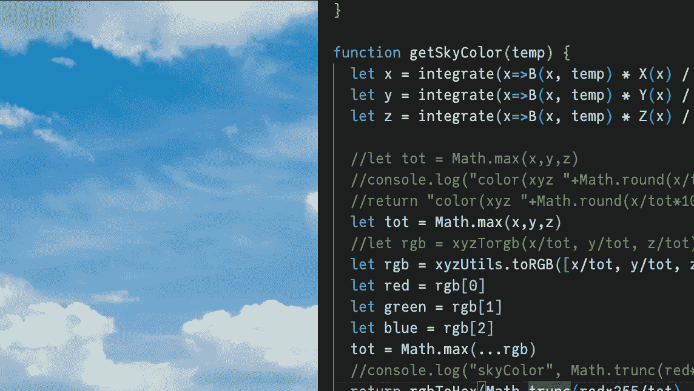
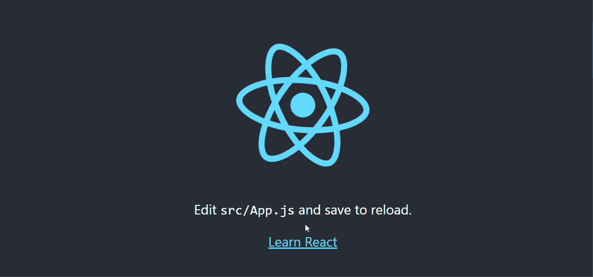
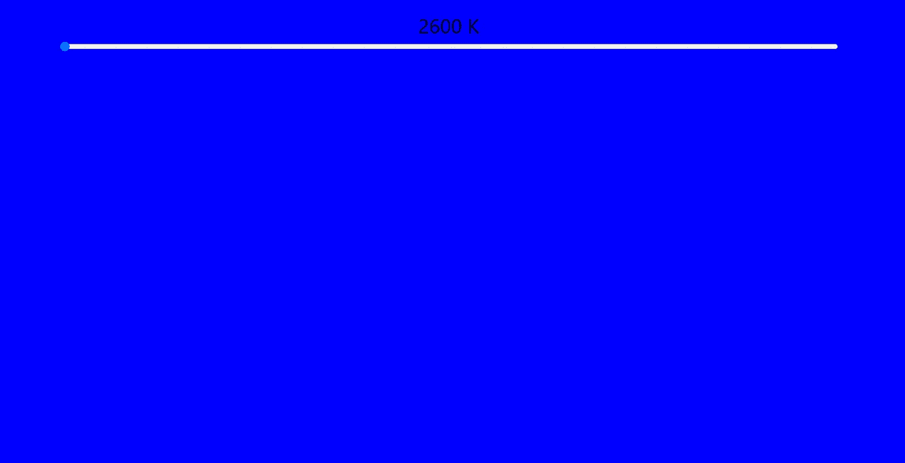
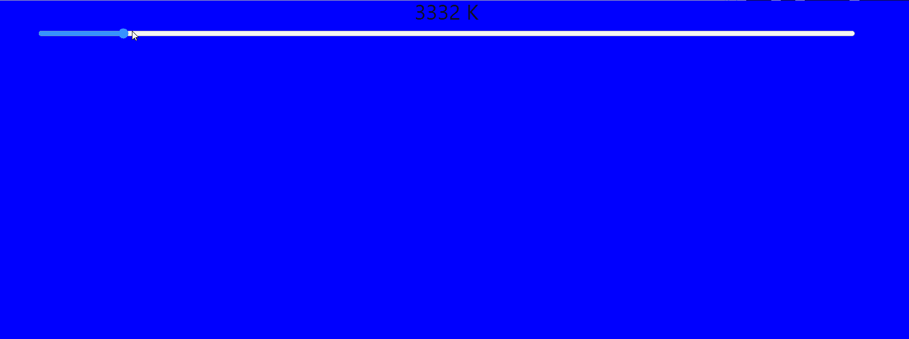
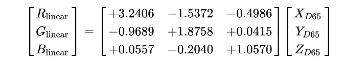
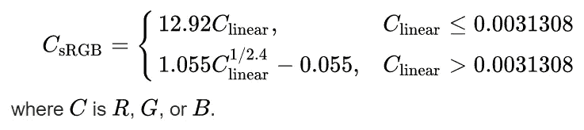
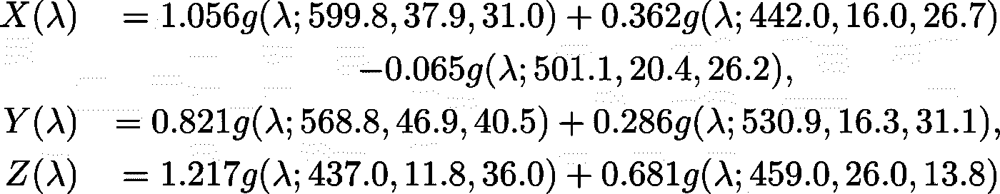
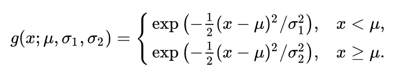
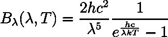
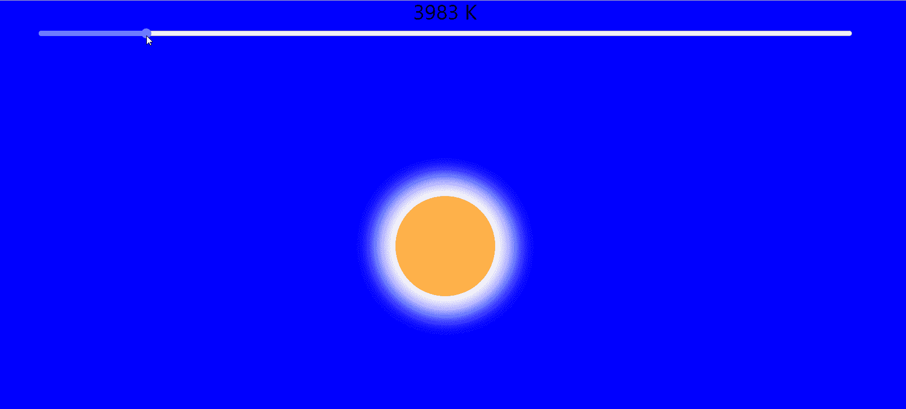

# 如何用 React.js 计算天空的颜色第二部分

> 原文：<https://blog.devgenius.io/show-me-the-sky-is-blue-using-react-js-part-2-a94f5bc0a44b?source=collection_archive---------14----------------------->



这是描述 [**React**](https://reactjs.org/) 的介绍性项目的系列文章的第二篇。你可以在这里阅读第一篇文章,在那里我也讨论了在给定太阳温度的情况下预测天空的颜色。以下内容将向您展示如何用 React 实现我所讨论的内容。[这里的](https://dchang10.github.io/blue-sky/)是最终结果应该是什么样子。

# 密码

## 自举反应

你需要下载并安装节点包管理器( [npm](http://npmjs.com) )来完成这个项目。

React 是一个 JavaScript 库，对于构建动态用户界面非常有用。React 主要用于构建单页 JavaScript 应用程序，但也可以在使用 [next.js](https://nextjs.org/) 进行服务器端渲染的项目中实现。

设置一个 react 应用程序可能会很繁琐，但是你可以用 [create-react-app](https://create-react-app.dev/) 来**引导**这个过程。`cd`到您希望保存和执行项目的文件夹，

```
npm install create-react-app
npx create-react-app blue-sky
```

您应该会看到一个名为 blue-sky 的文件夹。这个文件夹将是我们项目的主页。现在`cd`进入`blue-sky`，你应该会看到以下内容

```
\blue-sky
├── node_modules
├── package-lock.json
├── package.json
├── public
├── README.md
└── src
```

您需要为这个项目安装 mathjs。您可以通过执行 npm 来实现这一点，

```
npm install mathjs
```

现在可以用下面的命令启动 react 服务器，

```
npm start
```

您应该会看到:



`cd`进入`\src`，在你喜欢的文本编辑器中打开`App.js`。文件的内容应该是这样的:

## JSX

如果您以前使用过 HTML，您可能会认出`return`代码块内部的语法。这种类似 HTML **DOM 元素**的语法被称为 **JSX。** JSX 被 [**巴别塔**](https://babeljs.io/) 编译器编译成用于 React 的 JavaScript。create-react-app 已经为你设置好了。

您将需要为我们的网页定义我们自己的 DOM 元素，所以您应该删除`return`代码块的内容，并在它的位置放置天空、太阳和控件的 DOM 元素。您可以用`<div>`元素添加它，并给它们**引用**，以便您的代码与之交互。

添加以下内容作为 return 语句的参数:

与 HTML 一样，您可以以内联方式更改 DOM 元素**的属性。您可以通过更改代码来为 DOM 元素添加一些样式，如下所示:**

> *如果你对这些样式选项的作用感到好奇，你可以查看一下*[*w3schools*](https://www.w3schools.com/)*的 HTML 部分。HTML 的语法通常是在* ***肉串案*** *而不是* ***骆驼案*** *，所以* `*backgroundColor*` *会被称为* `*background-color*` *，但除此之外，名字应该是一样的。*

您的应用程序现在应该看起来像这样:



## 钩住

`ref`关键字定义了对 DOM 元素的引用，这是代码查找和更改 DOM 元素所必需的。 **React-hooks** 将是你在本教程中用来定义引用的对象。

首先需要从 React 导入钩子`useRef`。

现在可以通过将下面的代码插入到`App()`函数体中来定义 DOM 元素的引用。

这些引用将允许您访问和更改代码中 DOM 元素的属性。

你的应用程序的一个重要属性是它的外观由温度决定。因此，谨慎的做法是使用温度来定义应用程序的'*状态*，并编写代码来改变 DOM 元素的属性以响应状态的变化。你可以用`useState`钩子定义状态。编辑您的导入语句，

然后在`App()`函数中插入以下内容:

`useState`将初始状态作为其参数，并返回一个对名为`temperature`的状态的引用。`useState`也返回一个函数，可以用来引起一个叫做`setTemperature`的状态变化。初始温度设定为`3100` K

您的`App.js`文件中的完整代码应该如下所示:

你的温度滑块现在没有任何作用。理想情况下，它应该改变显示在顶部的数字，并改变天空和太阳的颜色，以响应滑块。第一个很容易做到。显示的温度是`temperature`状态的值，因此只需根据滑块改变温度状态。您可以通过向`input` DOM 元素添加一个`onChange` **事件处理程序**来实现这一点，当 DOM 元素的值改变时，它将调用一个函数。

将您的`<input>` DOM 元素更改为:

这就是反作用钩子的魔力所在。请看这段代码:

```
() => {setTemperature(event.target.value);}
```

这个片段就是所谓的匿名**箭头函数。**该函数将用于动态地将温度状态更改为我们的输入滑块的当前值。React 能够做到这一点，因为代码将使用您之前定义的`tempRef`引用找到滑块。

您的应用程序现在应该具有以下行为。



## XYZ 到 sRGB

你需要实现之前在 [*第一部分*](https://medium.com/@dominicchang/show-me-the-sky-is-blue-using-react-js-part-1-f851af7bfc84) 中讨论过的数学。这通常最简单的方法是向后工作，所以这是你将要采取的方法。回想一下，sRGB 值由下式确定:



在`App()`函数外定义一个函数`xyzTorgb`，但在同一个`App.js`文件内，

您还需要将这个 sRGB 值转换成十六进制的**以备后用。您可以使用以下两个函数来实现这一点:**

## 获取 XYZ 值

现在你需要找到天空和太阳的 XYZ 值。这些值是通过将光谱强度与 X、Y、Z 响应函数进行卷积得到的。


由于太阳和天空的光谱强度分布不同，因此它们的 XYZ 值也不同。

你要做的第一件事是定义 X，Y 和 Z 分布，因为它们将用于天空的颜色和太阳的颜色。您可以使用第 1 部分中给出的定义，



对应的代码是:

现在你需要太阳和天空的光谱指数。回想一下，太阳的光谱强度是由黑体辐射体描述的



因此，您可以用以下公式定义黑体光谱辐射亮度:

最后，您需要定义一个积分函数，这样您就可以将所有内容卷积在一起。有很多数值积分算法。你可以采用的一种方法是 [**龙伯格的方法**](https://en.wikipedia.org/wiki/Romberg%27s_method#:~:text=Romberg's%20method%20is%20a%20Newton,only%20a%20few%20derivatives%20exist.) **。**可在[这里](https://autarkaw.wordpress.com/2021/04/14/a-javascript-code-for-romberg-integration/)找到一个示例实现。将以下实现添加到您的代码中:

这个集成函数使用您在本教程开始时安装的`mathjs`库。您需要将它导入 react 应用程序，并在代码引用的全局范围内实例化它。您可以使用以下代码来实现这一点:

现在你可以把所有的东西放入一个函数中，这个函数将给出在给定温度下太阳的计算颜色。

> **注意**:由于波长很小，你可能很难从积分中得到合理的答案。本教程中使用的示例实现将波长重新调整为更小的单位，以解决这个问题。

您现在可以告诉 React 动态地将太阳的颜色设置为由您的`getSunColor`函数计算出的任何波长。改变，

到

它将背景颜色设置为`getSunColor` 函数的输出。

## 造型元素

你可能会注意到你仍然缺少一个太阳，或者你的太阳看起来不是圆形的。你需要设计你的`div`元素来获得正确的太阳外观。你可以用 **CSS** 来实现。

打开`App.css`文件，并在文件底部添加以下内容:

上面的代码描述了带有`className`太阳的`<div>`元素的样式。你现在应该可以看到你的太阳了，它应该会对你的滑块做出反应。您的应用程序应该具有以下行为:



## 收尾工作

你的太阳会变色，但天空不会。你可以重复你对太阳做的同样的步骤来得到天空相应的颜色。回想一下天空的光谱辐射亮度是由瑞利散射描述的，


**I₀** 是源光谱辐射亮度，在这种情况下是太阳的光谱辐射亮度。你可能还记得，计算天空的颜色只需要λ的四次方关系。所以你可以忽略这里的大部分术语，在`App.js`中定义下面的函数

`getSkyColor`与`getSunColor`相同，但是`integrate`的参数包括前面提到的额外的λ到第四个依赖项。现在对天空的`backgroundColor`做和对太阳一样的操作。改变，

到，

恭喜你！你已经用 React 向某人展示了天空的颜色。最终的应用程序应该是这样的:

