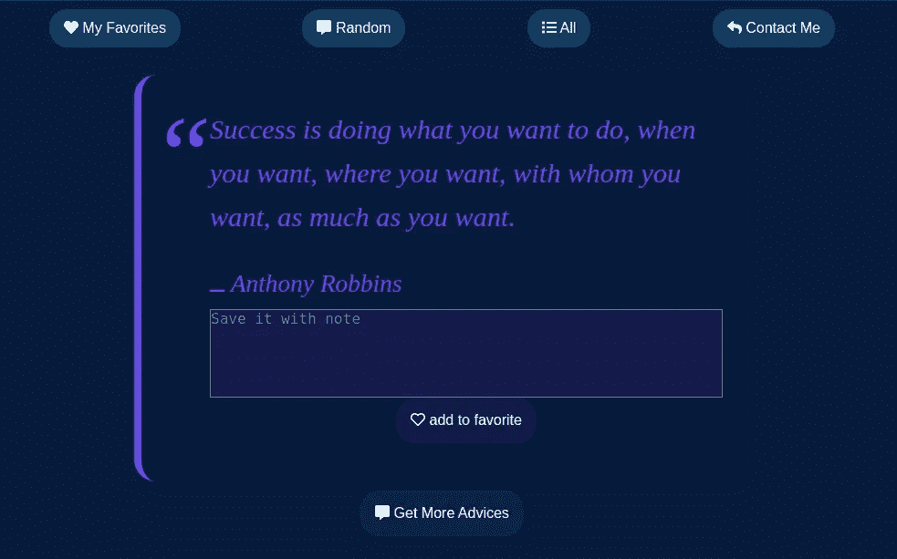
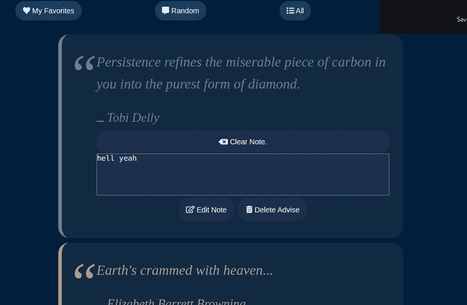
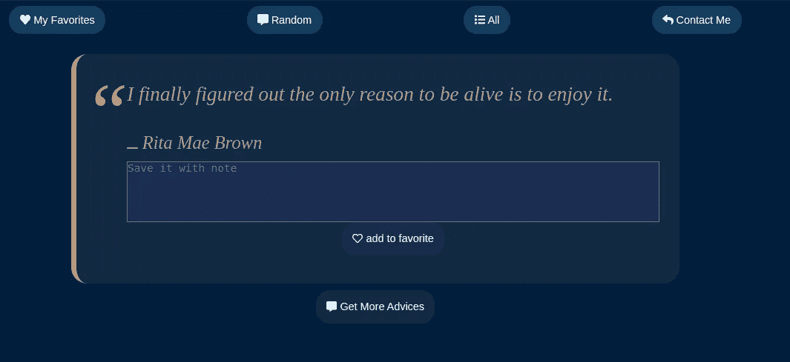
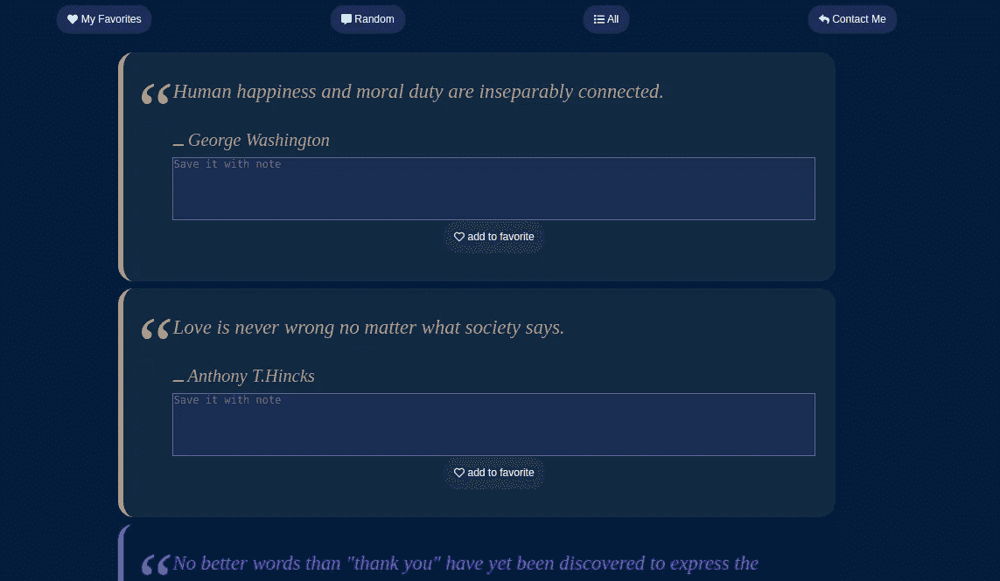
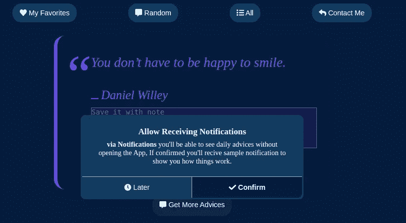
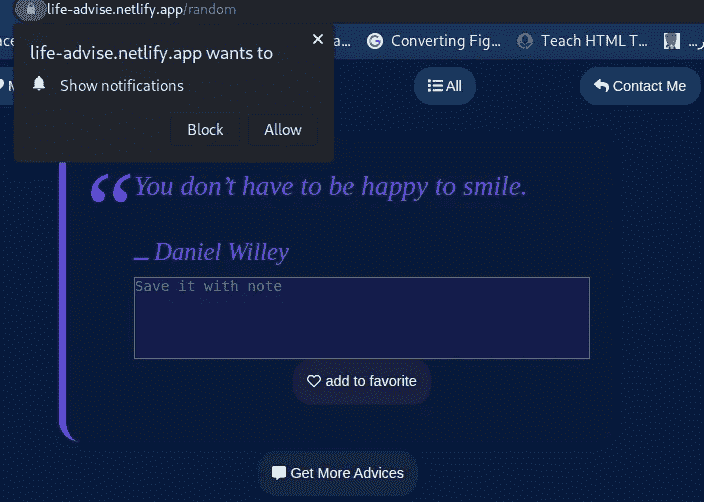
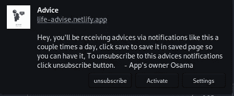
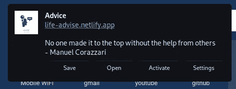

# 副业:生活建议网络应用

> 原文：<https://blog.devgenius.io/side-project-life-advise-web-app-aa8fc1fc25d7?source=collection_archive---------7----------------------->

## 离线优先 PWA，用于获取建议和向用户发送通知。

[第一页](https://life-advise.netlify.app/)

# 关于应用程序:

离线首先，全功能的报价和建议生成器 web 应用程序获得一些关于生活、成功、金钱等的精彩建议。

 [## 生活建议

### 使用 create-react-app 创建的网站

life-advise.netlify.app](https://life-advise.netlify.app/random) 

主要目标是阅读随机的建议和引用，你可以保存你喜欢的引用并添加一些关于它的注释。

如果你愿意，该应用程序将每天向你发送通知，通知包含随机的建议和报价，你可以在不需要或打开应用程序的情况下保存它，或者如果你想在应用程序中看到它，你可以打开它，添加注释并保存它，或者只查看其他的。

## 应用程序的回购:

 [## GitHub-Osama 865/生活建议-客户端

### 这个项目是用 Create React App 引导的。在项目目录中，您可以运行:在…中运行应用程序

github.com](https://github.com/osama865/life-advice-client)  [## GitHub-Osama 865/生活建议-服务器

### 此时您不能执行该操作。您已使用另一个标签页或窗口登录。您已在另一个选项卡中注销，或者…

github.com](https://github.com/osama865/life-advise-server)  [## osama865 -概述

### 此时您不能执行该操作。您已使用另一个标签页或窗口登录。您已在另一个选项卡中注销，或者…

github.com](https://github.com/osama865/) 

[App 页面:](#35c6)
∘ [收藏夹:](#8fe1)
∘ [随机:](#b42c)
∘ [全部:](#8f7b)
[技术我用过:](#a961)
∘ [客户端技术:](#a20b)
[通知部分:](#aa88)
∘ [按钮:](#f792)
[服务器端技术:](#39d9)
∘

# 应用程序页面:

## 收藏夹:

此页包含您最喜欢的建议，您可以修改您随建议一起写的注释或将其从保存的中删除。

保存的页面

## 随机:

从数据库中获取随机建议并显示给你，这样你可以保存它或获取另一个。

随机页面

## 全部:

如果你喜欢给定的建议，并希望阅读它们，这一页是为你准备的，你可以通过数百甚至数千种设备，在随机页面上，你每次只有一条建议，但这里没有限制，所以你可以随意阅读，想读多少就读多少。

所有页面

# 我使用的技术:

## 客户端技术:

***react:***
我的主要工作是在 MERN，在那里我总是使用 react 来构建交互式 ui，基于组件的应用程序，并考虑到可重用性。

 [## react——用于构建用户界面的 JavaScript 库

### React 使得创建交互式 ui 变得不那么痛苦。为应用程序中的每个状态设计简单的视图，并反应…

reactjs.org](https://reactjs.org/) 

***react-router:* 一个允许你在 web app 中处理路由的工具，使用动态路由**。
处理应用程序页面的路由和导航。

 [## 面向任意规模 React 应用的声明式路由| React 路由器

### 跳到内容近十年来，React Router v6 采用了以前版本的最佳功能…

reactrouter.com](https://reactrouter.com/) 

***服务人员:***

> 服务工作者是一种网络工作者。它本质上是一个 JavaScript 文件，独立于主浏览器线程运行，拦截网络请求，缓存或从缓存中检索资源，并传递推送消息。

使我的 web 应用程序可安装，并添加更多功能，如接收通知和采取行动，而无需打开应用程序。

***PWA:*** 渐进式 web 应用程序(PWA)是 *web 应用程序，它使用服务工作者、清单和其他 Web 平台功能，并结合渐进式增强，为用户提供与本机应用程序同等的体验。*

 [## 渐进式网络应用

### 网站提供了所有正确的维生素。

网络开发](https://web.dev/progressive-web-apps/) 

***IndexedDB 和 dexie.js:***

> 索引数据库 API 是由 web 浏览器提供的 JavaScript 应用程序编程接口，用于管理 JSON 对象的 NoSQL 数据库。

我决定赞同 [indexedDB](https://developer.mozilla.org/en-US/docs/Web/API/IndexedDB_API) 来保存用户的建议，而不是为了更简单、更高效和发现新技术而将用户的最爱存储在服务器上。

 [## Dexie.js

### 使用 IndexedDB 最简单的方法。一个轻量级的、极简的包装器，它为…

dexie.org](https://dexie.org/) 

简单地说，当你想保存建议时，它将被存储在 indexedDB 存储器中，即使你离线，也可以随时获取。

您还可以修改笔记，删除已保存的笔记，而无需连接互联网(因为 indexedDB 是浏览器存储，不会通过网络传输数据)。

***缓存:*** 离线应用程序的支柱是缓存，当应用程序第一次加载时，它将所需的页面存储在缓存中，这样下次您的页面将从缓存而不是服务器中提供。

您的应用程序有一些缓存策略，以下是有用的链接

 [## 下一个 PWA 应用的 5 个服务人员缓存策略

### 我们可以在服务人员中使用一些方法或策略来响应“获取”事件。这些策略决定了如何…

blog.bitsrc.io](https://blog.bitsrc.io/5-service-worker-caching-strategies-for-your-next-pwa-app-58539f156f52)  [## 前端缓存策略

### 前端缓存是一种很大程度上未被充分利用的技术，但是如果使用正确，它可以是一种非常强大的优化。一个好…

medium.com](https://medium.com/@brockreece/frontend-caching-strategies-38c57f59e254)  [## JavaScript 中缓存的威力

### 随着我们的应用程序变得越来越大，对性能的需求也在增长。性能可以通过缓存来实现。这是一个…

jsmanifest.com](https://jsmanifest.com/the-power-of-caching-in-javascript/) 

# 通知部分:

两步许可请求中的双重选择

我选择使用**双选入两步许可请求**推送通知来获得良好的用户体验等等。第一个弹出窗口会告诉你为什么应用程序需要通知权限，当你觉得可以接受时，真正的权限请求会显示给你。

为什么你应该在两步权限请求中使用**double opt-in:** 向用户简要描述你的应用程序将如何使用通知，这比丑陋的标准权限请求更友好，标准权限请求只告诉用户允许或阻止

当你使用单一选择加入一步权限请求时，你的用户将无法知道你为什么需要为他们推送通知！也许他们会认为你在欺骗他们，最糟糕的事情是他们会阻止你的网站推送通知。

当用户知道你为什么需要通知时，他们会对你的应用程序更放心，这增加了你的许可请求被允许的机会

在两步权限请求中使用双重选择最重要的一点是，您将有另一个机会向您的用户请求通知权限。

 [## 您需要了解的关于 PWAs 的一切—推送通知

### 向您的应用添加推送通知，以提高用户参与度

better 编程. pub](https://betterprogramming.pub/everything-you-need-to-know-about-pwas-push-notifications-e870bb54e14f)  [## 如何优化渐进式网络应用:超越基础——粉碎杂志

### 渐进式网络应用被证明可以提高用户参与度，并有效降低成本。构建一个现代化的…

www.smashingmagazine.com](https://www.smashingmagazine.com/2020/12/progressive-web-apps/#user-friendly-notifications-and-permission-requests) 

当您在第一个弹出窗口上单击确认时，真实的会出现并请求许可。

许可请求

如果允许，我们将向您发送一封欢迎样本通知，如果您对此功能不满意，可通过取消订阅选项停止接收通知。

带有取消订阅按钮的欢迎通知

典型的通知看起来会像这样，建议或引用的文本与谁说的或作者。

通常的通知会是这样的

## 按钮:

点击“保存”按钮，打开应用程序，将建议或引用添加到您最喜欢的白板中。神奇吧？！

“打开”按钮将打开应用程序，您将能够在应用程序中看到单击的建议或报价，因此您可以添加注释并保存它们或查看其他注释。

我希望我可以添加更多的通知按钮，这样用户就可以采取更多的行动。

# 服务器端技术:

## 节点 js:

Node.js 是一个免费、开源、跨平台的 JavaScript 运行时环境，允许开发人员在浏览器之外编写命令行工具和服务器端脚本。

在后端，我使用 node js 运行我的服务器代码。

 [## 节点. js

### Node.js 是基于 Chrome 的 V8 JavaScript 引擎构建的 JavaScript 运行时。

nodejs.org](https://nodejs.org/) 

## 快递. js:

Express 是一个最小且灵活的**节点**。 **js** web 应用程序框架，为 web 和移动应用程序提供了一组健壮的特性。

我使用 express 创建端点并轻松处理请求和响应

 [## Express - Node.js web 应用程序框架

### Express 是一个最小且灵活的 Node.js web 应用程序框架，它为 web 和…

expressjs.com](https://expressjs.com/) 

## 网页推送:

网络推送要求从后端触发的推送消息通过[网络推送协议](https://tools.ietf.org/html/draft-ietf-webpush-protocol)完成，如果您想通过推送消息发送数据，您还必须根据[网络推送消息加密规范](https://tools.ietf.org/html/draft-ietf-webpush-encryption)对数据进行加密。

该模块使发送消息变得容易，并且还将处理对依赖 GCM 进行消息发送/交付的浏览器的遗留支持。

我利用 web-push 库从我的服务器向用户发送通知。

 [## 网络推送

### 网络推送要求通过网络推送协议从后端触发推送消息，如果您想发送…

www.npmjs.com](https://www.npmjs.com/package/web-push)  [## 使用服务工作器开始使用 Node.js 中的推送通知

### 推送通知是当手机或网络应用程序正在执行另一个…

www.section.io](https://www.section.io/engineering-education/push-notification-in-nodejs-using-service-worker/) 

## mongodb.js:

官方的 MongoDB Node.js 驱动程序允许 Node.js 应用程序连接到 MongoDB 并处理数据。这个驱动程序有一个异步 API，允许你使用承诺或者通过传统的回调来与 MongoDB 交互。

为了简单和快速开发，我使用了 mongodb.js 驱动程序，它用于连接您的服务器和数据库(例如 mongo atlas)

 [## Node.js 的 MongoDB 官方 MongoDB 驱动升级到 4 版？请点击此处查看我们的升级指南！认为你已经…

### Node.js 官方 MongoDB 驱动升级到 4 版？请点击此处查看我们的升级指南！认为你已经…

www.npmjs.com](https://www.npmjs.com/package/mongodb)  [## MongoDB 和 Node.js 教程——CRUD 操作

### 在本系列的第一篇文章中，我向您展示了如何从 Node.js 脚本连接到 MongoDB 数据库…

www.mongodb.com](https://www.mongodb.com/developer/quickstart/node-crud-tutorial/)  [## 使用 MongoDB CRUD 操作的 node JS:6 个简单步骤-学习| Hevo

### Node.js 是使用最广泛的 JavaScript 框架。众所周知，它为应用程序提供了高速…

hevodata.com](https://hevodata.com/learn/node-js-with-mongodb-crud/) 

# 部署:

## 网络生活:

Netlify 是一个成倍提高生产力的网络开发平台。通过统一现代解耦网络的元素，从本地开发到先进的边缘逻辑，Netlify 能够以 10 倍的速度实现更高性能、更安全、更可扩展的网站和应用。

对我来说，在部署 react 或任何客户端项目时，netlify 总是我的首选。

我强烈推荐使用 netlify，因为它有独特的特性，它可以让您轻松地部署和维护您的应用程序，并具有持续部署等特性

 [## Netlify:在创纪录的时间内开发和部署最佳网络体验

### 结合您最喜爱的工具和 API 来构建最快的网站、商店和应用程序的最快方式…

www.netlify.com](https://www.netlify.com/)  [## 将 React 应用部署到 Netlify 的指南

### 部署是将我们的代码从源代码控制系统移动到托管平台并在那里存储的过程…

stackabuse.com](https://stackabuse.com/guide-to-deploying-a-react-app-to-netlify/) 

## 赫鲁科:

Heroku 是一个基于容器的云平台即服务(PaaS)。开发者使用 Heroku **来部署、管理和扩展现代应用**。我们的平台优雅、灵活且易于使用，为开发人员将应用推向市场提供了最简单的途径。

当我要部署 node js app 的时候，我唯一能想到的主机就是 heruko。
虽然免费计划有其缺点，而且价格比其他解决方案稍贵，但我仍然喜欢它

 [## 使用 Node.js 开始使用 Heroku

### 本教程将让您在几分钟内将 Node.js 应用程序部署到 Heroku。再坚持几分钟，学习如何…

devcenter.heroku.com](https://devcenter.heroku.com/articles/getting-started-with-nodejs)  [## 构建 Node.js 应用程序并将其部署到 Heroku

### 向您展示如何构建 Node.js 应用程序并将其部署到 Heroku 的教程。

developer.okta.com](https://developer.okta.com/blog/2022/02/28/build-deploy-node-app-heroku) 

## 数据库:

***MongoDB Atlas:***
MongoDB Atlas 是**一个完全托管的云数据库，可以处理在您选择的云服务提供商** (AWS、Azure 和 GCP)上部署、管理和修复您的部署的所有复杂性。MongoDB Atlas 是在云中部署、运行和扩展 MongoDB 的最佳方式。

 [## MongoDB Atlas 教程

### 为了访问您的 MongoDB Atlas 集群，您需要为您的网络或 IP 地址启用网络访问，并且…

www.mongodb.com](https://www.mongodb.com/basics/mongodb-atlas-tutorial) 

# 即将推出的功能:

## 设置页面:

让应用程序完全由用户定制
用户可以修改主题和设置每天的通知数量
个性化建议标签，以便只获得对您重要的建议(关系、成功、金钱、灵感等)
通知设置，例如您希望应用程序何时发送通知以及通知声音，以及您是否希望取消订阅此功能
以及您希望在通知中看到哪些按钮。

## 搜索建议:

一个小图标，允许您对建议及其作者进行简单的搜索。

## 动画:

让他们感觉良好，流畅地处理动画，这样用户就不会对严格的视图感到厌烦。

## 复制建议:

一个小图标，允许你复制你看到的建议及其作者，并将其发送给你的朋友。

## 为第三方服务创建 API:

我想与其他开发人员共享我的数据库，所以在未来，我将为数据库公开 API，这样任何人都可以获取和使用那里的数据。

更多的应用程序性能的增强和改进，使它更加定制和用户友好。

***请*** 如果您有任何问题或您想要的功能或建议让我改进我的应用程序，或者您想报告一个错误，请随时联系我。

[Twitter](https://twitter.com/Osam1010) ， [Email](http://osama0000ibrahim@gmail.com) ，此处中或访问[我的作品集](http://o-portfolio.netlify.com/)。

# 对我有帮助的资源:

 [## 渐进式网络应用培训|谷歌开发者

### 编辑描述

developers.google.com](https://developers.google.com/web/ilt/pwa)  [## 渐进式网络应用

### 网站提供了所有正确的维生素。

网络开发](https://web.dev/progressive-web-apps/)  [## 渐进式网络应用程序(pwa)| MDN

### 渐进式 web 应用程序(PWAs)是使用服务人员、清单和其他 web 平台功能的 Web 应用程序…

developer.mozilla.org](https://developer.mozilla.org/en-US/docs/Web/Progressive_web_apps)  [## PWAs 电源提示-首次开发

### 改善设计和用户体验# pwa # ios # android #桌面渐进式网络应用(pwa)是当前…

第一个开发](https://firt.dev/pwa-design-tips)  [## 如何优化渐进式网络应用:超越基础——粉碎杂志

### 渐进式网络应用被证明可以提高用户参与度，并有效降低成本。构建一个现代化的…

www.smashingmagazine.com](https://www.smashingmagazine.com/2020/12/progressive-web-apps/)  [## 您需要了解的关于 PWAs 的一切—推送通知

### 向您的应用添加推送通知，以提高用户参与度

better 编程. pub](https://betterprogramming.pub/everything-you-need-to-know-about-pwas-push-notifications-e870bb54e14f)  [## 推送通知 2022 年全指南(更新)

### 推送通知会引起用户的直接关注。如果您正确设计了推送通知，并在以下位置发送它们…

uxcam.com](https://uxcam.com/blog/push-notification-guide/)  [## 如何优化渐进式网络应用:超越基础——粉碎杂志

### 渐进式网络应用被证明可以提高用户参与度，并有效降低成本。构建一个现代化的…

www.smashingmagazine.com](https://www.smashingmagazine.com/2020/12/progressive-web-apps/#the-application-works-offline-as-it-does-online) 

感谢您的阅读，如果您有任何关于 javascript 或本系列的问题，请随时提问，我非常感谢您对我的内容的任何反馈。

在 [Twitter](https://twitter.com/Osam1010) 、 [Github](https://github.com/osama865/) 和 [my portfolio](http://o-portfolio.netlify.com/) 上找到我。