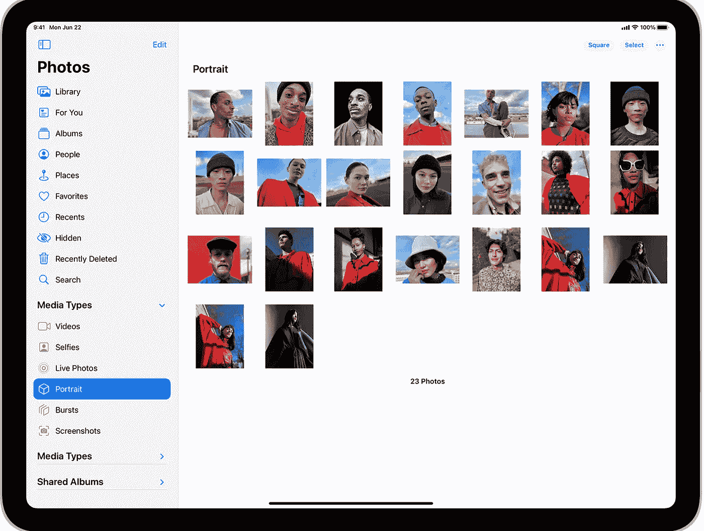
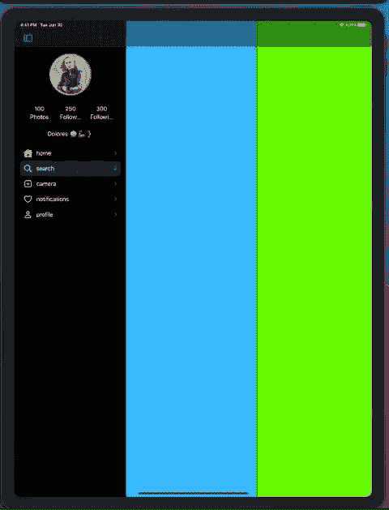

# iPad iOS 14 中的侧边栏，解释过。

> 原文：<https://blog.devgenius.io/sidebar-in-ipad-ios-14-explained-2617ffef09fa?source=collection_archive---------0----------------------->



[https://developer . apple . com/design/human-interface-guidelines/IOs/bars/sidebars/](https://developer.apple.com/design/human-interface-guidelines/ios/bars/sidebars/)

侧栏是我们应该如何在 iPad 中为 iOS 14 中的非紧凑模式环境创建分层导航系统。

好吧，但是边栏实际上是什么呢？只是一个视图控制器，它有一个集合视图，使用了**新的**侧栏外观列表布局。

(不想看你的东西😡，[给我代码](https://github.com/jamesrochabrun/iPadSideBar)

自从 iOS 14 苹果推出了[UICollectionLayoutListConfiguration](https://developer.apple.com/documentation/uikit/uicollectionlayoutlistconfiguration)以来，这是对`UICollectionViews`的一个令人难以置信的改进，它允许我们为收藏视图使用一组已定义的配置。

[来自文档](https://developer.apple.com/design/human-interface-guidelines/ios/bars/sidebars/)。

> 通过使用侧栏样式的列表并将其放在拆分视图的主栏中，可以创建侧栏。有关相关指南，请参见[分割视图](https://developer.apple.com/design/human-interface-guidelines/ios/views/split-views/)。
> 
> 将正确的外观应用于侧边栏。若要创建侧栏，请使用收藏视图列表布局的侧栏外观。有关开发人员指南，请参见[uicollectionlayoutlist configuration . appearance .](https://developer.apple.com/documentation/uikit/uicollectionlayoutlistconfiguration/appearance)

好了，让我们来构建一个，我们将使用所有可用的新集合视图 API，包括新的单元注册。如果你还没有看过，我强烈推荐你看史蒂夫布林的《WWDC 2020 年收藏观点进展》。

在 iOS 14 中使用收藏视图时，你总是需要实现 3 个重要的部分。

1-提供布局。

2-配置不同的数据源、单元格和页眉/页脚注册包括在此步骤中。

3-应用快照。

在我们开始这三个步骤之前，我们需要创建将在每个单元格上显示的模型。这里有一个提示，您可以创建一个共享视图模型来定义导航选项卡项目，您可以在您的选项卡栏控制器和侧栏中使用，它看起来像这样…

*(是的，在这篇文章的后面，我们还将为 split view*`UISPlitViewController.Column`*`*.compact*` *添加一个标签栏控制器。)**

```
*// MARK:**- ViewModel****enum** TabsViewModel: String, CaseIterable {
// 1
 **case** home
 **case** search
 **case** camera
 **case** notifications
 **case** profile/// Return:- the tab bar icon using SF Symbols**// 2
 var** icon: UIImage? {
  **switch** **self** {
   **case** .home: **return** UIImage(systemName: "house.fill")
   **case** .search: **return** UIImage(systemName: "magnifyingglass")
   **case** .camera: **return** UIImage(systemName: "plus.app")
   **case** .notifications: **return** UIImage(systemName: "suit.heart")
   **case** .profile: **return** UIImage(systemName: "person")
  }
}/// Return:- the tab bar title**// 3
var** title: String { rawValue }/// Return:-  the master/primary `topViewController`,  it instantiates a view controller using a convenient method for `UIStoryboards`.**// 4
var** primaryViewController: UIViewController  {
  **switch** **self** {
    **case** .home: **return** HomeViewController()
    **case** .search: **return** SearchViewController()
    **case** .camera: **return** CameraViewController()
    **case** .notifications: **return** NotificationsViewController()
    **case** .profile: **return** UserProfileViewController()
  }
 }
}*
```

*1-创建代表应用程序主要导航层次的案例。*

*2-提供一个图标图像，科幻符号是可怕的。*

*3-为每个案例提供一个标题，这将是侧栏所需要的。*

*4-为每个案例创建一个提供`primaryViewController`的便捷方式。*

*好了，现在我们有了一个视图模型，我们可以从侧边栏开始，只需创建一个视图控制器，内部视图就会加载…*

```
***override** **func** viewDidLoad() { **super**.viewDidLoad() configureCollectionViewLayout() // 1 Configure the layout configureDataSource() // 2 configure the data Source applyInitialSnapshots() // 3 Apply the snapshots.}*
```

*让我们看看这些方法中包含了什么:*

***第一步:**配置布局**。***

```
***private** **func** configureCollectionViewLayout() {
 collectionView.collectionViewLayout = createLayout()
}**private** **func** createLayout() -> UICollectionViewLayout {**let** sectionProvider = { (sectionIndex: Int, layoutEnvironment: NSCollectionLayoutEnvironment) -> NSCollectionLayoutSection? **in****// 1
let** section = NSCollectionLayoutSection.list(using: .init(appearance: .sidebar), layoutEnvironment: layoutEnvironment)**//2 
let** headerFooterSize = NSCollectionLayoutSize(widthDimension: .fractionalWidth(1.0),heightDimension: .estimated(200))**let** sectionHeader = NSCollectionLayoutBoundarySupplementaryItem(layoutSize: headerFooterSize,elementKind: SideBarViewController.sectionHeaderElementKind, alignment: .top)section.boundarySupplementaryItems = [sectionHeader]**return** section}
// 3
**return** UICollectionViewCompositionalLayout(sectionProvider: sectionProvider)}*
```

*1-新的[uicollectionlayoutlist 配置。外观](https://developer.apple.com/documentation/uikit/uicollectionlayoutlistconfiguration/appearance) `.sideBar`对，就是它。🔥*

*2–定义章节标题的估计大小。*

*3-返回一个`UICollectionViewCompositionalLayout.`的实例*

***第二步**:配置不同的数据源。*

```
***private** **func** configureDataSource() {/// 1 - header registration **let** headerRegistration = UICollectionView.SupplementaryRegistration<CollectionReusableView<ProfileInfoView>>(elementKind: "Header") {(supplementaryView, string, indexPath) **in** supplementaryView.subView.configureWith(UserProfileViewModel.stub)}/// 2 - data source dataSource = UICollectionViewDiffableDataSource<Section, TabsViewModel>(collectionView: collectionView) {(collectionView, indexPath, item) -> UICollectionViewCell? **in
 return** collectionView.dequeueConfiguredReusableCell(using:     **self**.configuredOutlineCell(), for: indexPath, item: item)}/// 4- data source supplementaryViewProvider dataSource.supplementaryViewProvider = { view, kind, index **in** **return** **self**.collectionView.dequeueConfiguredReusableSupplementary(using: headerRegistration, for: index)}}// 3
**private** **func** configuredOutlineCell() -> UICollectionView.CellRegistration<UICollectionViewListCell, TabsViewModel> { UICollectionView.CellRegistration<UICollectionViewListCell, TabsViewModel> { cell, indexPath, item **in
   var** content = cell.defaultContentConfiguration()
   content.text = item.title
   content.image = item.icon
   content.imageProperties.tintColor = .white
   cell.contentConfiguration = content
   cell.accessories = [.disclosureIndicator()]
  }
}*
```

*1-为节注册一个标题，元素种类字符串将定义是否应该显示为标题或页脚。*

*2-定义不同的数据源，并使用`dequeConfiguredReusableCell`配置单元格。*

*3-如果你还没有看过 [WWDC 现代细胞配置](https://developer.apple.com/videos/play/wwdc2020/10027)，看看吧！*

*4-`suppleMentaryViewProvider`配置页眉/页脚的内容。*

***第三步**:应用快照。*

```
***private** **func** applyInitialSnapshots() {**//1
 let** sections = Section.allCases// 2
 **var** snapshot = NSDiffableDataSourceSnapshot<Section, TabsViewModel>()
 snapshot.appendSections(sections)
 dataSource.apply(snapshot, animatingDifferences: **false**) **var** outlineSnapshot = 
// 3
NSDiffableDataSourceSectionSnapshot<TabsViewModel>()
 outlineSnapshot.append(TabsViewModel.allCases)
 dataSource.apply(outlineSnapshot, to: .list, animatingDifferences: **false**)
}*
```

*1- `Section`是视图控制器中定义的枚举。*

*2-为整个数据源定义快照。*

*3-新！`[NSDiffableDataSourceSectionSnapshot](https://developer.apple.com/documentation/uikit/nsdiffabledatasourcesectionsnapshot)`在 iOS 14 中:*

> *节快照表示集合视图或表视图中单个节的数据。通过节快照，您可以设置在视图的单个节中显示的数据的初始状态，并在以后更新该数据。*

*就是这样！现在我们有了一个工作侧栏，看起来像这样…*

**

*现在，还记得我们在开始时说过，我们将显示一个选项卡栏控制器作为紧凑模式的主导航系统吗？好吧，如果你在 iOS 14 之前使用过 iPad 应用程序，你就会知道实现这一点的痛苦，幸运的是苹果公司推出了一种简单的方法来做到这一点，只需在`setViewControllers`方法中为`.compact`提供一个视图控制器，这就是你需要在`SceneDelegate`文件中做的一切…*

```
***func** scene(**_** scene: UIScene, willConnectTo session: UISceneSession, options connectionOptions: UIScene.ConnectionOptions) {**guard** **let** **_** = (scene **as**? UIWindowScene) **else** { **return** }// 1
**let** sideBar = SideBarViewController.instantiate(from: "Main")
**let** supplementaryViewController = SupplementaryViewController()
**let** secondaryViewController = SecondaryViewController()**//2
let** tabBarController = TabBarController()// 3
**let** splitViewController = UISPlitViewController(style: .tripleColumn)
splitViewController.setViewController(sideBar, for: .primary)
splitViewController.setViewController(supplementaryViewController, for: .supplementary)
splitViewController.setViewController(secondaryViewController, for: .secondary)
// 4
splitViewController.setViewController(tabBarController, for: .compact)window?.rootViewController = splitViewController
window?.makeKeyAndVisible()}*
```

*1-为每个`UISPlitViewController.Column`案例创建一组视图控制器。*

*2-`UITabBarController`的一个实例，可能看起来像这样，或者你想要的样子…*

```
***final** **class** TabBarController: UITabBarController { **override** **func** viewDidLoad() {
     **super**.viewDidLoad()
// 1
     viewControllers = TabsViewModel.allCases.map {
     **let** rootNavigationController =
     UINavigationController(rootViewController:        $0.primaryViewController)
     rootNavigationController.tabBarItem.image = $0.icon
     **return** rootNavigationController
   }
  }
}*
```

*3-现在你可以使用`UISPlitViewController.Style`初始化器实例化 2 或 3 列的分割视图控制器。*

*为紧凑的宽度提供任何种类的视图控制器都是非常容易的！🤯*

*当你的应用从常规宽度变为紧凑宽度时，它会自动适应…*

**

*特质集合变化。*

*为 iPad 实现侧边栏时需要考虑的一些事情…*

*   *使用侧边栏来组织应用程序级别的信息。*
*   *只要有可能，让人们自定义侧边栏的内容。*
*   *不要阻止人们隐藏侧栏。*
*   *保持侧边栏中的标题清晰简洁。*
*   *一般来说，不要在一个侧边栏中暴露两层以上的层次结构。*

*最后，值得一提的是，虽然显示紧凑模式的视图控制器非常容易，但有一个问题，我们需要让我们的应用程序恢复其导航状态，以便用户在应用程序特征改变时进入正确的视图控制器。*

*这是另一个故事，我目前正在学习:)，如果你想进一步研究，这里有一些资源…*

 *[## Apple 开发者文档

### 编辑描述

developer.apple.com](https://developer.apple.com/documentation/uikit/uiviewcontroller/1621499-restorationidentifier)*  *[## Apple 开发者文档

### 编辑描述

developer.apple.com](https://developer.apple.com/documentation/uikit/uiviewcontroller/restoring_your_app_s_state)* *[](https://www.raywenderlich.com/1395-state-restoration-tutorial-getting-started) [## 状态恢复教程:入门

### 在这个状态恢复教程中，学习如何使用苹果的状态恢复 API 来增强用户的体验…

www.raywenderlich.com](https://www.raywenderlich.com/1395-state-restoration-tutorial-getting-started) 

下面是这个帖子的[代码](https://github.com/jamesrochabrun/iPadSideBar)。

😎*