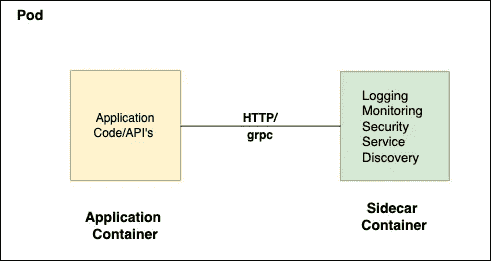
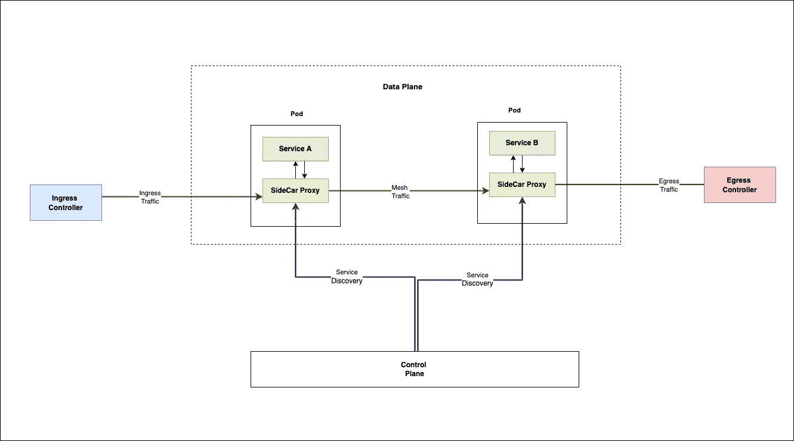

# 边车和服务网:101

> 原文：<https://blog.devgenius.io/sidecar-and-service-mesh-101-134d342bdad9?source=collection_archive---------4----------------------->

这篇博客是我们从零开始讨论 101 个概念的系列文章的一部分，读者的入门知识有限。这篇文章属于 ***中级*** 系列，因为它涉及到理解 **SideCar** 和 ServiceMesh 的原语，以及它们作为微服务架构主干的重要性。

101 系列中的一些早期博客如下:

[**数据加密 101**](/data-encryption-101-f0a25db7d913)[**数据库复制 101**](/database-replication-101-d148514598a7)[**数据库分片 101**](/database-sharding-101-4ef36046c29c)[**缓存策略 101**](/caching-strategy-101-3bc974d2a6cd)[**Kubernetes 部署 101**](http://kubernetes-deployments-101/)

# 什么是边车？

Sidecar 是沿着应用程序容器运行的独立容器，用于运行隔离的外围任务，如**日志记录、代理、配置管理等。**它们共享整个生命周期管理，因为父容器- **创建/终止**事件是同步的。

术语 sidecar ( **如上图**所示)来源于附加在摩托车上的 sidecar。它有助于将**弹性、可伸缩性和安全性**的非功能性需求卸载到单独的容器中，从而使应用程序能够运行业务用例。

边车——核心职责

# 服务网格—基本架构

边车可以作为**隔离**部署组件运行，以支持基本的水平需求。然而，在通常情况下，它们是优步服务网架构的一部分。

服务网格是一个基础设施层，它允许单元间通信，边车充当来自应用单元的**入站/出站**流量的中间代理。

## 成分

*   **数据平面** —这由部署为边车的代理组成。这些边车控制微服务之间的所有服务间通信。
*   **控制平面** —控制平面由帮助服务发现、代理和证书管理等的组件组成。

## 运输流量

*   **外部入口流量**通过**入口控制器**流向给定的 Pod，例如 **—服务 a**
*   **服务 A** 箱上的边车容器拦截该请求。对于有效的请求，它将请求转发给应用程序容器。
*   无效的请求会被 sidecar 拒绝，而不会被正在运行的应用程序处理。
*   **服务 A** 和**服务 B** 之间的服务间流量仅通过使用 [**服务发现模式的 sidecar 代理层提供服务。**](https://avinetworks.com/glossary/service-discovery)
*   类似地，外部流量通过**出口控制器**从任何给定的服务箱流出。

# 优势

使用边车和服务网为工程团队提供了更多的灵活性。根据应用程序的使用情况，以下是其中的一些优势:

*   SideCars 通过将具有**业务逻辑**的 API 与具有**基础设施**关注的代码分离，降低了代码的复杂性。
*   服务网格通过在 sidecar 层实施网络策略来帮助**安全通信**，从而将应用层与流氓流量隔离开来。
*   Sidecars 可以启用监控代理，如 **Splunk、fluentd、**和 **Dynatrace** ，提高**应用**和**系统的可观察性**。

# 摘要

边车和服务网格是现代微服务部署的流行选择。诸如 [**Istio**](https://istio.io/) 和 [**Linkerd**](https://linkerd.io/) 等技术解决方案是解决不同计算选项上的本地云部署的服务网格需求的一些自动化选择。然而，向整体架构添加多个组件会随着网络流中的每个额外跳引入**延迟**和**可见性**限制。此外，管理服务网格层需要额外的**运营**挑战，以便工程团队在整个**架构决策制定**流程中加以考虑。

*如需反馈，请留言至****Amit[dot]894[at]Gmail[dot]com****或联系*[*https://about.me/amit_raj*](https://about.me/amit_raj)*的任何链接。*