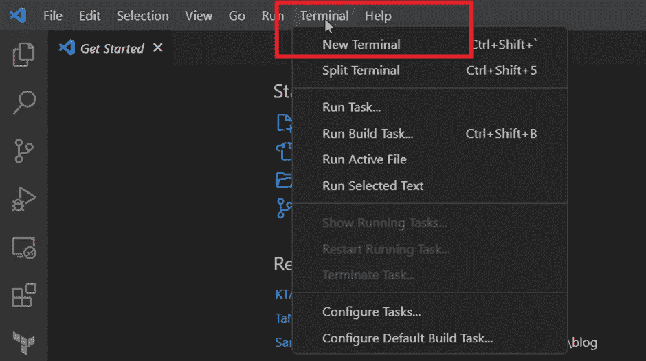
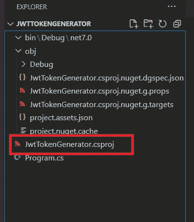

# 使用 PFX 证书签署 JWT 令牌-。Net 7.0

> 原文：<https://blog.devgenius.io/sign-jwt-token-using-a-pfx-certificate-net-6-0-c9e07807e180?source=collection_archive---------4----------------------->


照片由[飞:D](https://unsplash.com/es/@flyd2069?utm_source=medium&utm_medium=referral) 在 [Unsplash](https://unsplash.com/?utm_source=medium&utm_medium=referral)

上一篇文章介绍了使用 PFX 证书签署 JWT 令牌的理论概念。在本文中，我将使用。net 6.0 使用 pfx 证书和密码对 JWT 令牌进行签名。

我不是 Visual Studio 的忠实粉丝，因为我觉得它太重了。因此，我将主要使用 CLI 工具集和 Visual Studio 代码。

# Dotnet 新控制台

我们将创建一个控制台应用程序，它将打印一个 JWT 令牌作为输出。在 Visual Studio 代码中打开新的 PowerShell 终端。



创建一个新文件夹来保存项目详细信息。我将把这个文件夹命名为 JwtTokenGenerator

```
mkdir JwtTokenGenerator
```

从 JwtTokenGenerator 文件夹执行点新建命令

```
cd JwtTokenGenerator
dotnet new console
```

命令末尾的“console”关键字请求 dotnet 为此项目使用控制台应用程序模板。命令执行完毕后，我们将看到一个与文件夹 JwtTokenGenerator 同名的 csproj 文件。



# GetJwtToken()

我将在 Program.cs 中编写一个接受五个输入的函数

1.  PFX 文件的完整路径—字符串
2.  访问证书信息的密码—字符串
3.  令牌的颁发者—字符串
4.  令牌的受众—字符串
5.  以分钟为单位的到期持续时间— Int

函数定义将如下所示:

```
string GetJwtToken(string pfxFilePath, string password, string issuer, string audience, int expiryInMinutes)
```

要创建和签名 JWT 令牌，我们需要执行以下步骤:

## 步骤 1 —创建 X509Certificate2Collection 类型的实例

导入命名空间系统。Security . Cryptography.X509Certificates 证书

```
using System.Security.Cryptography.X509Certificates;
```

创建 X509Certificate2Collection 类型的实例。

> [X509Certificate2Collection 代表 X509Certificate2 对象的集合。该类不能被继承。](https://learn.microsoft.com/en-us/dotnet/api/system.security.cryptography.x509certificates.x509certificate2collection?view=net-7.0)

```
var collection = new X509Certificate2Collection();
```

## 步骤 2-将 PFX 文件导入集合

使用类 X509Certificate2Collection 的实例来[导入一个需要密码](https://learn.microsoft.com/en-us/dotnet/api/system.security.cryptography.x509certificates.x509certificate2collection.import?view=net-7.0#system-security-cryptography-x509certificates-x509certificate2collection-import(system-string-system-readonlyspan((system-char))-system-security-cryptography-x509certificates-x509keystorageflags))才能查看证书细节的证书文件。

```
collection.Import(certFilePath, certPassword, X509KeyStorageFlags.PersistKeySet);
```

使用参数 X509KeyStorageFlags 的原因。PersistKeySet 是为了避免下面的异常

```
System.Security.Cryptography.CryptographicException: Keyset does not exist. 
```

在这里阅读其背后的原因[。](https://learn.microsoft.com/en-us/troubleshoot/developer/dotnet/framework/general/install-pfx-file-using-x509certificate)

## 步骤 3 —获取 X509Certificate2 的实例

因为集合中只有一个证书，所以我们可以通过获取第一个条目来获得 X509 证书的实例。

```
var certificate = collection[0];
```

## 步骤 4 —创建系统的一个实例。Security.Cryptography.Rsa 类

下一步是创建一个默认实现 [RSA](https://learn.microsoft.com/en-us/dotnet/api/system.security.cryptography.rsa?view=net-7.0) 算法的实例。

> [RSA 是 40 多年前建立的一种流行的非对称(公钥)加密算法。为给定的接收者加密 JWT 需要他们的公开 RSA 密钥。解密使用相应的私有 RSA 密钥进行，接收方必须始终对该密钥保密。](https://www.connect2id.com/products/nimbus-jose-jwt/examples/jwt-with-rsa-encryption#:~:text=RSA%20is%20a%20commonly%20used%20algorithm%20for%20asymmetric,the%20recipient%20must%20keep%20secure%20at%20all%20times.)

```
var rsaPrivateKey = certificate.GetRSAPrivateKey();
```

## 步骤 5 —创建 RsaSecurityKey 类的实例

[RsaSecurityKey](https://learn.microsoft.com/en-us/dotnet/api/microsoft.identitymodel.tokens.rsasecuritykey?view=azure-dotnet) 类代表一个 Rsa 安全密钥。我们需要一个 NuGet 包来导入命名空间 Microsoft.IdentityModel.Tokens。

```
dotnet add package Microsoft.IdentityModel.Tokens — version 6.25.1
```

安装成功后，导入名称空间 Microsoft。然后在 GetJwtToken()方法中添加以下代码。

```
Var privateSecurityKey = new RsaSecurityKey(rsaPrivateKey);
```

## 步骤 6 —向令牌添加属性

下一步是准备令牌的属性。

```
var descriptor = new SecurityTokenDescriptor
 {
   Issuer = issuer,
   Audience = audience,
   IssuedAt = DateTime.UtcNow,
   NotBefore = DateTime.UtcNow,
   Expires = DateTime.UtcNow.AddMinutes(expiryInMinutes),

   //Import the namespace System.Security.Claims; for setting of claims along with the token.
   Subject = new ClaimsIdentity(new List<Claim> { }),

   // SigningCredentials will sign the jwt token using RSA-SHA256 cryptographic algorithm
   SigningCredentials = new SigningCredentials(privateSecurityKey, SecurityAlgorithms.RsaSha256Signature)
 };
```

## 步骤 7 —创建 JsonWebTokenHandler 的实例

[JsonWebTokenHandler](https://learn.microsoft.com/en-us/previous-versions/visualstudio/dn464181(v=vs.114)) 是一个 [SecurityTokenHandler](https://msdn.microsoft.com/en-us/library/hh193414(v=vs.114)) 用于创建和验证 JSON Web 令牌(JWT)。有关 JWT 规范的更多信息，请参见[http://tools . IETF . org/html/draft-IETF-oauth-JSON-we b-token-07](http://tools.ietf.org/html/draft-ietf-oauth-json-web-token-07)。

我们需要添加一个 nuget 包来创建类 [JsonWebTokenHandler](https://learn.microsoft.com/en-us/previous-versions/visualstudio/dn464181(v=vs.114)) 的实例。在 PowerShell 窗口上运行以下命令。

```
dotnet add package Microsoft.IdentityModel.JsonWebTokens — version 6.25.1
```

安装成功后，导入名称空间 Microsoft . identity model . jsonwebtokens

```
var handler = new JsonWebTokenHandler();
```

## 步骤 8-签署 JWT 令牌

最后一步是通过调用 JsonWebTokenHandler 类上的 CreateToken 方法，使用 RSA 私有安全密钥进行签名来创建 JWT 令牌。

```
jwtToken = handler.CreateToken(descriptor);
```

# 最终版

GetJwtToken()方法的最终版本将如下所示:

页（page 的缩写）s-Medium 是一个阅读、写作和向其他作者学习的绝佳平台。如果你想加入我的旅程，今天就加入 [medium](https://tarunbhatt9784.medium.com/membership) 。