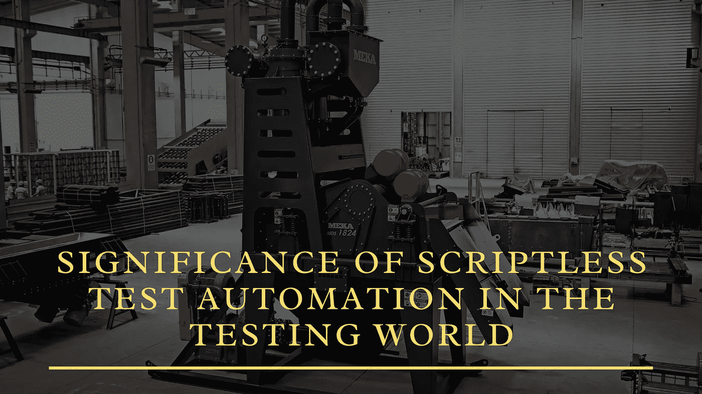

# 自动化测试世界中无脚本测试自动化的重要性

> 原文：<https://blog.devgenius.io/significance-of-scriptless-test-automation-in-the-automated-testing-world-bd100136aee6?source=collection_archive---------3----------------------->

软件测试已经发生了重大变化，可以快速启动高质量的软件。许多开发人员已经接受了无代码/低代码方法是满足对更快应用程序不断增长的需求的有效方法。因此，我们为什么不采纳专家的建议，遵循一种新的、更好的测试方法，而不是坚持基于脚本的、高维护性的测试方法。无代码/低代码已经成为测试人员或开发人员实现这个目标的一个很好的替代品。因此，一种先进的方法也可以用来更好地达到他们的目标，最大化自动化测试的可伸缩性。

什么是无脚本测试自动化？

STA(无脚本测试自动化)是一种使业务用户和测试人员能够自动化测试用例而不用担心编码的技术。它有助于实现快速的结果，并减少了解代码所花费的时间。无脚本测试自动化允许非测试业务提供者理解过程，检查测试用例，并理解测试人员正在做什么。使用无脚本测试自动化，整个软件开发过程可以一直加速，同时使公司能够为自动化测试做出贡献，并增加代码可重用性的机会。通过接受无脚本或无代码框架，开发团队可以轻松地在脚本开发上花费额外的时间。这种特定的方法也将有助于减轻公司自动化测试的复杂性。因此，无脚本测试自动化将帮助公司减少团队的时间和努力，但它也将确保保持良好的质量和轻松实现他们的需求。这种类型的测试也将使测试自动化更容易理解，并增强自动化测试的效果。

**市场快照**

***据环球新闻网报道，“预计到 2024 年，全球自动化测试市场规模将从 2019 年的 126 亿美元上升至 288 亿美元，预计期间的复合年增长率(CAGR)为 18%”。***

**无脚本自动化测试和自动化测试一样吗**

测试自动化是一种使用自动化工具在应用程序上自动化用户测试行为的技术。测试自动化专家在用编程语言开发测试脚本时使用这些测试自动化工具。另一方面，无代码自动化测试简化了没有真实代码的自动化测试过程。

与其他自动化工具相比，无脚本测试自动化是最简单、最容易学习的方法。无脚本自动化测试旨在解决测试团队遇到的一些差异。一些挑战很重要:

测试脚本只能由开发它们的人来审查和修改

手动测试专家或工程师不能自动化测试用例

测试脚本越多，实现的时间就越长

在敏捷环境中维护和管理测试数据和测试脚本

**采用无脚本自动化测试的主要驱动因素**

***下面列出了无脚本自动化测试的一些核心驱动因素:***

*   顺利采用技能集:由于无代码自动化工具易于学习和执行，企业也可以利用业务分析师来执行自动化。
*   缺陷/故障预测能力:在早期检测缺陷，并结合 MI(机器学习)来提高即将到来的缺陷分类的准确性。
*   生成测试可操作的见解:使用人工智能从测试周期中生成可操作的见解。
*   包括基于模型的测试:使用语音识别或自然语言处理(NLP)技术将手动测试用例自动转换为自动化测试脚本。
*   需要优化上市时间:与脚本工具相比，测试脚本形成的速度提高了 50%。此外，由于无脚本测试易于修复和利用人工智能，维护时间减少了 80%。
*   与 Cloud & CI/CD 集成:大多数无代码/无脚本自动化工具提供了与生命周期工具的默认集成，这与需要定制开发的旧工具形成对比。

在接受无脚本自动化测试服务的同时，考虑重要的成功因素是至关重要的。

**无脚本测试自动化的重要优势**

**缩短自动化时间**

这个测试解决方案更好的部分是测试自动化可以在软件开发生命周期的早期执行，它加速了上市时间。你可以通过原型或者你能接触到的线框很早就开始测试自动化过程。这加速了测试过程，因为测试脚本的介入最少。

**适合非技术和技术用户**

IT 专家意识到，在测试过程中，被称为“代码”的东西会发挥作用。他们非常欣赏它。但是，商业分析师花了很大力气去理解它！无脚本测试自动化不依赖于代码。因此，QA 专家节省了时间，并提高了测试自动化的可伸缩性。

**加快上市时间**

无脚本框架使得花费在脚本成熟上的时间最小化，因此它有可能更快地开发软件程序。质量工程师将一系列测试用例(统称为测试套件)结合在一起，检查每个程序的行为。事实上，他们测试瑕疵。幸运的是，对他们来说，反馈或结果很快。积极的成果保证了此类计划更快地投放市场。

**性价比高**

当几乎没有任何复杂因素时，价格就会下降。测试设计简单，软件开发过程也简单。用户友好的测试自动化消除了技术需求。它还将维护成本降至最低。通过减少编写大量程序的开销，您可以轻松地节省更多的成本。甚至测试脚本管理也会被取消，导致一个强大的框架，可以用最少的管理费用毫无困难地维护和管理。此外，自动化工程师可以为单元测试、白盒测试做出贡献，并通过 DevOps 维护高质量的基础设施。

**商业友好型**

由于测试实现的无脚本和简单性，专家涉众和业务分析师的参与肯定会得到促进。他们和技术团队之间的交易变得更加顺畅和简单，确保了高质量的产品，从不同的角度进行了完美的测试。

**快速脚本**

在无代码自动化测试中，没有简单的无脚本的硬性规则。然而，最简单的测试脚本的编写是非常容易和简单的。它不仅固定了整个程序；它使得自动化测试很容易被 QA 团队接受。

**自动化脚本的无故障维护**

维护阶段被认为是软件开发生命周期的关键阶段。即使现有的产品特性有微小的变化，脚本维护也是强制性的。即使在假阴性或假阳性结果的情况下，也需要大量的维护工作。但是，无脚本自动化测试是一个没有麻烦的过程，即使在大型测试自动化套件中也只需要最少的管理和维护。因此，测试套件变得高度可靠，从而提高了产品交付时间。

**用于无脚本自动化测试的伟大工具**

以下是一些更好的无脚本测试自动化工具，其中包括:

[**ACCELQ**](https://www.accelq.com/)

允许自动化 web 测试的无代码/无脚本自动化测试和敏捷测试管理平台。它还支持自动化和 API 验证，这是指协议、工具和例程的聚合，有助于软件应用的增长。这个神奇的工具与云兼容。因此，IT 团队可以轻松地自动计划、设计、实现和创建测试，没有任何麻烦。

[**试验飞船**](https://www.testcraft.io/codeless-test-automation-is-now-easy/?utm_expid=.k9NeUcF7TPKnUkQl4yjmBQ.2&utm_referrer=)

与 ACCELQ 类似，Test Craft 也适用于连续测试。这对回归测试也是有益的。IT 团队可以检查 web 应用程序，从而节省维护时间和成本。最重要的是，这个工具是一个免费的开源自动化测试框架。IT 领域将这种框架称为基于硒的框架。Test Craft 在几种浏览器和平台中测试不同网络应用的有效性。

[**Ranorex 工作室**](https://www.ranorex.com/)

Ranorex 工作室是个多面手！它在手机、网络和桌面上都能完美运行。简单地说，这个工具与当前的技术进步惊人地兼容。它允许全面的测试，保证应用程序仍然适合未来的需求，因此受到专家和新手的喜爱！在这个工具的帮助下，在实现过程中对自动化测试进行良好的控制成为可能。因此，用户在前进的过程中获得了经验。

[**十九第 68 期**](https://www.slksoftware.com/products-and-platforms/nineteen68)

这个令人惊叹的测试工具是一个面向未来的自动化测试工具，拥有交付一些更好的业务结果的可靠历史。它还加速了自动化测试，缩短了上市时间，并带来顶级的客户体验。19 个 68 的几个独特优势包括 100%无脚本/无代码自动化、与 SDLC 产品的简单集成、真正的精简容量、业务用户友好、完美的跨平台测试、交互式和广泛的报告功能、提供管理和映射的可视化插件，等等。

[**科比顿**](https://hubs.ly/H0SpXkd0)

Kobiton 无代码自动化测试是移动自动化测试的 raid 方式。这个智能自动化测试平台具有在任何小工具上创建和执行无脚本自动化的功能。在单个设备上执行手动测试，Kobiton 的 AI 测试框架可以在后台自动对其他实际设备执行类似的测试。使用这个平台可以轻松生成 100%的 Appium 代码。它通过 Appium Anywhere 为易断的测试脚本提供了解决方案。

**最终想法**

简而言之，无脚本自动化测试减轻了大量与自动化测试相关的负面特征。无脚本测试自动化非常适合时间紧迫的项目。整个过程使自动化变得容易，并帮助涉众关注更高的业务环境。无脚本自动化测试允许在尽可能短的时间内实现可靠的自动化。然而，为了加速自动化测试项目，自动化专家的参与是至关重要的。每个 QA 公司都必须通过发现他们的 SDLC(软件开发生命周期)中的最大挑战/约束来专注于自动化测试领域。不投资于特定的自动化测试解决方案的风险可能会导致您的竞争优势的丧失，以及灵活性和创新性的最小化。