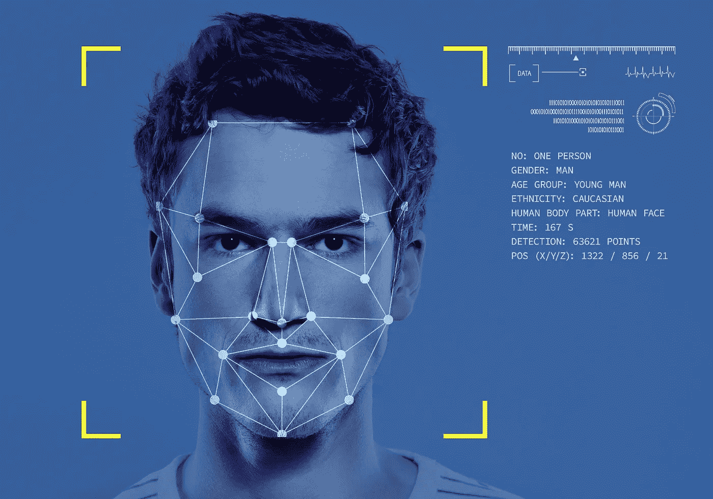

# 简单的人工智能人脸和情感识别与反应

> 原文：<https://blog.devgenius.io/simple-ai-face-and-emotion-recognition-with-react-da2921e6075e?source=collection_archive---------0----------------------->



你喜欢艾吗？因为我确实知道。今天，你将使用人工智能和面部识别来通过网络摄像头实时确定你的情绪。

为了完成这个人脸识别，您将使用一个名为 [face-api.js](https://www.npmjs.com/package/face-api.js) 的库，它是 tensor-flow 的包装器，是目前最流行的机器学习库之一(截至本文发表时)。在浏览器中设置和运行它真的很容易。

这是本文 GitHub 库的[链接。](https://github.com/Exclusiveideas/ai-face-detection)

当你在我的仓库时，请留下一颗星星✨。

# 我们开始吧

Bootstrap 一个新的 react 应用程序，比如人工智能-人脸检测

`npx create-react-app ai-face-detection`

运行以下命令，在 react 应用程序中下载 [face-api.js](https://www.npmjs.com/package/face-api.js) 库

```
//using npm
npm i face-api.js//using yarn
yarn add face-api.js
```

这个项目需要的所有模型都可以在我的[资源库](https://github.com/Exclusiveideas/ai-face-detection/tree/main/public/models)中找到。

将您从我的[存储库](https://github.com/Exclusiveideas/ai-face-detection/tree/main/public/models)获得的模型文件夹放在 react 应用程序的 public 文件夹下。你的 **app 结构**应该是这样的:

```
AI-FACE-DETECTION
|- public
   |- models
|- src
   |- App.css
   |- App.js
   |- index.css
   |- index.js
```

运行`npm start`启动您的应用程序。

让我们给我们的 **index.css** 添加一些样式:

```
body {
  margin: 0;
  padding: 0;
  width: 100vw;
  height: 100vh;
  display: flex;
  justify-content: center;
  align-items: center;
}
```

我们的 App.js 文件将是本文的重点。现在在 App 里**。js** ，我们要添加一个标题和视频元素。

**App.js**

```
import { useEffect, useRef } from 'react';const App = () => {
  const videoRef = useRef();return (
    <div>
       <video crossOrigin='anonymous' ref={videoRef} autoPlay>  
       </video>
    </div>
  )
};export default App;
```

我添加了一个 *useRef* 钩子来跟踪视频流。我们需要访问网络摄像头并输出视频，为此，我们将创建一个函数 *startVideo* ，它将包含访问网络摄像头并将流存储在 *videoRef、*中的语法

**App.js**

```
useEffect(() => {
  startVideo();
}, []);const startVideo = () => {
   navigator.mediaDevices.getUserMedia({ video: true    })
   .then((currentStream) => {
           videoRef.current.srcObject = currentStream;
        }).catch((err) => {
           console.error(err)
   });
}
```

*useeffecthhook*在应用安装后运行，并通过调用 *startVideo* 函数初始化视频流。现在，如果你保存，你应该可以在浏览器中看到你的摄像头输出。

现在让我们开始使用我们的 face-api.js 库。

将 face-api.js 库导入到 index.js 中，并从 models 文件夹中加载模型

**App.js**

```
useEffect(() => {
   startVideo(); videoRef && loadModels();
}, []);const loadModels = () => {
   Promise.all([
     faceapi.nets.tinyFaceDetector.loadFromUri('/models'),
     faceapi.nets.faceLandmark68Net.loadFromUri('/models'),
     faceapi.nets.faceRecognitionNet.loadFromUri('/models'),
     faceapi.nets.faceExpressionNet.loadFromUri('/models'),
   ]).then(() => {
    faceDetection();
   })
};const faceDetection = () => {
   const detections = await faceapi.detectAllFaces 
       (videoRef.current, new faceapi.TinyFaceDetectorOptions())
        .withFaceLandmarks()
        .withFaceExpressions();
   console.log(detections);
}
```

好吧，让我解释一下，

*   在添加到 *useEffect* 钩子的代码片段中，

`videoRef && loadModels();`

只有当网络摄像头被加载时，我们才调用 *loadModels* 函数

*   *loadModels* 函数使用一个 *Promise.all 从我们的模型文件夹中加载所有需要的模型(用于运行多个承诺并返回一个包含输入承诺结果的承诺)。*
*   加载模型后，它调用 *faceDetection* 函数，该函数检测摄像头视图中的任何人脸，并将其检测值打印到控制台。

现在，如果您将您的脸放在网络摄像头视图中，您应该会在浏览器控制台中看到一个日志，其中包含有关检测到的脸的信息。

注意:为了正确检测，你应该在一个光线充足的环境中。

为了在视频输出中显示检测结果，我们将在 App.js 中添加一个 canvas 元素，以跟踪检测到的人脸的位置，并创建一个 *canvasRef* 来跟踪画布。

**App.js**

```
const canvasRef = useRef();return (
  <div  className="app">
    <h1> AI FACE DETECTION</h1>
    <div className='app__video'> 
       <video crossOrigin='anonymous' ref={videoRef} autoPlay >
       </video>
    </div> 
    <canvas ref={canvasRef} width="940" height="650"
     className='app__canvas' />
</div>
);
```

对于位置的样式，我们将编辑我们的 App.css

**App.css**

```
.app {
   display: flex;
   width: 100vw; 
   height: 100vh;
   flex-direction: column;
   align-items: center;
   justify-content: space-between;
}.app__video {
   display: flex;
   align-items: center;
}.app__canvas {
   position: absolute;
   top: 100px;
}
```

现在，为了将来自检测的数据传输到画布上，我们将把我们的 *faceDetection* 函数编辑成:

**App.js**

```
const faceDetection = async () => {
   setInterval(async() => {
   const detections = await faceapi.detectAllFaces
         (videoRef.current,new faceapi.TinyFaceDetectorOptions())
          .withFaceLandmarks()
          .withFaceExpressions();canvasRef.current.innerHtml = faceapi.createCanvasFromMedia
                              (videoRef.current);faceapi.matchDimensions(canvasRef.current, {
  width: 940,
  height: 650,
})const resized = faceapi.resizeResults(detections, {
  width: 940,
  height: 650,
});// to draw the detection onto the detected face i.e the box
faceapi.draw.drawDetections(canvasRef.current, resized);//to draw the the points onto the detected face
faceapi.draw.drawFaceLandmarks(canvasRef.current, resized);//to analyze and output the current expression by the detected face
faceapi.draw.drawFaceExpressions(canvasRef.current, resized);}, 1000);};
```

这样我们就完成了人脸和表情识别 app，你可以在 ***App.css*** 文件中修改画布的位置。

所以我们完整的 **App.js** 文件应该是这样的:

```
import { useRef, useEffect } from 'react';
import './App.css';
import * as faceapi from "face-api.js";function App() {
  const videoRef = useRef();
  const canvasRef = useRef();

  useEffect(() => {
    startVideo(); videoRef && loadModels();
}, []); const loadModels = () => {
     Promise.all([
         faceapi.nets.tinyFaceDetector.loadFromUri('/models'),
         faceapi.nets.faceLandmark68Net.loadFromUri('/models'),
         faceapi.nets.faceRecognitionNet.loadFromUri('/models'),
         faceapi.nets.faceExpressionNet.loadFromUri('/models'),
     ]).then(() => {
         faceDetection();
        })
}; const startVideo = () => {
     navigator.mediaDevices.getUserMedia({ video: true })
     .then((currentStream) => {
          videoRef.current.srcObject = currentStream;
      }).catch((err) => {
         console.error(err)
         });
} const faceDetection = async () => {
    setInterval(async() => {
      const detections = await faceapi.detectAllFaces
           (videoRef.current, new faceapi.TinyFaceDetectorOptions())
           .withFaceLandmarks().withFaceExpressions();canvasRef.current.innerHtml = faceapi.
     createCanvasFromMedia(videoRef.current);faceapi.matchDimensions(canvasRef.current, {
    width: 940,
    height: 650,
})const resized = faceapi.resizeResults(detections, {
    width: 940,
    height: 650,
});// to draw the detection onto the detected face i.e the box
faceapi.draw.drawDetections(canvasRef.current, resized);//to draw the the points onto the detected face
faceapi.draw.drawFaceLandmarks(canvasRef.current, resized);//to analyze and output the current expression by the detected face
faceapi.draw.drawFaceExpressions(canvasRef.current, resized);}, 1000)}return (
  <div  className="app">
     <h1> AI FACE DETECTION</h1>
     <div className='app__video'>
        <video crossOrigin='anonymous' ref={videoRef} autoPlay 
        </video>
     </div>
     <canvas ref={canvasRef} width="940" height="650"
     className='app__canvas' />
 </div>
);
}export default App;
```

# 结论

在本文中，我们看到了使用 [face-api.js](https://www.npmjs.com/package/face-api.js) 库来设置人脸识别应用程序是多么容易。您可以通过阅读它们的文档来选择实现更多的特性。

感谢阅读，别忘了鼓掌👏并在我的仓库里留下一颗✨星。