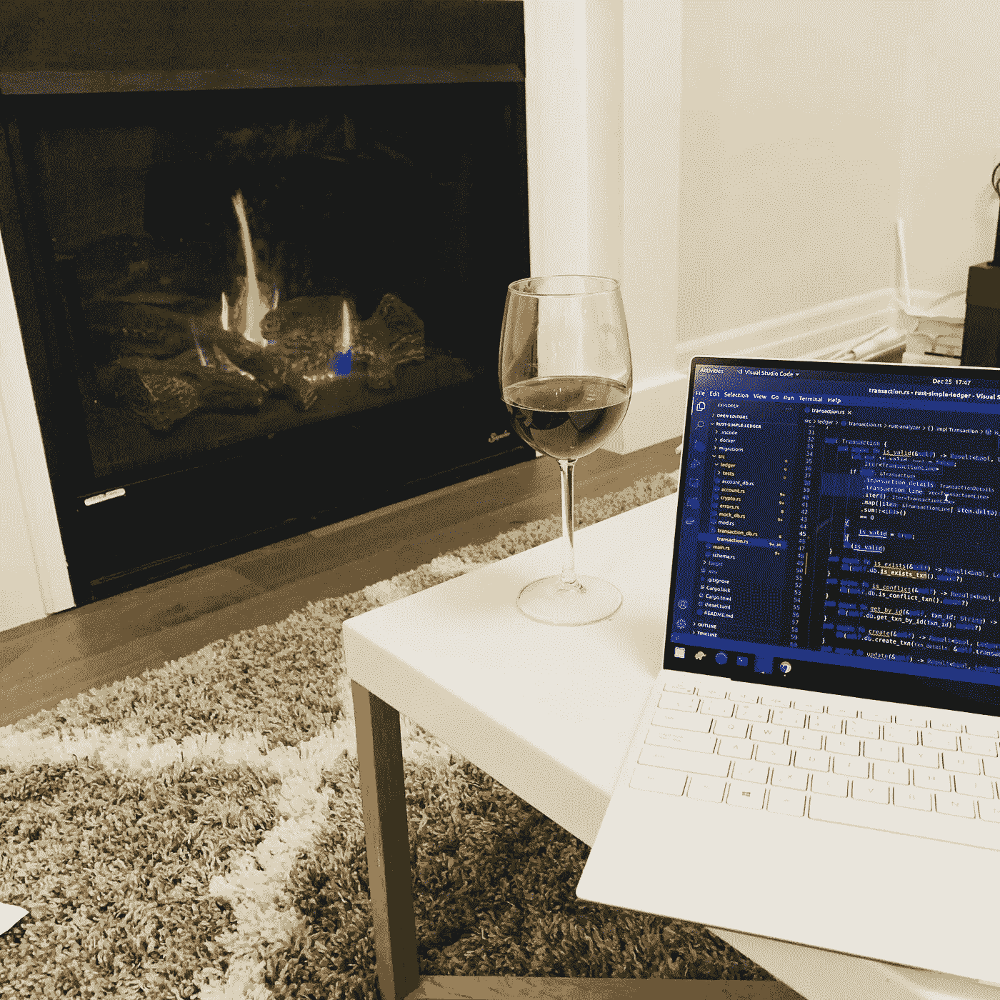
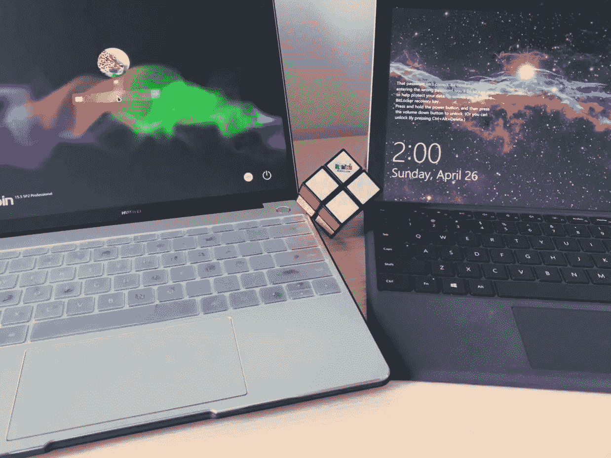
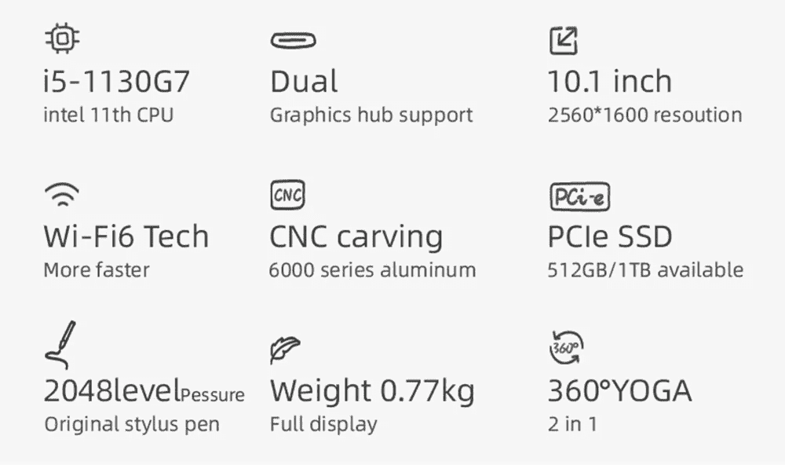
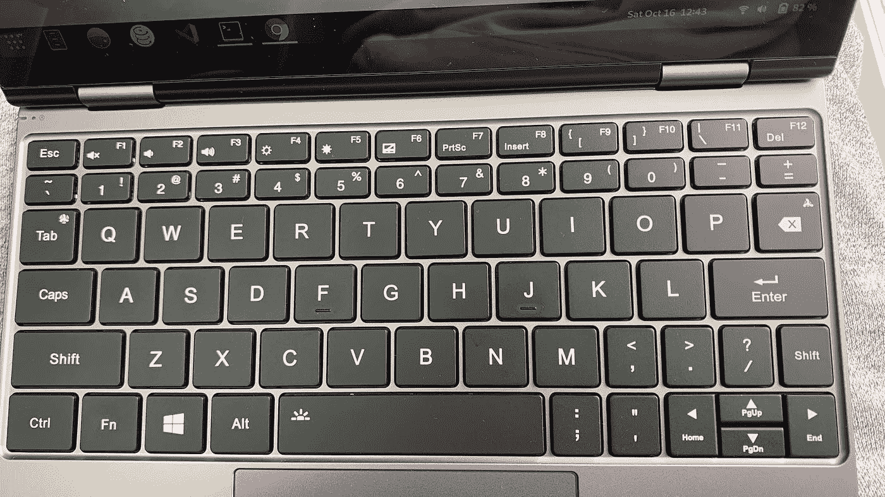

# 简单高效

> 原文：<https://blog.devgenius.io/simple-and-efficient-8ab081659fe3?source=collection_archive---------3----------------------->

我的个人发展环境设置

上周，我们重点讨论了编码，尤其是最热门的话题，交易机器人(coinbase)。如果你错过了这两个部分，请查看下面的链接。

 [## 周末用 Rust 构建一个可扩展的交易机器人

### 周末建设和学习。

medium.com](https://medium.com/swlh/build-a-scalable-trading-bot-with-rust-over-the-weekend-9fd781940360)  [## 周末用 Rust 构建一个可伸缩的交易机器人——第 2 部分

### Bot 在行动，比特币基地专业集成

medium.com](https://medium.com/coinmonks/build-a-scalable-trading-bot-with-rust-over-the-weekend-part-2-bb7d703eebe7) 

本周我们将改变一些不同的东西，不仅仅是为了编码，也是为了与编码相关。如上所述，我确实喜欢编码，但是我仍然希望我的文章类别更加多样化。

> 我热爱编码；我想分享一些我的 Tech/Env 设置，它推动并促进了我的编码和开发体验，并提高了效率。

# 关于笔记本电脑

我是 K.I.S.S .的忠实粉丝，它反映了我对笔记本电脑的选择；我喜欢优雅，简单的设计和良好的编码构建质量的笔记本电脑。这些是我目前拥有的用于不同用例、条件和项目的笔记本电脑。

## 2014 苹果 Macbook Pro 15 英寸视网膜

Radek Grzybowski 在 [Unsplash](https://unsplash.com?utm_source=medium&utm_medium=referral) 上的照片

这台 Macbook Pro 是我妻子送给我的礼物，这表明她如何支持我的编码热情，并确保我的眼睛受到视网膜显示器的保护。这台 Macbook 充满了爱，它还跟随我开发和学习了我所有的移动应用程序。

## 戴尔 XPS 13 开发人员版

戴尔 XPS 13 开发人员版-作者照片

拥有这台笔记本电脑的主要原因是硬件设计的美感和预装的 Ubuntu 20.04。它成了我的主要开发机器。

然而，从疫情时间开始。我的大儿子开始虚拟上学时间；它正式成为我大儿子的学校笔记本电脑，因为它具有触摸屏功能、漂亮的显示屏和便携性。

但是足够幸运的是，他开始对 Linux 生态系统表现出兴趣，这让我很高兴。我希望有一天他能开始用 Python、Golang 或 Rust 编程。

## 华为 Matebook 13 开发者版

我把我的戴尔 XPS 13 交给儿子后，我拿到了我的华为 Matebook 13，也是开发者版，预装了 Deepin Linux 发行版。

相比戴尔 XPS 13，华为有它唯一的美，对于任何开发需求都很舒服，尤其是它拥有的键盘品质我很喜欢。

华为 matebook 13 对比 Surface 7 PRO——作者照片

## N.E .上网本 4

在等儿子上完小提琴和钢琴课或者出差的时候，坐在咖啡店里喝着我最喜欢的咖啡馆，那些等待的时间是一些快速写作或者编码最宝贵的时间。

一台上网本 4 —作者照片

紧凑型笔记本电脑需要这些环境。然而，在目前的市场上，很难找到构建质量好且足够强大的东西来运行我所需要的开发栈，比如 Docker。

详情截图

这款 O.N.E .上网本 4 满足了我所有的开发需求。我对此感觉很好，唯一令人失望的部分是键盘，你真的需要一些时间来调整自己以适应键盘布局。

一个上网本 4 键盘布局—作者照片

# 操作系统

从硬件部分可以看出，有 2 个 OS I 多数使用:macOS 和 Linux。

**macOS** ，对我来说，主要是 iOS /移动应用开发。Linux 专注于所需的大多数其他开发，如 API、web、软件或物联网。

你可能会问，戴尔 XPS 13 是什么发行版的 Linux，因为它是开发者版，所以它预装了 **Ubuntu** 20.04。

对于华为 Matebook 是 **Deepin** ，对于 One Netbook 4，我最近安装了 **Fedora 34** ，我喜欢这个 Fedora 发行版，简单有效。我可能会花一些时间来写下面这篇关于 Fedora for development 的评论。

# 软件和开发

取决于我工作的项目或用例，它可能需要不同的工具/软件；但是，对于我的开发软件/应用程序/工具来说，每个桌面最常见和必备的是:

1.  微软 VS 代码:用于开发的 IDE。
2.  Docker，Docker Compose:更快地构建工作和开发环境。
3.  SQL 和数据库。
4.  戈朗
5.  拉斯特朗
6.  Nodejs
7.  计算机编程语言

就是这样。只是简单地概括一下我的开发和编码工具以及环境设置。

感谢您的阅读；我开始写作之旅已经快三年了。你们的支持是让我不断前进，写出更多精彩学习分享的最重要动力。

 [## 用我的推荐链接加入媒体-黄伟

### 作为一个媒体会员，你的会员费的一部分会给你阅读的作家，你可以完全接触到每一个故事…

jayhuang75.medium.com](https://jayhuang75.medium.com/membership) 

关于我的其他文章，请查看我的其他文章。

 [## 魏黄-中号

### 在媒介上阅读黄炜的作品。我喜欢学习。学会成功。Linkedin…

jayhuang75.medium.com](https://jayhuang75.medium.com/)