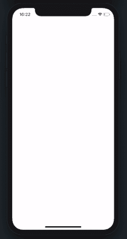

# 使用 SwiftUI 的简单应用加载视图

> 原文：<https://blog.devgenius.io/simple-app-loading-view-239807a9db1e?source=collection_archive---------1----------------------->

## 让-马克·布里安内

创建一个初始的应用程序加载屏幕可能是开发 iOS 应用程序时没有考虑太多的问题。今天我们将快速看一下如何创建一个相对简单优雅的加载屏幕。



装载视图示例

> 我们想看你的作品！如果你已经用这个教程制作了一些东西，请给我们发图片！在推特 [@TrailingClosure](https://twitter.com/TrailingClosure) 上找到我们，或者发邮件到[howdy@TrailingClosure.com](mailto:howdy@trailingclosure.com)联系我们

本教程分为两部分:

*   创建`ScaledMaskModifier`
*   创建`LoadingView`

## 创造了`ScaledMaskModifier`

我们的`ScaledMaskModifier`将用于动画显示我们的装载视图。它将一个`Mask`作为输入，该输入将随着时间的推移按比例放大，以显示加载视图。见下文一瞥。


`ScaledMaskModifier`使用`Circle`作为遮罩

首先，创建一个名为`ScaledMaskModifier`的新`ViewModifier`。我们将向该类添加两个变量:

1.  `mask`——前面描述的面具。它将随着时间的推移而增长，以显示底层的加载视图。
2.  `progress` -跟踪我们在动画中所处位置的值。

以下是目前为止该结构的模板:

```
import SwiftUI

struct ScaledMaskModifier<Mask: View>: ViewModifier {

    var mask: Mask
    var progress: CGFloat

    func body(content: Content) -> some View {
        content
    }

}
```

接下来，我们需要计算遮罩的高度和宽度，然后将其应用到我们的内容中。棘手的是，我们要确保遮罩的形状会增长到内容的最大尺寸。这类似于我们如何在`Image`上使用`scaleToFill()`。

1.  创建一个名为`calculateSize(geometry: GeometryProxy)`的函数。这将返回`mask`的最大尺寸(在动画结束时)。它将判断内容的宽度或高度是否更大，并将其作为大小返回。

```
// Calculate Max Size of Mask
func calculateSize(geometry: GeometryProxy) -> CGFloat {
    if geometry.size.width > geometry.size.height {
        return geometry.size.width
    }
    return geometry.size.height
}
```

1.  将`mask`应用于我们的内容，同时使用`calculateSize(geometry:)`和`progress`随着时间的推移缩放蒙版大小。

```
import SwiftUI

struct ScaledMaskModifier<Mask: View>: ViewModifier {

    var mask: Mask
    var progress: CGFloat

    func body(content: Content) -> some View {
        content
            .mask(GeometryReader(content: { geometry in
                self.mask.frame(width: self.calculateSize(geometry: geometry) * self.progress,
                                height: self.calculateSize(geometry: geometry) * self.progress,
                                alignment: .center)
            }))
    }

    // Calculate Max Size of Mask
    func calculateSize(geometry: GeometryProxy) -> CGFloat {
        if geometry.size.width > geometry.size.height {
            return geometry.size.width
        }
        return geometry.size.height
    }

}
```

## 创建`LoadingView`

接下来，我们将通过创建`LoadingView`来让`ScaledMaskModifier`工作。在`LoadingView`里面也是我们处理动画的地方。

1.  创建一个新的`View`，并将其命名为`LoadingView`。在里面你需要定义 3 个变量:一个用于`LoadingView`的内容，一个用于动画的进度，另一个用于 Y 偏移(弹跳动画)。下面是一个例子。

```
import SwiftUI

struct LoadingView<Content: View>: View {

    var content: Content
    @Binding var progress: CGFloat
    @State var logoOffset: CGFloat = 0 //Animation Y Offset

    var body: some View {
        content
    }
}
```

1.  接下来，我们需要对内容应用`ScaledMaskModifier`。这里我们使用了一个`Circle`作为遮罩，但是实际上你可以使用任何`Shape`或者`View`比如`Rectangle`或者任何其他定制的 SwiftUI `View`。

```
var body: some View {
    content
        .modifier(ScaledMaskModifier(mask: Circle(), progress: progress))
}
```

1.  另外`ScaledMaskModifier`我们会让`content`上下弹跳。为了做到这一点，我们将动画它的 y 偏移。

```
var body: some View {
    content
        .modifier(ScaledMaskModifier(mask: Circle(), progress: progress))
        .offset(x: 0, y: logoOffset)
}
```

1.  是时候添加动画了。这里我们将制作`content`从`0`到`1`的进度变化动画，同时上下弹跳。

```
import SwiftUI

struct LoadingView<Content: View>: View {

    var content: Content
    @Binding var progress: Double
    @State var logoOffset: CGFloat = 0 //Animation Y Offset

    var body: some View {
        content
            .modifier(ScaledMaskModifier(mask: Circle(), progress: progress))
            .offset(x: 0, y: logoOffset)
            .onAppear {
                withAnimation(Animation.easeInOut(duration: 1)) {
                    self.progress = 1.0
                }
                withAnimation(Animation.easeInOut(duration: 0.4).repeatForever(autoreverses: true)) {
                    self.logoOffset = 10
                }
            }
    }
}
```

## 创造一个例子

现在我们将在一个例子中测试我们的`LoadingView`。见下文:

在这里，我们创建了一个假的`HomeView`,一旦加载完成就会显示出来。正如你所看到的，我们使用变量`doneLoading`来决定在屏幕上呈现哪个 vie。

对于`LoadingView`,我已经传入了一个`Image`,它将被用作加载屏幕的`content`。

最后，如果你对我为什么使用`onAppear()`函数感到好奇，那么我可以模拟为你的应用加载数据的异步特性。

```
import SwiftUI

struct ContentView: View {

    @State var progress: CGFloat = 0
    @State var doneLoading: Bool = false

    var body: some View {
        ZStack {
            if doneLoading {
                HomeView()
                    .transition(AnyTransition.opacity.animation(.easeInOut(duration: 1.0)))
            } else {
                LoadingView(content: Image("PathMaskLogo-Dark")
                                        .resizable()
                                        .scaledToFit()
                                        .padding(.horizontal, 50),
                            progress: $progress)
                    // Added to simulate asynchronous data loading
                    .onAppear {
                        DispatchQueue.main.asyncAfter(deadline: .now() + 2) {
                            withAnimation {
                                self.progress = 0
                            }
                            DispatchQueue.main.asyncAfter(deadline: .now() + 0.4) {
                                withAnimation {
                                    self.doneLoading = true
                                }

                            }
                        }
                    }
            }
        }
    }
}
```


示例使用

## 支持未来像这样的教程！

请考虑使用此[链接](https://trailingclosure.com/signup/)进行订阅。如果你没有在 TrailingClosure.com[看到这篇文章，请随时来看看我们！](https://trailingclosure.com/)

我们想看你的作品！如果你已经用这个教程制作了一些东西，请给我们发图片！在推特 [@TrailingClosure](https://twitter.com/TrailingClosure) 上找到我们，或者发邮件到[howdy@TrailingClosure.com](mailto:howdy@trailingclosure.com)联系我们